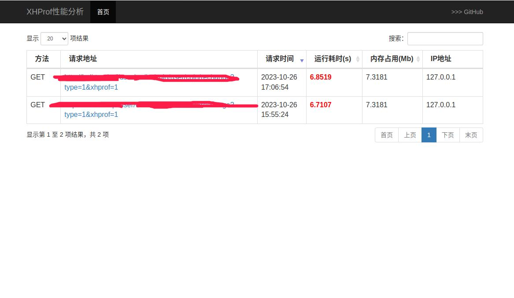
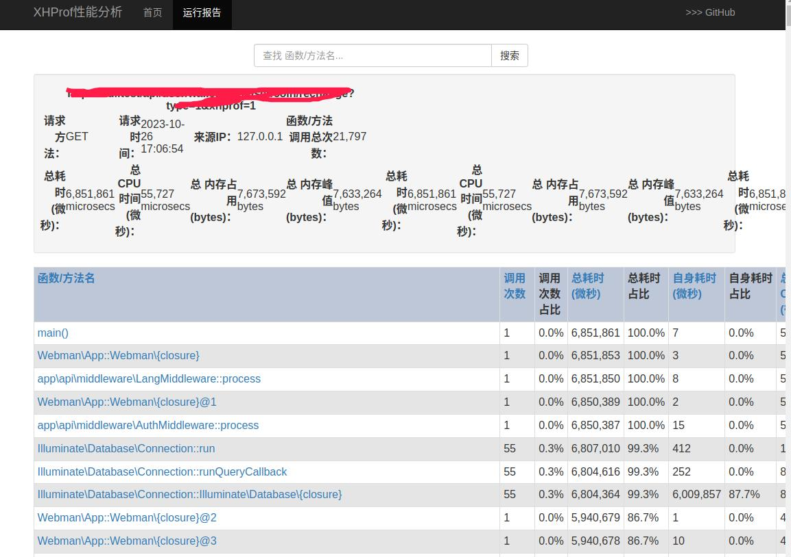

## 安装 ##

Use [Composer](https://github.com/composer/composer):
```sh
composer require aaron/xhprof-webman
```

## 配置 ##


1. 创建控制器,复制下面代码

```
<?php

namespace app\controller;

use support\Request;
use Aaron\Xhprof\Webman\Xhprof;

class TestController
{
    public function index(Request $request)
    {
        return Xhprof::index();
    }
}

```

2. 路由增加以下代码
```
Route::get('/test', ['app\controller\TestController','index']);

```

3. 然后重启服务就可以访问了。



本插件参考[phpxxb/xhprof](https://github.com/xiexianbo123/xhprof)