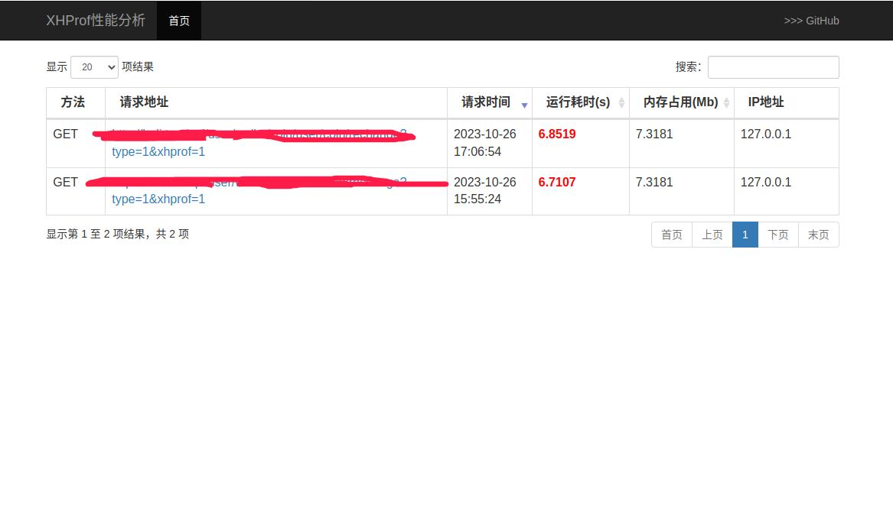
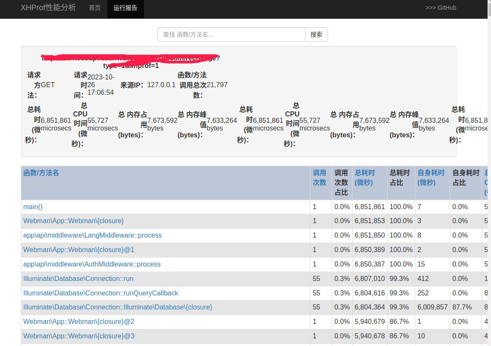

## 简介 ##
aaron-dev/xhprof-webman是一款适配webman的代码性能分析插件。
主要对旧版且无法使用的xhprof做优化调整，用于适配webman，安装简单快捷。
开发者可以通过浏览器快速访问性能分析报告，排查代码性能问题。

## 作者博客 ##
[艾瑞可erik](https://erik.xyz)

## 安装 ##

php要安装xhprof扩展
在php.ini中增加配置
```
[xhprof]
extension=xhprof.so;
xhprof.output_dir=/tmp/xhprof;

```

Use [Composer](https://github.com/composer/composer):
```sh
composer require aaron-dev/xhprof-webman
```

## 配置 ##

1. config增加全局中间件

```
    '' => [
        Aaron\Xhprof\Webman\XhprofMiddleware::class,
    ]
```

2. 创建控制器,复制下面代码

```
<?php

namespace app\controller;

use support\Request;
use Aaron\Xhprof\Webman\Xhprof;

class TestController
{
    public function index(Request $request)
    {
        return Xhprof::index();
    }
}

```

3. 路由增加以下代码（页面入口 + 静态资源，静态资源从包内直接提供，无需复制到 public）

```
Route::get('/test', ['app\controller\TestController','index']);
Route::get('/xhprof-assets/{path:.+}', [\Aaron\Xhprof\Webman\StaticController::class, 'serve']);
```

4. 基础配置在 config/plugin/aaron-dev/xhprof/xhprof.php 中

```
'enable' => true,
'time_limit' => 0,
'log_num' => 1000,
'view_wtred' => 3,
'ignore_url_arr' => ["/test"],
'assets_url' => '/xhprof-assets',  // 静态资源 URL，须与上面路由中的 path 一致
```


5. 然后重启服务就可以访问了。



本插件参考[phacility/xhprof](https://github.com/phacility/xhprof)、[phpxxb/xhprof](https://github.com/xiexianbo123/xhprof)