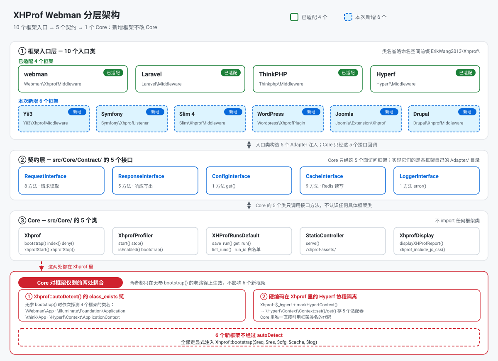
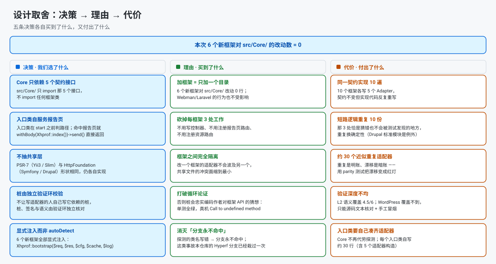
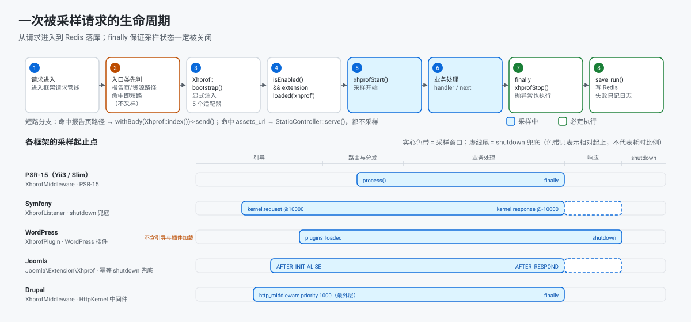

# XHProf 性能分析插件

**中文** · [English](./docs/i18n/en/README.md) · [한국어](./docs/i18n/ko/README.md) · [Русский](./docs/i18n/ru/README.md) · [Deutsch](./docs/i18n/de/README.md) · [Français](./docs/i18n/fr/README.md) · [Español](./docs/i18n/es/README.md) · [Português](./docs/i18n/pt/README.md) · [العربية](./docs/i18n/ar/README.md) · [हिन्दी](./docs/i18n/hi/README.md) · [বাংলা](./docs/i18n/bn/README.md) · [Bahasa Indonesia](./docs/i18n/id/README.md) · [日本語](./docs/i18n/ja/README.md)

兼容 webman / Laravel / ThinkPHP / Hyperf / Yii3 / Symfony / Slim 4 / WordPress / Joomla / Drupal 的代码性能分析插件。

基于 xhprof 扩展采集数据并存入 Redis，开发者可通过浏览器快速访问性能分析报告，排查代码性能瓶颈。


同一只小火苗也是报告页的站点图标与左上角品牌图标（`src/html/pet.svg`，随 `assets_url` 前缀服务）。

**请求记录**


**单次运行报告**


## 环境要求

- PHP >= 8.0
- xhprof 扩展
- redis 扩展
- Redis 服务

## 兼容框架与最低版本

| 框架 | 最低版本 | 最低 PHP | 入口类 | 挂载方式 |
|------|---------|---------|--------|---------|
| webman | `workerman/webman ^2.1` | 8.0 | `Webman\XhprofMiddleware` | `config/middleware.php` 注册全局中间件 |
| Laravel | `laravel/framework ^9.0\|^10.0\|^11.0` | 8.0 | `Laravel\Middleware` | `app/Http/Kernel.php` 注册全局中间件 |
| ThinkPHP | `topthink/framework ^6.0\|^8.0` | 8.0 | `Thinkphp\Middleware` | `app/middleware.php` 注册全局中间件 |
| Hyperf | `hyperf/framework ^3.0` | 8.0 | `Hyperf\Middleware` | ConfigProvider 自动注册 |
| Yii3 | `yiisoft/middleware-dispatcher ^5.0` | 8.1 | `Yii3\XhprofMiddleware` | `config/web/di/application.php` 注册，须放中间件队列第一位 |
| Symfony | `symfony/http-kernel ^6.4\|^7.0` | 8.1（6.4）/ 8.2（7.x） | `Symfony\XhprofListener` | `config/services.yaml` 加 `kernel.event_subscriber` tag |
| Slim 4 | `slim/slim ^4.12` | 8.0 | `Slim\XhprofMiddleware` | `$app->add(...)`，须最后 add |
| WordPress | 6.4+ | 8.0 | `Wordpress\XhprofPlugin` | 复制到 `wp-content/mu-plugins/` |
| Joomla | 4.4 / 5.x | 8.1 | `Joomla\Extension\Xhprof` | 复制到 `plugins/system/`，后台「发现」安装 |
| Drupal | 10.x / 11.x | 8.1（10.x）/ 8.3（11.x） | `xhprof` 模块（`Drupal\XhprofMiddleware`） | 标准模块，启用即可 |

入口类命名空间前缀统一为 `ErikWang2013\Xhprof\`（上表省略）。十家都不需要你注册控制器与路由：报告页与静态资源由入口类自行接管，Drupal 则由模块路由提供（见 Drupal 一节）。

本包声明 `php >= 8.0`，但 Yii3 依赖的 `yiisoft/*` 组件要求 **PHP 8.1+**，所以 **Yii3 在 PHP 8.0 上不可用**；Symfony 7.x、Drupal 11.x 同理需要更高的 PHP 版本。逐步接入方式见下方「框架配置」。

## 安装

php.ini 中增加 xhprof 配置：

```ini
[xhprof]
extension=xhprof.so
xhprof.output_dir=/tmp/xhprof
```

Composer 安装：

```sh
composer require aaron-dev/xhprof-webman
```

---

## 框架配置

### Webman

**1. 注册全局中间件** — `config/middleware.php`：

```php
return [
    '' => [
        ErikWang2013\Xhprof\Webman\XhprofMiddleware::class,
    ],
];
```

**2. 报告页与静态资源** — **无需注册控制器与路由**：中间件在采样开始前判断请求路径，命中报告路径 `/xhprof` 直接输出报告页并返回，命中资源路径（前缀从配置项 `assets_url` 读，默认 `/xhprof-assets`）直接输出静态资源。

**3. 配置** — 见 `config/plugin/aaron-dev/xhprof/xhprof.php`。

---

### Laravel

**1. 注册中间件** — `app/Http/Kernel.php`：

```php
protected $middleware = [
    // ...
    \ErikWang2013\Xhprof\Laravel\Middleware::class,
];
```

**2. 报告页与静态资源** — **无需注册控制器与路由**：中间件在采样开始前判断请求路径，命中报告路径 `/xhprof` 直接输出报告页并返回，命中资源路径（前缀从配置项 `assets_url` 读，默认 `/xhprof-assets`）直接输出静态资源。

**3. 发布配置**：

```sh
php artisan vendor:publish --tag=xhprof-config
```

配置文件在 `config/xhprof.php`。Laravel 支持自动发现 ServiceProvider。

---

### ThinkPHP

**1. 注册中间件** — `app/middleware.php`：

```php
return [
    \ErikWang2013\Xhprof\Thinkphp\Middleware::class,
];
```

**2. 报告页与静态资源** — **无需注册控制器与路由**：中间件在采样开始前判断请求路径，命中报告路径 `/xhprof` 直接输出报告页并返回，命中资源路径（前缀从配置项 `assets_url` 读，默认 `/xhprof-assets`）直接输出静态资源。

**3. 配置** — 复制 `vendor/aaron-dev/xhprof-webman/src/Thinkphp/config/xhprof.php` 到项目 `config/xhprof.php`。

---

### Hyperf

**1. 中间件自动注册** — ConfigProvider 自动将中间件加入 HTTP 中间件队列。

**2. 报告页与静态资源** — **无需注册控制器与路由**：中间件在采样开始前判断请求路径，命中报告路径 `/xhprof` 直接输出报告页并返回，命中资源路径（前缀从配置项 `assets_url` 读，默认 `/xhprof-assets`）直接输出静态资源。

**3. 发布配置**：

```sh
php bin/hyperf.php vendor:publish aaron-dev/xhprof-webman
```

配置输出在 `config/autoload/xhprof.php`。

---

### Yii3

**1. 注册中间件** — `config/web/di/application.php`：

```php
use ErikWang2013\Xhprof\Yii3\XhprofMiddleware;
use Yiisoft\Middleware\Dispatcher\MiddlewareDispatcher;

return [
    MiddlewareDispatcher::class => [
        'class' => MiddlewareDispatcher::class,
        // the first element is the outermost middleware (runs first, finishes last)
        'withMiddlewares()' => [[
            XhprofMiddleware::class,
            // ... other middlewares
        ]],
    ],
];
```

两个容易写错的地方（均已实测）：

- **不要**写 `'__construct()' => ['middlewares' => [...]]`：`MiddlewareDispatcher::__construct()` 只接受 `MiddlewareFactory` 与可选的 `EventDispatcherInterface`，**没有** `middlewares` 参数，中间件列表只能通过 `withMiddlewares()` 这个**实例方法**注入。
- **不要**把实例（`new XhprofMiddleware(...)`）放进 `withMiddlewares()`：定义只接受类名字符串 / 数组定义 / callable。传实例时注册阶段不报错，直到 `dispatch()` 才抛 `TypeError`（`MiddlewareFactory::create()` 的形参类型是 `callable|array|string`）。

**2. 报告页与静态资源** — **无需注册控制器与路由**：`XhprofMiddleware` 是 PSR-15 中间件，在采样开始前判断请求路径，命中报告路径 `/xhprof` 直接输出报告页并返回，命中资源路径（前缀默认 `/xhprof-assets`）直接输出静态资源。报告页响应由入口类显式带上 `Content-Type: text/html; charset=UTF-8`：PSR-7 响应没有默认值、Yii3 的响应发送器也不补，缺了它浏览器会把 HTML 报告按纯文本渲染。

**3. 配置** — 默认值在包内 `src/Yii3/config/xhprof.php`，字段含义见「配置项说明」。需要覆盖时在 DI 里注入 `$config`：

```php
XhprofMiddleware::class => [
    'class' => XhprofMiddleware::class,
    '__construct()' => [
        'config' => [
            'enable' => true,
            'auth_token' => 'your-token',
            'redis' => [
                'host' => '127.0.0.1',
                'port' => 6379,
                'password' => '',
                'database' => 0,
                'timeout' => 1.0,
            ],
        ],
    ],
],
```

`redis` 子数组是 Yii3 独有的：不注入 `CacheInterface` 时，中间件用它直连 phpredis。`assets_url` 可以改成任意前缀：报告页的 CSS/JS 链接与 `StaticController` 读的是同一个配置项（默认 `/xhprof-assets`）。目录/子路径部署下的剩余限制见[验证与已知限制](#验证与已知限制)。

**4. 版本要求** — Yii3 依赖的 `yiisoft/*` 组件要求 PHP >= 8.1，本包虽然声明 `php >= 8.0`，但在 PHP 8.0 上无法使用 Yii3 接入。

---

### Symfony

**1. 注册事件订阅器** — `config/services.yaml`：

```yaml
services:
    ErikWang2013\Xhprof\Symfony\XhprofListener:
        tags:
            - { name: kernel.event_subscriber }
```

**2. 报告页与静态资源** — **无需注册控制器与路由**：监听器在采样开始前判断请求路径，命中报告路径 `/xhprof` 直接输出报告页并返回，命中资源路径（前缀默认 `/xhprof-assets`）直接输出静态资源。

**3. 配置** — 默认值在包内 `src/Symfony/config/xhprof.php`，字段含义见「配置项说明」。

**4. 子请求与异常兜底** — 监听 `kernel.request`（优先级 10000）与 `kernel.response`（优先级 -10000）。用 `isMainRequest()` 过滤 ESI/fragment 子请求，否则子请求结束会把采样提前 stop；请求开始时另注册幂等的 `register_shutdown_function` 兜底——HttpKernel 重抛异常时 `kernel.response` 不会触发，没有兜底则采样状态会泄漏到下一个请求。

---

### Slim 4

**1. 注册中间件** — `public/index.php`：

```php
use ErikWang2013\Xhprof\Slim\XhprofMiddleware;

$app->addRoutingMiddleware();

// must be added last: Slim's middleware stack is LIFO, added later = further out = runs first
$app->add(new XhprofMiddleware(
    $app->getResponseFactory()
));
```

后三个构造参数都是可选的，省略即用包内默认值：

- 第 2 个参数 `array $config`：用户配置数组，与包内 `src/Slim/config/xhprof.php` 用 `array_replace` 合并（整块替换，不会递归合并 `ignore_url_arr` 这类列表键）。
- 第 3 个参数 `CacheInterface $cache`：省略则惰性 `new \Redis()`（构造函数刻意不碰 ext-redis，没装扩展也不会在建适配器时就炸）；要注入自己的连接就传 `new \ErikWang2013\Xhprof\Slim\Adapter\RedisAdapter($redis)`，或任何实现了 `ErikWang2013\Xhprof\Core\Contract\CacheInterface` 的对象。
- 第 4 个参数 `LoggerInterface $logger`：省略即 `new \ErikWang2013\Xhprof\Slim\Adapter\LogAdapter()`，**日志会被静默丢弃**（Slim 自身不提供 PSR-3 logger）；要记录就传 `new LogAdapter($psrLogger)`，`$psrLogger` 是你自己已有的 PSR-3 logger。

**不要写 `$app->add(XhprofMiddleware::class)`**：类名字符串会由 Slim 的 `CallableResolver` 解析成 `new XhprofMiddleware($container)`——只传容器这一个参数，而且解析推迟到请求期。结果是 `add()` 阶段不报错、第一个请求才抛 `TypeError`，属于最难排查的失败方式。一律用上面的显式 `new`。

**2. 报告页与静态资源** — **无需注册控制器与路由**：中间件在采样开始前判断请求路径，命中报告路径 `/xhprof` 直接输出报告页并返回，命中资源路径（前缀默认 `/xhprof-assets`）直接输出静态资源。

**3. 配置** — 默认值在包内 `src/Slim/config/xhprof.php`，字段含义见「配置项说明」。

**4. 挂载顺序** — Slim 的中间件栈是 LIFO（实测两个中间件的执行序列为 `B:before → A:before → A:after → B:after`）：`add()` 越晚越靠外层、越先执行。所以 xhprof 必须**最后 add**，并且**晚于 `addRoutingMiddleware()`**——否则 `/xhprof` 不在路由表里，RoutingMiddleware 会先抛 `HttpNotFoundException`，请求根本到不了中间件。报告页响应由入口类显式带上 `Content-Type: text/html; charset=UTF-8`：PSR-7 响应没有默认值、Slim 的 `ResponseEmitter` 也不补，缺了它浏览器会把 HTML 报告按纯文本渲染。

---

### WordPress

**1. 安装 mu-plugin** — 把包内引导文件复制到 `wp-content/mu-plugins/`：

```sh
cp vendor/aaron-dev/xhprof-webman/wordpress/xhprof-webman.php wp-content/mu-plugins/
```

`wordpress/xhprof-webman.php` 带 plugin header，引导 `Wordpress\XhprofPlugin`。mu-plugin 会被自动加载，不需要在后台启用。

**2. 报告页与静态资源** — **无需注册控制器与路由**：入口类在采样开始前判断请求路径，命中报告路径 `/xhprof` 直接输出报告页并返回，命中资源路径（前缀默认 `/xhprof-assets`）直接输出静态资源。

**3. 配置** — 默认值在包内 `src/Wordpress/config/xhprof.php`，字段含义见「配置项说明」。用 `ignore_url_arr` 排除 `wp-cron.php`、`admin-ajax.php` 等高频路径。

**4. 采样窗口的结构性限制** — 采样窗口是 `plugins_loaded` → `shutdown`，**不包含** `wp-settings.php` 的引导与插件加载本身。这是 WordPress 的结构性限制，该阶段的工作量无法被采样。

---

### Joomla

**1. 安装插件** — 把包内 `joomla/` 目录复制到站点的 `plugins/system/xhprof/`：

```sh
cp -r vendor/aaron-dev/xhprof-webman/joomla/ plugins/system/xhprof/
```

包内 `joomla/` 就是插件本体：`xhprof.xml` 清单、`services/provider.php`、`src/Extension/Xhprof.php`。入口类是 `ErikWang2013\Xhprof\Joomla\Extension\Xhprof`（`CMSPlugin`）。复制后在后台「系统 → 管理 → 扩展 → 发现」里执行「发现」并安装启用。

**2. 报告页与静态资源** — **无需注册控制器与路由**：插件在采样开始前判断请求路径，命中报告路径 `/xhprof` 直接输出报告页并返回，命中资源路径（前缀默认 `/xhprof-assets`）直接输出静态资源。

**3. 配置** — 默认值在包内 `src/Joomla/config/xhprof.php`，字段含义见「配置项说明」。**已知取舍**：这里读的是包内配置文件，而不是插件参数——插件参数要读数据库，而配置读取发生在每个请求上。

**4. 采样边界** — 采样窗口是 `ApplicationEvents::AFTER_INITIALISE` → `ApplicationEvents::AFTER_RESPOND`；`AFTER_INITIALISE` 时另注册幂等 `register_shutdown_function` 兜底，异常路径下 `AFTER_RESPOND` 不保证送达，没有兜底采样状态会泄漏到下一个请求。

---

### Drupal

**1. 启用模块** — 包内 `drupal/xhprof/` 是标准 Drupal 模块（`xhprof.info.yml` / `xhprof.routing.yml` / `xhprof.services.yml`），放到站点的 `modules/custom/xhprof/` 后在后台「扩展」页勾选启用（或 `drush en xhprof`）。

**2. 报告页与静态资源** — Drupal 是十个框架里**唯一走「模块 + 路由」这一形态**的：`xhprof.routing.yml` 注册报告路径 `/xhprof` 与资源路径 `/xhprof-assets`，默认由模块 Controller 输出；其余九家的入口类在采样开始前自行短路，自服务报告页与静态资源，不注册路由。**改成自定义 `assets_url` 前缀时资源改由中间件接管**：模块的资源路由 path 写死在 `xhprof.routing.yml`（`/xhprof-assets/{file}`），匹配不到别的前缀。

**3. 配置** — 配置是模块内的 typed config：默认值在 `drupal/xhprof/config/install/xhprof.settings.yml`，结构定义在 `drupal/xhprof/config/schema/xhprof.schema.yml`。字段含义见「配置项说明」。

**4. 中间件注册** — 在模块的 `xhprof.services.yml` 里注册中间件服务：

```yaml
services:
  xhprof.http_middleware:
    class: ErikWang2013\Xhprof\Drupal\XhprofMiddleware
    arguments: ['@config.factory', '@logger.factory']
    tags:
      - { name: http_middleware, priority: 1000 }
```

内侧 kernel 由 Drupal 的 `StackedKernelPass` **自动前插为构造参数 0**，**不要自己写**：写了会得到两个内侧 kernel，Drupal <= 11.2.x（含整个 10.x）在容器编译期直接失败，11.3.0 及以上则在每个请求上抛 TypeError。采样在 `finally` 中结束。

**5. 注意事项**

- `priority: 1000` 让中间件位于**页面缓存之外**（core 现有最高是 negotiation：D10 为 400、D11 为 500，而页面缓存是 200），因此**命中 Drupal 页面缓存的请求也会被采样**。对性能分析工具来说这是期望行为，但使用者需要知道。
- 缓存默认开箱即用：中间件内部默认用本包自带的 Redis 适配器（本包硬依赖 ext-redis），也可以按上面的 `arguments` 形式传入一个可选的 `CacheInterface` 覆写。若缓存不可用，落库失败会被 `XhprofProfiler::stop()` 吞成一条日志，**不会报错**。
- 报告页 `/xhprof` 与 `/xhprof-assets/*` 的请求**不采样**：中间件在 `xhprofStart()` 之前按路径跳过采样。响应仍由 `xhprof.routing.yml` 的 Controller 产生（**不是短路**）。因此即便把 `ignore_url_arr` 设为 `[]`（什么都不过滤），这两个请求也不会出现在报告里。

---

## 配置项说明

所有框架共用以下配置项：

| 配置 | 类型 | 默认值 | 说明 |
|------|------|--------|------|
| `enable` | bool | `true` | 是否启用性能分析 |
| `time_limit` | int | `0` | 仅记录响应超过 n 秒的请求，0 表示全部 |
| `log_num` | int | `1000` | 最大记录条数 |
| `view_wtred` | int | `3` | 列表耗时超过 n 秒标红 |
| `ignore_url_arr` | array | `["/xhprof"]` | 忽略的 URL 路径 |
| `assets_url` | string | `/xhprof-assets` | 静态资源 URL 前缀 |
| `auth_token` | string\|null | `null` | 设置后报告页必须带 `?token=xxx` 才能访问；建议公网部署时设置 |
| `key_prefix` | string | `xhprof` | Redis key 前缀，多项目共用 Redis 时务必改成各自独立的值 |
| `log_ttl` | int | `604800` | 性能数据保留时间（秒），默认 7 天 |
| `locale` | string\|null | `null` | 报告页语言：`zh_CN`/`en`/`ko`/`ru`/`de`/`fr`/`es`/`pt`/`ar`/`hi`/`bn`/`id`/`ja`；`null` = 跟随浏览器 `Accept-Language`，都匹配不上则中文；任意语言下都可用 `?lang=xx` 临时覆盖 |

各配置项在不同框架上的已知限制见[验证与已知限制](#验证与已知限制)。

**报告页的语言切换器**

导航右侧的下拉列出 13 种语言的**自称**（取自各词表里的 `_meta.name`，如「한국어」「日本語」）。每个选项的链接由**当前页面的查询串**生成（`XhprofLib::report_url()`），所以 `?token=`、排序、`run` 等参数都会跟着走；切换语言**不会离开当前视图**——在 run 报告页换语言仍停在同一个 run 上。

**报告页的诊断区**

报告页正文最上面那块卡片就是「诊断结论」（在操作栏与 run 说明之下）：先列「为什么慢」（最多 3 条归因），再列「其他发现」（最多 3 条体检项）。每条结论后的「查看」链接跳到该方法详情页；递归（R4）只在裸名确实在符号表里时才给链接——xhprof 把递归展开成 `fib@1`/`fib@2`，若符号表里只剩展开后的名字，按 `fib` 去查就会落空。六条规则与阈值：

- **R1** 自身耗时 ≥ 请求总耗时的 10%；
- **R2** 调用次数 ≥ 1000；
- **R3** 单条边的调用次数 ≥ 500，且被调方自身耗时 ≥ 请求总耗时的 5%；
- **R4** 同名符号出现在 ≥ 2 个不同深度（递归）；
- **R5** 自身内存峰值 ≥ 全局内存峰值的 30%；
- **R6** 自身耗时 > 总耗时（`excl_wt > wt`，逻辑上不可能）——数据完整性探针，健康数据下不触发。

阈值写死在 `src/Core/Analysis/Analyzer.php` 的常量里，目前**没有配置项**能调整或关闭诊断区（`enable` 关掉后没有采样数据，自然也没有诊断）。它**只在顶层单 run 视图**出现：diff 对比视图与函数详情页都不渲染——那两处传入的 `$symbol_tab`/`$totals` 不是单 run 的值（diff 模式下是 run2 − run1 的增量），据此分析没有意义。

---

## 手动初始化

如果自动检测框架失败，可以手动注入适配器：

```php
use ErikWang2013\Xhprof\Core\Xhprof;

Xhprof::bootstrap(
    new MyRequestAdapter($request),
    new MyResponseAdapter($response),
    new MyConfigAdapter(),
    new MyCacheAdapter(),
    new MyLoggerAdapter()
);
```

**六个新框架（Yii3 / Symfony / Slim 4 / WordPress / Joomla / Drupal）不要调用无参 `Xhprof::bootstrap()`**——无参调用走 `autoDetect()`，它只认识 webman / Laravel / ThinkPHP / Hyperf 四个分支，在这六个框架上会直接抛 `Unsupported framework`。必须像上面的例子一样显式传入 5 个适配器（各框架配套的入口类已经替你做完了这件事）。

---

## 架构与设计思路

Core 只通过 5 个契约访问框架，5 个契约都在 `src/Core/Contract/`：

| 契约 | 方法 | 用途 |
|------|------|------|
| `RequestInterface` | `get()` `all()` `method()` `header()` `host()` `uri()` `url()` `getRealIp()` | 读请求参数、判报告路径、拼报告页链接 |
| `ResponseInterface` | `withBody()` `withHeaders()` `withStatus()` `file()` `send()` | 输出报告页、静态资源与 400/403 |
| `ConfigInterface` | `get()` | 读插件配置：`get('xhprof')` 取整块，`get('xhprof.assets_url')` 取叶子 |
| `CacheInterface` | `get()` `set()` `mget()` `incr()` `lPush()` `rPop()` `lRange()` `del()` `decr()` | Redis 读写 |
| `LoggerInterface` | `error()` | 扩展缺失、落库失败的告警 |

每个框架提供 5 个适配器实现这 5 个接口，由 `Xhprof::bootstrap()` 登记进 Core。框架相关的知识全部收在该框架自己的 `src/<Fw>/` 目录里。

**Core 对框架仅剩两处耦合**：

1. `Xhprof::autoDetect()` 里那串 `class_exists()` 分支（`Webman\App` → `Illuminate\Foundation\Application` → `think\App` → `Hyperf\Context\ApplicationContext`），只有无参 `bootstrap()` 会走到它。
2. 硬编码的 Hyperf 协程开关：`Xhprof::markHyperfContext()` 配合 `\Hyperf\Context\Context` 的存在性判断，决定适配器存进进程静态属性还是协程 Context。

**六个新框架不经过 `autoDetect()`，全部走显式注入**：入口类自己 `new` 出 5 个适配器传给 `Xhprof::bootstrap($req, $res, $cfg, $cache, $log)`。原因是 PSR-7 框架的 Request / Response 只能从请求管线里拿到，无参 `bootstrap()` 结构上不可能工作；另一个好处是 `autoDetect()` 保持「四个旧框架」的现状不再膨胀。



上图讲**结构**：十个框架各自的入口类、5 个契约、Core 的三层划分，以及仅剩的两处耦合点。



上图讲**为什么这么设计**：5 条取舍的「决策 / 理由 / 代价」对照，顶栏是「六个新框架对 `src/Core/` 的改动数 = 0」。

---

## 请求生命周期

一次被采样的请求：

1. 入口类在**采样开始前**先判路径：命中报告路径 → 直接输出报告页并返回；命中资源路径 → 直接输出静态资源。这两条路径都不采样，也不进入下面的流程。
2. `XhprofProfiler::isEnabled()` 读配置里的 `enable`；未开启或扩展缺失则整段跳过。
3. `Xhprof::xhprofStart()` → `XhprofProfiler::start()` → `xhprof_enable(XHPROF_FLAGS_NO_BUILTINS + XHPROF_FLAGS_CPU + XHPROF_FLAGS_MEMORY)`。
4. 执行业务逻辑。
5. `finally { Xhprof::xhprofStop(); }` → `xhprof_disable()` 后由 `XHProfRunsDefault::save_run()` 写入 Redis。用 `finally` 而不是顺序语句，是为了业务抛异常时采样状态也能被清理并落库。
6. 浏览器访问报告页，`Xhprof::index()` 从 Redis 读回数据并渲染。



| 框架 | 采样开始 | 采样结束 |
|------|---------|---------|
| webman / Laravel / ThinkPHP / Hyperf | 中间件入口（`process()` / `handle()`） | `finally` |
| Yii3 / Slim 4 | PSR-15 `process()` | `finally` |
| Symfony | `kernel.request`（优先级 10000） | `kernel.response`（优先级 -10000），另有 shutdown 兜底 |
| WordPress | `plugins_loaded` | `shutdown` |
| Joomla | `onAfterInitialise` | `onAfterRespond`，另有 shutdown 兜底 |
| Drupal | `http_middleware`（priority 1000，最外层） | `finally` |

---

## 项目结构

```
xhprof-webman/
├── src/
│   ├── Core/                     # 框架无关：契约、报告页、Redis 落库、静态资源
│   │   ├── Contract/             # 5 个契约接口
│   │   ├── XhprofLib/            # 报告页渲染与 run 存储（源自 phacility/xhprof）
│   │   ├── Xhprof.php            # 静态门面：bootstrap() / index()
│   │   ├── XhprofProfiler.php    # xhprof_enable/disable 与配置
│   │   ├── StaticController.php  # /xhprof-assets 静态资源
│   │   ├── MiddlewareTrait.php   # Laravel / ThinkPHP 共享的采样包裹逻辑
│   │   └── RedisAdapterTrait.php # 各框架 Redis 适配器的共享实现
│   ├── Webman/ Laravel/ Thinkphp/ Hyperf/            # 既有 4 个框架
│   ├── Yii3/ Symfony/ Slim/ Wordpress/ Joomla/ Drupal/   # 新增 6 个框架
│   └── html/                     # 报告页静态资源（css / js / images / pet.svg 站点图标与品牌图标）
├── wordpress/                    # mu-plugin 引导文件（带 plugin header）
├── joomla/                       # Joomla 插件（CMSPlugin + 清单）
├── drupal/xhprof/                # Drupal 标准模块（info / routing / services + Controller）
├── tools/contracts/              # 独立验证环：对真实框架包校验签名与语义（`legacy-symfony64/` 是 6.4 腿）
├── tools/i18n/                   # README 与三张 SVG 的翻译工具链（生成 / 校验 / 自检）
├── docs/i18n/                    # 12 份译文产物（英文、韩语、俄语、德语、法语、西班牙语、葡萄牙语、阿拉伯语、印地语、孟加拉语、印尼语、日语）
├── tests/                        # PHPUnit：适配器单测、接线测试、Core 单测、14 份 README 的结构一致性
└── docs/images/                  # README 配图
```

除 Drupal 外，每个 `src/<Fw>/` 目录形状一致：

```
src/<Fw>/
├── Adapter/{Request,Response,Config,Redis,Log}Adapter.php
├── <入口类>.php
└── config/xhprof.php             # 10 个配置键，与其它框架一致
```

`src/Drupal/` 是唯一的例外：它没有 `config/`，配置改用模块内的 typed config（`drupal/xhprof/config/install/xhprof.settings.yml`）。

---

## 验证与已知限制

**能机械证明的**

| 项 | 怎么证明 |
|---|---|
| 适配器与入口接线的行为 | `tests/Unit/Adapter/*Test.php`：enable 落库 / disable 不落库 / 业务抛异常时 `finally` 仍落库 |
| 十个框架的配置 key 集一致 | 配置一致性测试（不逐字节比对，注释可不同） |
| 两份 README 逐段镜像 | README 一致性测试：比对 `##` / `###` 标题序列与代码块数量 |
| `tools/contracts/` 验证环（独立 CI job，**两条腿**：主腿装各框架最新包，独立的 `tools/contracts/legacy-symfony64` 项目用同一份 Symfony case 跑 6.4）：装真实框架包（Drupal 用真 `drupal/core`，Joomla 用两个真实 CMS 发布包），对**已入环的 8 个框架**（Slim / Symfony / Yii3 / Joomla / WordPress / Drupal / Laravel / Webman）用反射断言每个方法 / 常量 / 全局函数存在；ThinkPHP / Hyperf 未入环，见下 |
| 同一验证环用真实类实例化请求与响应后跑适配器，含两条不变量：`uri()` 不含 scheme/host、`file()` 之后 `withHeaders()` 仍生效。环的 SKIP 总数是冻结常量（主腿 2、6.4 腿 0），两条都在 Joomla：`#__extensions.params` 的真实读取路径、安装器形态，都需要数据库/安装器才能跑 |


**未自动化验证的（不要当成已验过）**

| 项 | 为什么没验 |
|---|---|
| 所有框架的接线（钩子是否真挂上、事件是否真触发） | 单测用的是桩，接线正确性目前只有手工冒烟能确认 |
| Joomla 剩下的两条子项 | 环里仍够不到、且原因都是需要数据库/安装器的那两件事：`#__extensions.params` 的真实读取路径（`PluginHelper::getPlugin()` → `bootPlugin()`）、安装器形态（namespacemap 被写过、`bootPlugin()` 找得到类） |
| Symfony 的 `kernel.event_subscriber` 自动配置 | 需要真实容器编译 |
| 长驻进程下的静态状态串扰 | Webman 侧未改（Hyperf 侧已隔离：渲染期 9 个按请求量走协程 Context，`tests/Unit/Lib/RenderStateCoroutineTest.php` 用真让出的协程钉住） |
| 真实 Redis 读写、浏览器渲染、真实负载下的采样开销 | 真实 Redis 读写**已进验证环**（`cases/Redis.php`：真 phpredis + 真 Slim 端到端——业务请求 → 落库 → 列表页 → 报告页）；浏览器渲染与真实负载下的采样开销仍超出单测与验证环的范围 |
| ThinkPHP / Hyperf 的适配器签名与语义 | 这两家未装入验证环（环覆盖 8 个框架），桩是包内手写的 `tests/Stubs/framework-stubs.php`，没有真实包对照 |

**手工冒烟清单（每个框架三步）**

| 步骤 | 动作 | 期望 |
|------|------|------|
| 1 | 按「框架配置」挂上入口类 | 无报错 |
| 2 | 访问任意业务 URL | Redis 里 `xhprof:run_id` 的长度 +1 |
| 3 | 访问 `/xhprof` | 报告页与样式正常显示；`/xhprof-assets/js/xhprof_report.js` 返回 200 |

**已知限制：列表页显示的 `request_uri` 不含端口**

`host()` 契约的语义是「仅 host，不含端口」（R-2），十个框架都遵守，只是实现方式不同：PSR-7 的 `getHost()` 天然不含端口，Joomla / WordPress 手工 `parse_url` 一次，Webman 与 ThinkPHP 要传严格参数 `host(true)`（默认参数会把 `Host` 头连同端口原样返回）。列表页显示的 `request_uri` 由 `host() . uri()` 拼成（`src/Core/XhprofLib/Utils/XHProfRunsDefault.php`），所以非标准端口（如 `:8080`）部署时，列表里那行 URL **文本**不体现端口。**链接本身不受影响**：列表页与报告页内的链接统一由 `XhprofLib::report_url()` 生成相对 URL（只含 path + query），点进去是正确的页面，不依赖 host。

**`assets_url` 已支持自定义前缀**

静态资源前缀不再是硬编码常量：`src/Core/StaticController.php` 按配置项 `assets_url` 匹配资源路径（默认 `/xhprof-assets`，尾斜杠可有可无）。**十个框架都跟随这个配置**：九家的入口类在采样开始前自行短路并服务资源；Drupal 的默认前缀由模块路由 + Controller 服务、自定义前缀由中间件接管。**边界**：Laravel、Hyperf、Webman、ThinkPHP 四家不再需要控制器与路由——中间件先跑，按旧版说明注册过的那两条路由只是被遮蔽：既不会报错，也不会再被命中。目录/子路径部署下的剩余限制见下一条 Drupal。

**已知限制：Drupal 装在子目录时路径守卫失效**

Drupal 装在子目录（如 `/sites/app/xhprof`）时，路径守卫匹配不上带 base path 的 URI，于是回到「采样但不落库」的行为（默认配置下由 `ignore_url_arr` 兜住）。

**Symfony 6.4 兼容性**

Symfony 6.4 的兼容性是实测过的（并因此修掉了两处在 7.4 上看不出的过度拟合：`Request` 属性在 6.4 无原生类型声明、`prepare()` 补的 charset 大小写不同）。**两条腿都进 CI**：主腿 7.x + 独立的 `tools/contracts/legacy-symfony64` 项目跑同一份 case（不复制），两条腿也都在 tag 门禁里。

---

## 作者

[艾瑞可 erik](https://erik.xyz)

本包以 MIT 授权发布（见 `LICENSE`）；`src/Core/XhprofLib/**`、`src/html/js/xhprof_report.js`、`src/html/css/xhprof.css` 派生自 [phacility/xhprof](https://github.com/phacility/xhprof)（Apache-2.0），沿用其条款；第三方前端库清单见 `NOTICE`。

## 开源不易，欢迎支持

<p align="center">
  
  
</p>

---

本插件参考 [phacility/xhprof](https://github.com/phacility/xhprof)、[xiexianbo123/xhprof](https://github.com/xiexianbo123/xhprof)
