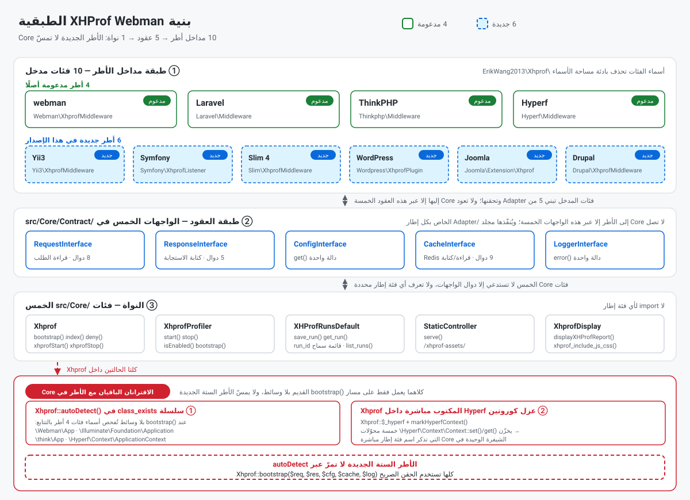
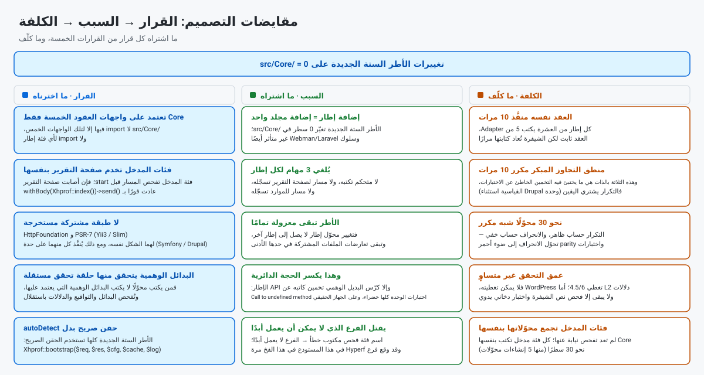
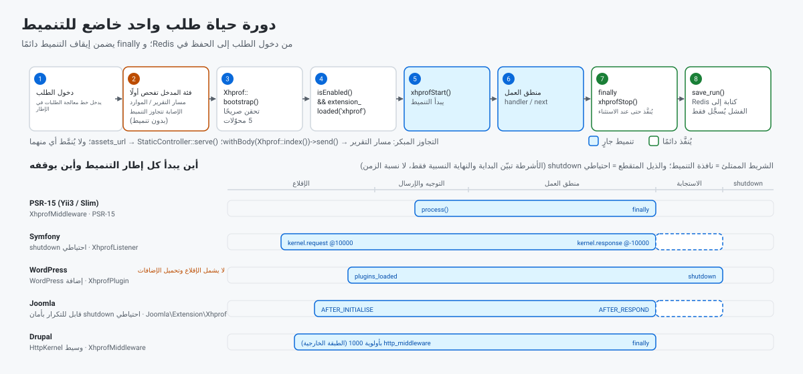

> **ترجمة آلية غير مُراجَعة.** هذا المستند تُرجم آليًا ولم يُراجعه متحدث أصلي بالعربية، وقد يحمل أخطاء في المعنى والمصطلحات. النسخة الإنجليزية هي المرجع المعتمد: [README.EN.md](../../../README.EN.md).

[中文](../../../README.md) · [English](../../../README.EN.md) · [한국어](../ko/README.md) · [Русский](../ru/README.md) · [Deutsch](../de/README.md) · [Français](../fr/README.md) · [Español](../es/README.md) · [Português](../pt/README.md) · **العربية** · [हिन्दी](../hi/README.md) · [বাংলা](../bn/README.md) · [Bahasa Indonesia](../id/README.md) · [日本語](../ja/README.md)

# محلّل أداء XHProf

إضافة لتنميط أداء الشيفرة، متوافقة مع webman / Laravel / ThinkPHP / Hyperf / Yii3 / Symfony / Slim 4 / WordPress / Joomla و Drupal.

تجمع بيانات التنميط عبر إضافة xhprof وتخزّنها في Redis. ويستطيع المطوّرون الوصول سريعًا من المتصفح إلى تقارير تحليل الأداء لتحديد مواضع الاختناق في أداء الشيفرة.

**سجل الطلبات**


**تقرير تشغيل واحد**


## المتطلبات

- PHP >= 8.0
- إضافة xhprof
- إضافة redis
- خادم Redis

## الأطر المتوافقة والحد الأدنى من الإصدارات

| الإطار | الحد الأدنى للإصدار | الحد الأدنى لـ PHP | فئة المدخل | كيفية التركيب |
|-----------|----------------|-------------|-------------|--------------|
| webman | `workerman/webman ^2.1` | 8.0 | `Webman\XhprofMiddleware` | سجّل وسيطًا عامًّا في `config/middleware.php` |
| Laravel | `laravel/framework ^9.0\|^10.0\|^11.0` | 8.0 | `Laravel\Middleware` | سجّل وسيطًا عامًّا في `app/Http/Kernel.php` |
| ThinkPHP | `topthink/framework ^6.0\|^8.0` | 8.0 | `Thinkphp\Middleware` | سجّل وسيطًا عامًّا في `app/middleware.php` |
| Hyperf | `hyperf/framework ^3.0` | 8.0 | `Hyperf\Middleware` | يُسجَّل تلقائيًا عبر ConfigProvider |
| Yii3 | `yiisoft/middleware-dispatcher ^5.0` | 8.1 | `Yii3\XhprofMiddleware` | سجّله في `config/web/di/application.php`، ويجب أن يكون الأول في قائمة الوسطاء |
| Symfony | `symfony/http-kernel ^6.4\|^7.0` | 8.1 (6.4) / 8.2 (7.x) | `Symfony\XhprofListener` | أضف وسم `kernel.event_subscriber` في `config/services.yaml` |
| Slim 4 | `slim/slim ^4.12` | 8.0 | `Slim\XhprofMiddleware` | عبر `$app->add(...)`‎، ويجب أن يُضاف أخيرًا |
| WordPress | 6.4+ | 8.0 | `Wordpress\XhprofPlugin` | انسخه إلى `wp-content/mu-plugins/`‎ |
| Joomla | 4.4 / 5.x | 8.1 | `Joomla\Extension\Xhprof` | انسخه إلى `plugins/system/`‎، وثبّته عبر Discover |
| Drupal | 10.x / 11.x | 8.1 (10.x) / 8.3 (11.x) | وحدة `xhprof` (`Drupal\XhprofMiddleware`) | وحدة قياسية، اكتفِ بتفعيلها |

تقع فئات المدخل جميعها تحت بادئة مساحة الأسماء `ErikWang2013\Xhprof\`‎ (المحذوفة من الجدول أعلاه). ومن بين الأطر الستة الجديدة تُعدّ Drupal الاستثناء — فهي تخدم صفحة التقرير عبر مسارات الوحدة — في حين أن فئات المدخل الخمس الأخرى **تخدم صفحة التقرير بنفسها**، دون كتابة متحكم أو تسجيل مسار.

تعلن هذه الحزمة عن `php >= 8.0`، لكن مكوّنات `yiisoft/*` التي يعتمد عليها Yii3 تشترط **PHP 8.1 أو أحدث**، لذا **لا يمكن استخدام Yii3 على PHP 8.0**؛ وكذلك يحتاج Symfony 7.x و Drupal 11.x إلى إصدار PHP أعلى. وخطوات الإعداد التفصيلية في «إعداد كل إطار» أدناه.

## التثبيت

أضف إعدادات xhprof في php.ini:

```ini
[xhprof]
extension=xhprof.so
xhprof.output_dir=/tmp/xhprof
```

ثم ثبّت عبر Composer:

```sh
composer require aaron-dev/xhprof-webman
```

---

## إعداد كل إطار

### Webman

**1. سجّل وسيطًا عامًّا** — `config/middleware.php`:

```php
return [
    '' => [
        ErikWang2013\Xhprof\Webman\XhprofMiddleware::class,
    ],
];
```

**2. أنشئ المتحكم**:

```php
<?php

namespace app\controller;

use support\Request;
use ErikWang2013\Xhprof\Webman\Xhprof;

class XhprofController
{
    public function index(Request $request)
    {
        return Xhprof::index();
    }
}
```

**3. سجّل المسارات** — `config/route.php`:

```php
use Webman\Route;
use ErikWang2013\Xhprof\Webman\StaticController;

Route::get('/xhprof', [app\controller\XhprofController::class, 'index']);
Route::get('/xhprof-assets/{path:.+}', [StaticController::class, 'serve']);

```

**4. الإعدادات** — انظر `config/plugin/aaron-dev/xhprof/xhprof.php`.

---

### Laravel

**1. سجّل الوسيط** — `app/Http/Kernel.php`:

```php
protected $middleware = [
    // ...
    \ErikWang2013\Xhprof\Laravel\Middleware::class,
];
```

**2. أنشئ المتحكم**:

```php
<?php

namespace App\Http\Controllers;

use Illuminate\Http\Request;
use ErikWang2013\Xhprof\Core\Xhprof;

class XhprofController extends Controller
{
    public function index(Request $request)
    {
        Xhprof::bootstrap();
        return Xhprof::index();
    }
}
```

**3. سجّل المسارات** — `routes/web.php`:

```php
use App\Http\Controllers\XhprofController;
use ErikWang2013\Xhprof\Core\StaticController;
use Illuminate\Support\Facades\Route;

Route::get('/xhprof', [XhprofController::class, 'index']);
Route::get('/xhprof-assets/{path}', function ($path) {
    $req = new \ErikWang2013\Xhprof\Laravel\Adapter\RequestAdapter(request());
    $res = new \ErikWang2013\Xhprof\Laravel\Adapter\ResponseAdapter(response(''));
    return StaticController::serve($req, $res)->send();
})->where('path', '.*');

```

**4. انشر ملف الإعدادات**:

```sh
php artisan vendor:publish --tag=xhprof-config
```

ملف الإعدادات في `config/xhprof.php`. ويدعم Laravel الاكتشاف التلقائي لـ ServiceProvider.

---

### ThinkPHP

**1. سجّل الوسيط** — `app/middleware.php`:

```php
return [
    \ErikWang2013\Xhprof\Thinkphp\Middleware::class,
];
```

**2. أنشئ المتحكم**:

```php
<?php

namespace app\controller;

use think\Request;
use ErikWang2013\Xhprof\Core\Xhprof;

class XhprofController
{
    public function index(Request $request)
    {
        Xhprof::bootstrap();
        return Xhprof::index();
    }
}
```

**3. سجّل المسارات** — `route/app.php`:

```php
use think\facade\Route;
use ErikWang2013\Xhprof\Core\StaticController;
use ErikWang2013\Xhprof\Thinkphp\Adapter\RequestAdapter;
use ErikWang2013\Xhprof\Thinkphp\Adapter\ResponseAdapter;

Route::get('/xhprof', 'app\controller\XhprofController@index');
Route::get('/xhprof-assets/[:path]', function ($path = '') {
    $req = new RequestAdapter(app('request'));
    $res = new ResponseAdapter(response(''));
    return StaticController::serve($req, $res)->send();
})->pattern(['path' => '.*']);

```

**4. الإعدادات** — انسخ `vendor/aaron-dev/xhprof-webman/src/Thinkphp/config/xhprof.php` إلى `config/xhprof.php` في مشروعك.

---

### Hyperf

**1. تسجيل الوسيط تلقائيًا** — يضيف ConfigProvider الوسيط تلقائيًا إلى قائمة وسطاء HTTP.

**2. أنشئ المتحكم**:

```php
<?php

namespace App\Controller;

use Hyperf\HttpServer\Annotation\Controller;
use Hyperf\HttpServer\Annotation\RequestMapping;
use ErikWang2013\Xhprof\Core\Xhprof;

#[Controller(prefix: '/xhprof')]
class XhprofController
{
    #[RequestMapping(path: '')]
    public function index()
    {
        Xhprof::bootstrap();
        $html = Xhprof::index();
        if (!is_string($html)) {
            return $html;
        }
        return $this->response
            ->withStatus(200)
            ->withHeader('Content-Type', 'text/html; charset=UTF-8')
            ->withBody(new \Hyperf\HttpMessage\Stream\SwooleStream($html));
    }
}
```

عندما يعيد `Xhprof::index()`‎ سلسلة HTML، **لا** تُرجعه مباشرةً عبر `return`: فـ `CoreMiddleware::transferToResponse()`‎ في Hyperf يضيف `content-type: text/plain`‎ بلا شرط إلى القيم المُعادة من نوع سلسلة، فيعرض المتصفح صفحة التقرير كنصّ عادي (قيس السلوك نفسه في الإصدارات 3.0.45 / 3.1.69 / 3.2.0). والاستجابة الصريحة أعلاه تتجاوز ذلك؛ وعند فشل المصادقة يعيد `index()`‎ كائن استجابة سبق إرساله — فأعِده كما هو.

**3. مسارات الموارد الساكنة** — `config/routes.php`:

```php
use Hyperf\HttpServer\Router\Router;
use ErikWang2013\Xhprof\Core\StaticController;
use ErikWang2013\Xhprof\Hyperf\Adapter\RequestAdapter;
use ErikWang2013\Xhprof\Hyperf\Adapter\ResponseAdapter;
use Hyperf\Context\ApplicationContext;

Router::get('/xhprof-assets/{path:.+}', function ($path) {
    $container = ApplicationContext::getContainer();
    $req = new RequestAdapter($container->get(\Hyperf\HttpServer\Contract\RequestInterface::class));
    $res = new ResponseAdapter($container->get(\Hyperf\HttpServer\Contract\ResponseInterface::class));
    return StaticController::serve($req, $res)->send();
});

```

**4. انشر ملف الإعدادات**:

```sh
php bin/hyperf.php vendor:publish aaron-dev/xhprof-webman
```

وتكون الإعدادات الناتجة في `config/autoload/xhprof.php`.

---

### Yii3

**1. سجّل الوسيط** — `config/web/di/application.php`:

```php
use ErikWang2013\Xhprof\Yii3\XhprofMiddleware;
use Yiisoft\Middleware\Dispatcher\MiddlewareDispatcher;

return [
    MiddlewareDispatcher::class => [
        'class' => MiddlewareDispatcher::class,
        // the first element is the outermost middleware (runs first, finishes last)
        'withMiddlewares()' => [[
            XhprofMiddleware::class,
            // ... other middlewares
        ]],
    ],
];
```

خطأان شائعان (كلاهما مُقاس):

- **لا** تكتب `'__construct()' => ['middlewares' => [...]]`: فالمُنشئ `MiddlewareDispatcher::__construct()`‎ لا يقبل إلا `MiddlewareFactory` واختياريًا `EventDispatcherInterface` — ولا يوجد **أي** معامل باسم `middlewares`. ولا يمكن حقن قائمة الوسطاء إلا عبر دالة النسخة `withMiddlewares()`‎.
- **لا** تضع كائنًا (`new XhprofMiddleware(...)`‎) داخل `withMiddlewares()`‎: فالتعريفات لا تقبل إلا نصًّا لاسم فئة أو تعريفًا مصفوفًا أو دالة قابلة للاستدعاء. ومع كائن، لا يُسجَّل شيء ويرفع `dispatch()`‎ استثناء `TypeError` (لأن `MiddlewareFactory::create()`‎ مقيَّدة بـ `callable|array|string`).

**2. صفحة التقرير والموارد الساكنة** — **لا حاجة إلى متحكم أو تسجيل مسار**: فـ `XhprofMiddleware` وسيط PSR-15. وقبل بدء التنميط يفحص مسار الطلب: فإن أصاب مسار التقرير `/xhprof` أعاد صفحة التقرير فورًا، وإن أصاب مسار الموارد (بادئته الافتراضية `/xhprof-assets`) أعاد المورد الساكن مباشرة. وتحمل استجابة صفحة التقرير ترويسة `Content-Type: text/html; charset=UTF-8` صريحة من فئة المدخل: فاستجابات PSR-7 لا ترويسة افتراضية لها، ومُرسِل الاستجابة في Yii3 لا يضيف واحدة، ولولاه لعرض المتصفح تقرير HTML كنص عادي.

**3. الإعدادات** — القيم الافتراضية في الحزمة عند `src/Yii3/config/xhprof.php`؛ وانظر «مرجع الإعدادات» لمعرفة الحقول. ولتجاوزها، احقن `$config` عبر DI:

```php
XhprofMiddleware::class => [
    'class' => XhprofMiddleware::class,
    '__construct()' => [
        'config' => [
            'enable' => true,
            'auth_token' => 'your-token',
            'redis' => [
                'host' => '127.0.0.1',
                'port' => 6379,
                'password' => '',
                'database' => 0,
                'timeout' => 1.0,
            ],
        ],
    ],
],
```

المصفوفة الفرعية `redis` خاصة بـ Yii3: فعندما لا يُحقن أي `CacheInterface` يستخدمها الوسيط للتواصل مع phpredis مباشرة. وأبقِ `assets_url` يمكن ضبطه على أي بادئة: فروابط CSS/JS في صفحة التقرير و`StaticController` يقرآن الخيار نفسه (الافتراضي `/xhprof-assets`). أما القيود المتبقية عند النشر في مجلد فرعي فهي في [التحقق والقيود المعروفة](#التحقق-والقيود-المعروفة).

**4. متطلبات الإصدار** — تشترط مكوّنات `yiisoft/*` التي يعتمد عليها Yii3 إصدار PHP 8.1 أو أحدث. ومع أن هذه الحزمة تعلن `php >= 8.0`، لا يمكن استخدام تكامل Yii3 على PHP 8.0.

---

### Symfony

**1. سجّل مستمع الأحداث** — `config/services.yaml`:

```yaml
services:
    ErikWang2013\Xhprof\Symfony\XhprofListener:
        tags:
            - { name: kernel.event_subscriber }
```

**2. صفحة التقرير والموارد الساكنة** — **لا حاجة إلى متحكم أو تسجيل مسار**: فقبل بدء التنميط يفحص المستمع مسار الطلب: فإن أصاب مسار التقرير `/xhprof` أعاد صفحة التقرير فورًا، وإن أصاب مسار الموارد (بادئته الافتراضية `/xhprof-assets`) أعاد المورد الساكن مباشرة.

**3. الإعدادات** — القيم الافتراضية في الحزمة عند `src/Symfony/config/xhprof.php`؛ وانظر «مرجع الإعدادات» لمعرفة الحقول.

**4. الطلبات الفرعية والاحتياطي عند الاستثناء** — يستمع المستمع إلى `kernel.request` (بأولوية 10000) و `kernel.response` (بأولوية -10000). وتستبعد `isMainRequest()`‎ الطلبات الفرعية من نوع ESI/fragment التي لولا ذلك لأوقفت التنميط مبكرًا؛ كما يُسجَّل `register_shutdown_function` قابل للتكرار بأمان عند بدء الطلب — فإن أعاد HttpKernel رفع استثناء لم يعمل `kernel.response` أبدًا، ولولا ذلك الاحتياطي لتسرّبت حالة التنميط إلى الطلب التالي.

---

### Slim 4

**1. سجّل الوسيط** — `public/index.php`:

```php
use ErikWang2013\Xhprof\Slim\XhprofMiddleware;

$app->addRoutingMiddleware();

// must be added last: Slim's middleware stack is LIFO, added later = further out = runs first
$app->add(new XhprofMiddleware(
    $app->getResponseFactory()
));
```

أما معاملات المُنشئ الثلاثة الباقية فكلها اختيارية؛ اتركها لاستخدام القيم الافتراضية في الحزمة:

- المعامل الثاني `array $config`: مصفوفة إعداداتك، تُدمج فوق `src/Slim/config/xhprof.php` بـ `array_replace` (استبدال كامل للقيم — فمفاتيح القوائم مثل `ignore_url_arr` لا تُدمج دمجًا متداخلًا أبدًا).
- المعامل الثالث `CacheInterface $cache`: إن تُرك، ينشئ الوسيط `new \Redis()`‎ بتأخير (فالمُنشئ لا يلمس ext-redis عمدًا، حتى لا تنفجر العملية عند غياب الإضافة أثناء بناء المحوّل). ولحقن اتصالك الخاص مرّر `new \ErikWang2013\Xhprof\Slim\Adapter\RedisAdapter($redis)`‎، أو أي كائن ينفّذ `ErikWang2013\Xhprof\Core\Contract\CacheInterface`.
- المعامل الرابع `LoggerInterface $logger`: إن تُرك صار `new \ErikWang2013\Xhprof\Slim\Adapter\LogAdapter()`‎ و**تُهمل السجلات صامتةً** (فـ Slim لا يوفّر مسجّل PSR-3). ولتسجيلها مرّر `new LogAdapter($psrLogger)`‎ حيث `$psrLogger` مسجّل PSR-3 متاح لديك.

**لا تكتب `$app->add(XhprofMiddleware::class)`‎**: فـ `CallableResolver` في Slim يحوّل نص الفئة هذا إلى `new XhprofMiddleware($container)`‎ — أي تمرير الحاوية وحدها مع تأجيل الحل إلى وقت الطلب. والنتيجة أن `add()`‎ لا يبلّغ عن شيء وأن أول طلب يرفع `TypeError` — وهو أصعب أنماط الفشل تشخيصًا. استخدم دائمًا `new` الصريحة أعلاه.

**2. صفحة التقرير والموارد الساكنة** — **لا حاجة إلى متحكم أو تسجيل مسار**: فقبل بدء التنميط يفحص الوسيط مسار الطلب: فإن أصاب مسار التقرير `/xhprof` أعاد صفحة التقرير فورًا، وإن أصاب مسار الموارد (بادئته الافتراضية `/xhprof-assets`) أعاد المورد الساكن مباشرة.

**3. الإعدادات** — القيم الافتراضية في الحزمة عند `src/Slim/config/xhprof.php`؛ وانظر «مرجع الإعدادات» لمعرفة الحقول.

**4. ترتيب التركيب** — مكدّس الوسطاء في Slim يعمل بنمط LIFO (مقاسًا بوسيطين، ترتيب التنفيذ هو `B:before → A:before → A:after → B:after`): فكلما أضفت لاحقًا كان الوسيط في طبقة أبعد وعمل أبكر. لذا يجب إضافة xhprof **أخيرًا**، و**بعد `addRoutingMiddleware()`‎** — وإلا لم يكن `/xhprof` في جدول التوجيه، فيرفع RoutingMiddleware استثناء `HttpNotFoundException` أولًا، ولا يصل الطلب إلى الوسيط أبدًا. وتحمل استجابة صفحة التقرير ترويسة `Content-Type: text/html; charset=UTF-8` صريحة من فئة المدخل: فاستجابات PSR-7 لا ترويسة افتراضية لها، و`ResponseEmitter` في Slim لا يضيف واحدة، ولولاه لعرض المتصفح تقرير HTML كنص عادي.

---

### WordPress

**1. ثبّت إضافة mu** — انسخ ملف الإقلاع من الحزمة إلى `wp-content/mu-plugins/`‎:

```sh
cp vendor/aaron-dev/xhprof-webman/wordpress/xhprof-webman.php wp-content/mu-plugins/
```

يحمل `wordpress/xhprof-webman.php` ترويسة إضافة ويقلع `Wordpress\XhprofPlugin`. وتُحمَّل إضافات mu تلقائيًا — فلا شيء لتفعيله في wp-admin.

**2. صفحة التقرير والموارد الساكنة** — **لا حاجة إلى متحكم أو تسجيل مسار**: فقبل بدء التنميط تفحص فئة المدخل مسار الطلب: فإن أصاب مسار التقرير `/xhprof` أعادت صفحة التقرير فورًا، وإن أصاب مسار الموارد (بادئته الافتراضية `/xhprof-assets`) أعادت المورد الساكن مباشرة.

**3. الإعدادات** — القيم الافتراضية في الحزمة عند `src/Wordpress/config/xhprof.php`؛ وانظر «مرجع الإعدادات» لمعرفة الحقول. واستخدم `ignore_url_arr` لاستثناء المسارات كثيفة التردد مثل `wp-cron.php` و `admin-ajax.php`.

**4. حدّ بنيوي في نافذة التنميط** — النافذة هي `plugins_loaded` → `shutdown`، وهي **لا تشمل** إقلاع `wp-settings.php` ولا تحميل الإضافات نفسه. وهذا حدّ بنيوي في WordPress: فالعمل المنجز في تلك المرحلة لا يمكن تنميطه.

---

### Joomla

**1. ثبّت الإضافة** — انسخ مجلد `joomla/`‎ من الحزمة إلى `plugins/system/xhprof/`‎ في موقعك:

```sh
cp -r vendor/aaron-dev/xhprof-webman/joomla/ plugins/system/xhprof/
```

مجلد `joomla/`‎ في الحزمة *هو* الإضافة: ملف التعريف `xhprof.xml`، و `services/provider.php`، و `src/Extension/Xhprof.php`. وفئة المدخل هي `ErikWang2013\Xhprof\Joomla\Extension\Xhprof` (وترث `CMSPlugin`). وبعد النسخ شغّل Discover من «System → Manage → Extensions → Discover» ثم ثبّتها وفعّلها.

**2. صفحة التقرير والموارد الساكنة** — **لا حاجة إلى متحكم أو تسجيل مسار**: فقبل بدء التنميط تفحص الإضافة مسار الطلب: فإن أصاب مسار التقرير `/xhprof` أعادت صفحة التقرير فورًا، وإن أصاب مسار الموارد (بادئته الافتراضية `/xhprof-assets`) أعادت المورد الساكن مباشرة.

**3. الإعدادات** — القيم الافتراضية في الحزمة عند `src/Joomla/config/xhprof.php`؛ وانظر «مرجع الإعدادات» لمعرفة الحقول. **مقايضة معروفة**: هنا يُقرأ ملف إعدادات الحزمة لا معاملات الإضافة — فمعاملات الإضافة تتطلب قراءة من قاعدة البيانات، والإعدادات تُقرأ في كل طلب.

**4. حدود التنميط** — النافذة هي `ApplicationEvents::AFTER_INITIALISE` → `ApplicationEvents::AFTER_RESPOND`؛ ويُسجَّل أيضًا `register_shutdown_function` قابل للتكرار بأمان في `AFTER_INITIALISE`، لأن الوصول إلى `AFTER_RESPOND` غير مضمون على مسار الاستثناء — ولولا ذلك الاحتياطي لتسرّبت حالة التنميط إلى الطلب التالي.

---

### Drupal

**1. فعّل الوحدة** — مجلد `drupal/xhprof/`‎ في الحزمة وحدة Drupal قياسية (`xhprof.info.yml` / `xhprof.routing.yml` / `xhprof.services.yml`). ضعها في `modules/custom/xhprof/`‎ بموقعك، ثم فعّلها من صفحة «Extend» (أو بالأمر `drush en xhprof`).

**2. صفحة التقرير** — Drupal هي **الإطار الوحيد من الأطر العشرة الذي يخدم صفحة التقرير عبر مسارات الوحدة**: فملف `xhprof.routing.yml` يسجّل مسار التقرير `/xhprof` ويعرضه متحكم الوحدة. أما الأطر الخمسة الجديدة الأخرى فتخدم صفحة التقرير والموارد الساكنة بنفسها ولا تسجّل أي مسار.

**3. الإعدادات** — الإعدادات هنا إعدادات مُهيّأة على مستوى الوحدة: القيم الافتراضية في `drupal/xhprof/config/install/xhprof.settings.yml`، والمخطط في `drupal/xhprof/config/schema/xhprof.schema.yml`. وانظر «مرجع الإعدادات» لمعرفة الحقول.

**4. تسجيل الوسيط** — سجّل خدمة الوسيط في `xhprof.services.yml` داخل الوحدة:

```yaml
services:
  xhprof.http_middleware:
    class: ErikWang2013\Xhprof\Drupal\XhprofMiddleware
    arguments: ['@config.factory', '@logger.factory']
    tags:
      - { name: http_middleware, priority: 1000 }
```

النواة الداخلية **تُضاف تلقائيًا كمعامل مُنشئ رقم 0** عبر `StackedKernelPass` في Drupal — **فلا تكتبها بنفسك**: فكتابتها تنتج نواتين داخليتين، وهو ما يفشل عند ترجمة الحاوية على Drupal <= 11.2.x (بما فيها كل إصدارات 10.x) ويرفع TypeError في كل طلب على 11.3.0 وما بعدها. ويتوقف التنميط في `finally`.

**5. ملاحظات**

- الأولوية `priority: 1000` تضع الوسيط **خارج ذاكرة التخزين المؤقت للصفحات** (فأعلى أولوية قائمة في النواة هي negotiation: 400 على D10 و500 على D11، بينما ذاكرة الصفحات 200)، لذا **تُنمَّط الطلبات المخدومة من ذاكرة التخزين المؤقت للصفحات في Drupal**. وبالنسبة لأداة تنميط هذا هو السلوك المقصود، لكن ينبغي أن يعرفه المستخدمون.
- ذاكرة التخزين المؤقت تعمل دون إعداد: فالوسيط يستخدم افتراضيًا محوّل Redis المشحون مع هذه الحزمة (والحزمة تعتمد على ext-redis اعتمادًا صريحًا)، ويقبل أيضًا معامل `CacheInterface` اختياريًا عبر `arguments` في `services.yml` لتجاوزه. وإن كانت الذاكرة غير متاحة، يبتلع `XhprofProfiler::stop()`‎ الفشل في سطر سجل واحد — **دون رفع أي خطأ**.
- الطلبات إلى صفحة التقرير `/xhprof` وإلى `/xhprof-assets/*` **لا تُنمَّط**: فالوسيط يتخطى التنميط بحسب المسار قبل `xhprofStart()`‎. ومع ذلك تبقى الاستجابة صادرة من المتحكم في `xhprof.routing.yml` (**وهذا ليس تجاوزًا مبكرًا**). لذا حتى مع ضبط `ignore_url_arr` على `[]` (أي بلا تصفية)، لا يظهر هذان الطلبان في التقرير أبدًا.

---

## مرجع الإعدادات

تتشارك كل الأطر خيارات الإعدادات هذه:

| الإعداد | النوع | القيمة الافتراضية | الوصف |
|--------|------|---------|-------------|
| `enable` | bool | `true` | تفعيل التنميط أو تعطيله |
| `time_limit` | int | `0` | تُنمَّط فقط الطلبات التي تتجاوز n ثانية؛ و0 تعني الكل |
| `log_num` | int | `1000` | الحد الأقصى لعدد السجلات |
| `view_wtred` | int | `3` | إبراز الصفوف التي يزيد زمن استجابتها على n ثانية بالأحمر |
| `ignore_url_arr` | array | `["/xhprof"]` | مسارات URL التي تُستثنى |
| `assets_url` | string | `/xhprof-assets` | بادئة URL للموارد الساكنة |
| `auth_token` | string\|null | `null` | عند ضبطه تتطلب صفحة التقرير `?token=xxx`؛ ويُوصى به للنشر العام |
| `key_prefix` | string | `xhprof` | بادئة مفاتيح Redis؛ اضبط قيمًا مختلفة لكل مشروع عند مشاركة Redis واحد |
| `log_ttl` | int | `604800` | مدة الاحتفاظ بالبيانات بالثواني (7 أيام افتراضيًا) |
| `locale` | string\|null | `null` | لغة صفحة التقرير: `zh_CN`/`en`/`ko`/`ru`/`de`/`fr`/`es`/`pt`/`ar`/`hi`/`bn`/`id`/`ja`؛ `null` = اتباع `Accept-Language` في المتصفح، وإلا فالصينية؛ ويمكن لـ `?lang=xx` تجاوزها لطلب واحد |

والقيود المعروفة لهذه الخيارات في كل إطار مدرجة في [التحقق والقيود المعروفة](#التحقق-والقيود-المعروفة).

**مبدّل اللغة في صفحة التقرير**

تسرد القائمة المنسدلة على يمين شريط التنقّل اللغات الـ 13 **بأسمائها الذاتية** (قيمة `_meta.name` في كل قاموس، مثل 한국어 و日本語). ويُبنى رابط كل خيار من **سلسلة استعلام الصفحة الحالية** (`XhprofLib::report_url()`)، لذلك تنتقل معه `?token=` والترتيب و`run` وبقية الوسائط؛ وتغيير اللغة **لا يغادر العرض الحالي** — فعند تغييرها في تقرير تشغيل تبقى على التشغيل نفسه.

**منطقة التشخيص في صفحة التقرير**

البطاقة الأولى في متن التقرير هي «نتائج التشخيص» (أسفل وصف التشغيل مباشرة): تسرد أولًا «لماذا هو بطيء» (3 أسباب على الأكثر)، ثم «ملاحظات أخرى» (3 نقاط فحص على الأكثر). رابط «عرض» بعد كل نتيجة ينقل إلى صفحة تفاصيل الدالة؛ أما الاستدعاء الذاتي (R4) فلا رابط له إلا إذا كان الاسم المجرّد موجودًا فعلًا في جدول الرموز — يفكّ xhprof الاستدعاء الذاتي إلى `fib@1`/`fib@2`، وإن لم تبقَ إلا الأسماء المفكوكة فلا تجد صفحة التفاصيل الرمز `fib`. القواعد الست وحدودها:

- **R1** الزمن الذاتي ≥ 10% من الزمن الكلي للطلب؛
- **R2** عدد الاستدعاءات ≥ 1000؛
- **R3** استدعاءات علاقة واحدة ≥ 500 **مع** زمن ذاتي للدالة المستدعاة ≥ 5% من الزمن الكلي للطلب؛
- **R4** ظهور الرمز نفسه على عمقين مختلفين أو أكثر (استدعاء ذاتي)؛
- **R5** ذروة الذاكرة الذاتية ≥ 30% من الذروة الإجمالية؛
- **R6** الزمن الذاتي > الزمن الشامل (`excl_wt > wt`، وهو مستحيل منطقيًا) — مسبار سلامة بيانات لا يُطلق أبدًا على بيانات سليمة.

الحدود مثبّتة كثوابت في `src/Core/Analysis/Analyzer.php`، ولا يوجد حاليًا **أي خيار إعداد** يعدّلها أو يعطّل هذه البطاقة (إيقاف `enable` يعني عدم جمع أي بيانات، فلا يوجد ما يُشخَّص). وتظهر **في عرض التشغيل الواحد على المستوى الأعلى فقط**: لا عرض الفروق (diff) ولا صفحة تفاصيل الدالة يرسمانها — لأن `$symbol_tab`/`$totals` المارّين هناك ليسا قيم تشغيل واحد (في وضع diff هما فروق run2 − run1).

---

## التهيئة اليدوية

إن فشل الاكتشاف التلقائي للإطار، يمكنك حقن المحوّلات يدويًا:

```php
use ErikWang2013\Xhprof\Core\Xhprof;

Xhprof::bootstrap(
    new MyRequestAdapter($request),
    new MyResponseAdapter($response),
    new MyConfigAdapter(),
    new MyCacheAdapter(),
    new MyLoggerAdapter()
);
```

**يجب ألا تستدعي الأطر الستة الجديدة (Yii3 / Symfony / Slim 4 / WordPress / Joomla / Drupal) الدالة `Xhprof::bootstrap()`‎ بلا معاملات** — فهي بلا معاملات تمرّ عبر `autoDetect()`‎ الذي لا يعرف إلا فروع webman / Laravel / ThinkPHP / Hyperf ويرفع `Unsupported framework` على هذه الستة. مرّر المحوّلات الخمسة كلها صريحة كما في المثال أعلاه (وفئة المدخل المشحونة مع كل إطار تفعل ذلك عنك أصلًا).

---

## البنية والتصميم

تصل النواة إلى الإطار عبر 5 عقود بالضبط، وكلها في `src/Core/Contract/`‎:

| العقد | الدوال | الغرض |
|----------|---------|---------|
| `RequestInterface` | `get()`‎ `all()`‎ `method()`‎ `header()`‎ `host()`‎ `uri()`‎ `url()`‎ `getRealIp()`‎ | قراءة بيانات الطلب، ومطابقة مسار التقرير، وبناء روابط صفحة التقرير |
| `ResponseInterface` | `withBody()`‎ `withHeaders()`‎ `withStatus()`‎ `file()`‎ `send()`‎ | إصدار صفحة التقرير والموارد الساكنة و 400/403 |
| `ConfigInterface` | `get()`‎ | قراءة إعدادات الإضافة: `get('xhprof')`‎ للكتلة كاملة، و`get('xhprof.assets_url')`‎ لورقة واحدة |
| `CacheInterface` | `get()`‎ `set()`‎ `mget()`‎ `incr()`‎ `lPush()`‎ `rPop()`‎ `lRange()`‎ `del()`‎ `decr()`‎ | القراءة والكتابة في Redis |
| `LoggerInterface` | `error()`‎ | تحذيرات الإضافات المفقودة وفشل الحفظ |

ويوفّر كل إطار 5 محوّلات تنفّذ هذه العقود، يسجّلها في النواة `Xhprof::bootstrap()`‎. وكل ما يخصّ إطارًا بعينه يبقى داخل مجلد `src/<Fw>/`‎ الخاص به.

**لم يبقَ في النواة إلا موضعا اقتران مع الأطر**:

1. سلسلة `class_exists()`‎ في `Xhprof::autoDetect()`‎ (`Webman\App` → `Illuminate\Foundation\Application` → `think\App` → `Hyperf\Context\ApplicationContext`)، ولا يُصل إليها إلا بـ `bootstrap()`‎ بلا معاملات.
2. تبديل كوروتين Hyperf المكتوب مباشرة: `Xhprof::markHyperfContext()`‎ مع فحوص وجود `\Hyperf\Context\Context`، وهي التي تقرر هل تُوضع المحوّلات في خصائص ساكنة على مستوى العملية أم في سياق الكوروتين.

**الأطر الستة الجديدة لا تمرّ عبر `autoDetect()`‎ أبدًا — بل تستخدم الحقن الصريح**: فكل فئة مدخل تبني محوّلاتها الخمسة بنفسها وتمرّرها إلى `Xhprof::bootstrap($req, $res, $cfg, $cache, $log)`‎. والسبب أن الطلب/الاستجابة في أطر PSR-7 لا يمكن الحصول عليهما إلا من خط معالجة الطلبات، فـ `bootstrap()`‎ بلا معاملات لا يمكن أن يعمل بحكم البنية؛ وفائدة ثانية أن `autoDetect()`‎ تظل مجمّدة على أطرها الأربعة الحالية.



المخطط الأول هو **البنية**: فئة مدخل كل إطار من الأطر العشرة، والعقود الخمسة، وطبقات النواة الثلاث، والاقترانان الوحيدان الباقيان.



المخطط الثاني هو **الاستدلال**: خمس مقايضات معروضة في صورة قرار / سبب / كلفة، يتصدرها «تغييرات الأطر الستة الجديدة على `src/Core/`‎ = 0».

---

## دورة حياة الطلب

طلب واحد خاضع للتنميط:

1. **قبل بدء التنميط**، تفحص فئة المدخل المسار: فإن أصاب مسار التقرير أعادت صفحة التقرير فورًا، وإن أصاب مسار الموارد أعادت المورد الساكن فورًا. ولا يُنمَّط أي من المسارين، ولا يدخل أي منهما التدفق أدناه.
2. تقرأ `XhprofProfiler::isEnabled()`‎ الإعداد `enable`؛ فإن كان التنميط معطلًا أو كانت إضافة مفقودة، تُتخطى الكتلة كلها.
3. `Xhprof::xhprofStart()`‎ → `XhprofProfiler::start()`‎ → `xhprof_enable(XHPROF_FLAGS_NO_BUILTINS + XHPROF_FLAGS_CPU + XHPROF_FLAGS_MEMORY)`‎.
4. يعمل منطق العمل.
5. `finally { Xhprof::xhprofStop(); }` → `xhprof_disable()`‎، ثم يكتب `XHProfRunsDefault::save_run()`‎ في Redis. و`finally` بدل عبارة عادية، حتى يُفرغ الاستثناء المرفوع حالة التنميط ويحفظ التشغيل رغم ذلك.
6. يفتح المتصفح صفحة التقرير؛ فتقرأ `Xhprof::index()`‎ البيانات عائدةً من Redis وتعرضها.



| الإطار | بداية التنميط | نهاية التنميط |
|-----------|-----------------|----------------|
| webman / Laravel / ThinkPHP / Hyperf | دخول الوسيط (`process()`‎ / `handle()`‎) | `finally` |
| Yii3 / Slim 4 | `process()`‎ في PSR-15 | `finally` |
| Symfony | `kernel.request` (أولوية 10000) | `kernel.response` (أولوية -10000)، مع احتياطي shutdown |
| WordPress | `plugins_loaded` | `shutdown` |
| Joomla | `onAfterInitialise` | `onAfterRespond`، مع احتياطي shutdown |
| Drupal | `http_middleware` (أولوية 1000، الطبقة الخارجية) | `finally` |

---

## بنية المشروع

```
xhprof-webman/
├── src/
│   ├── Core/                     # Framework-agnostic: contracts, report page, Redis, assets
│   │   ├── Contract/             # the 5 contract interfaces
│   │   ├── XhprofLib/            # report rendering and run storage (from phacility/xhprof)
│   │   ├── Xhprof.php            # static facade: bootstrap() / index()
│   │   ├── XhprofProfiler.php    # xhprof_enable/disable and config
│   │   ├── StaticController.php  # /xhprof-assets static assets
│   │   ├── MiddlewareTrait.php   # shared profiling wrapper for Laravel / ThinkPHP
│   │   └── RedisAdapterTrait.php # shared Redis adapter implementation
│   ├── Webman/ Laravel/ Thinkphp/ Hyperf/            # the existing 4 frameworks
│   ├── Yii3/ Symfony/ Slim/ Wordpress/ Joomla/ Drupal/   # the 6 new frameworks
│   └── html/                     # report page assets (css / js / images)
├── wordpress/                    # mu-plugin bootstrap file (with plugin header)
├── joomla/                       # Joomla plugin (CMSPlugin + manifest)
├── drupal/xhprof/                # standard Drupal module (info / routing / services + controller)
├── tools/contracts/              # standalone verification loop: signatures and semantics against real framework packages
├── tools/i18n/                   # translation toolchain for the README and the three SVGs (generate / check / selftest)
├── docs/i18n/                    # the 12 translated deliverables (English, Korean, Russian, German, French, Spanish, Portuguese, Arabic, Hindi, Bengali, Indonesian, Japanese)
├── tests/                        # PHPUnit: adapter tests, wiring tests, Core tests, structural parity across all 14 READMEs
└── docs/images/                  # README diagrams
```

باستثناء Drupal، لكل مجلد `src/<Fw>/`‎ الشكل نفسه:

```
src/<Fw>/
├── Adapter/{Request,Response,Config,Redis,Log}Adapter.php
├── <EntryClass>.php
└── config/xhprof.php             # the same 10 config keys as every other framework
```

و`src/Drupal/`‎ هو الاستثناء الوحيد: فليس فيه مجلد `config/`‎ — إذ تعيش إعداداته في إعدادات مُهيّأة على مستوى الوحدة (`drupal/xhprof/config/install/xhprof.settings.yml`).

---

## التحقق والقيود المعروفة

**ما هو مُثبَت آليًا**

| البند | الطريقة |
|------|-----|
| سلوك المحوّلات وتوصيل فئات المدخل | `tests/Unit/Adapter/*Test.php`: مفعّل → يُحفظ / معطّل → لا يُحفظ / استثناء في منطق العمل → يُحفظ رغم ذلك عبر `finally` |
| الأطر العشرة كلها تتشارك مجموعة مفاتيح إعدادات واحدة | اختبار تكافؤ الإعدادات (مجموعات المفاتيح لا التطابق الحرفي؛ فالتعليقات قد تختلف) |
| ملفا README يطابق أحدهما الآخر | اختبار تكافؤ README: يقارن تسلسل عناوين `##` / `###` وعدد كتل الشيفرة |
| الدوال التي تستدعيها المحوّلات موجودة فعلًا | حلقة التحقق في `tools/contracts/`‎ (ولها مهمة CI خاصة): تثبّت حزم الأطر الحقيقية وتتحقق عبر الانعكاس من وجود كل دالة وثابت ودالة عامة **للأطر الثمانية المشمولة في الحلقة** (Slim / Symfony / Yii3 / Joomla / WordPress / Drupal / Laravel / Webman)؛ أما ThinkPHP / Hyperf فغير مشمولين بالحلقة، انظر أدناه |
| دلالات المحوّلات | الحلقة نفسها تنشئ كائنات طلب واستجابة حقيقية وتشغّل المحوّلات، بما في ذلك ثابتان: أن `uri()`‎ لا تحمل مخطّطًا ولا مضيفًا، وأن `withHeaders()`‎ تظل سارية بعد `file()`‎ |


**غير مُتحقَّق منه آليًا (لا تقرأ هذا على أنه «اختبار الأطر الستة جميعًا»)**

| البند | لماذا لا |
|------|---------|
| **توصيل** كل إطار (هل الخُطّاف موصول فعلًا، وهل يقع الحدث فعلًا) | اختبارات الوحدة تستخدم بدائل وهمية؛ والتوصيل لا يمكن تأكيده حاليًا إلا باختبارات دخانية يدوية |
| WordPress من طرف إلى طرف | توقيت `plugins_loaded` الفعلي، وهل يقع `shutdown` عند خطأ فادح، وهل تُحمَّل إضافة mu — كل ذلك يحتاج WordPress حقيقيًا |
| اكتشاف إضافة Joomla و `$app->close()`‎ | يحتاج تشغيل Discover في لوحة تحكم Joomla حقيقية |
| هل تقع أولوية Drupal فعلًا خارج ذاكرة التخزين المؤقت للصفحات | يحتاج نواة Drupal مُقلَعة |
| التهيئة التلقائية لـ `kernel.event_subscriber` في Symfony | يحتاج ترجمة حاوية حقيقية |
| تشابك الحالة الساكنة في العمليات طويلة العمر | موروث من البنية القائمة (والأمر نفسه ينطبق على Webman / Hyperf)؛ ولم يتغير هنا |
| إدخال/إخراج Redis الحقيقي، وعرض المتصفح، وكلفة التنميط تحت حمل حقيقي | إدخال/إخراج Redis الحقيقي **دخل حلقة التحقق** (`cases/Redis.php`: phpredis حقيقي + طلب Slim حقيقي من الطرفين — طلب → تخزين → صفحة القائمة → صفحة التقرير)؛ أما عرض المتصفح وكلفة التنميط تحت حمل حقيقي فتبقى خارج نطاق اختبارات الوحدة وحلقة التحقق |
| توقيعات محوّلي ThinkPHP / Hyperf ودلالاتهما | هذان ليسا في حلقة التحقق (فالحلقة تغطي ثمانية أطر)؛ وستَباتها (stubs) مكتوبة يدويًا داخل الحزمة في `tests/Stubs/framework-stubs.php`‎، دون مقارنة بحزم حقيقية |

**قائمة تحقق دخانية يدوية (ثلاث خطوات لكل إطار)**

| الخطوة | الإجراء | المتوقع |
|------|--------|----------|
| 1 | ركّب فئة المدخل كما في «إعداد كل إطار» | لا أخطاء |
| 2 | اطلب أي عنوان في التطبيق | يزيد طول المفتاح `xhprof:run_id` في Redis بمقدار 1 |
| 3 | افتح `/xhprof` | تُعرض صفحة التقرير بأنماطها؛ ويعيد `/xhprof-assets/js/xhprof_report.js` الاستجابة 200 |

**قيد معروف: `request_uri` المعروض في القائمة بلا منفذ**

يقصد بالعقد `host()`‎ «المضيف فقط، بلا منفذ» (R-2)، والإطارات العشرة كلها تلتزم بذلك، وإن اختلف التنفيذ: فـ`getHost()`‎ في PSR-7 لا يحمل المنفذ أبدًا، وJoomla / WordPress يقتطعانه يدويًا عبر `parse_url`، بينما يحتاج Webman وThinkPHP إلى الوسيط الصارم `host(true)`‎ (فالقيمة الافتراضية تعيد ترويسة `Host` كما هي مع المنفذ). ويُبنى `request_uri` المعروض في القائمة على الشكل `host() . uri()`‎ (`src/Core/XhprofLib/Utils/XHProfRunsDefault.php`)، لذا على منفذ غير قياسي (مثل `:8080`) لا يُظهر **نص** ذلك السطر المنفذ. **أما الروابط نفسها فلا تتأثر**: فروابط القائمة والتقرير كلها يبنيها `XhprofLib::report_url()`‎ كعناوين نسبية (المسار + الاستعلام فقط)، وهي تفتح الصفحة الصحيحة ولا تعتمد على `host()`.

**صار `assets_url` يدعم بادئة مخصّصة**

لم تعد بادئة الموارد ثابتًا مكتوبًا في الكود: فـ`src/Core/StaticController.php` يطابق مسارات الموارد مع خيار `assets_url` (الافتراضي `/xhprof-assets`، والشرطة المائلة الأخيرة اختيارية). أما القيد المتبقي عند النشر في مجلد فرعي فهو قيد Drupal الوارد أدناه. **حدّ**: تعمل البادئة المخصّصة مباشرةً على الأُطر الخمسة التي يتجاوز فيها الوسيط أو صنف الدخول مسار الأصول بنفسه (Yii3 وSymfony وSlim وWordPress وJoomla)؛ أما مسار الأصول في Laravel وHyperf وWebman وThinkPHP، وملف `xhprof.routing.yml` في Drupal، فيسجّلها **أنت** — غيّرها مع `assets_url`، وإلا فلن تصل طلبات الأصول إلى `StaticController` ويفقد تقرير الصفحة تنسيقاته وسكربتاته.

**قيد معروف: حارس المسار يفشل عندما يكون Drupal في مجلد فرعي**

عند تثبيت Drupal تحت مجلد فرعي (مثل `/sites/app/xhprof`)، لا يستطيع حارس المسار مطابقة URI يحمل مسار الأساس، فيرتد السلوك إلى «يُنمَّط لكن لا يُحفظ» (ومع الإعدادات الافتراضية يعالجه `ignore_url_arr`).

**توافق Symfony 6.4**

قيس توافق Symfony 6.4 (وهكذا أُصلح إفراطان في التخصيص لا يظهران على 7.4: خصائص `Request` لا تحمل تصريح نوع أصليًا على 6.4، ومجموعة المحارف التي يضيفها `prepare()`‎ تختلف في حالة الأحرف)، لكن حلقة التحقق في CI لا تشغّل إلا 7.4.

---

## المؤلف

[erik](https://erik.xyz)

يُصدر هذا المشروع برخصة MIT (انظر `LICENSE`)؛ أما `src/Core/XhprofLib/**` و`src/html/js/xhprof_report.js` و`src/html/css/xhprof.css` فمشتقة من [phacility/xhprof](https://github.com/phacility/xhprof) (Apache-2.0) وتظل خاضعة لشروطها؛ وقائمة مكتبات الواجهة الخارجية في `NOTICE`.

## دعم المصادر المفتوحة

<p align="center">
  
  
</p>

---

تستند هذه الإضافة إلى [phacility/xhprof](https://github.com/phacility/xhprof) و [xiexianbo123/xhprof](https://github.com/xiexianbo123/xhprof).
