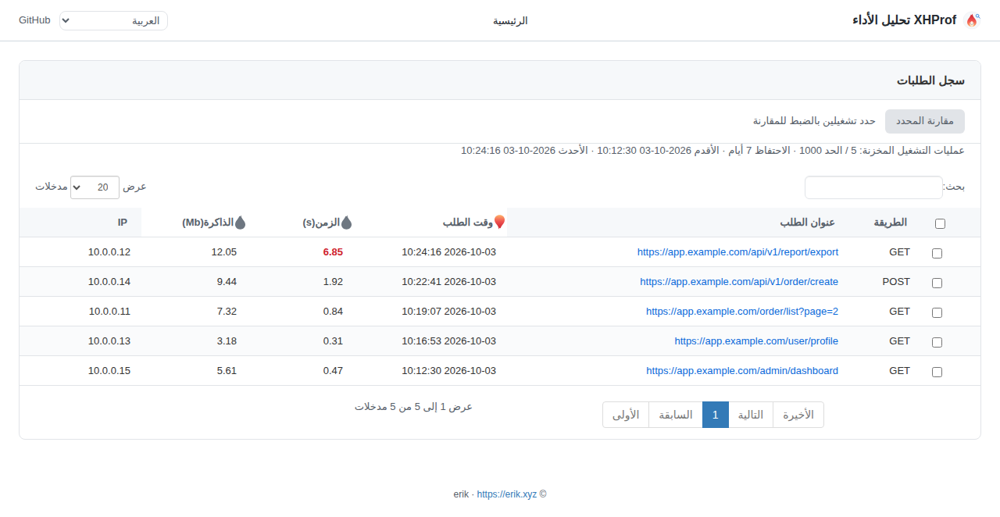
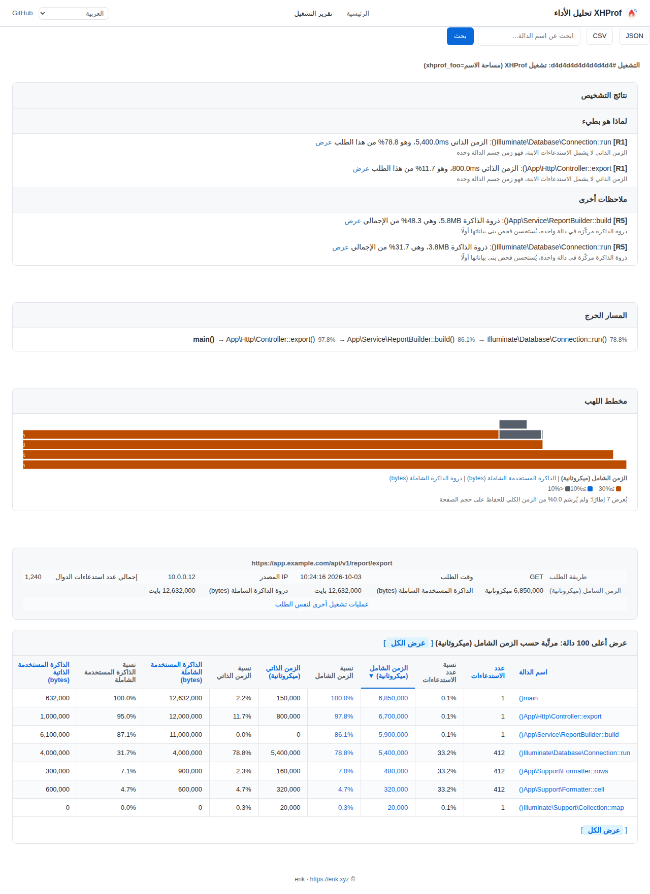
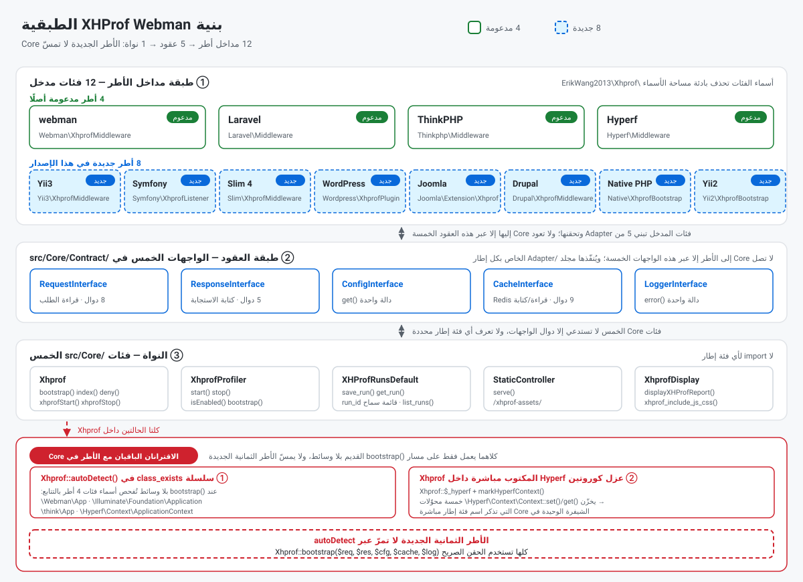
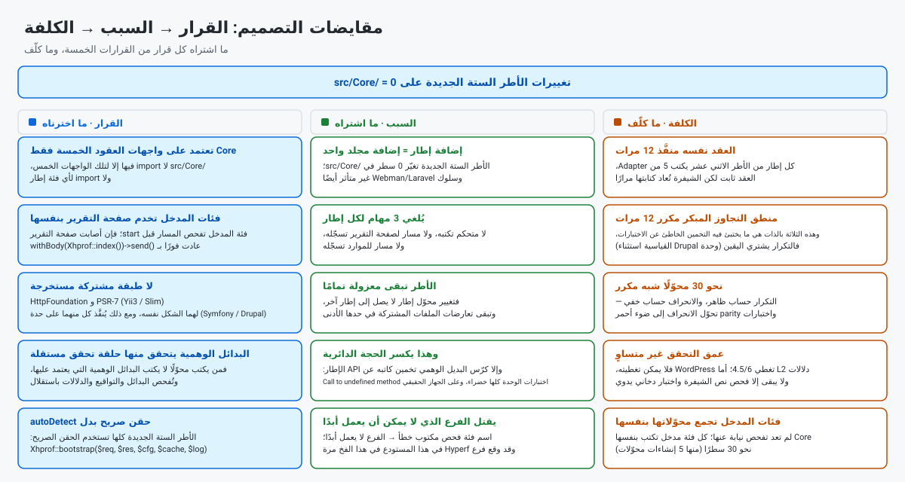
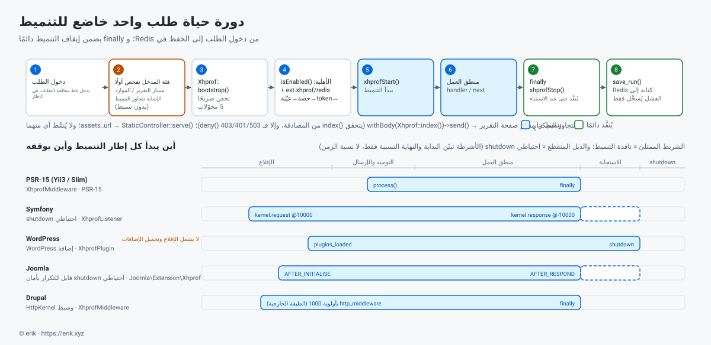

> **ترجمة آلية غير مُراجَعة.** هذا المستند تُرجم آليًا ولم يُراجعه متحدث أصلي بالعربية، وقد يحمل أخطاء في المعنى والمصطلحات. المرجع المعتمد هو [النسخة الإنجليزية](../en/README.md).

[中文](../../../README.md) · [English](../en/README.md) · [한국어](../ko/README.md) · [Русский](../ru/README.md) · [Deutsch](../de/README.md) · [Français](../fr/README.md) · [Español](../es/README.md) · [Português](../pt/README.md) · **العربية** · [हिन्दी](../hi/README.md) · [বাংলা](../bn/README.md) · [Bahasa Indonesia](../id/README.md) · [日本語](../ja/README.md)

# محلّل أداء XHProf

   

إضافة لتنميط أداء الشيفرة، متوافقة مع webman / Laravel / ThinkPHP / Hyperf / Yii2 / Yii3 / Symfony / Slim 4 / WordPress / Joomla و Drupal و PHP الخام (بدون إطار).

تجمع بيانات التنميط عبر إضافة xhprof وتخزّنها في Redis. ويستطيع المطوّرون الوصول سريعًا من المتصفح إلى تقارير تحليل الأداء لتحديد مواضع الاختناق في أداء الشيفرة.


الشعلة الصغيرة نفسها هي أيضًا أيقونة الموقع، وأيقونة العلامة في أعلى اليسار، وأيقونات فرز الجداول في صفحة التقرير (`src/html/pet.svg`‎، `src/html/images/sort_*.svg`‎، تُقدَّم تحت بادئة `assets_url`‎).

**سجل الطلبات**



**تقرير تشغيل واحد**



**مقارنة تشغيلين** — في قائمة «سجل الطلبات» حدّد صفّين اثنين بالضبط (مربّع اختيار لكل صف، وفي رأس القائمة تحديد الكل)، ثم انقر «مقارنة المحدد» لفتح عرض الفروق (diff). ويُرتَّب الطرفان حسب الزمن (run1 = التشغيل الأسبق، و run2 = التشغيل الأحدث، بصرف النظر عن الترتيب الحالي للقائمة)؛ وتعني الألوان التحسّن / التراجع «من run1 إلى run2»، ويمكن لرابط «عكس تقرير الفرق» داخل الصفحة تبديل الطرفين في أي وقت.

## المتطلبات

- PHP >= 8.0
- إضافة xhprof
- إضافة redis
- خادم Redis

## الأطر المتوافقة والحد الأدنى من الإصدارات

| الإطار | الحد الأدنى للإصدار | الحد الأدنى لـ PHP | فئة المدخل | كيفية التركيب |
|-----------|----------------|-------------|-------------|--------------|
| webman | `workerman/webman ^2.1` | 8.0 | `Webman\XhprofMiddleware` | سجّل وسيطًا عامًّا في `config/middleware.php` |
| Laravel | `laravel/framework ^9.0\|^10.0\|^11.0` | 8.0 | `Laravel\Middleware` | سجّل وسيطًا عامًّا في `app/Http/Kernel.php` |
| ThinkPHP | `topthink/framework ^6.0\|^8.0` | 8.0 | `Thinkphp\Middleware` | سجّل وسيطًا عامًّا في `app/middleware.php` |
| Hyperf | `hyperf/framework ^3.0` | 8.0 | `Hyperf\Middleware` | يُسجَّل تلقائيًا عبر ConfigProvider |
| Yii3 | `yiisoft/middleware-dispatcher ^5.0` | 8.1 | `Yii3\XhprofMiddleware` | سجّله في `config/web/di/application.php`، ويجب أن يكون الأول في قائمة الوسطاء |
| Symfony | `symfony/http-kernel ^6.4\|^7.0` | 8.1 (6.4) / 8.2 (7.x) | `Symfony\XhprofListener` | أضف وسم `kernel.event_subscriber` في `config/services.yaml` |
| Slim 4 | `slim/slim ^4.12` | 8.0 | `Slim\XhprofMiddleware` | عبر `$app->add(...)`‎، ويجب أن يُضاف أخيرًا |
| WordPress | 6.4+ | 8.0 | `Wordpress\XhprofPlugin` | انسخه إلى `wp-content/mu-plugins/`‎ |
| Joomla | 4.4 / 5.x | 8.1 | `Joomla\Extension\Xhprof` | انسخه إلى `plugins/system/`‎، وثبّته عبر Discover |
| Drupal | 10.x / 11.x | 8.1 (10.x) / 8.3 (11.x) | وحدة `xhprof` (`Drupal\XhprofMiddleware`) | وحدة قياسية، اكتفِ بتفعيلها |
| PHP الخام (بدون إطار) | — (بلا حزمة خارجية) | 8.0 | `Native\XhprofBootstrap` | سطر واحد في أعلى ملف الدخول: `XhprofBootstrap::start()`، بلا تسجيل متحكم أو مسار |
| Yii2 | `yiisoft/yii2 ^2.0` | 8.0 | `Yii2\XhprofBootstrap` | يُسجَّل في مصفوفة `bootstrap` في `config/web.php`، بلا تسجيل متحكم أو مسار |

تقع فئات المدخل جميعها تحت بادئة مساحة الأسماء `ErikWang2013\Xhprof\`‎ (المحذوفة من الجدول أعلاه).  ولا يحتاج أيٌّ من الاثني عشر إلى تسجيل متحكم أو مسار: فصفحة التقرير والموارد الساكنة يتولّاها صنف الدخول بنفسه (وفي حالة Drupal يتولّاها مسار الوحدة).

تعلن هذه الحزمة عن `php >= 8.0`، لكن مكوّنات `yiisoft/*` التي يعتمد عليها Yii3 تشترط **PHP 8.1 أو أحدث**، لذا **لا يمكن استخدام Yii3 على PHP 8.0**؛ وكذلك يحتاج Symfony 7.x و Drupal 11.x إلى إصدار PHP أعلى. وخطوات الإعداد التفصيلية في «إعداد كل إطار» أدناه.

## التثبيت

ثبّت إضافة xhprof من PECL (الإصدار الحالي على PHP 8 هو 2.3.x):

```sh
pecl install xhprof
```

أضف إعدادات xhprof في php.ini:

```ini
[xhprof]
extension=xhprof.so
xhprof.output_dir=/tmp/xhprof
```

ثم ثبّت عبر Composer:

```sh
composer require aaron-dev/xhprof-webman
```

### البدء السريع

أقصر مسار في ثلاث خطوات:

1. **ثبّت الإضافة** — `pecl install xhprof`‎، وأضف قسم `[xhprof]`‎ في php.ini (`extension=xhprof.so`‎، `xhprof.output_dir=/tmp/xhprof`‎).
2. **شغّل Redis** — `redis-server --daemonize yes`‎، أو استخدم نسخة لديك بالفعل (تقع معاملات الاتصال في المصفوفة الفرعية `redis`‎ في `config/xhprof.php`‎ لكل إطار).
3. **اربط الإضافة وافتح صفحة التقرير** — `composer require aaron-dev/xhprof-webman`‎، ثم ركّب فئة المدخل في أحد الأطر وفق «إعداد كل إطار»، وبعد توليد طلب عمل واحد افتح `http://<your site>/xhprof`‎.

> **لا تريد تثبيت البيئة؟** `demo/`‎ يضمّ عرضًا تجريبيًّا جاهزًا بـ docker compose (مدخل PHP خام، دون الاعتماد على أي إطار): `cd demo && docker compose up -d`‎، ثم افتح `http://127.0.0.1:8080/xhprof`‎ لترى صفحة تقرير حقيقية؛ والشرح في `demo/README.md`‎.

### استكشاف الأخطاء وإصلاحها

| العَرَض | ما يجب فحصه أولًا |
|---------|-------------|
| صفحة التقرير فارغة ولا توجد سجلات في القائمة | هل `enable`‎ يساوي `true`‎؛ هل ضُبط `sample_rate`‎ على `0`‎ (عندئذٍ لا تُعايَن إلا الطلبات الحاملة للترويسة `X-Xhprof-Token`‎)؛ هل `<key_prefix>:run_id`‎ فارغ في Redis |
| صفحة التقرير تعيد 403 / 401 | 403: قائمة `ip_allowlist`‎ تحجب عنوان IP الحالي (أو أن عنوان الطلب جاء من ترويسة تمرير بينما `trusted_proxies`‎ فارغة)، أو أن `auth_token`‎ مضبوط والرابط لا يحمل `?token=`‎؛ 401 مع ظهور نافذة بيانات الاعتماد في المتصفح: `auth_basic`‎ مضبوط واسم المستخدم/كلمة المرور المُدخَلان لا يطابقان |
| أخطاء في الاتصال بـ Redis | هل إضافة redis مثبَّتة (يظهر `redis`‎ في مخرجات `php -m`‎)، وهل Redis يعمل، وهل تتطابق host / port / password / database في المصفوفة الفرعية `redis`‎ مع النسخة |
| الإضافة مثبَّتة لكن طلبات العمل لا تُحفظ | هل فئة المدخل مركَّبة فعلًا (انظر «إعداد كل إطار»)؛ هل مسار الطلب يطابق `ignore_url_arr`‎؛ هل بلغ `max_runs_per_minute`‎ سقفه (فلا تُعايَن أي طلب حتى الدقيقة التالية) |
| صفحة التقرير تُفتح لكن الأنماط/السكربتات تعيد 404 | هل بادئة `assets_url`‎ تطابق مسار النشر؛ هل الوكيل العكسي يمرّر هذه البادئة إلى التطبيق أيضًا |

---

## إعداد كل إطار

### Webman

**1. سجّل وسيطًا عامًّا** — `config/middleware.php`:

```php
return [
    '' => [
        ErikWang2013\Xhprof\Webman\XhprofMiddleware::class,
    ],
];
```

**2. صفحة التقرير والموارد الساكنة** — **لا حاجة إلى تسجيل متحكم أو مسار**: قبل بدء التنميط يفحص الوسيط مسار الطلب: عند مطابقة مسار التقرير `/xhprof` يعيد صفحة التقرير فورًا، وعند مطابقة مسار الموارد (البادئة تُقرأ من الخيار `assets_url`، والافتراضية `/xhprof-assets`) يعيد المورد الساكن مباشرةً.

**3. الإعدادات** — انظر `config/plugin/aaron-dev/xhprof/xhprof.php`.

---

### Laravel

**1. سجّل الوسيط** — `app/Http/Kernel.php`:

```php
protected $middleware = [
    // ...
    \ErikWang2013\Xhprof\Laravel\Middleware::class,
];
```

**2. صفحة التقرير والموارد الساكنة** — **لا حاجة إلى تسجيل متحكم أو مسار**: قبل بدء التنميط يفحص الوسيط مسار الطلب: عند مطابقة مسار التقرير `/xhprof` يعيد صفحة التقرير فورًا، وعند مطابقة مسار الموارد (البادئة تُقرأ من الخيار `assets_url`، والافتراضية `/xhprof-assets`) يعيد المورد الساكن مباشرةً.

**3. انشر ملف الإعدادات**:

```sh
php artisan vendor:publish --tag=xhprof-config
```

ملف الإعدادات في `config/xhprof.php`. ويدعم Laravel الاكتشاف التلقائي لـ ServiceProvider.

---

### ThinkPHP

**1. سجّل الوسيط** — `app/middleware.php`:

```php
return [
    \ErikWang2013\Xhprof\Thinkphp\Middleware::class,
];
```

**2. صفحة التقرير والموارد الساكنة** — **لا حاجة إلى تسجيل متحكم أو مسار**: قبل بدء التنميط يفحص الوسيط مسار الطلب: عند مطابقة مسار التقرير `/xhprof` يعيد صفحة التقرير فورًا، وعند مطابقة مسار الموارد (البادئة تُقرأ من الخيار `assets_url`، والافتراضية `/xhprof-assets`) يعيد المورد الساكن مباشرةً.

**3. الإعدادات** — انسخ `vendor/aaron-dev/xhprof-webman/src/Thinkphp/config/xhprof.php` إلى `config/xhprof.php` في مشروعك.

---

### Hyperf

**1. تسجيل الوسيط تلقائيًا** — يضيف ConfigProvider الوسيط تلقائيًا إلى قائمة وسطاء HTTP.

**2. صفحة التقرير والموارد الساكنة** — **لا حاجة إلى تسجيل متحكم أو مسار**: قبل بدء التنميط يفحص الوسيط مسار الطلب: عند مطابقة مسار التقرير `/xhprof` يعيد صفحة التقرير فورًا، وعند مطابقة مسار الموارد (البادئة تُقرأ من الخيار `assets_url`، والافتراضية `/xhprof-assets`) يعيد المورد الساكن مباشرةً.

**3. انشر ملف الإعدادات**:

```sh
php bin/hyperf.php vendor:publish aaron-dev/xhprof-webman
```

وتكون الإعدادات الناتجة في `config/autoload/xhprof.php`.

---

### Yii3

**1. سجّل الوسيط** — `config/web/di/application.php`:

```php
use ErikWang2013\Xhprof\Yii3\XhprofMiddleware;
use Yiisoft\Middleware\Dispatcher\MiddlewareDispatcher;

return [
    MiddlewareDispatcher::class => [
        'class' => MiddlewareDispatcher::class,
        // the first element is the outermost middleware (runs first, finishes last)
        'withMiddlewares()' => [[
            XhprofMiddleware::class,
            // ... other middlewares
        ]],
    ],
];
```

خطأان شائعان (كلاهما مُقاس):

- **لا** تكتب `'__construct()' => ['middlewares' => [...]]`: فالمُنشئ `MiddlewareDispatcher::__construct()`‎ لا يقبل إلا `MiddlewareFactory` واختياريًا `EventDispatcherInterface` — ولا يوجد **أي** معامل باسم `middlewares`. ولا يمكن حقن قائمة الوسطاء إلا عبر دالة النسخة `withMiddlewares()`‎.
- **لا** تضع كائنًا (`new XhprofMiddleware(...)`‎) داخل `withMiddlewares()`‎: فالتعريفات لا تقبل إلا نصًّا لاسم فئة أو تعريفًا مصفوفًا أو دالة قابلة للاستدعاء. ومع كائن، لا يُسجَّل شيء ويرفع `dispatch()`‎ استثناء `TypeError` (لأن `MiddlewareFactory::create()`‎ مقيَّدة بـ `callable|array|string`).

**2. صفحة التقرير والموارد الساكنة** — **لا حاجة إلى متحكم أو تسجيل مسار**: فـ `XhprofMiddleware` وسيط PSR-15. وقبل بدء التنميط يفحص مسار الطلب: فإن أصاب مسار التقرير `/xhprof` أعاد صفحة التقرير فورًا، وإن أصاب مسار الموارد (بادئته الافتراضية `/xhprof-assets`) أعاد المورد الساكن مباشرة. وتحمل استجابة صفحة التقرير ترويسة `Content-Type: text/html; charset=UTF-8` صريحة من فئة المدخل: فاستجابات PSR-7 لا ترويسة افتراضية لها، ومُرسِل الاستجابة في Yii3 لا يضيف واحدة، ولولاه لعرض المتصفح تقرير HTML كنص عادي.

**3. الإعدادات** — القيم الافتراضية في الحزمة عند `src/Yii3/config/xhprof.php`؛ وانظر «مرجع الإعدادات» لمعرفة الحقول. ولتجاوزها، احقن `$config` عبر DI:

```php
XhprofMiddleware::class => [
    'class' => XhprofMiddleware::class,
    '__construct()' => [
        'config' => [
            'enable' => true,
            'auth_token' => 'your-token',
            'redis' => [
                'host' => '127.0.0.1',
                'port' => 6379,
                'password' => '',
                'database' => 0,
                'timeout' => 1.0,
            ],
        ],
    ],
],
```

المصفوفة الفرعية `redis` خاصة بـ Yii3: فعندما لا يُحقن أي `CacheInterface` يستخدمها الوسيط للتواصل مع phpredis مباشرة. وأبقِ `assets_url` يمكن ضبطه على أي بادئة: فروابط CSS/JS في صفحة التقرير و`StaticController` يقرآن الخيار نفسه (الافتراضي `/xhprof-assets`). أما القيود المتبقية عند النشر في مجلد فرعي فهي في [التحقق والقيود المعروفة](#التحقق-والقيود-المعروفة).

**4. متطلبات الإصدار** — تشترط مكوّنات `yiisoft/*` التي يعتمد عليها Yii3 إصدار PHP 8.1 أو أحدث. ومع أن هذه الحزمة تعلن `php >= 8.0`، لا يمكن استخدام تكامل Yii3 على PHP 8.0.

---

### Symfony

**1. سجّل مستمع الأحداث** — `config/services.yaml`:

```yaml
services:
    ErikWang2013\Xhprof\Symfony\XhprofListener:
        tags:
            - { name: kernel.event_subscriber }
```

**2. صفحة التقرير والموارد الساكنة** — **لا حاجة إلى متحكم أو تسجيل مسار**: فقبل بدء التنميط يفحص المستمع مسار الطلب: فإن أصاب مسار التقرير `/xhprof` أعاد صفحة التقرير فورًا، وإن أصاب مسار الموارد (بادئته الافتراضية `/xhprof-assets`) أعاد المورد الساكن مباشرة.

**3. الإعدادات** — القيم الافتراضية في الحزمة عند `src/Symfony/config/xhprof.php`؛ وانظر «مرجع الإعدادات» لمعرفة الحقول.

**4. الطلبات الفرعية والاحتياطي عند الاستثناء** — يستمع المستمع إلى `kernel.request` (بأولوية 10000) و `kernel.response` (بأولوية -10000). وتستبعد `isMainRequest()`‎ الطلبات الفرعية من نوع ESI/fragment التي لولا ذلك لأوقفت التنميط مبكرًا؛ كما يُسجَّل `register_shutdown_function` قابل للتكرار بأمان عند بدء الطلب — فإن أعاد HttpKernel رفع استثناء لم يعمل `kernel.response` أبدًا، ولولا ذلك الاحتياطي لتسرّبت حالة التنميط إلى الطلب التالي.

---

### Slim 4

**1. سجّل الوسيط** — `public/index.php`:

```php
use ErikWang2013\Xhprof\Slim\XhprofMiddleware;

$app->addRoutingMiddleware();

// must be added last: Slim's middleware stack is LIFO, added later = further out = runs first
$app->add(new XhprofMiddleware(
    $app->getResponseFactory()
));
```

أما معاملات المُنشئ الثلاثة الباقية فكلها اختيارية؛ اتركها لاستخدام القيم الافتراضية في الحزمة:

- المعامل الثاني `array $config`: مصفوفة إعداداتك، تُدمج فوق `src/Slim/config/xhprof.php` بـ `array_replace` (استبدال كامل للقيم — فمفاتيح القوائم مثل `ignore_url_arr` لا تُدمج دمجًا متداخلًا أبدًا).
- المعامل الثالث `CacheInterface $cache`: إن تُرك، ينشئ الوسيط `new \Redis()`‎ بتأخير (فالمُنشئ لا يلمس ext-redis عمدًا، حتى لا تنفجر العملية عند غياب الإضافة أثناء بناء المحوّل). ولحقن اتصالك الخاص مرّر `new \ErikWang2013\Xhprof\Slim\Adapter\RedisAdapter($redis)`‎، أو أي كائن ينفّذ `ErikWang2013\Xhprof\Core\Contract\CacheInterface`.
- المعامل الرابع `LoggerInterface $logger`: إن تُرك صار `new \ErikWang2013\Xhprof\Slim\Adapter\LogAdapter()`‎ و**تُهمل السجلات صامتةً** (فـ Slim لا يوفّر مسجّل PSR-3). ولتسجيلها مرّر `new LogAdapter($psrLogger)`‎ حيث `$psrLogger` مسجّل PSR-3 متاح لديك.

**لا تكتب `$app->add(XhprofMiddleware::class)`‎**: فـ `CallableResolver` في Slim يحوّل نص الفئة هذا إلى `new XhprofMiddleware($container)`‎ — أي تمرير الحاوية وحدها مع تأجيل الحل إلى وقت الطلب. والنتيجة أن `add()`‎ لا يبلّغ عن شيء وأن أول طلب يرفع `TypeError` — وهو أصعب أنماط الفشل تشخيصًا. استخدم دائمًا `new` الصريحة أعلاه.

**2. صفحة التقرير والموارد الساكنة** — **لا حاجة إلى متحكم أو تسجيل مسار**: فقبل بدء التنميط يفحص الوسيط مسار الطلب: فإن أصاب مسار التقرير `/xhprof` أعاد صفحة التقرير فورًا، وإن أصاب مسار الموارد (بادئته الافتراضية `/xhprof-assets`) أعاد المورد الساكن مباشرة.

**3. الإعدادات** — القيم الافتراضية في الحزمة عند `src/Slim/config/xhprof.php`؛ وانظر «مرجع الإعدادات» لمعرفة الحقول.

**4. ترتيب التركيب** — مكدّس الوسطاء في Slim يعمل بنمط LIFO (مقاسًا بوسيطين، ترتيب التنفيذ هو `B:before → A:before → A:after → B:after`): فكلما أضفت لاحقًا كان الوسيط في طبقة أبعد وعمل أبكر. لذا يجب إضافة xhprof **أخيرًا**، و**بعد `addRoutingMiddleware()`‎** — وإلا لم يكن `/xhprof` في جدول التوجيه، فيرفع RoutingMiddleware استثناء `HttpNotFoundException` أولًا، ولا يصل الطلب إلى الوسيط أبدًا. وتحمل استجابة صفحة التقرير ترويسة `Content-Type: text/html; charset=UTF-8` صريحة من فئة المدخل: فاستجابات PSR-7 لا ترويسة افتراضية لها، و`ResponseEmitter` في Slim لا يضيف واحدة، ولولاه لعرض المتصفح تقرير HTML كنص عادي.

---

### WordPress

**1. ثبّت إضافة mu** — انسخ ملف الإقلاع من الحزمة إلى `wp-content/mu-plugins/`‎:

```sh
cp vendor/aaron-dev/xhprof-webman/wordpress/xhprof-webman.php wp-content/mu-plugins/
```

يحمل `wordpress/xhprof-webman.php` ترويسة إضافة ويقلع `Wordpress\XhprofPlugin`. وتُحمَّل إضافات mu تلقائيًا — فلا شيء لتفعيله في wp-admin.

**2. صفحة التقرير والموارد الساكنة** — **لا حاجة إلى متحكم أو تسجيل مسار**: فقبل بدء التنميط تفحص فئة المدخل مسار الطلب: فإن أصاب مسار التقرير `/xhprof` أعادت صفحة التقرير فورًا، وإن أصاب مسار الموارد (بادئته الافتراضية `/xhprof-assets`) أعادت المورد الساكن مباشرة.

**3. الإعدادات** — القيم الافتراضية في الحزمة عند `src/Wordpress/config/xhprof.php`؛ وانظر «مرجع الإعدادات» لمعرفة الحقول. واستخدم `ignore_url_arr` لاستثناء المسارات كثيفة التردد مثل `wp-cron.php` و `admin-ajax.php`.

لتجاوز الإعدادات (عنوان Redis، و`auth_token`‎، وما إلى ذلك) عرّف ثابتًا في `wp-config.php`‎ (فإضافات mu تُحمَّل متأخرة بما يكفي ليكون الثابت متاحًا):

```php
define('XHPROF_WEBMAN_CONFIG', [
    'auth_token' => 'your-token',
    'redis' => ['host' => '127.0.0.1', 'port' => 6379, 'password' => '', 'database' => 0],
]);
```

أو اربط المرشِّح `xhprof_webman_config`‎ (من قالب أو إضافة): فهو يُطبَّق فوق الثابت، وبالشكل المصفوفي نفسه.

**4. حدّ بنيوي في نافذة التنميط** — النافذة هي `plugins_loaded` → `shutdown`، وهي **لا تشمل** إقلاع `wp-settings.php` ولا تحميل الإضافات نفسه. وهذا حدّ بنيوي في WordPress: فالعمل المنجز في تلك المرحلة لا يمكن تنميطه.

---

### Joomla

**1. ثبّت الإضافة** — انسخ مجلد `joomla/`‎ من الحزمة إلى `plugins/system/xhprof/`‎ في موقعك:

```sh
cp -r vendor/aaron-dev/xhprof-webman/joomla/ plugins/system/xhprof/
```

مجلد `joomla/`‎ في الحزمة *هو* الإضافة: ملف التعريف `xhprof.xml`، و `services/provider.php`، و `src/Extension/Xhprof.php`. وفئة المدخل هي `ErikWang2013\Xhprof\Joomla\Extension\Xhprof` (وترث `CMSPlugin`). وبعد النسخ شغّل Discover من «System → Manage → Extensions → Discover» ثم ثبّتها وفعّلها.

**2. صفحة التقرير والموارد الساكنة** — **لا حاجة إلى متحكم أو تسجيل مسار**: فقبل بدء التنميط تفحص الإضافة مسار الطلب: فإن أصاب مسار التقرير `/xhprof` أعادت صفحة التقرير فورًا، وإن أصاب مسار الموارد (بادئته الافتراضية `/xhprof-assets`) أعادت المورد الساكن مباشرة.

**3. الإعدادات** — القيم الافتراضية في الحزمة عند `src/Joomla/config/xhprof.php`؛ وانظر «مرجع الإعدادات» لمعرفة الحقول. **مقايضة معروفة**: هنا يُقرأ ملف إعدادات الحزمة لا معاملات الإضافة — فمعاملات الإضافة تتطلب قراءة من قاعدة البيانات، والإعدادات تُقرأ في كل طلب.

**4. حدود التنميط** — النافذة هي `ApplicationEvents::AFTER_INITIALISE` → `ApplicationEvents::AFTER_RESPOND`؛ ويُسجَّل أيضًا `register_shutdown_function` قابل للتكرار بأمان في `AFTER_INITIALISE`، لأن الوصول إلى `AFTER_RESPOND` غير مضمون على مسار الاستثناء — ولولا ذلك الاحتياطي لتسرّبت حالة التنميط إلى الطلب التالي.

---

### Drupal

**1. فعّل الوحدة** — مجلد `drupal/xhprof/`‎ في الحزمة وحدة Drupal قياسية (`xhprof.info.yml` / `xhprof.routing.yml` / `xhprof.services.yml`). ضعها في `modules/custom/xhprof/`‎ بموقعك، ثم فعّلها من صفحة «Extend» (أو بالأمر `drush en xhprof`).

**2. صفحة التقرير والموارد الساكنة** — Drupal هي **الإطار الوحيد من الأطر الاثني عشر الذي يخدم صفحة التقرير عبر مسارات الوحدة**: فملف `xhprof.routing.yml` يسجّل مسار التقرير `/xhprof` ومسار الموارد `/xhprof-assets`، ويعرضهما متحكم الوحدة افتراضيًا؛ أما الأحد عشر الأخرى فتخدم صفحة التقرير والموارد الساكنة بنفسها قبل بدء التنميط ولا تسجّل أي مسار. **ومع بادئة `assets_url` مخصّصة يتولّى الوسيط خدمة الموارد**: فمسار موارد الوحدة مكتوب في `xhprof.routing.yml` (`/xhprof-assets/{file}`) ولا يطابق بادئة أخرى.

**3. الإعدادات** — الإعدادات هنا إعدادات مُهيّأة على مستوى الوحدة: القيم الافتراضية في `drupal/xhprof/config/install/xhprof.settings.yml`، والمخطط في `drupal/xhprof/config/schema/xhprof.schema.yml`. وانظر «مرجع الإعدادات» لمعرفة الحقول.

**4. تسجيل الوسيط** — سجّل خدمة الوسيط في `xhprof.services.yml` داخل الوحدة:

```yaml
services:
  xhprof.http_middleware:
    class: ErikWang2013\Xhprof\Drupal\XhprofMiddleware
    arguments: ['@config.factory', '@logger.factory']
    tags:
      - { name: http_middleware, priority: 1000 }
```

النواة الداخلية **تُضاف تلقائيًا كمعامل مُنشئ رقم 0** عبر `StackedKernelPass` في Drupal — **فلا تكتبها بنفسك**: فكتابتها تنتج نواتين داخليتين، وهو ما يفشل عند ترجمة الحاوية على Drupal <= 11.2.x (بما فيها كل إصدارات 10.x) ويرفع TypeError في كل طلب على 11.3.0 وما بعدها. ويتوقف التنميط في `finally`.

**5. ملاحظات**

- الأولوية `priority: 1000` تضع الوسيط **خارج ذاكرة التخزين المؤقت للصفحات** (فأعلى أولوية قائمة في النواة هي negotiation: 400 على D10 و500 على D11، بينما ذاكرة الصفحات 200)، لذا **تُنمَّط الطلبات المخدومة من ذاكرة التخزين المؤقت للصفحات في Drupal**. وبالنسبة لأداة تنميط هذا هو السلوك المقصود، لكن ينبغي أن يعرفه المستخدمون.
- ذاكرة التخزين المؤقت تعمل دون إعداد: فالوسيط يستخدم افتراضيًا محوّل Redis المشحون مع هذه الحزمة (والحزمة تعتمد على ext-redis اعتمادًا صريحًا)، ويقبل أيضًا معامل `CacheInterface` اختياريًا عبر `arguments` في `services.yml` لتجاوزه. وإن كانت الذاكرة غير متاحة، يبتلع `XhprofProfiler::stop()`‎ الفشل في سطر سجل واحد — **دون رفع أي خطأ**.
- الطلبات إلى صفحة التقرير `/xhprof` وإلى `/xhprof-assets/*` **لا تُنمَّط**: فالوسيط يتخطى التنميط بحسب المسار قبل `xhprofStart()`‎. ومع ذلك تبقى الاستجابة صادرة من المتحكم في `xhprof.routing.yml` (**وهذا ليس تجاوزًا مبكرًا**). لذا حتى مع ضبط `ignore_url_arr` على `[]` (أي بلا تصفية)، لا يظهر هذان الطلبان في التقرير أبدًا.

### PHP الخام (بدون إطار)

مناسب للتطبيقات بلا إطار، التي لها متحكم أمامي واحد فقط (`public/index.php` أو ما شابه).

**1. أضف سطرًا واحدًا في أعلى ملف الدخول**:

```php
\ErikWang2013\Xhprof\Native\XhprofBootstrap::start();
```

لتغيير الإعدادات مرّر المصفوفة إلى هذا السطر (مجموعة المفاتيح نفسها لدى الأحد عشر الآخرين، والقيم الافتراضية في `src/Native/config/xhprof.php`):

```php
\ErikWang2013\Xhprof\Native\XhprofBootstrap::start([
    'enable' => true,
    'auth_token' => 'xxx',
]);
```

المعاملان الثاني والثالث نقطتا حقن اختياريتان: `CacheInterface $cache` و`LoggerInterface $logger` (الافتراضي: محوّل Redis في هذه الحزمة و`error_log`). القيمة المُعادة هي نسخة الدخول لهذا الطلب (`stop()` عديمة الأثر عند التكرار)؛ نادِها لإيقاف التنميط مبكرًا في العملية نفسها.

**2. صفحة التقرير والموارد الساكنة** — **لا حاجة إلى تسجيل متحكم أو مسار**: هذا السطر يفحص مسار الطلب قبل بدء التنميط: عند مطابقة مسار التقرير `/xhprof` يعيد صفحة التقرير مباشرةً (مع `Content-Type: text/html; charset=UTF-8` و`Cache-Control: no-cache, private`، و`auth_token` يعمل كما هو)، وعند مطابقة مسار الموارد (البادئة تُقرأ من الخيار `assets_url`، والافتراضية `/xhprof-assets`) يعيد المورد الساكن مباشرةً. **والكلفة مكتوبة صراحةً**: بعد معالجة هذين المسارين ينفّذ `exit` — فلا تُنفَّذ بقية مسار الطلب (المسارات بعد هذا السطر، وتهيئة الحاوية، وبدء الجلسة، ومنطق الإنهاء الذي يسجّله التطبيق نفسه).

**3. نافذة التنميط = هذا السطر → إغلاق العملية** (المُسجَّل هو `register_shutdown_function`). **والحدود كما هي**: لا تشمل الكود **قبل** هذا السطر (composer autoload، تهيئة المتحكم الأمامي)، ولا ما تفعله عملية أو إضافة أخرى (تحليل الطلب في php-fpm، والمعالجة في nginx). النهاية الطبيعية و`exit` وError أو الاستثناء غير الملتقَط تصل كلها إلى نقطة الإيقاف؛ أما `SIGKILL` / OOM killer فلا — تختفي حالة التنميط مع العملية ولا تبقى للطلب التالي. ولتضييق النطاق استخدم الخيار `ignore_url_arr` (مطابقة جزئية على `uri()`، ويعمل بلا تعديل كود).

**4. شغّله فعلاً بـ `php -S`**:

```sh
# في أعلى public/index.php سطر XhprofBootstrap::start()، وهو المتحكم الأمامي نفسه
php -S 127.0.0.1:8000 -t public public/index.php
```

زُر `http://127.0.0.1:8000/` لتوليد بيانات، ثم `http://127.0.0.1:8000/xhprof` لصفحة التقرير — كلاهما في العملية نفسها، وتُتحقَّق الموارد كذلك.

---

### Yii2

خاص بـ Yii2 (`yiisoft/yii2 ^2.0`، و PHP >= 8.0). **وهو ليس الإطار نفسه الذي في Yii3**: فـ Yii3 نسخة معادة الكتابة وفق PSR-15، بينما يحمل Yii2 معه `yii\web\Request` / `Response`‎ ودورة حياة تطبيق خاصة به، ولذلك فله فئة مدخل مستقلة.

**1. سجّل فئة الإقلاع** — `config/web.php`:

```php
'bootstrap' => [
    [
        'class' => \ErikWang2013\Xhprof\Yii2\XhprofBootstrap::class,
        'config' => ['auth_token' => 'xxx'],   // optional; see src/Yii2/config/xhprof.php
    ],
],
```

هذا هو الشكل القياسي لنقطة الامتداد الخاصة بـ Yii2، `yii\base\BootstrapInterface`‎ فمفتاح `config` في تعريف المصفوفة تسنده الحاوية إلى فئة المدخل كـ**خاصية عامة** (`cache` / `logger`‎ نقطتا حقن بالطريقة نفسها — مرّر كائنًا لاستبدال محوّل Redis الافتراضي أو `error_log`‎).

**2. صفحة التقرير والموارد الساكنة** — **بلا متحكم، وبلا مسار، وبلا أي تعديل في urlManager**: ففئة الإقلاع تفحص مسار الطلب عند `Application::EVENT_BEFORE_REQUEST`‎ وتعيد صفحة التقرير مباشرةً على مسار التقرير `/xhprof`‎ وتُنهي الطلب، وتعيد الموارد الساكنة على بادئة الموارد (تُقرأ من الخيار `assets_url`‎ والافتراضية `/xhprof-assets`‎). وكلا المسارين يقصّر قبل بدء التنميط.

**3. نافذة التنميط = `EVENT_BEFORE_REQUEST` → `EVENT_AFTER_REQUEST`.** لاحظ أن Yii2 يُطلق `EVENT_AFTER_REQUEST`‎ **قبل** إرسال الاستجابة (`run()`‎ في `base/Application.php`‎)، فإرسال الاستجابة نفسه خارج النافذة. **ومسار الاستثناء يعتمد على احتياطي shutdown**: فـ `run()`‎ لا يلتقط إلا `ExitException`‎ لذا أي خطأ آخر مرفوع من شيفرتك يعني أن `EVENT_AFTER_REQUEST`‎ لن يُطلق أبدًا — ولذلك تسجّل فئة المدخل `register_shutdown_function`‎ احتياطيًا عند بدء التنميط (بالشكل نفسه كما في Symfony / Joomla).

**4. تطبيقات الطرفية (console) لا تُمسّ** — فـ `yii\console\Application`‎ لا يعيد تعريف `run()`‎ لذا فإن أوامر الطرفية (cron، والترحيلات، والطوابير) **تُطلق** `EVENT_BEFORE_REQUEST`‎؛ ولذلك تفحص فئة المدخل في `bootstrap()`‎ أولًا الشرط `instanceof yii\web\Application`‎ ولا تصل أي خُطّافات في وضع الطرفية.

**5. عنوان IP للعميل يتبع دلالات الإطار نفسه** — `getRealIp()`‎ يفوّض إلى `Request::getUserIP()`‎: فافتراضيًا يُسقط Yii2 ترويسات التمرير مثل `X-Forwarded-For`‎ عبر `secureHeaders`‎ (وهو الافتراضي الآمن عنده)، لذا خلف وكيل عكسي تحصل على `REMOTE_ADDR`‎. ولتسجيل عنوان IP الحقيقي للعميل، اضبط `trustedHosts`‎ في مكوّن request في التطبيق (ومتى ضُبط، يعيد Yii2 أول عنوان غير موثوق سيرًا من اليمين إلى اليسار — وهو سلوك **مقصود** ومخالف لبقية المحوّلات التي تأخذ أول مقطع دائمًا). وهذا حكم أمني يخصّ الإطار نفسه، وهذه الحزمة لا تقرر نيابة عن الموقع مَن يجب الوثوق به.

**6. الإعدادات** — القيم الافتراضية في `src/Yii2/config/xhprof.php`‎ وتُتجاوَز بمفتاح `config` من الخطوة 1؛ والمصفوفة الفرعية الاختيارية `redis`‎ (تُستخدم للتواصل مع phpredis مباشرةً عند عدم حقن `cache`‎) تأخذ المفاتيح نفسها كما في بقية الأطر: `host` / `port` / `password` / `database` / `timeout`‎.

---

## مرجع الإعدادات

تتشارك كل الأطر خيارات الإعدادات هذه:

| الإعداد | النوع | القيمة الافتراضية | الوصف |
|--------|------|---------|-------------|
| `enable` | bool | `true` | تفعيل التنميط أو تعطيله |
| `sample_rate`‎ | float | `1.0`‎ | معاينة نسبية: يُسجَّل كل طلب بهذا الاحتمال (مثل `0.05`‎ = معاينة 5% من الطلبات)؛ `1.0`‎ = معاينة الكل، و`<=0`‎ أو `false`‎ = عدم معاينة أي طلب |
| `trigger_token`‎ | string\|null | `null`‎ | معاينة عند الطلب: بعد ضبطه، أي طلب يحمل الترويسة `X-Xhprof-Token: <value>`‎ يُعايَن **إلزاميًا** (متجاهلًا `sample_rate`‎، وحتى مع `0`‎)؛ `null`‎ أو سلسلة فارغة = إيقاف، وتُهمَل الترويسة كليًا. الترويسة وحدها، **ولا وسيطة استعلام أبدًا**. وهو يستطيع فرض المعاينة الكاملة على أي طلب، فاستخدم قيمة عشوائية طويلة ولا تشاركها إلا مع من تثق به |
| `auth_basic`‎ | string\|null | `null`‎ | بيانات اعتماد HTTP Basic (`user:password`‎، تُفصَل عند أول نقطتين رأسيتين، ويمكن أن تحوي كلمة المرور نقطتين). وبينها وبين `auth_token`‎ علاقة **أو**: أيّهما ضُبط يُفرَض، وأيّهما نجح يمرّرك؛ وعدم ضبط أي منهما = بلا مصادقة. **وApache+CGI/FastCGI يجرّد ترويسة `Authorization`‎ افتراضيًا** (يحتاج `CGIPassAuth On`‎، 2.4.13+)؛ أما nginx+php-fpm فلا يتأثر |
| `ip_allowlist`‎ | array | `[]`‎ | قائمة سماح بعناوين IP لصفحة التقرير، تُطابَق **بايتًا ببايت**: لا نطاقات CIDR ولا تسوية لعناوين IPv6 (`2001:0db8::1`‎ و`2001:db8::1`‎ سلسلتان مختلفتان). فارغة = إيقاف؛ وقيمة ليست مصفوفة ترفض كل شيء (الرفض عند الفشل، مع سطر خطأ في السجل). وتأتي القيمة من `getRealIp()`‎ ويجب قراءتها مع `trusted_proxies`‎ |
| `trusted_proxies`‎ | array | `[]`‎ | **إعلان نشر وليس فرضًا تقنيًا**: فقط بعد إعلان «أمامي وكيل موثوق» تقبل `ip_allowlist`‎ عنوان IP للعميل مأخوذًا من `X-Forwarded-For`‎/`X-Real-IP`‎. ومعظم المحوّلات تأخذ ترويسات التمرير دون شرط — فالإعلان **لا** يوقف XFF مُلفَّقًا، ولا يكون آمنًا إلا خلف وكيل تتحكّم به |
| `webhook_url`‎ | string\|null | `null`‎ | بعد حفظ تشغيل بطيء (`wt >= view_wtred`‎) يُرسَل POST بجسم JSON (`run_id`‎/`uri`‎/`wt`‎/`ct`‎/`ip`‎/`time`‎) إلى هذا العنوان. فارغ = لا يُرسَل شيء. **وليس طابورًا**: لا ينتظر استجابة، ولا إعادات محاولة ولا احتياطي على القرص؛ فإن كان العنوان بطيئًا أو معطّلًا ضاع هذا الإشعار وحده |
| `sample_cli`‎ | bool | `false`‎ | معاينة CLI والطلبات بلا HTTP أيضًا: مع `true`‎ يُسجَّل `request_uri`‎ للتشغيل المحفوظ على الشكل `cli:<script name>`‎؛ `false`‎ = تُهمَل دائمًا (الافتراضي، بما في ذلك عمّال الطوابير والمهام المجدولة) |
| `symbol_lookup_url`‎ | string\|null | `null`‎ | قالب رابط المصدر: تعرض صفحة التقرير `<template>?symbol=<urlencoded function name>`‎؛ `null`‎/فارغ = بلا رابط |
| `max_runs_per_minute`‎ | int\|null | `null`‎ | ميزانية تكيّفية: الحدّ الأقصى لعدد التشغيلات المسجَّلة في الدقيقة (عدّاد لكل دقيقة؛ وما زاد لا يُعايَن)؛ `null`‎ أو قيمة غير موجبة = إيقاف. وعند تعذّر ذاكرة التخزين المؤقت أو رميها استثناءً **تفشل مفتوحة** (تسير المعاينة وفق `sample_rate`‎ كالمعتاد)؛ **والمعاينة بالمُشغِّل لا تخضع لها** |
| `time_limit` | int | `0` | تُنمَّط فقط الطلبات التي تتجاوز n ثانية؛ و0 تعني الكل |
| `log_num` | int | `1000` | الحد الأقصى لعدد السجلات |
| `view_wtred` | int | `3` | إبراز الصفوف التي يزيد زمن استجابتها على n ثانية بالأحمر |
| `ignore_url_arr` | array | `["/xhprof"]` | مسارات URL التي تُستثنى |
| `assets_url` | string | `/xhprof-assets` | بادئة URL للموارد الساكنة |
| `auth_token`‎ | string\|null | `null`‎ | عند ضبطه تتطلب صفحة التقرير `?token=xxx`‎ للوصول. **والافتراضي `null`‎ يعني عدم وجود أي مصادقة**: ففئة المدخل تتولّى صفحة التقرير ومواردها الساكنة **قبل** تشغيل مصادقة التطبيق المضيف (التبعات في «صفحة التقرير والموارد الساكنة»)، لذا يستطيع كل من يصل إلى ذلك المسار قراءة URI الطلب وعنوان IP المصدر وأسماء الدوال لكل التشغيلات — و**يجب** ضبطه في النشر العام ومتعدد المستأجرين؛ وعند عدم ضبطه يُسجَّل تحذير واحد عند كل عرض |
| `key_prefix` | string | `xhprof` | بادئة مفاتيح Redis؛ اضبط قيمًا مختلفة لكل مشروع عند مشاركة Redis واحد |
| `log_ttl` | int | `604800` | مدة الاحتفاظ بالبيانات بالثواني (7 أيام افتراضيًا) |
| `locale` | string\|null | `null` | لغة صفحة التقرير: `zh_CN`/`en`/`ko`/`ru`/`de`/`fr`/`es`/`pt`/`ar`/`hi`/`bn`/`id`/`ja`؛ `null` = اتباع `Accept-Language` في المتصفح، وإلا فالصينية؛ ويمكن لـ `?lang=xx` تجاوزها لطلب واحد |

والقيود المعروفة لهذه الخيارات في كل إطار مدرجة في [التحقق والقيود المعروفة](#التحقق-والقيود-المعروفة).

خفض `sample_rate`‎ هو الوسيلة الوحيدة لخفض الكلفة بنسبة متناسبة (`0.05`‎ = تسجيل 5% فقط من الطلبات)؛ ويبقى `ignore_url_arr`‎ استثناءً للمسارات كاملة، ويمكن الجمع بينهما. ويُتخذ القرار مرة واحدة لكل طلب عند نقطة دخول المعاينة، ولا يؤثر في طريقة قراءة التشغيلات المحفوظة أو الاحتفاظ بها. أما القيم غير الصالحة (مثل `'5%'`‎ و `'disabled'`‎) فتُعامَل كالقيمة `1.0`‎: فالمعاينة الزائدة أهون من أن يتحوّل الأمر صامتًا إلى «عدم معاينة أي شيء» فتبدو صفحة التقرير معطوبة.

لتنظيف بيانات التنميط: لتفريغ صفحة القائمة وحدها، استخدم `DEL <prefix>:run_id`‎ — فمفاتيح البيانات تنتهي صلاحيتها من تلقاء نفسها وفق `log_ttl`‎، والمعرّفات المعلّقة الباقية في الفهرس تتخطّاها القائمة؛ وللتنظيف الكامل، امسح `<prefix>:request_log:*`‎ و`<prefix>:xhprof_log:*`‎ واحذفهما مع قائمة الفهرس (`DEL`‎ لا يقبل محارف البدل، فاسرد المفاتيح أولًا بـ `redis-cli --scan --pattern '<prefix>:*'`‎ ثم احذفها — ولا تستخدم `KEYS`‎). وغياب TTL عن قائمة الفهرس مقصود: فهي محدودة بـ `log_num`‎ وليست سوى مؤشّرات إلى مفاتيح البيانات (`<prefix>`‎ هي قيمة `key_prefix`‎ المضبوطة لهذا المشروع).

**المعاينة بالمُشغِّل (`trigger_token`‎)**

المعاينة بالمُشغِّل والمعاينة النسبية محوران مستقلّان — يُفحَص المُشغِّل أولًا ثم تأتي القرعة: بعد ضبط `trigger_token`‎ يمكن لبيئة الإنتاج خفض `sample_rate`‎ إلى `0`‎ (فلا تُعايَن أي عملية في الأوقات العادية)، وعند الحاجة إلى التحقيق يكفي إرسال طلب واحد يحمل الترويسة `X-Xhprof-Token`‎ ليُعايَن هذا الطلب كاملًا. وتُقارَن القيمة بـ `hash_equals`‎ ذي الزمن الثابت، وتُقرأ في ترويسة الطلب وحدها — لا تمرّرها في سلسلة الاستعلام (فالاستعلامات تنتهي في سجلات الوصول و`Referer`‎ وسجلّ المتصفح). والمُشغِّل لا يتجاوز `ignore_url_arr`‎ (فطلبات صفحة التقرير والموارد الساكنة تظل متخطّاة حتى مع وجود المفتاح)، ويظل `enable: false`‎ المفتاح الرئيسي.

**مصادقة صفحة التقرير (`auth_token`‎ و`auth_basic`‎)**

`auth_token`‎ (`?token=xxx`‎) و`auth_basic`‎ (HTTP Basic) بينهما علاقة **أو**: أيّهما ضُبط يُفرَض، وأيّهما نجح يمرّرك؛ وعدم ضبط أي منهما = بلا مصادقة (الافتراضي، مع تسجيل سطر تحذير واحد عند كل عرض). وبيانات اعتماد Basic على الشكل `user:password`‎ (تُفصَل عند أول نقطتين رأسيتين، ويمكن أن تحوي كلمة المرور نقطتين، ويُقارَن الشقّان — اسم المستخدم وكلمة المرور — بـ `hash_equals`‎)؛ وعند ضبط Basic وفشل التحقق تكون الاستجابة 401 مع `WWW-Authenticate`‎ — وهو وحده ما يجعل المتصفح يفتح نافذة بيانات الاعتماد — بينما فشل token وحده يعيد 403. **وترك المصادقة معطّلة افتراضيًا قرار مقصود**: ففئة المدخل تتولّى صفحة التقرير **قبل** تشغيل مصادقة التطبيق المضيف، لذا مع عدم ضبط أي منهما يستطيع كل من يصل إلى ذلك المسار قراءة URI الطلب وعنوان IP المصدر وأسماء الدوال لكل التشغيلات — و**يجب** على أي نشر عام أو متعدد المستأجرين ضبط أحدهما. **وفخّ في النشر**: Apache + CGI/FastCGI يجرّد ترويسة `Authorization`‎ افتراضيًا، فلا ينجح Basic أبدًا (وتبقى الاستجابة 401) — ويحتاج إلى `CGIPassAuth On`‎ (2.4.13+) أو متغيّر مُمرَّر مكافئ؛ أما nginx + php-fpm فلا يتأثر.

**قائمة السماح بعناوين IP والوكلاء الموثوقون (`ip_allowlist`‎ / `trusted_proxies`‎)**

المطابقة في قائمة السماح **بايتًا ببايت**: لا نطاقات CIDR ولا تسوية لعناوين IPv6 (`2001:0db8::1`‎ و`2001:db8::1`‎ سلسلتان مختلفتان)؛ فارغة = إيقاف؛ وقيمة ليست مصفوفة **ترفض كل شيء** وتُسجّل سطر خطأ واحدًا (الرفض عند الفشل — فالإيقاف الصامت يُسقط طبقة تحكّم أمني من حيث لا يُشعر). وتأتي القيمة المفحوصة من `getRealIp()`‎ في المحوّل، ومعظم المحوّلات تأخذ ترويسة التمرير **دون شرط** عند رؤية `X-Forwarded-For`‎ / `X-Real-IP`‎: ومطابقة تلك القيمة مباشرةً تتيح لأي عميل تلفيق عنوانه والمرور من جانب قائمة السماح. ومن هنا `trusted_proxies`‎: عندما تأتي قيمة IP من ترويسة تمرير، يُشترَط إعلان `trusted_proxies`‎ غير فارغ، وإلا رُفض الطلب وسُجّل. **وهذا إعلان نشر وليس فرضًا تقنيًا**: فالإعلان لا يوقف XFF مُلفَّقًا، ولا يكون آمنًا إلا حين يعمل التطبيق فعلًا خلف وكيل تتحكّم به أنت — وكون القفزات الوسيطة موثوقة مسؤولية إعداد الوكيل عندك. وتعمل بوابة قائمة السماح قبل التحقق من بيانات الاعتماد (الرفض 403).

**خطاف الويب للطلبات البطيئة (`webhook_url`‎)**

بعد حفظ تشغيل زمن استجابته `wt >= view_wtred`‎ يُرسَل POST إلى هذا العنوان بجسم JSON (الحقول: `run_id`‎ / `uri`‎ / `wt`‎ / `ct`‎ / `ip`‎ / `time`‎). فارغ = لا يُرسَل شيء. **وهو ليس طابورًا**: إطلاق بلا انتظار — يتصل ويكتب الطلب ويغلق المقبس، ولا ينتظر استجابة ولا يقرأ رمز الحالة، بلا إعادات محاولة وبلا احتياطي على القرص؛ فإن كان العنوان بطيئًا أو معطّلًا ضاع هذا الإشعار وحده (مهلة الاتصال مضغوطة إلى 200ms، لكن تحليل DNS لا يخضع لها). وأي فشل يُسجَّل في سطر خطأ واحد ولا يمسّ طلب العمل إطلاقًا. وتمييز الصفوف في القائمة يستخدم `>`‎ الصارم، بينما شرط الخطاف `>=`‎ — فالحدّ يفترق بمقدار درجة.

**الميزانية التكيّفية (`max_runs_per_minute`‎)**

الحدّ الأقصى لعدد التشغيلات المسجَّلة في الدقيقة الواحدة، والمعدود هو **عدد الطلبات الواصلة إلى نقطة دخول المعاينة** (بما فيها ما خسر القرعة — فالحكم يقع قبل القرعة)، وما زاد لا يُعايَن حتى تنقضي الدقيقة؛ `null`‎ أو قيمة غير موجبة = إيقاف. ويسكن العدّاد في ذاكرة التخزين المؤقت: يظهر في Redis مفتاح `<key_prefix>:budget:<YmdHi>`‎ (مثل `xhprof:budget:202610032316`‎)، ويُضبط له TTL مدته 120 ثانية عند أول incr ثم ينتهي إلى الصفر من تلقاء نفسه — ورؤيته أثناء فحص تشغيلي أمر طبيعي. وإذا كانت ذاكرة التخزين المؤقت غير متاحة أو رمت استثناءً فـ**تفشل مفتوحة**: تسير المعاينة وفق `sample_rate`‎ كالمعتاد، ولا تجعل آلية الميزانية طلبًا يفشل ولا توقف المعاينة صامتةً. **والمعاينة بالمُشغِّل لا تخضع لها**: فمن يحمل المفتاح للتحقيق لا ينبغي أن تحجبه الميزانية (ترتيب القرار: المُشغِّل، ثم الميزانية، ثم القرعة).

**مبدّل اللغة في صفحة التقرير**

تسرد القائمة المنسدلة على يمين شريط التنقّل اللغات الـ 13 **بأسمائها الذاتية** (قيمة `_meta.name` في كل قاموس، مثل 한국어 و日本語). ويُبنى رابط كل خيار من **سلسلة استعلام الصفحة الحالية** (`XhprofLib::report_url()`)، لذلك تنتقل معه `?token=` والترتيب و`run` وبقية الوسائط؛ وتغيير اللغة **لا يغادر العرض الحالي** — فعند تغييرها في تقرير تشغيل تبقى على التشغيل نفسه.

**منطقة التشخيص في صفحة التقرير**

البطاقة الأولى في متن التقرير هي «نتائج التشخيص» (أسفل وصف التشغيل مباشرة): تسرد أولًا «لماذا هو بطيء» (3 أسباب على الأكثر)، ثم «ملاحظات أخرى» (3 نقاط فحص على الأكثر). رابط «عرض» بعد كل نتيجة ينقل إلى صفحة تفاصيل الدالة؛ أما الاستدعاء الذاتي (R4) فلا رابط له إلا إذا كان الاسم المجرّد موجودًا فعلًا في جدول الرموز — يفكّ xhprof الاستدعاء الذاتي إلى `fib@1`/`fib@2`، وإن لم تبقَ إلا الأسماء المفكوكة فلا تجد صفحة التفاصيل الرمز `fib`. القواعد الست وحدودها:

- **R1** الزمن الذاتي ≥ 10% من الزمن الكلي للطلب؛
- **R2** عدد الاستدعاءات ≥ 1000؛
- **R3** استدعاءات علاقة واحدة ≥ 500 **مع** زمن ذاتي للدالة المستدعاة ≥ 5% من الزمن الكلي للطلب؛
- **R4** ظهور الرمز نفسه على عمقين مختلفين أو أكثر (استدعاء ذاتي)؛
- **R5** ذروة الذاكرة الذاتية ≥ 30% من الذروة الإجمالية؛
- **R6** الزمن الذاتي > الزمن الشامل (`excl_wt > wt`، وهو مستحيل منطقيًا) — مسبار سلامة بيانات لا يُطلق أبدًا على بيانات سليمة.

الحدود مثبّتة كثوابت في `src/Core/Analysis/Analyzer.php`، ولا يوجد حاليًا **أي خيار إعداد** يعدّلها أو يعطّل هذه البطاقة (إيقاف `enable` يعني عدم جمع أي بيانات، فلا يوجد ما يُشخَّص). وتظهر **في عرض التشغيل الواحد على المستوى الأعلى فقط**: لا عرض الفروق (diff) ولا صفحة تفاصيل الدالة يرسمانها — لأن `$symbol_tab`/`$totals` المارّين هناك ليسا قيم تشغيل واحد (في وضع diff هما فروق run2 − run1).

---

## التهيئة اليدوية

إن فشل الاكتشاف التلقائي للإطار، يمكنك حقن المحوّلات يدويًا:

```php
use ErikWang2013\Xhprof\Core\Xhprof;

Xhprof::bootstrap(
    new MyRequestAdapter($request),
    new MyResponseAdapter($response),
    new MyConfigAdapter(),
    new MyCacheAdapter(),
    new MyLoggerAdapter()
);
```

**بعيدًا عن الأطر الأربعة التي يعرفها `autoDetect()`‎، يجب ألا تستدعي الأطر الثمانية الأخرى (Yii2 / Yii3 / Symfony / Slim 4 / WordPress / Joomla / Drupal / PHP الخام) الدالة `Xhprof::bootstrap()`‎ بلا معاملات** — فهي بلا معاملات تمرّ عبر `autoDetect()`‎ الذي لا يعرف إلا فروع webman / Laravel / ThinkPHP / Hyperf ويرفع `Unsupported framework` على هذه الثمانية. مرّر المحوّلات الخمسة كلها صريحة كما في المثال أعلاه (وفئة المدخل المشحونة مع كل إطار تفعل ذلك عنك أصلًا).

---

## البنية والتصميم

تصل النواة إلى الإطار عبر 5 عقود بالضبط، وكلها في `src/Core/Contract/`‎:

| العقد | الدوال | الغرض |
|----------|---------|---------|
| `RequestInterface` | `get()`‎ `all()`‎ `method()`‎ `header()`‎ `host()`‎ `uri()`‎ `url()`‎ `getRealIp()`‎ | قراءة بيانات الطلب، ومطابقة مسار التقرير، وبناء روابط صفحة التقرير |
| `ResponseInterface` | `withBody()`‎ `withHeaders()`‎ `withStatus()`‎ `file()`‎ `send()`‎ | إصدار صفحة التقرير والموارد الساكنة و 400/403 |
| `ConfigInterface` | `get()`‎ | قراءة إعدادات الإضافة: `get('xhprof')`‎ للكتلة كاملة، و`get('xhprof.assets_url')`‎ لورقة واحدة |
| `CacheInterface` | `get()`‎ `set()`‎ `mget()`‎ `incr()`‎ `lPush()`‎ `rPop()`‎ `lRange()`‎ `del()`‎ `decr()`‎ | القراءة والكتابة في Redis |
| `LoggerInterface` | `error()`‎ | تحذيرات الإضافات المفقودة وفشل الحفظ |

ويوفّر كل إطار 5 محوّلات تنفّذ هذه العقود، يسجّلها في النواة `Xhprof::bootstrap()`‎. وكل ما يخصّ إطارًا بعينه يبقى داخل مجلد `src/<Fw>/`‎ الخاص به.

**لم يبقَ في النواة إلا موضعا اقتران مع الأطر**:

1. سلسلة `class_exists()`‎ في `Xhprof::autoDetect()`‎ (`Webman\App` → `Illuminate\Foundation\Application` → `think\App` → `Hyperf\Context\ApplicationContext`)، ولا يُصل إليها إلا بـ `bootstrap()`‎ بلا معاملات.
2. تبديل كوروتين Hyperf المكتوب مباشرة: `Xhprof::markHyperfContext()`‎ مع فحوص وجود `\Hyperf\Context\Context`، وهي التي تقرر هل تُوضع المحوّلات في خصائص ساكنة على مستوى العملية أم في سياق الكوروتين.

**الأطر الثمانية الأخرى لا تمرّ عبر `autoDetect()`‎ أبدًا — بل تستخدم الحقن الصريح**: فكل فئة مدخل تبني محوّلاتها الخمسة بنفسها وتمرّرها إلى `Xhprof::bootstrap($req, $res, $cfg, $cache, $log)`‎. والسبب أن كائنَي الطلب/الاستجابة في أطر PSR-7 أو كائن الطلب الأصلي للإطار لا يمكن الحصول عليهما إلا من خط معالجة الطلبات، فـ `bootstrap()`‎ بلا معاملات لا يمكن أن يعمل بحكم البنية؛ وفائدة ثانية أن `autoDetect()`‎ تظل مجمّدة على أطرها الأربعة الحالية.



المخطط الأول هو **البنية**: فئة مدخل كل إطار من الأطر الاثني عشر، والعقود الخمسة، وطبقات النواة الثلاث، والاقترانان الوحيدان الباقيان.



المخطط الثاني هو **الاستدلال**: خمس مقايضات معروضة في صورة قرار / سبب / كلفة، يتصدرها «تغييرات الأطر الثمانية الجديدة على `src/Core/`‎ = 0».

---

## دورة حياة الطلب

طلب واحد خاضع للتنميط:

1. **قبل بدء التنميط**، تفحص فئة المدخل المسار: فإن أصاب مسار التقرير أعادت صفحة التقرير فورًا، وإن أصاب مسار الموارد أعادت المورد الساكن فورًا. ولا يُنمَّط أي من المسارين، ولا يدخل أي منهما التدفق أدناه.
2. تقرأ `XhprofProfiler::isEnabled()`‎ الإعداد `enable`؛ فإن كان التنميط معطلًا أو كانت إضافة مفقودة، تُتخطى الكتلة كلها.
3. `Xhprof::xhprofStart()`‎ → `XhprofProfiler::start()`‎ → `xhprof_enable(XHPROF_FLAGS_NO_BUILTINS + XHPROF_FLAGS_CPU + XHPROF_FLAGS_MEMORY)`‎.
4. يعمل منطق العمل.
5. `finally { Xhprof::xhprofStop(); }` → `xhprof_disable()`‎، ثم يكتب `XHProfRunsDefault::save_run()`‎ في Redis. و`finally` بدل عبارة عادية، حتى يُفرغ الاستثناء المرفوع حالة التنميط ويحفظ التشغيل رغم ذلك.
6. يفتح المتصفح صفحة التقرير؛ فتقرأ `Xhprof::index()`‎ البيانات عائدةً من Redis وتعرضها.



| الإطار | بداية التنميط | نهاية التنميط |
|-----------|-----------------|----------------|
| webman / Laravel / ThinkPHP / Hyperf | دخول الوسيط (`process()`‎ / `handle()`‎) | `finally` |
| Yii3 / Slim 4 | `process()`‎ في PSR-15 | `finally` |
| Symfony | `kernel.request` (أولوية 10000) | `kernel.response` (أولوية -10000)، مع احتياطي shutdown |
| WordPress | `plugins_loaded` | `shutdown` |
| Joomla | `onAfterInitialise` | `onAfterRespond`، مع احتياطي shutdown |
| Drupal | `http_middleware` (أولوية 1000، الطبقة الخارجية) | `finally` |
| PHP الخام (بدون إطار) | سطر واحد `XhprofBootstrap::start()` في أعلى ملف الدخول | إغلاق العملية (`register_shutdown_function`)، مع `stop()` لإيقاف أبكر |
| Yii2 | `EVENT_BEFORE_REQUEST` | `EVENT_AFTER_REQUEST` (يُطلق قبل إرسال الاستجابة)، مع احتياطي shutdown |

---

## بنية المشروع

```
xhprof-webman/
├── src/
│   ├── Core/                     # Framework-agnostic: contracts, report page, Redis, assets
│   │   ├── Contract/             # the 5 contract interfaces
│   │   ├── XhprofLib/            # report rendering and run storage (from phacility/xhprof)
│   │   ├── Xhprof.php            # static facade: bootstrap() / index()
│   │   ├── XhprofProfiler.php    # xhprof_enable/disable and config
│   │   ├── StaticController.php  # /xhprof-assets static assets
│   │   ├── MiddlewareTrait.php   # shared profiling wrapper for Laravel / ThinkPHP
│   │   └── RedisAdapterTrait.php # shared Redis adapter implementation
│   ├── Webman/ Laravel/ Thinkphp/ Hyperf/            # the existing 4 frameworks
│   ├── Yii3/ Symfony/ Slim/ Wordpress/ Joomla/ Drupal/   # the 6 new frameworks
│   ├── Yii2/                     # Yii2: فئة الإقلاع BootstrapInterface و5 محوّلات
│   ├── Native/                   # PHP خام (بدون إطار): فئة الدخول و5 محوّلات
│   └── html/                     # report page assets (css / js / images / pet.svg site icon and brand icon)
├── wordpress/                    # mu-plugin bootstrap file (with plugin header)
├── joomla/                       # Joomla plugin (CMSPlugin + manifest)
├── drupal/xhprof/                # standard Drupal module (info / routing / services + controller)
├── tools/contracts/              # standalone verification loop: signatures and semantics against real framework packages (`legacy-symfony64/` هي ساق 6.4)
├── tools/i18n/                   # translation toolchain for the README and the three SVGs (generate / check / selftest)
├── docs/i18n/                    # the 12 translated deliverables (English, Korean, Russian, German, French, Spanish, Portuguese, Arabic, Hindi, Bengali, Indonesian, Japanese)
├── tests/                        # PHPUnit: adapter tests, wiring tests, Core tests, structural parity across all 14 READMEs
├── demo/                         # عرض docker compose (مدخل PHP خام، وصفحة تقرير دون تثبيت أي شيء)
└── docs/images/                  # README diagrams
```

باستثناء Drupal، لكل مجلد `src/<Fw>/`‎ الشكل نفسه:

```
src/<Fw>/
├── Adapter/{Request,Response,Config,Redis,Log}Adapter.php
├── <EntryClass>.php
└── config/xhprof.php             # the same 19 config keys as every other framework
```

و`src/Drupal/`‎ هو الاستثناء الوحيد: فليس فيه مجلد `config/`‎ — إذ تعيش إعداداته في إعدادات مُهيّأة على مستوى الوحدة (`drupal/xhprof/config/install/xhprof.settings.yml`).

---

## التحقق والقيود المعروفة

**ما هو مُثبَت آليًا**

| البند | الطريقة |
|------|-----|
| سلوك المحوّلات وتوصيل فئات المدخل | `tests/Unit/Adapter/*Test.php`: مفعّل → يُحفظ / معطّل → لا يُحفظ / استثناء في منطق العمل → يُحفظ رغم ذلك عبر `finally` |
| الأطر الاثنا عشر كلها تتشارك مجموعة مفاتيح إعدادات واحدة | اختبار تكافؤ الإعدادات (مجموعات المفاتيح لا التطابق الحرفي؛ فالتعليقات قد تختلف) |
| ملفا README يطابق أحدهما الآخر | اختبار تكافؤ README: يقارن تسلسل عناوين `##` / `###` وعدد كتل الشيفرة |
| الدوال التي تستدعيها المحوّلات موجودة فعلًا | حلقة التحقق في `tools/contracts/`‎ (ولها مهمة CI خاصة، **ساقان**: الساق الرئيسية تثبّت أحدث حزمة لكل إطار، ومشروع `tools/contracts/legacy-symfony64`‎ المنفصل يشغّل حالة Symfony نفسها على 6.4): تثبّت حزم الأطر الحقيقية (Drupal بـ`drupal/core`‎ الحقيقي، وJoomla بحزمتَي إصدار CMS حقيقيتين) وتتحقق عبر الانعكاس من وجود كل دالة وثابت ودالة عامة **للأطر التسعة المشمولة في الحلقة** (Slim / Symfony / Yii3 / Yii2 / Joomla / WordPress / Drupal / Laravel / Webman)؛ أما PHP الخام / ThinkPHP / Hyperf فغير مشمولة بالحلقة، ولأسباب مختلفة، انظر أدناه |
| دلالات المحوّلات | الحلقة نفسها تنشئ كائنات طلب واستجابة حقيقية وتشغّل المحوّلات، مع ثابتين: `uri()` بلا scheme/host، و`withHeaders()` يظل ساريًا بعد `file()`. وعدد SKIP في الحلقة ثابت مُجمّد (2 في الساق الرئيسية، و0 في ساق 6.4)، وكلاهما في Joomla: مسار القراءة الحقيقي لـ`#__extensions.params` وشكل المُثبِّت، وكلاهما يحتاج قاعدة بيانات أو مُثبِّتًا ليُشغَّل |


**غير مُتحقَّق منه آليًا (لا تقرأ هذا على أنه «كل شيء مُغطّى»)**

| البند | لماذا لا |
|------|---------|
| **توصيل** كل إطار (هل الخُطّاف موصول فعلًا، وهل يقع الحدث فعلًا) | اختبارات الوحدة تستخدم بدائل وهمية؛ والتوصيل لا يمكن تأكيده حاليًا إلا باختبارات دخانية يدوية |
| البندان المتبقيان في Joomla | البندان اللذان لا تصل إليهما الحلقة بعد، وللسبب نفسه (يحتاجان قاعدة بيانات أو مُثبِّتًا): مسار القراءة الحقيقي لـ`#__extensions.params` (`PluginHelper::getPlugin()` → `bootPlugin()`) وشكل المُثبِّت (خريطة الأسماء namespacemap مكتوبة، و`bootPlugin()` يجد الصنف) |
| التهيئة التلقائية لـ `kernel.event_subscriber` في Symfony | يحتاج ترجمة حاوية حقيقية |
| تشابك الحالة الساكنة في العمليات طويلة العمر | جانب Webman لم يُغيَّر (جانب Hyperf معزول: القيم التسع لحالة العرض لكل طلب تمر عبر Context الكوروتين، و`tests/Unit/Lib/RenderStateCoroutineTest.php` يثبّتها بكوروتين يتنازل فعلاً) |
| إدخال/إخراج Redis الحقيقي، وعرض المتصفح، وكلفة التنميط تحت حمل حقيقي | إدخال/إخراج Redis الحقيقي **دخل حلقة التحقق** (`cases/Redis.php`: phpredis حقيقي + طلب Slim حقيقي من الطرفين — طلب → تخزين → صفحة القائمة → صفحة التقرير)؛ أما عرض المتصفح وكلفة التنميط تحت حمل حقيقي فتبقى خارج نطاق اختبارات الوحدة وحلقة التحقق |
| توقيعات محوّلي PHP الخام / ThinkPHP / Hyperf ودلالاتها | هذه الثلاثة ليست في حلقة التحقق (فالحلقة تغطي تسعة أطر)، ولأسباب مختلفة: **فـ PHP الخام لا توجد له حزمة خارجية تُثبَّت** — فمرجع المقارنة في الحلقة هو حزم الأطر الحقيقية، ولا وجود لها عنده، لذا تُغطّى دلالات محوّلاته عبر `tests/Unit/Adapter/NativeTest.php`‎ بمتغيرات فائقة حقيقية ورحلة ذهاب وإياب حقيقية بـ`php -S`‎ (وهو سطح رصد أقوى من CLI في الحلقة)؛ **أما ThinkPHP / Hyperf فلهما حزمان حقيقيان غير مثبَّتين فحسب**، وستَباتهما (stubs) مكتوبة يدويًا داخل الحزمة في `tests/Stubs/framework-stubs.php`‎، دون مقارنة بحزم حقيقية |

**قائمة تحقق دخانية يدوية (ثلاث خطوات لكل إطار)**

| الخطوة | الإجراء | المتوقع |
|------|--------|----------|
| 1 | ركّب فئة المدخل كما في «إعداد كل إطار» | لا أخطاء |
| 2 | اطلب أي عنوان في التطبيق | يزيد طول المفتاح `xhprof:run_id` في Redis بمقدار 1 |
| 3 | افتح `/xhprof` | تُعرض صفحة التقرير بأنماطها؛ ويعيد `/xhprof-assets/js/xhprof_report.js` الاستجابة 200 |

**اختبار الدخان للـ PHP الخام**: شغّل الخادم المدمج بـ `php -S 127.0.0.1:8000 -t public public/index.php` (الخطوة 4 في «PHP الخام»)، ثم نفّذ الخطوات الثلاث — صفحة التقرير والموارد وطلبات العمل في **العملية نفسها**، فالخطوة 3 تُتحقَّق مباشرةً.

**قيد معروف: `request_uri` المعروض في القائمة بلا منفذ**

يقصد بالعقد `host()`‎ «المضيف فقط، بلا منفذ» (R-2)، والإطارات الاثنا عشر كلها تلتزم بذلك، وإن اختلف التنفيذ: فـ`getHost()`‎ في PSR-7 لا يحمل المنفذ أبدًا، وJoomla / WordPress يقتطعانه يدويًا عبر `parse_url`، بينما يحتاج Webman وThinkPHP إلى الوسيط الصارم `host(true)`‎ (فالقيمة الافتراضية تعيد ترويسة `Host` كما هي مع المنفذ). ويُبنى `request_uri` المعروض في القائمة على الشكل `host() . uri()`‎ (`src/Core/XhprofLib/Utils/XHProfRunsDefault.php`)، لذا على منفذ غير قياسي (مثل `:8080`) لا يُظهر **نص** ذلك السطر المنفذ. **أما الروابط نفسها فلا تتأثر**: فروابط القائمة والتقرير كلها يبنيها `XhprofLib::report_url()`‎ كعناوين نسبية (المسار + الاستعلام فقط)، وهي تفتح الصفحة الصحيحة ولا تعتمد على `host()`.

**صار `assets_url` يدعم بادئة مخصّصة**

لم تعد بادئة الموارد ثابتًا مكتوبًا في الكود: فـ`src/Core/StaticController.php` يطابق مسارات الموارد مع خيار `assets_url` (الافتراضي `/xhprof-assets`، والشرطة المائلة الأخيرة اختيارية). أما القيد المتبقي عند النشر في مجلد فرعي فهو قيد Drupal الوارد أدناه. **الاثنا عشر إطارًا تتبع هذا الخيار جميعًا**: إحدى عشرة فئة مدخل تقصّر مسار الموارد بنفسها قبل بدء التنميط وتخدمه، أما Drupal فيخدم البادئة الافتراضية عبر مسار الوحدة + Controller ويسلّم البادئة المخصّصة إلى الوسيط. **حدّ**: Laravel وHyperf وWebman وThinkPHP لم تعد تحتاج متحكمًا ولا مسارين — فالوسيط يعمل أولًا، والمساران المسجّلان حسب تعليمات النسخة القديمة صارا محجوبين فقط: لا يرفعان خطأً ولا يُصابان بعد الآن.

**قيد معروف: حارس المسار يفشل عندما يكون Drupal في مجلد فرعي**

عند تثبيت Drupal تحت مجلد فرعي (مثل `/sites/app/xhprof`)، لا يستطيع حارس المسار مطابقة URI يحمل مسار الأساس، فيرتد السلوك إلى «يُنمَّط لكن لا يُحفظ» (ومع الإعدادات الافتراضية يعالجه `ignore_url_arr`).

**توافق Symfony 6.4**

قيس توافق Symfony 6.4 (وهكذا أُصلح إفراطان في التخصيص لا يظهران على 7.4: خصائص `Request` لا تحمل تصريح نوع أصليًا على 6.4، ومجموعة المحارف التي يضيفها `prepare()` تختلف في حالة الأحرف). **الساقان كلتاهما داخل CI**: الساق الرئيسية 7.x زائد مشروع `tools/contracts/legacy-symfony64` المنفصل الذي يشغّل الملف نفسه من الحالات (دون نسخه)، والساقان معًا داخل بوابة الوسم أيضًا.

---

## المؤلف

[erik](https://erik.xyz)

يُصدر هذا المشروع برخصة MIT (انظر `LICENSE`)؛ أما `src/Core/XhprofLib/**` و`src/html/js/xhprof_report.js` و`src/html/css/xhprof.css` فمشتقة من [phacility/xhprof](https://github.com/phacility/xhprof) (Apache-2.0) وتظل خاضعة لشروطها؛ وقائمة مكتبات الواجهة الخارجية في `NOTICE`.

## دعم المصادر المفتوحة

<p align="center">
  
  
</p>

---

تستند هذه الإضافة إلى [phacility/xhprof](https://github.com/phacility/xhprof) و [xiexianbo123/xhprof](https://github.com/xiexianbo123/xhprof).
