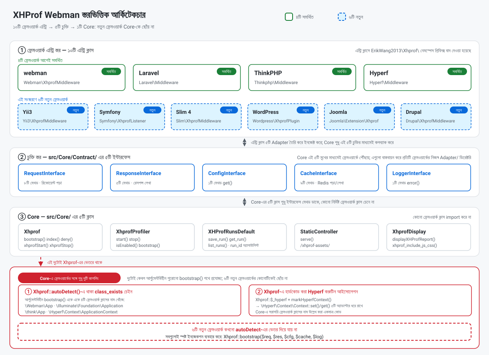
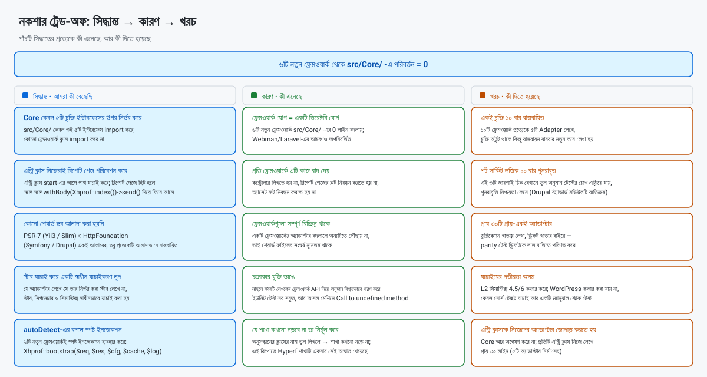
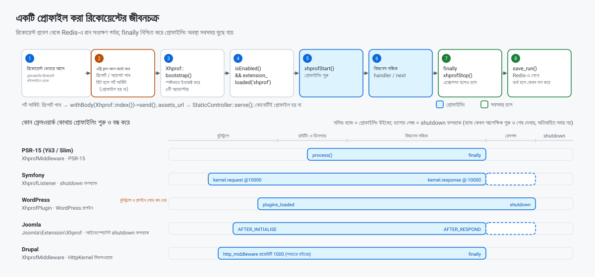

> **যন্ত্রানুবাদ।** এই নথিটি স্বয়ংক্রিয়ভাবে অনূদিত হয়েছে এবং কোনো মাতৃভাষী দ্বারা পুনরালোচিত হয়নি। নির্ভরযোগ্য তথ্যের জন্য ইংরেজি সংস্করণ [README.EN.md](../../../README.EN.md) দেখুন।

[中文](../../../README.md) · [English](../../../README.EN.md) · [한국어](../ko/README.md) · [Русский](../ru/README.md) · [Deutsch](../de/README.md) · [Français](../fr/README.md) · [Español](../es/README.md) · [Português](../pt/README.md) · [العربية](../ar/README.md) · [हिन्दी](../hi/README.md) · **বাংলা** · [Bahasa Indonesia](../id/README.md) · [日本語](../ja/README.md)

# XHProf পারফরম্যান্স প্রোফাইলার

webman / Laravel / ThinkPHP / Hyperf / Yii3 / Symfony / Slim 4 / WordPress / Joomla ও Drupal-এর সঙ্গে সামঞ্জস্যপূর্ণ একটি কোড পারফরম্যান্স প্রোফাইলিং প্লাগইন।

xhprof এক্সটেনশনের মাধ্যমে প্রোফাইলিং ডেটা সংগ্রহ করে Redis-এ সংরক্ষণ করে। ডেভেলপাররা ব্রাউজার দিয়ে দ্রুত পারফরম্যান্স বিশ্লেষণ রিপোর্ট দেখে কোডের পারফরম্যান্স বটলনেক চিহ্নিত করতে পারেন।

## প্রয়োজনীয়তা

- PHP >= 8.0
- xhprof এক্সটেনশন
- redis এক্সটেনশন
- Redis সার্ভার

## সামঞ্জস্যপূর্ণ ফ্রেমওয়ার্ক ও ন্যূনতম সংস্করণ

| ফ্রেমওয়ার্ক | ন্যূনতম সংস্করণ | ন্যূনতম PHP | এন্ট্রি ক্লাস | মাউন্ট করার নিয়ম |
|-----------|----------------|-------------|-------------|--------------|
| webman | `workerman/webman ^2.1` | 8.0 | `Webman\XhprofMiddleware` | `config/middleware.php`-এ গ্লোবাল মিডলওয়্যার নিবন্ধন করুন |
| Laravel | `laravel/framework ^9.0\|^10.0\|^11.0` | 8.0 | `Laravel\Middleware` | `app/Http/Kernel.php`-এ গ্লোবাল মিডলওয়্যার নিবন্ধন করুন |
| ThinkPHP | `topthink/framework ^6.0\|^8.0` | 8.0 | `Thinkphp\Middleware` | `app/middleware.php`-এ গ্লোবাল মিডলওয়্যার নিবন্ধন করুন |
| Hyperf | `hyperf/framework ^3.0` | 8.0 | `Hyperf\Middleware` | ConfigProvider-এর মাধ্যমে স্বয়ংক্রিয়ভাবে নিবন্ধিত |
| Yii3 | `yiisoft/middleware-dispatcher ^5.0` | 8.1 | `Yii3\XhprofMiddleware` | `config/web/di/application.php`-এ নিবন্ধন করুন; মিডলওয়্যার তালিকায় অবশ্যই প্রথমে থাকতে হবে |
| Symfony | `symfony/http-kernel ^6.4\|^7.0` | 8.1 (6.4) / 8.2 (7.x) | `Symfony\XhprofListener` | `config/services.yaml`-এ `kernel.event_subscriber` ট্যাগ যোগ করুন |
| Slim 4 | `slim/slim ^4.12` | 8.0 | `Slim\XhprofMiddleware` | `$app->add(...)`, অবশ্যই সবার শেষে যোগ করতে হবে |
| WordPress | 6.4+ | 8.0 | `Wordpress\XhprofPlugin` | `wp-content/mu-plugins/`-এ কপি করুন |
| Joomla | 4.4 / 5.x | 8.1 | `Joomla\Extension\Xhprof` | `plugins/system/`-এ কপি করুন, Discover দিয়ে ইনস্টল করুন |
| Drupal | 10.x / 11.x | 8.1 (10.x) / 8.3 (11.x) | `xhprof` মডিউল (`Drupal\XhprofMiddleware`) | স্ট্যান্ডার্ড মডিউল, শুধু চালু করুন |

সব এন্ট্রি ক্লাসই `ErikWang2013\Xhprof\` নেমস্পেস প্রিফিক্সের অধীনে থাকে (উপরে বাদ দেওয়া হয়েছে)। ছয়টি নতুন ফ্রেমওয়ার্কের মধ্যে Drupal ব্যতিক্রম — এটি মডিউল রুটের মাধ্যমে রিপোর্ট পেজ পরিবেশন করে — বাকি পাঁচটি এন্ট্রি ক্লাস **নিজেরাই রিপোর্ট পেজ পরিবেশন করে**, কোনো কন্ট্রোলার বা রুট নিবন্ধনের প্রয়োজন হয় না।

এই প্যাকেজটি `php >= 8.0` ঘোষণা করে, কিন্তু Yii3 যে `yiisoft/*` কম্পোনেন্টগুলোর উপর নির্ভর করে সেগুলোর জন্য **PHP 8.1+** দরকার, তাই **PHP 8.0-তে Yii3 ব্যবহার করা যায় না**; একইভাবে Symfony 7.x ও Drupal 11.x-এরও বেশি PHP সংস্করণ লাগে। ধাপে ধাপে সেটআপ নিচের "ফ্রেমওয়ার্ক কনফিগারেশন"-এ আছে।

## ইনস্টলেশন

php.ini-তে xhprof কনফিগারেশন যোগ করুন:

```ini
[xhprof]
extension=xhprof.so
xhprof.output_dir=/tmp/xhprof
```

Composer দিয়ে ইনস্টল করুন:

```sh
composer require aaron-dev/xhprof-webman
```

---

## ফ্রেমওয়ার্ক কনফিগারেশন

### Webman

**১. গ্লোবাল মিডলওয়্যার নিবন্ধন করুন** — `config/middleware.php`:

```php
return [
    '' => [
        ErikWang2013\Xhprof\Webman\XhprofMiddleware::class,
    ],
];
```

**২. কন্ট্রোলার তৈরি করুন**:

```php
<?php

namespace app\controller;

use support\Request;
use ErikWang2013\Xhprof\Webman\Xhprof;

class XhprofController
{
    public function index(Request $request)
    {
        return Xhprof::index();
    }
}
```

**৩. রুট নিবন্ধন করুন** — `config/route.php`:

```php
use Webman\Route;
use ErikWang2013\Xhprof\Webman\StaticController;

Route::get('/xhprof', [app\controller\XhprofController::class, 'index']);
Route::get('/xhprof-assets/{path:.+}', [StaticController::class, 'serve']);

```

**৪. কনফিগারেশন** — `config/plugin/aaron-dev/xhprof/xhprof.php` দেখুন।

---

### Laravel

**১. মিডলওয়্যার নিবন্ধন করুন** — `app/Http/Kernel.php`:

```php
protected $middleware = [
    // ...
    \ErikWang2013\Xhprof\Laravel\Middleware::class,
];
```

**২. কন্ট্রোলার তৈরি করুন**:

```php
<?php

namespace App\Http\Controllers;

use Illuminate\Http\Request;
use ErikWang2013\Xhprof\Core\Xhprof;

class XhprofController extends Controller
{
    public function index(Request $request)
    {
        Xhprof::bootstrap();
        return Xhprof::index();
    }
}
```

**৩. রুট নিবন্ধন করুন** — `routes/web.php`:

```php
use App\Http\Controllers\XhprofController;
use ErikWang2013\Xhprof\Core\StaticController;
use Illuminate\Support\Facades\Route;

Route::get('/xhprof', [XhprofController::class, 'index']);
Route::get('/xhprof-assets/{path}', function ($path) {
    $req = new \ErikWang2013\Xhprof\Laravel\Adapter\RequestAdapter(request());
    $res = new \ErikWang2013\Xhprof\Laravel\Adapter\ResponseAdapter(response(''));
    return StaticController::serve($req, $res)->send();
})->where('path', '.*');

```

**৪. কনফিগ প্রকাশ করুন**:

```sh
php artisan vendor:publish --tag=xhprof-config
```

কনফিগ ফাইল `config/xhprof.php`-এ থাকবে। Laravel ServiceProvider-এর স্বয়ংক্রিয় আবিষ্কার সমর্থন করে।

---

### ThinkPHP

**১. মিডলওয়্যার নিবন্ধন করুন** — `app/middleware.php`:

```php
return [
    \ErikWang2013\Xhprof\Thinkphp\Middleware::class,
];
```

**২. কন্ট্রোলার তৈরি করুন**:

```php
<?php

namespace app\controller;

use think\Request;
use ErikWang2013\Xhprof\Core\Xhprof;

class XhprofController
{
    public function index(Request $request)
    {
        Xhprof::bootstrap();
        return Xhprof::index();
    }
}
```

**৩. রুট নিবন্ধন করুন** — `route/app.php`:

```php
use think\facade\Route;
use ErikWang2013\Xhprof\Core\StaticController;
use ErikWang2013\Xhprof\Thinkphp\Adapter\RequestAdapter;
use ErikWang2013\Xhprof\Thinkphp\Adapter\ResponseAdapter;

Route::get('/xhprof', 'app\controller\XhprofController@index');
Route::get('/xhprof-assets/[:path]', function ($path = '') {
    $req = new RequestAdapter(app('request'));
    $res = new ResponseAdapter(response(''));
    return StaticController::serve($req, $res)->send();
})->pattern(['path' => '.*']);

```

**৪. কনফিগারেশন** — `vendor/aaron-dev/xhprof-webman/src/Thinkphp/config/xhprof.php` প্রকল্পের `config/xhprof.php`-এ কপি করুন।

---

### Hyperf

**১. মিডলওয়্যারের স্বয়ংক্রিয় নিবন্ধন** — ConfigProvider স্বয়ংক্রিয়ভাবে HTTP মিডলওয়্যার কিউতে মিডলওয়্যার যোগ করে।

**২. কন্ট্রোলার তৈরি করুন**:

```php
<?php

namespace App\Controller;

use Hyperf\HttpServer\Annotation\Controller;
use Hyperf\HttpServer\Annotation\RequestMapping;
use ErikWang2013\Xhprof\Core\Xhprof;

#[Controller(prefix: '/xhprof')]
class XhprofController
{
    #[RequestMapping(path: '')]
    public function index()
    {
        Xhprof::bootstrap();
        return Xhprof::index();
    }
}
```

**৩. স্ট্যাটিক অ্যাসেট রুট** — `config/routes.php`:

```php
use Hyperf\HttpServer\Router\Router;
use ErikWang2013\Xhprof\Core\StaticController;
use ErikWang2013\Xhprof\Hyperf\Adapter\RequestAdapter;
use ErikWang2013\Xhprof\Hyperf\Adapter\ResponseAdapter;
use Hyperf\Context\ApplicationContext;

Router::get('/xhprof-assets/{path:.+}', function ($path) {
    $container = ApplicationContext::getContainer();
    $req = new RequestAdapter($container->get(\Hyperf\HttpServer\Contract\RequestInterface::class));
    $res = new ResponseAdapter($container->get(\Hyperf\HttpServer\Contract\ResponseInterface::class));
    return StaticController::serve($req, $res)->send();
});

```

**৪. কনফিগ প্রকাশ করুন**:

```sh
php bin/hyperf.php vendor:publish aaron-dev/xhprof-webman
```

কনফিগ আউটপুট `config/autoload/xhprof.php`-এ থাকবে।

---

### Yii3

**১. মিডলওয়্যার নিবন্ধন করুন** — `config/web/di/application.php`:

```php
use ErikWang2013\Xhprof\Yii3\XhprofMiddleware;
use Yiisoft\Middleware\Dispatcher\MiddlewareDispatcher;

return [
    MiddlewareDispatcher::class => [
        'class' => MiddlewareDispatcher::class,
        // the first element is the outermost middleware (runs first, finishes last)
        'withMiddlewares()' => [[
            XhprofMiddleware::class,
            // ... other middlewares
        ]],
    ],
];
```

সহজে করা দুটি ভুল (দুটোই মাপা হয়েছে):

- **লিখবেন না** `'__construct()' => ['middlewares' => [...]]`: `MiddlewareDispatcher::__construct()` কেবল একটি `MiddlewareFactory` আর ঐচ্ছিক একটি `EventDispatcherInterface` নেয় — কোনো `middlewares` প্যারামিটার **নেই**। মিডলওয়্যারের তালিকা কেবল **ইনস্ট্যান্স মেথড** `withMiddlewares()` দিয়েই ইনজেক্ট করা যায়।
- `withMiddlewares()`-এ একটি ইনস্ট্যান্স (`new XhprofMiddleware(...)`) **রাখবেন না**: ডেফিনিশন কেবল class-string, অ্যারে ডেফিনিশন বা callable গ্রহণ করে। ইনস্ট্যান্স দিলে নিবন্ধন কিছুই জানায় না আর `dispatch()` একটি `TypeError` ছোড়ে (`MiddlewareFactory::create()`-এর টাইপ `callable|array|string`)।

**২. রিপোর্ট পেজ ও স্ট্যাটিক অ্যাসেট** — **কোনো কন্ট্রোলার বা রুট নিবন্ধন লাগে না**: `XhprofMiddleware` একটি PSR-15 মিডলওয়্যার। প্রোফাইলিং শুরু হওয়ার আগে এটি রিকোয়েস্ট পাথ পরীক্ষা করে: রিপোর্ট পাথ `/xhprof`-এ হিট হলে সঙ্গে সঙ্গে রিপোর্ট পেজ ফেরত দেয়, আর অ্যাসেট পাথ (ডিফল্ট প্রিফিক্স `/xhprof-assets`) -এ হিট হলে সরাসরি স্ট্যাটিক অ্যাসেট ফেরত দেয়। রিপোর্ট পেজের রেসপন্সটি এন্ট্রি ক্লাস থেকে স্পষ্ট `Content-Type: text/html; charset=UTF-8` বহন করে: PSR-7 রেসপন্সে কোনো ডিফল্ট থাকে না এবং Yii3-এর রেসপন্স সেন্ডারও যোগ করে না, তাই এটি না দিলে ব্রাউজার HTML রিপোর্টটিকে সাধারণ টেক্সট হিসেবে দেখায়।

**৩. কনফিগারেশন** — ডিফল্টগুলো প্যাকেজের `src/Yii3/config/xhprof.php`-এ আছে; ফিল্ডগুলোর জন্য "কনফিগারেশন রেফারেন্স" দেখুন। ওভাররাইড করতে DI দিয়ে `$config` ইনজেক্ট করুন:

```php
XhprofMiddleware::class => [
    'class' => XhprofMiddleware::class,
    '__construct()' => [
        'config' => [
            'enable' => true,
            'auth_token' => 'your-token',
            'redis' => [
                'host' => '127.0.0.1',
                'port' => 6379,
                'password' => '',
                'database' => 0,
                'timeout' => 1.0,
            ],
        ],
    ],
],
```

`redis` সাব-অ্যারে Yii3-নির্দিষ্ট: কোনো `CacheInterface` ইনজেক্ট না করা হলে মিডলওয়্যার এটি দিয়ে সরাসরি phpredis-এর সঙ্গে কথা বলে। `assets_url` ডিফল্টেই রাখুন — অন্য যেকোনো প্রিফিক্স কেবল খালি বডিসহ একটি 200 দেয় (এটি Core-এ হার্ডকোড করা ধ্রুবক; [যাচাইকরণ ও জ্ঞাত সীমাবদ্ধতা](#যাচাইকরণ-ও-জ্ঞাত-সীমাবদ্ধতা) দেখুন)।

**৪. সংস্করণ প্রয়োজনীয়তা** — Yii3 যে `yiisoft/*` কম্পোনেন্টগুলোর উপর নির্ভর করে সেগুলোর জন্য PHP >= 8.1 দরকার। এই প্যাকেজ `php >= 8.0` ঘোষণা করলেও PHP 8.0-তে Yii3 ইন্টিগ্রেশন ব্যবহার করা যায় না।

---

### Symfony

**১. ইভেন্ট সাবস্ক্রাইবার নিবন্ধন করুন** — `config/services.yaml`:

```yaml
services:
    ErikWang2013\Xhprof\Symfony\XhprofListener:
        tags:
            - { name: kernel.event_subscriber }
```

**২. রিপোর্ট পেজ ও স্ট্যাটিক অ্যাসেট** — **কোনো কন্ট্রোলার বা রুট নিবন্ধন লাগে না**: প্রোফাইলিং শুরু হওয়ার আগে লিসেনার রিকোয়েস্ট পাথ পরীক্ষা করে: রিপোর্ট পাথ `/xhprof`-এ হিট হলে সঙ্গে সঙ্গে রিপোর্ট পেজ ফেরত দেয়, আর অ্যাসেট পাথ (ডিফল্ট প্রিফিক্স `/xhprof-assets`) -এ হিট হলে সরাসরি স্ট্যাটিক অ্যাসেট ফেরত দেয়।

**৩. কনফিগারেশন** — ডিফল্টগুলো প্যাকেজের `src/Symfony/config/xhprof.php`-এ আছে; ফিল্ডগুলোর জন্য "কনফিগারেশন রেফারেন্স" দেখুন।

**৪. সাব-রিকোয়েস্ট ও এক্সেপশন ফলব্যাক** — এটি `kernel.request` (প্রায়োরিটি 10000) ও `kernel.response` (প্রায়োরিটি -10000) শোনে। `isMainRequest()` ESI/ফ্র্যাগমেন্ট সাব-রিকোয়েস্ট বাদ দেয়, নাহলে সেগুলো প্রোফাইলিং খুব আগেই বন্ধ করে দিত; রিকোয়েস্ট শুরু হলে একটি আইডেম্পোটেন্ট `register_shutdown_function`-ও নিবন্ধিত হয় — HttpKernel যদি এক্সেপশন আবার ছোড়ে, `kernel.response` কখনো চলে না, আর সেই ফলব্যাক না থাকলে প্রোফাইলিং অবস্থা পরের রিকোয়েস্টে গড়িয়ে পড়ত।

---

### Slim 4

**১. মিডলওয়্যার নিবন্ধন করুন** — `public/index.php`:

```php
use ErikWang2013\Xhprof\Slim\XhprofMiddleware;

$app->addRoutingMiddleware();

// must be added last: Slim's middleware stack is LIFO, added later = further out = runs first
$app->add(new XhprofMiddleware(
    $app->getResponseFactory()
));
```

বাকি তিনটি কনস্ট্রাক্টর আর্গুমেন্টই ঐচ্ছিক; বাদ দিলে প্যাকেজের ডিফল্ট ব্যবহৃত হয়:

- আর্গুমেন্ট ২, `array $config`: আপনার কনফিগ অ্যারে, যা `array_replace` দিয়ে প্যাকেজের `src/Slim/config/xhprof.php`-এর উপরে মার্জ হয় (সম্পূর্ণ-মান প্রতিস্থাপন — `ignore_url_arr`-এর মতো লিস্ট কী কখনো পুনরাবৃত্তভাবে মার্জ হয় না)।
- আর্গুমেন্ট ৩, `CacheInterface $cache`: বাদ দিলে এটি অলসভাবে `new \Redis()` করে (কনস্ট্রাক্টর সচেতনভাবেই ext-redis স্পর্শ করে না, তাই অ্যাডাপ্টার তৈরি হওয়ার সময় এক্সটেনশন না থাকলেও বিস্ফোরণ ঘটে না)। নিজের কানেকশন ইনজেক্ট করতে `new \ErikWang2013\Xhprof\Slim\Adapter\RedisAdapter($redis)` পাঠান, বা `ErikWang2013\Xhprof\Core\Contract\CacheInterface` বাস্তবায়ন করে এমন যেকোনো অবজেক্ট।
- আর্গুমেন্ট ৪, `LoggerInterface $logger`: বাদ দিলে এটি `new \ErikWang2013\Xhprof\Slim\Adapter\LogAdapter()` এবং **লগ নীরবে ফেলে দেওয়া হয়** (Slim কোনো PSR-3 লগার দেয় না)। লগ রাখতে `new LogAdapter($psrLogger)` পাঠান, যেখানে `$psrLogger` আপনার কাছে থাকা একটি PSR-3 লগার।

**`$app->add(XhprofMiddleware::class)` লিখবেন না**: Slim-এর `CallableResolver` ওই class string-কে `new XhprofMiddleware($container)`-এ পরিণত করে — কেবল কন্টেইনার পাস করে, আর রেজল্যুশন রিকোয়েস্টের সময় পর্যন্ত পিছিয়ে দেয়। ফলে `add()` কিছুই জানায় না আর প্রথম রিকোয়েস্টেই একটি `TypeError` ছোড়ে — সবচেয়ে কঠিন ব্যর্থতার ধরন। সবসময় উপরের স্পষ্ট `new` ব্যবহার করুন।

**২. রিপোর্ট পেজ ও স্ট্যাটিক অ্যাসেট** — **কোনো কন্ট্রোলার বা রুট নিবন্ধন লাগে না**: প্রোফাইলিং শুরু হওয়ার আগে মিডলওয়্যার রিকোয়েস্ট পাথ পরীক্ষা করে: রিপোর্ট পাথ `/xhprof`-এ হিট হলে সঙ্গে সঙ্গে রিপোর্ট পেজ ফেরত দেয়, আর অ্যাসেট পাথ (ডিফল্ট প্রিফিক্স `/xhprof-assets`) -এ হিট হলে সরাসরি স্ট্যাটিক অ্যাসেট ফেরত দেয়।

**৩. কনফিগারেশন** — ডিফল্টগুলো প্যাকেজের `src/Slim/config/xhprof.php`-এ আছে; ফিল্ডগুলোর জন্য "কনফিগারেশন রেফারেন্স" দেখুন।

**৪. মাউন্ট করার ক্রম** — Slim-এর মিডলওয়্যার স্ট্যাক LIFO (দুটি মিডলওয়্যার দিয়ে মাপা, কার্যক্রমের ক্রম `B:before → A:before → A:after → B:after`): যত পরে `add()` করবেন, তত বাইরে থাকবে আর তত আগে চলবে। তাই xhprof অবশ্যই **সবার শেষে** এবং **`addRoutingMiddleware()`-এর পরে** যোগ করতে হবে — নাহলে `/xhprof` রাউটিং টেবিলে থাকবে না, RoutingMiddleware আগেই `HttpNotFoundException` ছোড়ে, এবং রিকোয়েস্ট কখনো মিডলওয়্যারে পৌঁছায় না। রিপোর্ট পেজের রেসপন্সটি এন্ট্রি ক্লাস থেকে স্পষ্ট `Content-Type: text/html; charset=UTF-8` বহন করে: PSR-7 রেসপন্সে কোনো ডিফল্ট থাকে না এবং Slim-এর `ResponseEmitter`-ও যোগ করে না, তাই এটি না দিলে ব্রাউজার HTML রিপোর্টটিকে সাধারণ টেক্সট হিসেবে দেখায়।

---

### WordPress

**১. mu-plugin ইনস্টল করুন** — প্যাকেজ থেকে বুটস্ট্র্যাপ ফাইলটি `wp-content/mu-plugins/`-এ কপি করুন:

```sh
cp vendor/aaron-dev/xhprof-webman/wordpress/xhprof-webman.php wp-content/mu-plugins/
```

`wordpress/xhprof-webman.php` একটি প্লাগইন হেডার বহন করে এবং `Wordpress\XhprofPlugin` বুট করে। mu-plugin স্বয়ংক্রিয়ভাবে লোড হয় — wp-admin-এ চালু করার কিছু নেই।

**২. রিপোর্ট পেজ ও স্ট্যাটিক অ্যাসেট** — **কোনো কন্ট্রোলার বা রুট নিবন্ধন লাগে না**: প্রোফাইলিং শুরু হওয়ার আগে এন্ট্রি ক্লাস রিকোয়েস্ট পাথ পরীক্ষা করে: রিপোর্ট পাথ `/xhprof`-এ হিট হলে সঙ্গে সঙ্গে রিপোর্ট পেজ ফেরত দেয়, আর অ্যাসেট পাথ (ডিফল্ট প্রিফিক্স `/xhprof-assets`) -এ হিট হলে সরাসরি স্ট্যাটিক অ্যাসেট ফেরত দেয়।

**৩. কনফিগারেশন** — ডিফল্টগুলো প্যাকেজের `src/Wordpress/config/xhprof.php`-এ আছে; ফিল্ডগুলোর জন্য "কনফিগারেশন রেফারেন্স" দেখুন। `wp-cron.php` ও `admin-ajax.php`-এর মতো ঘন ঘন আসা পাথ বাদ দিতে `ignore_url_arr` ব্যবহার করুন।

**৪. প্রোফাইলিং উইন্ডোর একটি কাঠামোগত সীমা** — উইন্ডোটি `plugins_loaded` → `shutdown`, যাতে `wp-settings.php`-এর বুটস্ট্র্যাপ বা প্লাগইন লোডিং **অন্তর্ভুক্ত নয়**। এটি WordPress-এর একটি কাঠামোগত সীমা: ওই পর্যায়ের কাজ প্রোফাইল করা যায় না।

---

### Joomla

**১. প্লাগইন ইনস্টল করুন** — প্যাকেজের `joomla/` ডিরেক্টরিটি সাইটের `plugins/system/xhprof/`-এ কপি করুন:

```sh
cp -r vendor/aaron-dev/xhprof-webman/joomla/ plugins/system/xhprof/
```

প্যাকেজের `joomla/` ডিরেক্টরিটিই প্লাগইন: `xhprof.xml` ম্যানিফেস্ট, `services/provider.php`, আর `src/Extension/Xhprof.php`। এন্ট্রি ক্লাস `ErikWang2013\Xhprof\Joomla\Extension\Xhprof` (একটি `CMSPlugin`)। কপি করার পর "System → Manage → Extensions → Discover"-এ গিয়ে Discover চালান এবং ইনস্টল/চালু করুন।

**২. রিপোর্ট পেজ ও স্ট্যাটিক অ্যাসেট** — **কোনো কন্ট্রোলার বা রুট নিবন্ধন লাগে না**: প্রোফাইলিং শুরু হওয়ার আগে প্লাগইন রিকোয়েস্ট পাথ পরীক্ষা করে: রিপোর্ট পাথ `/xhprof`-এ হিট হলে সঙ্গে সঙ্গে রিপোর্ট পেজ ফেরত দেয়, আর অ্যাসেট পাথ (ডিফল্ট প্রিফিক্স `/xhprof-assets`) -এ হিট হলে সরাসরি স্ট্যাটিক অ্যাসেট ফেরত দেয়।

**৩. কনফিগারেশন** — ডিফল্টগুলো প্যাকেজের `src/Joomla/config/xhprof.php`-এ আছে; ফিল্ডগুলোর জন্য "কনফিগারেশন রেফারেন্স" দেখুন। **জ্ঞাত ট্রেড-অফ**: এটি প্লাগইন প্যারামিটারের বদলে প্যাকেজের কনফিগ ফাইল পড়ে — প্লাগইন প্যারামিটারের জন্য ডেটাবেস পড়া লাগে, আর কনফিগ প্রতিটি রিকোয়েস্টে পড়া হয়।

**৪. প্রোফাইলিংয়ের সীমানা** — উইন্ডোটি `ApplicationEvents::AFTER_INITIALISE` → `ApplicationEvents::AFTER_RESPOND`; `AFTER_INITIALISE`-এ একটি আইডেম্পোটেন্ট `register_shutdown_function`-ও নিবন্ধিত হয়, কারণ এক্সেপশনের পথে `AFTER_RESPOND`-এ পৌঁছানোর নিশ্চয়তা নেই — ফলব্যাক না থাকলে প্রোফাইলিং অবস্থা পরের রিকোয়েস্টে গড়িয়ে পড়ত।

---

### Drupal

**১. মডিউল চালু করুন** — প্যাকেজের `drupal/xhprof/` একটি স্ট্যান্ডার্ড Drupal মডিউল (`xhprof.info.yml` / `xhprof.routing.yml` / `xhprof.services.yml`)। এটি আপনার সাইটের `modules/custom/xhprof/`-এ রাখুন, তারপর "Extend" পেজে (বা `drush en xhprof` দিয়ে) চালু করুন।

**২. রিপোর্ট পেজ** — দশটি ফ্রেমওয়ার্কের মধ্যে Drupal **একমাত্র যেটি মডিউল রুটের মাধ্যমে রিপোর্ট পেজ পরিবেশন করে**: `xhprof.routing.yml` রিপোর্ট পাথ `/xhprof` নিবন্ধন করে আর একটি মডিউল কন্ট্রোলার সেটি রেন্ডার করে। বাকি পাঁচটি নতুন ফ্রেমওয়ার্ক নিজেরাই রিপোর্ট পেজ ও স্ট্যাটিক অ্যাসেট পরিবেশন করে এবং কোনো রুট নিবন্ধন করে না।

**৩. কনফিগারেশন** — কনফিগারেশন মডিউল-স্তরের টাইপড কনফিগ: ডিফল্টগুলো `drupal/xhprof/config/install/xhprof.settings.yml`-এ, স্কিমা `drupal/xhprof/config/schema/xhprof.schema.yml`-এ। ফিল্ডগুলোর জন্য "কনফিগারেশন রেফারেন্স" দেখুন।

**৪. মিডলওয়্যার নিবন্ধন** — মডিউলের `xhprof.services.yml`-এ মিডলওয়্যার সার্ভিস নিবন্ধন করুন:

```yaml
services:
  xhprof.http_middleware:
    class: ErikWang2013\Xhprof\Drupal\XhprofMiddleware
    arguments: ['@config.factory', '@logger.factory']
    tags:
      - { name: http_middleware, priority: 1000 }
```

ভেতরের কার্নেলটি Drupal-এর `StackedKernelPass` **স্বয়ংক্রিয়ভাবে কনস্ট্রাক্টর আর্গুমেন্ট ০ হিসেবে প্রিপেন্ড করে** — **নিজে লিখবেন না**: লিখলে দুটি ভেতরের কার্নেল তৈরি হয়, যা Drupal <= 11.2.x (সব 10.x সহ) -এ কন্টেইনার কম্পাইলের সময় ব্যর্থ হয় আর 11.3.0 ও তার উপরে প্রতিটি রিকোয়েস্টে একটি TypeError ছোড়ে। প্রোফাইলিং `finally`-তে বন্ধ হয়।

**৫. টীকা**

- `priority: 1000` মিডলওয়্যারটিকে **পেজ ক্যাশের বাইরে** রাখে (core-এর বিদ্যমান সর্বোচ্চ প্রায়োরিটি negotiation: D10-এ 400, D11-এ 500, আর পেজ ক্যাশ 200), তাই **Drupal-এর পেজ ক্যাশ থেকে পরিবেশিত রিকোয়েস্টও প্রোফাইল করা হয়**। একটি প্রোফাইলিং টুলের জন্য এটিই কাঙ্ক্ষিত আচরণ, তবে ব্যবহারকারীর জানা উচিত।
- ক্যাশ বাক্সের বাইরে কাজ করে: মিডলওয়্যার ডিফল্টভাবে এই প্যাকেজের সঙ্গে আসা Redis অ্যাডাপ্টার ব্যবহার করে (প্যাকেজটি ext-redis-এর উপর হার্ড-নির্ভর), এবং `services.yml`-এর `arguments` দিয়ে ওভাররাইড করতে ঐচ্ছিক একটি `CacheInterface` আর্গুমেন্টও গ্রহণ করে। ক্যাশ অনুপলব্ধ হলে ব্যর্থ সংরক্ষণ `XhprofProfiler::stop()` একটি একক লগ লাইনে গিলে ফেলে — **কোনো ত্রুটি উত্থাপিত হয় না**।
- রিপোর্ট পেজ `/xhprof` ও `/xhprof-assets/*`-এ আসা রিকোয়েস্ট **প্রোফাইল করা হয় না**: মিডলওয়্যার `xhprofStart()`-এর আগে পাথ দিয়ে প্রোফাইলিং এড়িয়ে যায়। রেসপন্সটি তবুও `xhprof.routing.yml`-এর Controller তৈরি করে (**এটি শর্ট-সার্কিট নয়**)। তাই `ignore_url_arr` `[]` (কিছুই ফিল্টার না করা) হলেও এই দুটি রিকোয়েস্ট কখনো রিপোর্টে দেখা যায় না।

---

## কনফিগারেশন রেফারেন্স

সব ফ্রেমওয়ার্ক এই কনফিগারেশন অপশনগুলো শেয়ার করে:

| কনফিগ | টাইপ | ডিফল্ট | বিবরণ |
|--------|------|---------|-------------|
| `enable` | bool | `true` | প্রোফাইলিং চালু/বন্ধ করুন |
| `time_limit` | int | `0` | কেবল n সেকেন্ডের বেশি সময় নেওয়া রিকোয়েস্ট প্রোফাইল করুন, 0 মানে সব |
| `log_num` | int | `1000` | রেকর্ডের সর্বোচ্চ সংখ্যা |
| `view_wtred` | int | `3` | যে সারিগুলোর রেসপন্স টাইম n সেকেন্ডের বেশি সেগুলো লাল রঙে হাইলাইট করুন |
| `ignore_url_arr` | array | `["/xhprof"]` | যেসব URL পাথ এড়িয়ে যেতে হবে |
| `assets_url` | string | `/xhprof-assets` | স্ট্যাটিক অ্যাসেট URL প্রিফিক্স |
| `auth_token` | string\|null | `null` | সেট করা থাকলে রিপোর্ট পেজে `?token=xxx` লাগে; পাবলিক ডিপ্লয়মেন্টে সুপারিশ করা হয় |
| `key_prefix` | string | `xhprof` | Redis কী প্রিফিক্স; একটি Redis শেয়ার করলে প্রতি প্রকল্পে আলাদা মান দিন |
| `log_ttl` | int | `604800` | ডেটা ধরে রাখার সময় সেকেন্ডে (ডিফল্ট ৭ দিন) |
| `locale` | string\|null | `null` | রিপোর্ট পেজের ভাষা: `zh_CN`/`en`/`ko`/`ru`/`de`/`fr`/`es`/`pt`/`ar`/`hi`/`bn`/`id`/`ja`; `null` = ব্রাউজারের `Accept-Language` অনুসরণ করুন, না মিললে চীনা; `?lang=xx` একটি রিকোয়েস্টের জন্য এটি বদলে দেয় |

প্রতিটি ফ্রেমওয়ার্কে এই অপশনগুলোর জ্ঞাত সীমাবদ্ধতা [যাচাইকরণ ও জ্ঞাত সীমাবদ্ধতা](#যাচাইকরণ-ও-জ্ঞাত-সীমাবদ্ধতা)-এ দেওয়া আছে।

---

## ম্যানুয়াল ইনিশিয়ালাইজেশন

ফ্রেমওয়ার্কের স্বয়ংক্রিয় শনাক্তকরণ ব্যর্থ হলে আপনি নিজেই অ্যাডাপ্টার ইনজেক্ট করতে পারেন:

```php
use ErikWang2013\Xhprof\Core\Xhprof;

Xhprof::bootstrap(
    new MyRequestAdapter($request),
    new MyResponseAdapter($response),
    new MyConfigAdapter(),
    new MyCacheAdapter(),
    new MyLoggerAdapter()
);
```

**ছয়টি নতুন ফ্রেমওয়ার্ককে (Yii3 / Symfony / Slim 4 / WordPress / Joomla / Drupal) আর্গুমেন্টবিহীন `Xhprof::bootstrap()` কখনো ডাকতে হবে না** — আর্গুমেন্ট না দিলে এটি `autoDetect()`-এর ভেতর দিয়ে যায়, যা কেবল webman / Laravel / ThinkPHP / Hyperf শাখা জানে আর এই ছয়টিতে `Unsupported framework` ছোড়ে। উপরের উদাহরণের মতো সব ৫টি অ্যাডাপ্টার স্পষ্টভাবে পাস করুন (প্রতিটি ফ্রেমওয়ার্কের সঙ্গে আসা এন্ট্রি ক্লাস ইতিমধ্যেই এটি আপনার হয়ে করে)।

---

## আর্কিটেকচার ও নকশা

Core ঠিক ৫টি চুক্তির মাধ্যমে ফ্রেমওয়ার্কে পৌঁছায়, সবই `src/Core/Contract/`-এ:

| চুক্তি | মেথড | উদ্দেশ্য |
|----------|---------|---------|
| `RequestInterface` | `get()` `all()` `method()` `header()` `host()` `uri()` `url()` `getRealIp()` | রিকোয়েস্ট ডেটা পড়া, রিপোর্ট পাথ মেলানো, রিপোর্ট-পেজ লিংক তৈরি |
| `ResponseInterface` | `withBody()` `withHeaders()` `withStatus()` `file()` `send()` | রিপোর্ট পেজ, স্ট্যাটিক অ্যাসেট ও 400/403 পাঠানো |
| `ConfigInterface` | `get()` | প্লাগইন কনফিগ পড়া: পুরো ব্লকের জন্য `get('xhprof')`, পাতার জন্য `get('xhprof.assets_url')` |
| `CacheInterface` | `get()` `set()` `mget()` `incr()` `lPush()` `rPop()` `lRange()` `del()` `decr()` | Redis পড়া ও লেখা |
| `LoggerInterface` | `error()` | অনুপস্থিত এক্সটেনশন ও ব্যর্থ সংরক্ষণের সতর্কবার্তা |

প্রতিটি ফ্রেমওয়ার্ক এই চুক্তিগুলো বাস্তবায়ন করে ৫টি অ্যাডাপ্টার দেয়, যা `Xhprof::bootstrap()` Core-এ নিবন্ধন করে। ফ্রেমওয়ার্ক-নির্দিষ্ট সবকিছু সেই ফ্রেমওয়ার্কের নিজের `src/<Fw>/` ডিরেক্টরিতেই থাকে।

**Core-এ ফ্রেমওয়ার্কের সঙ্গে কেবল দুটি কাপলিং বাকি আছে**:

1. `Xhprof::autoDetect()`-এ `class_exists()` চেইন (`Webman\App` → `Illuminate\Foundation\Application` → `think\App` → `Hyperf\Context\ApplicationContext`), যেখানে কেবল আর্গুমেন্টবিহীন `bootstrap()` পৌঁছায়।
2. হার্ডকোড করা Hyperf করুটিন সুইচ: `Xhprof::markHyperfContext()` এবং `\Hyperf\Context\Context`-এর অস্তিত্ব যাচাই, যা ঠিক করে অ্যাডাপ্টারগুলো প্রসেস-ব্যাপী স্ট্যাটিক প্রপার্টিতে যাবে নাকি করুটিন Context-এ।

**ছয়টি নতুন ফ্রেমওয়ার্ক কখনো `autoDetect()`-এর ভেতর দিয়ে যায় না — সবগুলোই স্পষ্ট ইনজেকশন ব্যবহার করে**: প্রতিটি এন্ট্রি ক্লাস নিজের ৫টি অ্যাডাপ্টার তৈরি করে `Xhprof::bootstrap($req, $res, $cfg, $cache, $log)`-এ পাস করে। কারণ PSR-7 ফ্রেমওয়ার্কে Request/Response কেবল রিকোয়েস্ট পাইপলাইন থেকেই পাওয়া যায়, তাই আর্গুমেন্টবিহীন `bootstrap()` গঠনগতভাবেই কাজ করতে পারে না; দ্বিতীয় সুবিধা হলো `autoDetect()` তার বর্তমান চারটি ফ্রেমওয়ার্কেই স্থির থাকে।



প্রথম ডায়াগ্রামটি **কাঠামো**: দশটি ফ্রেমওয়ার্কের প্রতিটির এন্ট্রি ক্লাস, ৫টি চুক্তি, Core-এর তিনটি স্তর, আর বাকি থাকা একমাত্র দুটি কাপলিং।



দ্বিতীয় ডায়াগ্রামটি **যুক্তি**: সিদ্ধান্ত / কারণ / খরচ আকারে সাজানো পাঁচটি ট্রেড-অফ, শিরোনামে "ছয়টি নতুন ফ্রেমওয়ার্ক থেকে `src/Core/`-এ পরিবর্তন = 0"।

---

## রিকোয়েস্ট জীবনচক্র

একটি প্রোফাইল করা রিকোয়েস্ট:

1. **প্রোফাইলিং শুরু হওয়ার আগে** এন্ট্রি ক্লাস পাথ পরীক্ষা করে: রিপোর্ট পাথে হিট হলে সঙ্গে সঙ্গে রিপোর্ট পেজ ফেরত দেয়; অ্যাসেট পাথে হিট হলে সঙ্গে সঙ্গে স্ট্যাটিক অ্যাসেট ফেরত দেয়। কোনোটিই প্রোফাইল করা হয় না, আর কোনোটিই নিচের প্রবাহে ঢোকে না।
2. `XhprofProfiler::isEnabled()` কনফিগ থেকে `enable` পড়ে; প্রোফাইলিং বন্ধ থাকলে বা কোনো এক্সটেনশন না থাকলে পুরো ব্লকটি এড়িয়ে যাওয়া হয়।
3. `Xhprof::xhprofStart()` → `XhprofProfiler::start()` → `xhprof_enable(XHPROF_FLAGS_NO_BUILTINS + XHPROF_FLAGS_CPU + XHPROF_FLAGS_MEMORY)`।
4. বিজনেস লজিক চলে।
5. `finally { Xhprof::xhprofStop(); }` → `xhprof_disable()`, তারপর `XHProfRunsDefault::save_run()` Redis-এ লেখে। সাধারণ স্টেটমেন্টের বদলে `finally`, যাতে ছোড়া এক্সেপশনেও প্রোফাইলিং অবস্থা মুছে যায় আর রান সংরক্ষিত হয়।
6. ব্রাউজার রিপোর্ট পেজ খোলে; `Xhprof::index()` Redis থেকে ডেটা ফিরিয়ে এনে রেন্ডার করে।



| ফ্রেমওয়ার্ক | প্রোফাইলিং শুরু | প্রোফাইলিং শেষ |
|-----------|-----------------|----------------|
| webman / Laravel / ThinkPHP / Hyperf | মিডলওয়্যার এন্ট্রি (`process()` / `handle()`) | `finally` |
| Yii3 / Slim 4 | PSR-15 `process()` | `finally` |
| Symfony | `kernel.request` (প্রায়োরিটি 10000) | `kernel.response` (প্রায়োরিটি -10000), সঙ্গে একটি shutdown ফলব্যাক |
| WordPress | `plugins_loaded` | `shutdown` |
| Joomla | `onAfterInitialise` | `onAfterRespond`, সঙ্গে একটি shutdown ফলব্যাক |
| Drupal | `http_middleware` (প্রায়োরিটি 1000, সবচেয়ে বাইরের) | `finally` |

---

## প্রকল্প কাঠামো

```
xhprof-webman/
├── src/
│   ├── Core/                     # Framework-agnostic: contracts, report page, Redis, assets
│   │   ├── Contract/             # the 5 contract interfaces
│   │   ├── XhprofLib/            # report rendering and run storage (from phacility/xhprof)
│   │   ├── Xhprof.php            # static facade: bootstrap() / index()
│   │   ├── XhprofProfiler.php    # xhprof_enable/disable and config
│   │   ├── StaticController.php  # /xhprof-assets static assets
│   │   ├── MiddlewareTrait.php   # shared profiling wrapper for Laravel / ThinkPHP
│   │   └── RedisAdapterTrait.php # shared Redis adapter implementation
│   ├── Webman/ Laravel/ Thinkphp/ Hyperf/            # the existing 4 frameworks
│   ├── Yii3/ Symfony/ Slim/ Wordpress/ Joomla/ Drupal/   # the 6 new frameworks
│   └── html/                     # report page assets (css / js / images)
├── wordpress/                    # mu-plugin bootstrap file (with plugin header)
├── joomla/                       # Joomla plugin (CMSPlugin + manifest)
├── drupal/xhprof/                # standard Drupal module (info / routing / services + controller)
├── tools/contracts/              # standalone verification loop: signatures and semantics against real framework packages
├── tests/                        # PHPUnit: adapters, wiring, README parity
└── docs/images/                  # README diagrams
```

Drupal ছাড়া প্রতিটি `src/<Fw>/` ডিরেক্টরির আকার একই:

```
src/<Fw>/
├── Adapter/{Request,Response,Config,Redis,Log}Adapter.php
├── <EntryClass>.php
└── config/xhprof.php             # the same 9 config keys as every other framework
```

`src/Drupal/` একমাত্র ব্যতিক্রম: এতে কোনো `config/` ডিরেক্টরি নেই — এর কনফিগারেশন মডিউল-স্তরের টাইপড কনফিগে থাকে (`drupal/xhprof/config/install/xhprof.settings.yml`)।

---

## যাচাইকরণ ও জ্ঞাত সীমাবদ্ধতা

**যা যন্ত্রপাতির সাহায্যে প্রমাণিত**

| বিষয় | কীভাবে |
|------|-----|
| অ্যাডাপ্টার ও এন্ট্রি-ওয়্যারিংয়ের আচরণ | `tests/Unit/Adapter/*Test.php`: চালু → সংরক্ষিত / বন্ধ → সংরক্ষিত নয় / বিজনেস এক্সেপশন → `finally`-এর মাধ্যমে তবুও সংরক্ষিত |
| দশটি ফ্রেমওয়ার্কই একই কনফিগ কী সেট শেয়ার করে | config parity টেস্ট (কী সেট, বাইট-প্রতি-বাইট নয়; কমেন্ট আলাদা হতে পারে) |
| দুটি README পরস্পরের প্রতিচ্ছবি | README parity টেস্ট: `##` / `###` শিরোনামের ক্রম ও কোড ব্লকের সংখ্যা তুলনা করে |
| অ্যাডাপ্টার যে মেথডগুলো ডাকে সেগুলো সত্যিই আছে | `tools/contracts/` verification loop (নিজস্ব CI জব): আসল ফ্রেমওয়ার্ক প্যাকেজ ইনস্টল করে রিফ্লেকশনের মাধ্যমে প্রতিটি মেথড / ধ্রুবক / গ্লোবাল ফাংশন নিশ্চিত করে |
| অ্যাডাপ্টারের সিমান্টিক্স | একই লুপ আসল রিকোয়েস্ট ও রেসপন্স অবজেক্ট তৈরি করে অ্যাডাপ্টার চালায়, দুটি ইনভ্যারিয়েন্টসহ: `uri()`-তে স্কিম/হোস্ট থাকে না, আর `file()`-এর পরেও `withHeaders()` প্রয়োগ হয় |

উপরের প্রথম তিনটি সারি — অ্যাডাপ্টার ও এন্ট্রি-ওয়্যারিংয়ের আচরণ, দশটি ফ্রেমওয়ার্কেই একই কনফিগ কী সেট, আর দুটি README-র পরস্পরকে প্রতিফলন — **ভবিষ্যতের ডেলিভারেবল** বর্ণনা করে (ছয়-ফ্রেমওয়ার্ক ওয়্যারিং কেস, config parity টেস্ট, README parity টেস্ট) যা এই নথির সময়ে এখনো নেই। ছয়টি নতুন ফ্রেমওয়ার্কের জন্য আপাতত ম্যানুয়াল স্মোক চেকলিস্টকেই সত্যের উৎস ধরুন।

**স্বয়ংক্রিয়ভাবে যাচাই করা হয় না (এটিকে "ছয়টিই পরীক্ষিত" বলে পড়বেন না)**

| বিষয় | কেন নয় |
|------|---------|
| প্রতিটি ফ্রেমওয়ার্কের **ওয়্যারিং** (হুকটি সত্যিই লাগানো আছে কি, ইভেন্টটি সত্যিই নড়ে কি) | ইউনিট টেস্ট স্টাব ব্যবহার করে; ওয়্যারিং এই মুহূর্তে কেবল ম্যানুয়াল স্মোক টেস্টেই নিশ্চিত করা যায় |
| WordPress শেষ থেকে শেষ পর্যন্ত | প্রকৃত `plugins_loaded`-এর সময়, ফ্যাটাল এররে `shutdown` নড়ে কি না, আর mu-plugin লোড হয় কি না — সবকিছুর জন্য আসল WordPress দরকার |
| Joomla প্লাগইন আবিষ্কার ও `$app->close()` | আসল Joomla অ্যাডমিনে Discover চালানো দরকার |
| Drupal-এর প্রায়োরিটি সত্যিই পেজ ক্যাশের বাইরে পড়ে কি না | বুট করা একটি Drupal কার্নেল দরকার |
| Symfony-র `kernel.event_subscriber` স্বয়ংক্রিয়-কনফিগারেশন | আসল কন্টেইনার কম্পাইল দরকার |
| দীর্ঘকাল চলা প্রসেসে স্ট্যাটিক স্টেটের ক্রসটক | বিদ্যমান আর্কিটেকচার থেকে উত্তরাধিকারসূত্রে পাওয়া (Webman / Hyperf-েও একই); এখানে অপরিবর্তিত |
| প্রকৃত Redis I/O, ব্রাউজার রেন্ডারিং, আসল লোডে প্রোফাইলিং ওভারহেড | ইউনিট টেস্ট ও verification loop-এর পরিধির বাইরে |

**ম্যানুয়াল স্মোক চেকলিস্ট (প্রতি ফ্রেমওয়ার্কে তিনটি ধাপ)**

| ধাপ | কাজ | প্রত্যাশিত |
|------|--------|----------|
| 1 | "ফ্রেমওয়ার্ক কনফিগারেশন"-এ বর্ণিত নিয়মে এন্ট্রি ক্লাসটি মাউন্ট করুন | কোনো ত্রুটি নেই |
| 2 | অ্যাপ্লিকেশনের যেকোনো URL-এ হিট করুন | Redis-এ `xhprof:run_id` কী-এর দৈর্ঘ্য ১ বাড়ে |
| 3 | `/xhprof` খুলুন | রিপোর্ট পেজ তার স্টাইলসহ রেন্ডার হয়; `/xhprof-assets/js/xhprof_report.js` 200 ফেরত দেয় |

**জ্ঞাত সীমাবদ্ধতা: `host()`-এ পোর্ট নেই**

`host()` চুক্তির অর্থ "কেবল হোস্ট, পোর্ট নয়", কিন্তু রিপোর্ট তালিকার লিংকগুলো `host() . uri()` হিসেবে তৈরি হয় (`src/Core/XhprofLib/Utils/XHProfRunsDefault.php`)। তাই **অ-স্ট্যান্ডার্ড পোর্টে (যেমন `:8080`) তালিকার লিংকগুলো পোর্ট হারায় আর কোথাও নিয়ে যায় না**। এটি বিদ্যমান বাস্তবায়নের একটি সুপ্ত সমস্যা (webman / Laravel / ThinkPHP / Hyperf-কে সমানভাবে প্রভাবিত করে), এখানে ঠিক করা হয়নি, এবং জ্ঞাত সীমাবদ্ধতা হিসেবে লিপিবদ্ধ।

**জ্ঞাত সীমাবদ্ধতা: `assets_url` কেবল `/xhprof-assets` হলেই কাজ করে**

অ্যাসেট প্রিফিক্সটি `src/Core/StaticController.php`-এ হার্ডকোড করা একটি ধ্রুবক (`private const URI_PREFIX = '/xhprof-assets'`), অথচ রিপোর্ট পেজের CSS/JS লিংক `assets_url` কনফিগ অপশন পড়ে (`src/Core/Xhprof.php`)। দুটি ভিন্ন হয়ে গেলেই `getPathFromRequest()` `null` ফেরত দেয় আর `serve()` `withBody('')->withHeaders([])` ফেরত দেয় — **একটি 200 খালি রেসপন্স, 404 নয়**। পরিণাম: `assets_url` অন্য কিছুতে সেট করলে CSS/JS নীরবে খালি হয়ে যায়, রিপোর্ট পেজ স্টাইলহীন থাকে আর কোনো রকমের ত্রুটিও দেখায় না। অর্থাৎ `assets_url` এই মুহূর্তে একটি ভুয়া অপশন যা কেবল ডিফল্টে রাখলে কাজ করে। এটি আগে থেকেই থাকা সমস্যা এবং এখানে ঠিক করা হয়নি।

**জ্ঞাত সীমাবদ্ধতা: Drupal সাবডিরেক্টরিতে থাকলে পাথ গার্ড ব্যর্থ হয়**

Drupal সাবডিরেক্টরিতে (যেমন `/sites/app/xhprof`) ইনস্টল করা থাকলে পাথ গার্ড base path বহন করা URI মেলাতে পারে না, ফলে আচরণ "প্রোফাইল হয় কিন্তু সংরক্ষিত হয় না"-এ ফিরে যায় (ডিফল্ট কনফিগে `ignore_url_arr` এটিকে ধরে ফেলে)। এটি হার্ডকোড করা `assets_url` প্রিফিক্সের মতোই একই শ্রেণির সীমাবদ্ধতা।

**Symfony 6.4 সামঞ্জস্য**

Symfony 6.4 সামঞ্জস্য মাপা হয়েছে (এভাবেই 7.4-এ অদৃশ্য দুটি অতিরিক্ত-ফিট ধরা পড়েছিল: 6.4-এ `Request` প্রপার্টিতে কোনো নেটিভ টাইপ ডিক্লারেশন থাকে না, আর `prepare()` যে charset যোগ করে তার কেস আলাদা), কিন্তু CI verification loop কেবল 7.4 চালায়।

---

## লেখক

[erik](https://erik.xyz)

## ওপেন সোর্সকে সমর্থন করুন

<p align="center">
  
  
</p>

---

এই প্লাগইনটি [phacility/xhprof](https://github.com/phacility/xhprof) ও [phpxxb/xhprof](https://github.com/xiexianbo123/xhprof) থেকে রেফারেন্স নিয়েছে।
