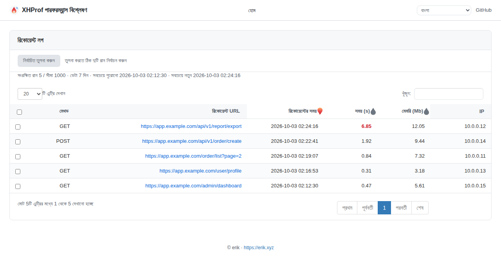
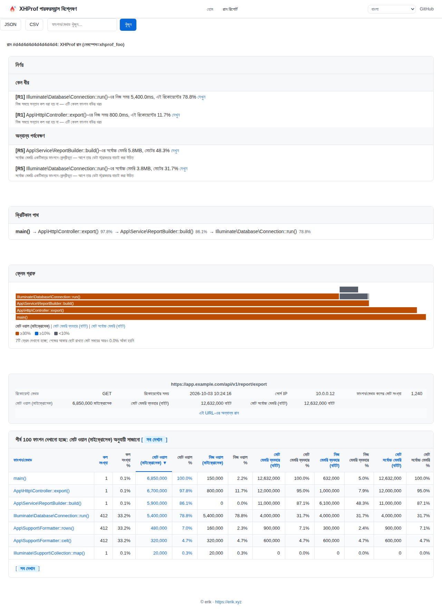
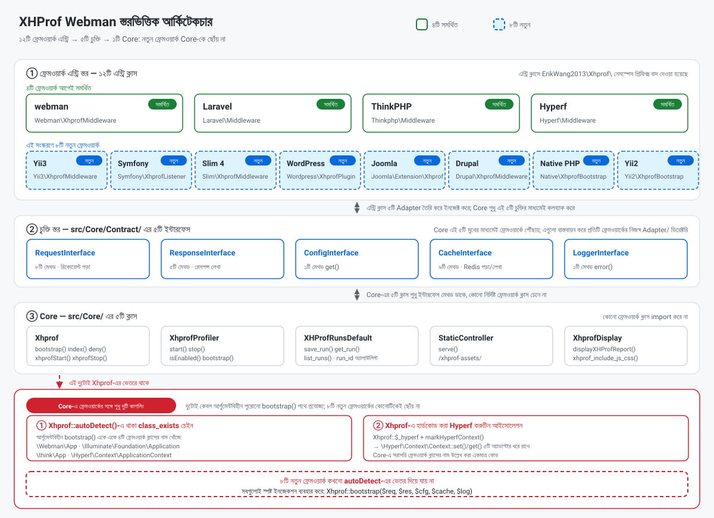
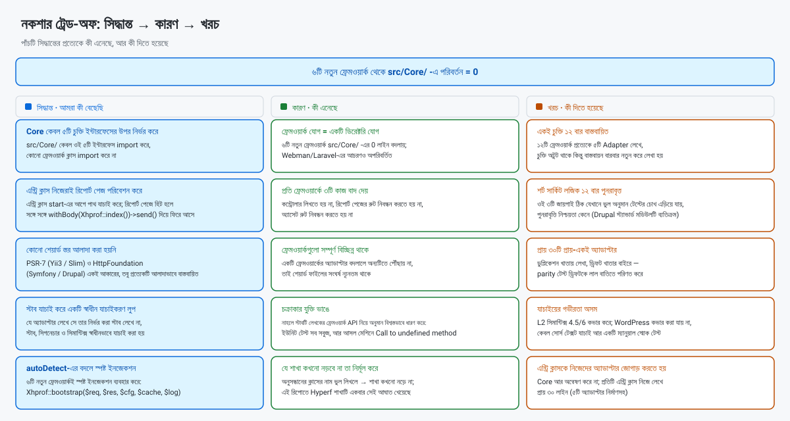
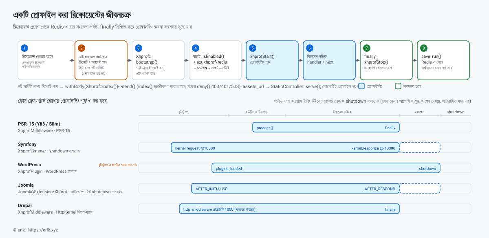

> **যন্ত্রানুবাদ।** এই নথিটি স্বয়ংক্রিয়ভাবে অনূদিত হয়েছে এবং কোনো মাতৃভাষী দ্বারা পুনরালোচিত হয়নি। নির্ভরযোগ্য তথ্যের জন্য [ইংরেজি সংস্করণ](../en/README.md) দেখুন।

[中文](../../../README.md) · [English](../en/README.md) · [한국어](../ko/README.md) · [Русский](../ru/README.md) · [Deutsch](../de/README.md) · [Français](../fr/README.md) · [Español](../es/README.md) · [Português](../pt/README.md) · [العربية](../ar/README.md) · [हिन्दी](../hi/README.md) · **বাংলা** · [Bahasa Indonesia](../id/README.md) · [日本語](../ja/README.md)

# XHProf পারফরম্যান্স প্রোফাইলার

   

webman / Laravel / ThinkPHP / Hyperf / Yii2 / Yii3 / Symfony / Slim 4 / WordPress / Joomla / Drupal ও খাঁটি PHP (ফ্রেমওয়ার্ক ছাড়া)-এর সঙ্গে সামঞ্জস্যপূর্ণ একটি কোড পারফরম্যান্স প্রোফাইলিং প্লাগইন।

xhprof এক্সটেনশনের মাধ্যমে প্রোফাইলিং ডেটা সংগ্রহ করে Redis-এ সংরক্ষণ করে। ডেভেলপাররা ব্রাউজার দিয়ে দ্রুত পারফরম্যান্স বিশ্লেষণ রিপোর্ট দেখে কোডের পারফরম্যান্স বটলনেক চিহ্নিত করতে পারেন।


একই ছোট শিখাটিই রিপোর্ট পেজের সাইট আইকন, উপরের-বাম কোণের ব্র্যান্ড আইকন ও টেবিলের সর্ট আইকন (`src/html/pet.svg`, `src/html/images/sort_*.svg`, `assets_url` উপসর্গে পরিবেশিত)।

**রিকোয়েস্ট লগ**



**একক রানের রিপোর্ট**



**দুইটি রানের তুলনা** — রিকোয়েস্ট লগ তালিকায় ঠিক দুটি সারি টিক দিন (প্রতিটি সারিতে একটি চেকবক্স, হেডারে "সব নির্বাচন করুন"), তারপর "নির্বাচিত তুলনা করুন"-এ ক্লিক করে diff ভিউ খুলুন। দুই পক্ষ সময় অনুসারে সাজানো (run1 = আগের রান, run2 = পরের রান, তালিকার বর্তমান ক্রম নির্বিশেষে); রঙের অর্থ "run1 থেকে run2"-এর উন্নতি / রিগ্রেশন, আর পেজের ভিতরের "ডিফ রিপোর্ট উল্টান" লিংক যেকোনো সময় দুই পক্ষ বদলে দিতে পারে।

**যন্ত্রের জন্য এক্সপোর্ট** — রিপোর্ট পেজের অ্যাকশন বার JSON / CSV এক্সপোর্ট দেয় (একক রান, তুলনা ও সমষ্টিগত — তিন ধরনের ভিউতেই পাওয়া যায়); `run` প্যারামিটার ছাড়া `?format=json` ফেরত দেয় **রান তালিকার JSON** (প্রতিটি এন্ট্রিতে run_id, রিকোয়েস্ট মেটাডেটা ও তালিকা-পরিসরের হেডার-পরিসংখ্যান থাকে), তাই মনিটরিং স্ক্রিপ্ট / ড্যাশবোর্ড HTML পার্স না করেই run_id নিতে পারে। `symbol=` বহন করা এক্সপোর্ট রিকোয়েস্ট 400 ফেরত দেয় — এক্সপোর্টে একক-ফাংশন ভিউ নেই, আর চুপচাপ পুরো সমতল টেবিল ফেরত দেওয়া ত্রুটি জানানোর চেয়েও খারাপ।

## প্রয়োজনীয়তা

- PHP >= 8.0
- xhprof এক্সটেনশন
- redis এক্সটেনশন
- Redis সার্ভার

## সামঞ্জস্যপূর্ণ ফ্রেমওয়ার্ক ও ন্যূনতম সংস্করণ

| ফ্রেমওয়ার্ক | ন্যূনতম সংস্করণ | ন্যূনতম PHP | এন্ট্রি ক্লাস | মাউন্ট করার নিয়ম |
|-----------|----------------|-------------|-------------|--------------|
| webman | `workerman/webman ^2.1` | 8.0 | `Webman\XhprofMiddleware` | `config/middleware.php`-এ গ্লোবাল মিডলওয়্যার নিবন্ধন করুন |
| Laravel | `laravel/framework ^9.0\|^10.0\|^11.0\|^12.0\|^13.0` | 8.0 | `Laravel\Middleware` | 11+ -এ `bootstrap/app.php`-এর `->withMiddleware()` দিয়ে যোগ করুন; 10 ও তার নিচে `app/Http/Kernel.php`-এ গ্লোবাল মিডলওয়্যার নিবন্ধন করুন |
| ThinkPHP | `topthink/framework ^6.0\|^8.0` | 8.0 | `Thinkphp\Middleware` | `app/middleware.php`-এ গ্লোবাল মিডলওয়্যার নিবন্ধন করুন |
| Hyperf | `hyperf/framework ^3.0` | 8.0 | `Hyperf\Middleware` | ConfigProvider-এর মাধ্যমে স্বয়ংক্রিয়ভাবে নিবন্ধিত |
| Yii3 | `yiisoft/middleware-dispatcher ^5.0` | 8.1 | `Yii3\XhprofMiddleware` | `config/web/di/application.php`-এ নিবন্ধন করুন; মিডলওয়্যার তালিকায় অবশ্যই প্রথমে থাকতে হবে |
| Symfony | `symfony/http-kernel ^6.4\|^7.0\|^8.0` | 8.1 (6.4) / 8.2 (7.x) / 8.4 (8.x) | `Symfony\XhprofListener` | `config/services.yaml`-এ `kernel.event_subscriber` ট্যাগ যোগ করুন |
| Slim 4 | `slim/slim ^4.12` | 8.0 | `Slim\XhprofMiddleware` | `$app->add(...)`, অবশ্যই সবার শেষে যোগ করতে হবে |
| WordPress | 6.4+ | 8.0 | `Wordpress\XhprofPlugin` | `wp-content/mu-plugins/`-এ কপি করুন |
| Joomla | 4.4 / 5.x | 8.1 | `Joomla\Extension\Xhprof` | `plugins/system/`-এ কপি করুন, Discover দিয়ে ইনস্টল করুন |
| Drupal | 10.x / 11.x | 8.1 (10.x) / 8.3 (11.x) | `xhprof` মডিউল (`Drupal\XhprofMiddleware`) | স্ট্যান্ডার্ড মডিউল, শুধু চালু করুন |
| খাঁটি PHP (ফ্রেমওয়ার্ক ছাড়া) | — (কোনো বাইরের প্যাকেজ নেই) | 8.0 | `Native\XhprofBootstrap` | এন্ট্রি ফাইলের উপরে এক লাইন `XhprofBootstrap::start()`, কোনো কন্ট্রোলার বা রুট নিবন্ধন ছাড়াই |
| Yii2 | `yiisoft/yii2 ^2.0` | 8.0 | `Yii2\XhprofBootstrap` | `config/web.php`-এর `bootstrap` অ্যারেতে নিবন্ধন করুন, কোনো কন্ট্রোলার বা রুট নিবন্ধন ছাড়াই |

সব এন্ট্রি ক্লাসই `ErikWang2013\Xhprof\` নেমস্পেস প্রিফিক্সের অধীনে থাকে (উপরে বাদ দেওয়া হয়েছে)।  বারোটির কোনোটিতেই আপনাকে কন্ট্রোলার বা রুট নিবন্ধন করতে হবে না: রিপোর্ট পেজ ও স্ট্যাটিক অ্যাসেট এন্ট্রি ক্লাস নিজেই পরিবেশন করে (Drupal-এর ক্ষেত্রে মডিউল রুট)।

এই প্যাকেজটি `php >= 8.0` ঘোষণা করে, কিন্তু Yii3 যে `yiisoft/*` কম্পোনেন্টগুলোর উপর নির্ভর করে সেগুলোর জন্য **PHP 8.1+** দরকার, তাই **PHP 8.0-তে Yii3 ব্যবহার করা যায় না**; একইভাবে Symfony 7.x ও Drupal 11.x-এরও বেশি PHP সংস্করণ লাগে। ধাপে ধাপে সেটআপ নিচের "ফ্রেমওয়ার্ক কনফিগারেশন"-এ আছে।

## ইনস্টলেশন

PECL থেকে xhprof এক্সটেনশন ইনস্টল করুন (PHP 8-এ বর্তমানে 2.3.x):

```sh
pecl install xhprof
```

php.ini-তে xhprof কনফিগারেশন যোগ করুন:

```ini
[xhprof]
extension=xhprof.so
xhprof.output_dir=/tmp/xhprof
```

Composer দিয়ে ইনস্টল করুন:

```sh
composer require aaron-dev/xhprof-webman
```

### দ্রুত শুরু

তিন ধাপে সবচেয়ে ছোট পথ:

1. **এক্সটেনশন ইনস্টল করুন** — `pecl install xhprof`, তারপর php.ini-তে একটি `[xhprof]` সেকশন যোগ করুন (`extension=xhprof.so`, `xhprof.output_dir=/tmp/xhprof`)।
2. **Redis চালু করুন** — `redis-server --daemonize yes`; অথবা আপনার আগে থেকেই থাকা ইনস্ট্যান্সটি ব্যবহার করুন (সংযোগের প্যারামিটারগুলো প্রতিটি ফ্রেমওয়ার্কের `config/xhprof.php`-এর `redis` সাব-অ্যারেতে থাকে)।
3. **সংযুক্ত করুন ও রিপোর্ট পেজ খুলুন** — `composer require aaron-dev/xhprof-webman`, তারপর "ফ্রেমওয়ার্ক কনফিগারেশন" অনুসারে যেকোনো একটি ফ্রেমওয়ার্কে এন্ট্রি ক্লাসটি মাউন্ট করুন; এরপর একটি ব্যবসায়িক রিকোয়েস্ট চালিয়ে `http://<আপনার সাইট>/xhprof` খুলুন।

> **পরিবেশ ইনস্টল করতে চান না?** `demo/`-এ আছে একটি রেডি-টু-রান docker compose ডেমো (খাঁটি PHP এন্ট্রি, কোনো ফ্রেমওয়ার্ক ছাড়া): `cd demo && docker compose up -d`, তারপর `http://127.0.0.1:8080/xhprof` খুললেই একটি সত্যিকারের রিপোর্ট পেজ দেখা যাবে; বিস্তারিত রয়েছে `demo/README.md`-এ।

### সমস্যা সমাধান

| উপসর্গ | প্রথমে কী দেখবেন |
|---------|-------------|
| রিপোর্ট পেজ ফাঁকা, তালিকায় কোনো রেকর্ড নেই | `enable` কি `true`; `sample_rate` কি `0` করে ফেলা হয়েছে (তাহলে কেবল `X-Xhprof-Token` হেডারসহ রিকোয়েস্টই স্যাম্পল হয়); Redis-এ `<key_prefix>:run_id` কি খালি |
| রিপোর্ট পেজ 403 / 401 ফেরত দেয় | 403: `ip_allowlist` বর্তমান IP আটকে দিচ্ছে (বা রিকোয়েস্টের IP ফরওয়ার্ডিং হেডার থেকে এসেছে অথচ `trusted_proxies` খালি), অথবা `auth_token` কনফিগার করা আছে কিন্তু URL-এ `?token=` নেই; ব্রাউজারে ক্রেডেনশিয়ালের প্রম্পট নিয়ে 401: `auth_basic` কনফিগার করা আছে আর দেওয়া ইউজারনেম/পাসওয়ার্ড কনফিগের সঙ্গে মেলে না |
| Redis-এ সংযোগ নিয়ে ত্রুটি | `redis` এক্সটেনশন ইনস্টল আছে কি (`php -m`-এর আউটপুটে `redis` আছে), Redis চলছে কি, `redis` সাব-অ্যারের host / port / password / database ইনস্ট্যান্সের সঙ্গে মেলে কি |
| এক্সটেনশন ইনস্টল হয়েছে, কিন্তু ব্যবসায়িক রিকোয়েস্ট সংরক্ষিত হয় না | এন্ট্রি ক্লাসটি সত্যিই মাউন্ট করা হয়েছে কি ("ফ্রেমওয়ার্ক কনফিগারেশন" দেখুন); রিকোয়েস্টের পাথ কি `ignore_url_arr`-এ পড়ে; `max_runs_per_minute` কি সীমায় পৌঁছে গেছে (সীমা ছাড়ালে পরের মিনিট পর্যন্ত কিছুই স্যাম্পল হয় না) |
| রিপোর্ট পেজ খোলে, কিন্তু CSS/JS 404 দেয় | `assets_url` প্রিফিক্সটি ডিপ্লয় করা পাথের সঙ্গে মেলে কি; রিভার্স প্রক্সি সেই প্রিফিক্সটিও অ্যাপ্লিকেশন পর্যন্ত ফরওয়ার্ড করে কি |

---

## ফ্রেমওয়ার্ক কনফিগারেশন

### Webman

**১. গ্লোবাল মিডলওয়্যার নিবন্ধন করুন** — `config/middleware.php`:

```php
return [
    '' => [
        ErikWang2013\Xhprof\Webman\XhprofMiddleware::class,
    ],
];
```

**২. রিপোর্ট পেজ ও স্ট্যাটিক অ্যাসেট** — **কোনো কন্ট্রোলার বা রুট নিবন্ধন লাগে না**: প্রোফাইলিং শুরুর আগে মিডলওয়্যার রিকোয়েস্ট পাথ পরীক্ষা করে: রিপোর্ট পাথ `/xhprof`-এ মিললে সঙ্গে সঙ্গে রিপোর্ট পেজ ফেরত দেয়, আর অ্যাসেট পাথ (প্রিফিক্স `assets_url` অপশন থেকে পড়া হয়, ডিফল্ট `/xhprof-assets`) -এ মিললে সোজা স্ট্যাটিক অ্যাসেট ফেরত দেয়।

**৩. কনফিগারেশন** — `config/plugin/aaron-dev/xhprof/xhprof.php` দেখুন।

---

### Laravel

**১. মিডলওয়্যার নিবন্ধন করুন** — Laravel 11 ও তার উপরে (slim skeleton-এ আর `app/Http/Kernel.php` নেই) `bootstrap/app.php`-এ:

```php
->withMiddleware(function (Middleware $middleware) {
    $middleware->append(\ErikWang2013\Xhprof\Laravel\Middleware::class);
})
```

Laravel 10 ও তার নিচে আপনি এখনও `app/Http/Kernel.php`-এর `protected $middleware` অ্যারেতে `\ErikWang2013\Xhprof\Laravel\Middleware::class` যোগ করবেন।

**২. রিপোর্ট পেজ ও স্ট্যাটিক অ্যাসেট** — **কোনো কন্ট্রোলার বা রুট নিবন্ধন লাগে না**: প্রোফাইলিং শুরুর আগে মিডলওয়্যার রিকোয়েস্ট পাথ পরীক্ষা করে: রিপোর্ট পাথ `/xhprof`-এ মিললে সঙ্গে সঙ্গে রিপোর্ট পেজ ফেরত দেয়, আর অ্যাসেট পাথ (প্রিফিক্স `assets_url` অপশন থেকে পড়া হয়, ডিফল্ট `/xhprof-assets`) -এ মিললে সোজা স্ট্যাটিক অ্যাসেট ফেরত দেয়।

**৩. কনফিগ প্রকাশ করুন**:

```sh
php artisan vendor:publish --tag=xhprof-config
```

কনফিগ ফাইল `config/xhprof.php`-এ থাকবে। Laravel ServiceProvider-এর স্বয়ংক্রিয় আবিষ্কার সমর্থন করে।

**৪. CLI ও কিউ** (দরকার হলে আগে `sample_cli` চালু করুন; ডিফল্টে বন্ধ) — HTTP রিকোয়েস্ট ছাড়া দুই ধরনের এন্ট্রিই স্যাম্পলিং উইন্ডোর ভিতরে চলে:

- **কিউ worker**: `AppServiceProvider::boot()`-এ চারটি ইভেন্ট প্যাকেজের লিসেনারের সঙ্গে যুক্ত করুন — প্রতি মেসেজে একটি করে উইন্ডো, তাই দীর্ঘকাল চলা worker-ও বাদ পড়ে না:

```php
use ErikWang2013\Xhprof\Laravel\XhprofQueueListener;
use Illuminate\Queue\Events\{JobProcessing, JobProcessed, JobFailed, JobExceptionOccurred};

Event::listen(JobProcessing::class, [XhprofQueueListener::class, 'onJobProcessing']);
Event::listen(JobProcessed::class, [XhprofQueueListener::class, 'onJobProcessed']);
Event::listen(JobFailed::class, [XhprofQueueListener::class, 'onJobFailed']);
Event::listen(JobExceptionOccurred::class, [XhprofQueueListener::class, 'onJobExceptionOccurred']);
```

- **artisan কমান্ড**: `xhprof:profile` প্যাকেজের সঙ্গেই স্বয়ংক্রিয়ভাবে নিবন্ধিত হয় (Laravel ServiceProvider স্বয়ংক্রিয়ভাবে আবিষ্কার করে) — সরাসরি ব্যবহার করুন:

```sh
php artisan xhprof:profile "migrate --force"
```

- **কাস্টম স্ক্রিপ্ট / শিডিউল করা টাস্ক**: artisan-বহির্ভূত এন্ট্রির জন্য (নিজের লেখা PHP স্ক্রিপ্ট, ক্লোজার টাস্ক) টাস্ক-বডির বাইরে একটি স্তর মুড়ে দিন:

```php
\ErikWang2013\Xhprof\Laravel\XhprofCli::start();
try { /* your logic */ } finally { \ErikWang2013\Xhprof\Laravel\XhprofCli::stop(); }
```

উইন্ডো প্রতি টাস্কে খোলে ও বন্ধ হয় (সিঙ্ক্রোনাসভাবে ডিসপ্যাচ করা চাইল্ড জব নেস্ট হলে কেবল সবচেয়ে বাইরের টাস্কটিই রেকর্ড হয়), আর সংরক্ষিত রানের `request_uri` লেখা হয় `cli:<স্ক্রিপ্টের নাম>` হিসেবে।

---

### ThinkPHP

**১. মিডলওয়্যার নিবন্ধন করুন** — `app/middleware.php`:

```php
return [
    \ErikWang2013\Xhprof\Thinkphp\Middleware::class,
];
```

**২. রিপোর্ট পেজ ও স্ট্যাটিক অ্যাসেট** — **কোনো কন্ট্রোলার বা রুট নিবন্ধন লাগে না**: প্রোফাইলিং শুরুর আগে মিডলওয়্যার রিকোয়েস্ট পাথ পরীক্ষা করে: রিপোর্ট পাথ `/xhprof`-এ মিললে সঙ্গে সঙ্গে রিপোর্ট পেজ ফেরত দেয়, আর অ্যাসেট পাথ (প্রিফিক্স `assets_url` অপশন থেকে পড়া হয়, ডিফল্ট `/xhprof-assets`) -এ মিললে সোজা স্ট্যাটিক অ্যাসেট ফেরত দেয়।

**৩. কনফিগারেশন** — `vendor/aaron-dev/xhprof-webman/src/Thinkphp/config/xhprof.php` প্রকল্পের `config/xhprof.php`-এ কপি করুন।

---

### Hyperf

**১. মিডলওয়্যারের স্বয়ংক্রিয় নিবন্ধন** — ConfigProvider স্বয়ংক্রিয়ভাবে HTTP মিডলওয়্যার কিউতে মিডলওয়্যার যোগ করে।

**২. রিপোর্ট পেজ ও স্ট্যাটিক অ্যাসেট** — **কোনো কন্ট্রোলার বা রুট নিবন্ধন লাগে না**: প্রোফাইলিং শুরুর আগে মিডলওয়্যার রিকোয়েস্ট পাথ পরীক্ষা করে: রিপোর্ট পাথ `/xhprof`-এ মিললে সঙ্গে সঙ্গে রিপোর্ট পেজ ফেরত দেয়, আর অ্যাসেট পাথ (প্রিফিক্স `assets_url` অপশন থেকে পড়া হয়, ডিফল্ট `/xhprof-assets`) -এ মিললে সোজা স্ট্যাটিক অ্যাসেট ফেরত দেয়।

**৩. কনফিগ প্রকাশ করুন**:

```sh
php bin/hyperf.php vendor:publish aaron-dev/xhprof-webman
```

কনফিগ আউটপুট `config/autoload/xhprof.php`-এ থাকবে।

---

### Yii3

**১. মিডলওয়্যার নিবন্ধন করুন** — `config/web/di/application.php`:

```php
use ErikWang2013\Xhprof\Yii3\XhprofMiddleware;
use Yiisoft\Middleware\Dispatcher\MiddlewareDispatcher;

return [
    MiddlewareDispatcher::class => [
        'class' => MiddlewareDispatcher::class,
        // the first element is the outermost middleware (runs first, finishes last)
        'withMiddlewares()' => [[
            XhprofMiddleware::class,
            // ... other middlewares
        ]],
    ],
];
```

সহজে করা দুটি ভুল (দুটোই মাপা হয়েছে):

- **লিখবেন না** `'__construct()' => ['middlewares' => [...]]`: `MiddlewareDispatcher::__construct()` কেবল একটি `MiddlewareFactory` আর ঐচ্ছিক একটি `EventDispatcherInterface` নেয় — কোনো `middlewares` প্যারামিটার **নেই**। মিডলওয়্যারের তালিকা কেবল **ইনস্ট্যান্স মেথড** `withMiddlewares()` দিয়েই ইনজেক্ট করা যায়।
- `withMiddlewares()`-এ একটি ইনস্ট্যান্স (`new XhprofMiddleware(...)`) **রাখবেন না**: ডেফিনিশন কেবল class-string, অ্যারে ডেফিনিশন বা callable গ্রহণ করে। ইনস্ট্যান্স দিলে নিবন্ধন কিছুই জানায় না আর `dispatch()` একটি `TypeError` ছোড়ে (`MiddlewareFactory::create()`-এর টাইপ `callable|array|string`)।

**২. রিপোর্ট পেজ ও স্ট্যাটিক অ্যাসেট** — **কোনো কন্ট্রোলার বা রুট নিবন্ধন লাগে না**: `XhprofMiddleware` একটি PSR-15 মিডলওয়্যার। প্রোফাইলিং শুরু হওয়ার আগে এটি রিকোয়েস্ট পাথ পরীক্ষা করে: রিপোর্ট পাথ `/xhprof`-এ হিট হলে সঙ্গে সঙ্গে রিপোর্ট পেজ ফেরত দেয়, আর অ্যাসেট পাথ (ডিফল্ট প্রিফিক্স `/xhprof-assets`) -এ হিট হলে সরাসরি স্ট্যাটিক অ্যাসেট ফেরত দেয়। রিপোর্ট পেজের রেসপন্সটি এন্ট্রি ক্লাস থেকে স্পষ্ট `Content-Type: text/html; charset=UTF-8` বহন করে: PSR-7 রেসপন্সে কোনো ডিফল্ট থাকে না এবং Yii3-এর রেসপন্স সেন্ডারও যোগ করে না, তাই এটি না দিলে ব্রাউজার HTML রিপোর্টটিকে সাধারণ টেক্সট হিসেবে দেখায়।

**৩. কনফিগারেশন** — ডিফল্টগুলো প্যাকেজের `src/Yii3/config/xhprof.php`-এ আছে; ফিল্ডগুলোর জন্য "কনফিগারেশন রেফারেন্স" দেখুন। ওভাররাইড করতে DI দিয়ে `$config` ইনজেক্ট করুন:

```php
XhprofMiddleware::class => [
    'class' => XhprofMiddleware::class,
    '__construct()' => [
        'config' => [
            'enable' => true,
            'auth_token' => 'your-token',
            'redis' => [
                'host' => '127.0.0.1',
                'port' => 6379,
                'password' => '',
                'database' => 0,
                'timeout' => 1.0,
            ],
        ],
    ],
],
```

`redis` সাব-অ্যারে Yii3-নির্দিষ্ট: কোনো `CacheInterface` ইনজেক্ট না করা হলে মিডলওয়্যার এটি দিয়ে সরাসরি phpredis-এর সঙ্গে কথা বলে। `assets_url` যেকোনো প্রিফিক্স হতে পারে: রিপোর্ট পেজের CSS/JS লিংক আর `StaticController` একই অপশন পড়ে (ডিফল্ট `/xhprof-assets`)। সাবডিরেক্টরিতে ডিপ্লয় করলে যে সীমাবদ্ধতাগুলো থাকে তা [যাচাইকরণ ও জ্ঞাত সীমাবদ্ধতা](#যাচাইকরণ-ও-জ্ঞাত-সীমাবদ্ধতা)-এ আছে।

**৪. সংস্করণ প্রয়োজনীয়তা** — Yii3 যে `yiisoft/*` কম্পোনেন্টগুলোর উপর নির্ভর করে সেগুলোর জন্য PHP >= 8.1 দরকার। এই প্যাকেজ `php >= 8.0` ঘোষণা করলেও PHP 8.0-তে Yii3 ইন্টিগ্রেশন ব্যবহার করা যায় না।

---

### Symfony

**১. ইভেন্ট সাবস্ক্রাইবার নিবন্ধন করুন** — `config/services.yaml`:

```yaml
services:
    ErikWang2013\Xhprof\Symfony\XhprofListener:
        tags:
            - { name: kernel.event_subscriber }
```

**২. রিপোর্ট পেজ ও স্ট্যাটিক অ্যাসেট** — **কোনো কন্ট্রোলার বা রুট নিবন্ধন লাগে না**: প্রোফাইলিং শুরু হওয়ার আগে লিসেনার রিকোয়েস্ট পাথ পরীক্ষা করে: রিপোর্ট পাথ `/xhprof`-এ হিট হলে সঙ্গে সঙ্গে রিপোর্ট পেজ ফেরত দেয়, আর অ্যাসেট পাথ (ডিফল্ট প্রিফিক্স `/xhprof-assets`) -এ হিট হলে সরাসরি স্ট্যাটিক অ্যাসেট ফেরত দেয়।

**৩. কনফিগারেশন** — ডিফল্টগুলো প্যাকেজের `src/Symfony/config/xhprof.php`-এ আছে; ফিল্ডগুলোর জন্য "কনফিগারেশন রেফারেন্স" দেখুন।

**৪. সাব-রিকোয়েস্ট ও এক্সেপশন ফলব্যাক** — এটি `kernel.request` (প্রায়োরিটি 10000) ও `kernel.response` (প্রায়োরিটি -10000) শোনে। `isMainRequest()` ESI/ফ্র্যাগমেন্ট সাব-রিকোয়েস্ট বাদ দেয়, নাহলে সেগুলো প্রোফাইলিং খুব আগেই বন্ধ করে দিত; রিকোয়েস্ট শুরু হলে একটি আইডেম্পোটেন্ট `register_shutdown_function`-ও নিবন্ধিত হয় — HttpKernel যদি এক্সেপশন আবার ছোড়ে, `kernel.response` কখনো চলে না, আর সেই ফলব্যাক না থাকলে প্রোফাইলিং অবস্থা পরের রিকোয়েস্টে গড়িয়ে পড়ত।

---

### Slim 4

**১. মিডলওয়্যার নিবন্ধন করুন** — `public/index.php`:

```php
use ErikWang2013\Xhprof\Slim\XhprofMiddleware;

$app->addRoutingMiddleware();

// must be added last: Slim's middleware stack is LIFO, added later = further out = runs first
$app->add(new XhprofMiddleware(
    $app->getResponseFactory()
));
```

বাকি তিনটি কনস্ট্রাক্টর আর্গুমেন্টই ঐচ্ছিক; বাদ দিলে প্যাকেজের ডিফল্ট ব্যবহৃত হয়:

- আর্গুমেন্ট ২, `array $config`: আপনার কনফিগ অ্যারে, যা `array_replace` দিয়ে প্যাকেজের `src/Slim/config/xhprof.php`-এর উপরে মার্জ হয় (সম্পূর্ণ-মান প্রতিস্থাপন — `ignore_url_arr`-এর মতো লিস্ট কী কখনো পুনরাবৃত্তভাবে মার্জ হয় না)।
- আর্গুমেন্ট ৩, `CacheInterface $cache`: বাদ দিলে এটি অলসভাবে `new \Redis()` করে (কনস্ট্রাক্টর সচেতনভাবেই ext-redis স্পর্শ করে না, তাই অ্যাডাপ্টার তৈরি হওয়ার সময় এক্সটেনশন না থাকলেও বিস্ফোরণ ঘটে না)। নিজের কানেকশন ইনজেক্ট করতে `new \ErikWang2013\Xhprof\Slim\Adapter\RedisAdapter($redis)` পাঠান, বা `ErikWang2013\Xhprof\Core\Contract\CacheInterface` বাস্তবায়ন করে এমন যেকোনো অবজেক্ট।
- আর্গুমেন্ট ৪, `LoggerInterface $logger`: বাদ দিলে এটি `new \ErikWang2013\Xhprof\Slim\Adapter\LogAdapter()` এবং **লগ নীরবে ফেলে দেওয়া হয়** (Slim কোনো PSR-3 লগার দেয় না)। লগ রাখতে `new LogAdapter($psrLogger)` পাঠান, যেখানে `$psrLogger` আপনার কাছে থাকা একটি PSR-3 লগার।

**`$app->add(XhprofMiddleware::class)` লিখবেন না**: Slim-এর `CallableResolver` ওই class string-কে `new XhprofMiddleware($container)`-এ পরিণত করে — কেবল কন্টেইনার পাস করে, আর রেজল্যুশন রিকোয়েস্টের সময় পর্যন্ত পিছিয়ে দেয়। ফলে `add()` কিছুই জানায় না আর প্রথম রিকোয়েস্টেই একটি `TypeError` ছোড়ে — সবচেয়ে কঠিন ব্যর্থতার ধরন। সবসময় উপরের স্পষ্ট `new` ব্যবহার করুন।

**২. রিপোর্ট পেজ ও স্ট্যাটিক অ্যাসেট** — **কোনো কন্ট্রোলার বা রুট নিবন্ধন লাগে না**: প্রোফাইলিং শুরু হওয়ার আগে মিডলওয়্যার রিকোয়েস্ট পাথ পরীক্ষা করে: রিপোর্ট পাথ `/xhprof`-এ হিট হলে সঙ্গে সঙ্গে রিপোর্ট পেজ ফেরত দেয়, আর অ্যাসেট পাথ (ডিফল্ট প্রিফিক্স `/xhprof-assets`) -এ হিট হলে সরাসরি স্ট্যাটিক অ্যাসেট ফেরত দেয়।

**৩. কনফিগারেশন** — ডিফল্টগুলো প্যাকেজের `src/Slim/config/xhprof.php`-এ আছে; ফিল্ডগুলোর জন্য "কনফিগারেশন রেফারেন্স" দেখুন।

**৪. মাউন্ট করার ক্রম** — Slim-এর মিডলওয়্যার স্ট্যাক LIFO (দুটি মিডলওয়্যার দিয়ে মাপা, কার্যক্রমের ক্রম `B:before → A:before → A:after → B:after`): যত পরে `add()` করবেন, তত বাইরে থাকবে আর তত আগে চলবে। তাই xhprof অবশ্যই **সবার শেষে** এবং **`addRoutingMiddleware()`-এর পরে** যোগ করতে হবে — নাহলে `/xhprof` রাউটিং টেবিলে থাকবে না, RoutingMiddleware আগেই `HttpNotFoundException` ছোড়ে, এবং রিকোয়েস্ট কখনো মিডলওয়্যারে পৌঁছায় না। রিপোর্ট পেজের রেসপন্সটি এন্ট্রি ক্লাস থেকে স্পষ্ট `Content-Type: text/html; charset=UTF-8` বহন করে: PSR-7 রেসপন্সে কোনো ডিফল্ট থাকে না এবং Slim-এর `ResponseEmitter`-ও যোগ করে না, তাই এটি না দিলে ব্রাউজার HTML রিপোর্টটিকে সাধারণ টেক্সট হিসেবে দেখায়।

---

### WordPress

**১. mu-plugin ইনস্টল করুন** — প্যাকেজ থেকে বুটস্ট্র্যাপ ফাইলটি `wp-content/mu-plugins/`-এ কপি করুন:

```sh
cp vendor/aaron-dev/xhprof-webman/wordpress/xhprof-webman.php wp-content/mu-plugins/
```

`wordpress/xhprof-webman.php` একটি প্লাগইন হেডার বহন করে এবং `Wordpress\XhprofPlugin` বুট করে। mu-plugin স্বয়ংক্রিয়ভাবে লোড হয় — wp-admin-এ চালু করার কিছু নেই।

**২. রিপোর্ট পেজ ও স্ট্যাটিক অ্যাসেট** — **কোনো কন্ট্রোলার বা রুট নিবন্ধন লাগে না**: প্রোফাইলিং শুরু হওয়ার আগে এন্ট্রি ক্লাস রিকোয়েস্ট পাথ পরীক্ষা করে: রিপোর্ট পাথ `/xhprof`-এ হিট হলে সঙ্গে সঙ্গে রিপোর্ট পেজ ফেরত দেয়, আর অ্যাসেট পাথ (ডিফল্ট প্রিফিক্স `/xhprof-assets`) -এ হিট হলে সরাসরি স্ট্যাটিক অ্যাসেট ফেরত দেয়।

**৩. কনফিগারেশন** — ডিফল্টগুলো প্যাকেজের `src/Wordpress/config/xhprof.php`-এ আছে; ফিল্ডগুলোর জন্য "কনফিগারেশন রেফারেন্স" দেখুন। `wp-cron.php` ও `admin-ajax.php`-এর মতো ঘন ঘন আসা পাথ বাদ দিতে `ignore_url_arr` ব্যবহার করুন।

কনফিগারেশন ওভাররাইড করতে (Redis ঠিকানা, `auth_token` ইত্যাদি) `wp-config.php`-এ একটি কনস্ট্যান্ট ডিফাইন করুন (mu-plugin যথেষ্ট পরে লোড হয়, তাই কনস্ট্যান্টটি ততক্ষণে প্রস্তুত থাকে):

```php
define('XHPROF_WEBMAN_CONFIG', [
    'auth_token' => 'your-token',
    'redis' => ['host' => '127.0.0.1', 'port' => 6379, 'password' => '', 'database' => 0],
]);
```

বিকল্পভাবে `xhprof_webman_config` ফিল্টারটি হুক করুন (থিম বা প্লাগইন থেকে): এটি কনস্ট্যান্টের উপরে প্রয়োগ হয়, আর ফেরত দেওয়া মান উপরের অ্যারের সঙ্গে একই আকারের।

**৪. প্রোফাইলিং উইন্ডোর একটি কাঠামোগত সীমা** — উইন্ডোটি `plugins_loaded` → `shutdown`, যাতে `wp-settings.php`-এর বুটস্ট্র্যাপ বা প্লাগইন লোডিং **অন্তর্ভুক্ত নয়**। এটি WordPress-এর একটি কাঠামোগত সীমা: ওই পর্যায়ের কাজ প্রোফাইল করা যায় না।

---

### Joomla

**১. প্লাগইন ইনস্টল করুন** — প্যাকেজের `joomla/` ডিরেক্টরিটি সাইটের `plugins/system/xhprof/`-এ কপি করুন:

```sh
cp -r vendor/aaron-dev/xhprof-webman/joomla/ plugins/system/xhprof/
```

প্যাকেজের `joomla/` ডিরেক্টরিটিই প্লাগইন: `xhprof.xml` ম্যানিফেস্ট, `services/provider.php`, আর `src/Extension/Xhprof.php`। এন্ট্রি ক্লাস `ErikWang2013\Xhprof\Joomla\Extension\Xhprof` (একটি `CMSPlugin`)। কপি করার পর "System → Manage → Extensions → Discover"-এ গিয়ে Discover চালান এবং ইনস্টল/চালু করুন।

**২. রিপোর্ট পেজ ও স্ট্যাটিক অ্যাসেট** — **কোনো কন্ট্রোলার বা রুট নিবন্ধন লাগে না**: প্রোফাইলিং শুরু হওয়ার আগে প্লাগইন রিকোয়েস্ট পাথ পরীক্ষা করে: রিপোর্ট পাথ `/xhprof`-এ হিট হলে সঙ্গে সঙ্গে রিপোর্ট পেজ ফেরত দেয়, আর অ্যাসেট পাথ (ডিফল্ট প্রিফিক্স `/xhprof-assets`) -এ হিট হলে সরাসরি স্ট্যাটিক অ্যাসেট ফেরত দেয়।

**৩. কনফিগারেশন** — ডিফল্টগুলো প্যাকেজের `src/Joomla/config/xhprof.php`-এ আছে; ফিল্ডগুলোর জন্য "কনফিগারেশন রেফারেন্স" দেখুন। **জ্ঞাত ট্রেড-অফ**: এটি প্লাগইন প্যারামিটারের বদলে প্যাকেজের কনফিগ ফাইল পড়ে — প্লাগইন প্যারামিটারের জন্য ডেটাবেস পড়া লাগে, আর কনফিগ প্রতিটি রিকোয়েস্টে পড়া হয়।

**৪. প্রোফাইলিংয়ের সীমানা** — উইন্ডোটি `ApplicationEvents::AFTER_INITIALISE` → `ApplicationEvents::AFTER_RESPOND`; `AFTER_INITIALISE`-এ একটি আইডেম্পোটেন্ট `register_shutdown_function`-ও নিবন্ধিত হয়, কারণ এক্সেপশনের পথে `AFTER_RESPOND`-এ পৌঁছানোর নিশ্চয়তা নেই — ফলব্যাক না থাকলে প্রোফাইলিং অবস্থা পরের রিকোয়েস্টে গড়িয়ে পড়ত।

---

### Drupal

**১. মডিউল চালু করুন** — প্যাকেজের `drupal/xhprof/` একটি স্ট্যান্ডার্ড Drupal মডিউল (`xhprof.info.yml` / `xhprof.routing.yml` / `xhprof.services.yml`)। এটি আপনার সাইটের `modules/custom/xhprof/`-এ রাখুন, তারপর "Extend" পেজে (বা `drush en xhprof` দিয়ে) চালু করুন।

**২. রিপোর্ট পেজ ও স্ট্যাটিক অ্যাসেট** — বারোটি ফ্রেমওয়ার্কের মধ্যে Drupal **একমাত্র যেটি মডিউল + রুট পথে চলে**: `xhprof.routing.yml` রিপোর্ট পাথ `/xhprof` ও অ্যাসেট পাথ `/xhprof-assets` নিবন্ধন করে, আর ডিফল্টভাবে মডিউল Controller সেগুলো পরিবেশন করে; বাকি এগারোটি এন্ট্রি ক্লাস প্রোফাইলিং শুরুর আগে নিজেরাই শর্ট-সার্কিট করে রিপোর্ট পেজ ও স্ট্যাটিক অ্যাসেট পরিবেশন করে, কোনো রুট নিবন্ধন ছাড়াই। **কাস্টম `assets_url` প্রিফিক্স হলে অ্যাসেট মিডলওয়্যার নিজে পরিবেশন করে**: মডিউলের অ্যাসেট রুটের path `xhprof.routing.yml`-এ লেখা (`/xhprof-assets/{file}`), তাই অন্য প্রিফিক্সে কখনও মেলে না।

**৩. কনফিগারেশন** — কনফিগারেশন মডিউল-স্তরের টাইপড কনফিগ: ডিফল্টগুলো `drupal/xhprof/config/install/xhprof.settings.yml`-এ, স্কিমা `drupal/xhprof/config/schema/xhprof.schema.yml`-এ। ফিল্ডগুলোর জন্য "কনফিগারেশন রেফারেন্স" দেখুন।

**৪. মিডলওয়্যার নিবন্ধন** — মডিউলের `xhprof.services.yml`-এ মিডলওয়্যার সার্ভিস নিবন্ধন করুন:

```yaml
services:
  xhprof.http_middleware:
    class: ErikWang2013\Xhprof\Drupal\XhprofMiddleware
    arguments: ['@config.factory', '@logger.factory']
    tags:
      - { name: http_middleware, priority: 1000 }
```

ভেতরের কার্নেলটি Drupal-এর `StackedKernelPass` **স্বয়ংক্রিয়ভাবে কনস্ট্রাক্টর আর্গুমেন্ট ০ হিসেবে প্রিপেন্ড করে** — **নিজে লিখবেন না**: লিখলে দুটি ভেতরের কার্নেল তৈরি হয়, যা Drupal <= 11.2.x (সব 10.x সহ) -এ কন্টেইনার কম্পাইলের সময় ব্যর্থ হয় আর 11.3.0 ও তার উপরে প্রতিটি রিকোয়েস্টে একটি TypeError ছোড়ে। প্রোফাইলিং `finally`-তে বন্ধ হয়।

**৫. টীকা**

- `priority: 1000` মিডলওয়্যারটিকে **পেজ ক্যাশের বাইরে** রাখে (core-এর বিদ্যমান সর্বোচ্চ প্রায়োরিটি negotiation: D10-এ 400, D11-এ 500, আর পেজ ক্যাশ 200), তাই **Drupal-এর পেজ ক্যাশ থেকে পরিবেশিত রিকোয়েস্টও প্রোফাইল করা হয়**। একটি প্রোফাইলিং টুলের জন্য এটিই কাঙ্ক্ষিত আচরণ, তবে ব্যবহারকারীর জানা উচিত।
- ক্যাশ বাক্সের বাইরে কাজ করে: মিডলওয়্যার ডিফল্টভাবে এই প্যাকেজের সঙ্গে আসা Redis অ্যাডাপ্টার ব্যবহার করে (প্যাকেজটি ext-redis-এর উপর হার্ড-নির্ভর), এবং `services.yml`-এর `arguments` দিয়ে ওভাররাইড করতে ঐচ্ছিক একটি `CacheInterface` আর্গুমেন্টও গ্রহণ করে। ক্যাশ অনুপলব্ধ হলে ব্যর্থ সংরক্ষণ `XhprofProfiler::stop()` একটি একক লগ লাইনে গিলে ফেলে — **কোনো ত্রুটি উত্থাপিত হয় না**।
- রিপোর্ট পেজ `/xhprof` ও `/xhprof-assets/*`-এ আসা রিকোয়েস্ট **প্রোফাইল করা হয় না**: মিডলওয়্যার `xhprofStart()`-এর আগে পাথ দিয়ে প্রোফাইলিং এড়িয়ে যায়। রেসপন্সটি তবুও `xhprof.routing.yml`-এর Controller তৈরি করে (**এটি শর্ট-সার্কিট নয়**)। তাই `ignore_url_arr` `[]` (কিছুই ফিল্টার না করা) হলেও এই দুটি রিকোয়েস্ট কখনো রিপোর্টে দেখা যায় না।

### খাঁটি PHP (ফ্রেমওয়ার্ক ছাড়া)

ফ্রেমওয়ার্কবিহীন, কেবল একটি ফ্রন্ট কন্ট্রোলার আছে এমন অ্যাপের জন্য (`public/index.php` ইত্যাদি)।

**১. এন্ট্রি ফাইলের একেবারে উপরে এক লাইন যোগ করুন**:

```php
\ErikWang2013\Xhprof\Native\XhprofBootstrap::start();
```

কনফিগ বদলাতে অ্যারেটি এই লাইনেই দিন (কী সেট অন্য এগারোটির সঙ্গে এক, ডিফল্ট মান `src/Native/config/xhprof.php`-এ):

```php
\ErikWang2013\Xhprof\Native\XhprofBootstrap::start([
    'enable' => true,
    'auth_token' => 'xxx',
]);
```

দ্বিতীয় ও তৃতীয় আর্গুমেন্ট ঐচ্ছিক ইনজেকশন পয়েন্ট: `CacheInterface $cache` ও `LoggerInterface $logger` (ডিফল্টভাবে এই প্যাকেজের Redis অ্যাডাপ্টার ও `error_log`)। ফেরত মান এই রিকোয়েস্টের এন্ট্রি ইনস্ট্যান্স (`stop()` আইডেম্পোটেন্ট); একই প্রসেসে আগেই থামাতে চাইলে সেটি ডাকুন।

**২. রিপোর্ট পেজ ও স্ট্যাটিক অ্যাসেট** — **কোনো কন্ট্রোলার বা রুট নিবন্ধন লাগে না**: প্রোফাইলিং শুরুর আগে এই লাইনটি রিকোয়েস্ট পাথ পরীক্ষা করে: রিপোর্ট পাথ `/xhprof`-এ মিললে সঙ্গে সঙ্গে রিপোর্ট পেজ ফেরত দেয় (`Content-Type: text/html; charset=UTF-8` ও `Cache-Control: no-cache, private` সহ, `auth_token` আগের মতোই কাজ করে), আর অ্যাসেট পাথ (প্রিফিক্স `assets_url` অপশন থেকে পড়া হয়, ডিফল্ট `/xhprof-assets`) -এ মিললে স্ট্যাটিক অ্যাসেট সরাসরি ফেরত দেয়। **খরচ স্পষ্ট করে বলা**: এই দুটি পাথ সামলানোর পরই `exit` — তাই ওই রিকোয়েস্টের বাকি অংশ (এই লাইনের পরের রুট, কনটেইনার বুটস্ট্র্যাপ, সেশন শুরু, এবং অ্যাপের নিজের নিবন্ধিত সমাপ্তি-লজিক) আর চলে না।

**৩. প্রোফাইলিং উইন্ডো = এই লাইন → প্রসেস shutdown** (`register_shutdown_function` নিবন্ধিত হয়)। **সীমাগুলো যেমন আছে তেমনই**: এই লাইনের **আগের** কোড (composer autoload, ফ্রন্ট কন্ট্রোলারের বুটস্ট্র্যাপ) এর মধ্যে পড়ে না, আর অন্য প্রসেস/এক্সটেনশনের কাজও (php-fpm-এ রিকোয়েস্ট পার্সিং, nginx-এর দিকের কাজ) পড়ে না। স্বাভাবিক সমাপ্তি, `exit`, এবং ধরা না-পড়া Error / এক্সেপশন — সবই শেষবিন্দুতে পৌঁছায়; `SIGKILL` / OOM killer পৌঁছায় না — প্রোফাইলিং অবস্থা প্রসেসের সঙ্গে হারিয়ে যায়, পরের রিকোয়েস্টের জন্য পড়ে থাকে না। পরিধি ছোট করতে `ignore_url_arr` অপশন (`uri()`-এ সাবস্ট্রিং মিল, কোড না বদলেই কাজ করে)।

**৪. `php -S` দিয়ে সত্যিকারের একবার চালান**:

```sh
# public/index.php-এর উপরে XhprofBootstrap::start() আছে, এবং এটিই ফ্রন্ট কন্ট্রোলার
php -S 127.0.0.1:8000 -t public public/index.php
```

`http://127.0.0.1:8000/`-এ গিয়ে ডেটা তৈরি করুন, তারপর `http://127.0.0.1:8000/xhprof`-এ রিপোর্ট পেজ দেখুন — দুটোই একই প্রসেসে, আর অ্যাসেটও সঙ্গে যাচাই হয়ে যায়।

---

### Yii2

Yii2-এর জন্য (`yiisoft/yii2 ^2.0`, PHP >= 8.0)। **এটি Yii3-এর মতো একই ফ্রেমওয়ার্ক নয়**: Yii3 হলো PSR-15 পুনর্লিখন, অথচ Yii2 তার নিজস্ব `yii\web\Request` / `Response` ও অ্যাপ্লিকেশন জীবনচক্র নিয়ে আসে, তাই এর জন্য আলাদা এন্ট্রি ক্লাস আছে।

**১. বুটস্ট্র্যাপ ক্লাস নিবন্ধন করুন** — `config/web.php`:

```php
'bootstrap' => [
    [
        'class' => \ErikWang2013\Xhprof\Yii2\XhprofBootstrap::class,
        'config' => ['auth_token' => 'xxx'],   // optional; see src/Yii2/config/xhprof.php
    ],
],
```

এটি Yii2-এর নিজস্ব এক্সটেনশন পয়েন্ট `yii\base\BootstrapInterface`-এর স্ট্যান্ডার্ড রূপ: অ্যারে ডেফিনিশনের `config` কী-টি কন্টেইনার এন্ট্রি ক্লাসে একটি **পাবলিক প্রপার্টি** হিসেবে অ্যাসাইন করে (`cache` / `logger`-ও একইভাবে ইনজেকশন পয়েন্ট — ডিফল্ট Redis অ্যাডাপ্টার বা `error_log` বদলাতে একটি ইনস্ট্যান্স পাস করুন)।

**২. রিপোর্ট পেজ ও স্ট্যাটিক অ্যাসেট** — **কোনো কন্ট্রোলার নয়, রুট নয়, urlManager বদলানোও নয়**: বুটস্ট্র্যাপ ক্লাস `Application::EVENT_BEFORE_REQUEST`-এ রিকোয়েস্ট পাথ পরীক্ষা করে, রিপোর্ট পাথ `/xhprof`-এ সোজা রিপোর্ট পেজ পরিবেশন করে রিকোয়েস্টটি শেষ করে দেয়, আর অ্যাসেট প্রিফিক্সে (`assets_url` অপশন থেকে পড়া হয়, ডিফল্ট `/xhprof-assets`) স্ট্যাটিক অ্যাসেট পরিবেশন করে। দুটি পাথই প্রোফাইলিং শুরুর আগে শর্ট-সার্কিট করে।

**৩. প্রোফাইলিং উইন্ডো = `EVENT_BEFORE_REQUEST` → `EVENT_AFTER_REQUEST`।** লক্ষ্য করুন, Yii2 `EVENT_AFTER_REQUEST` নিক্ষেপ করে রেসপন্স পাঠানোর **আগে** (`base/Application.php`-এর `run()`), তাই রেসপন্স পাঠানো উইন্ডোর ভিতরে পড়ে না। **এক্সেপশনের পথটি shutdown ফলব্যাকের উপর নির্ভর করে**: `run()` কেবল `ExitException` ধরে, তাই আপনার কোড থেকে অন্য যেকোনো throwable ছোড়া হলে `EVENT_AFTER_REQUEST` কখনো চলে না — তাই এন্ট্রি ক্লাসটি স্যাম্পলিং শুরু করার সময় একটি `register_shutdown_function` ফলব্যাক নিবন্ধন করে (Symfony / Joomla-র মতোই একই রূপ)।

**৪. কনসোল অ্যাপ্লিকেশন অপরিবর্তিত থাকে** — `yii\console\Application` `run()` ওভাররাইড করে না, তাই CLI কমান্ড (cron, migration, queue) **সত্যিই** `EVENT_BEFORE_REQUEST` নিক্ষেপ করে; এন্ট্রি ক্লাসটি প্রথমে `bootstrap()`-এ `instanceof yii\web\Application` যাচাই করে আর কনসোলের জন্য কোনো হুক লাগায় না।

**৫. ক্লায়েন্ট IP ফ্রেমওয়ার্কের নিজস্ব সিমান্টিক্স অনুসরণ করে** — `getRealIp()` কাজটি `Request::getUserIP()`-এর হাতে দেয়: ডিফল্টভাবে Yii2 `secureHeaders`-এর মাধ্যমে `X-Forwarded-For`-এর মতো ফরওয়ার্ডিং হেডার ছেঁকে ফেলে (এটিই তার নিরাপদ ডিফল্ট), তাই রিভার্স প্রক্সির পিছনে আপনি `REMOTE_ADDR` পান। আসল ক্লায়েন্ট IP লিপিবদ্ধ করতে অ্যাপ্লিকেশনের রিকোয়েস্ট কম্পোনেন্টে `trustedHosts` কনফিগার করুন (একবার কনফিগার করলে Yii2 ডান থেকে বাঁয়ে হেঁটে প্রথম অবিশ্বস্ত অ্যাড্রেসটি ফেরত দেয় — বাকি অ্যাডাপ্টারগুলো সবসময় প্রথম এন্ট্রিটিই নেয়, এটি সচেতনভাবেই তার থেকে আলাদা)। সেটি ফ্রেমওয়ার্কের নিজস্ব নিরাপত্তা-সিদ্ধান্ত; কোনও সাইট কাকে বিশ্বাস করবে তা এই প্যাকেজ ঠিক করে না।

**৬. কনফিগারেশন** — ডিফল্টগুলো `src/Yii2/config/xhprof.php`-এ আছে আর ১ নম্বর ধাপের `config` কী দিয়ে সেগুলো ওভাররাইড করা হয়; ঐচ্ছিক `redis` সাব-অ্যারে (কোনো `cache` ইনজেক্ট না থাকলে এটি দিয়ে সরাসরি phpredis-এ সংযোগ হয়) বাকি ফ্রেমওয়ার্কগুলোর মতোই একই কী নেয়: `host` / `port` / `password` / `database` / `timeout`।

---

## কনফিগারেশন রেফারেন্স

সব ফ্রেমওয়ার্ক এই কনফিগারেশন অপশনগুলো শেয়ার করে:

| কনফিগ | টাইপ | ডিফল্ট | বিবরণ |
|--------|------|---------|-------------|
| `enable` | bool | `true` | প্রোফাইলিং চালু/বন্ধ করুন |
| `sample_rate` | float | `1.0` | আনুপাতিক স্যাম্পলিং: প্রতিটি রিকোয়েস্ট এই সম্ভাবনায় রেকর্ড হয় (যেমন `0.05` = 5% রিকোয়েস্ট); `1.0` = সব স্যাম্পল হয়, `<=0` বা `false` = কিছুই স্যাম্পল হয় না |
| `trigger_token` | string\|null | `null` | অন-ডিমান্ড স্যাম্পলিং: সেট করা থাকলে `X-Xhprof-Token: <মান>` হেডারসহ যেকোনো রিকোয়েস্ট **নিশ্চিতভাবে স্যাম্পল হয়** (`sample_rate` উপেক্ষিত, `0` হলেও); `null` বা খালি = বন্ধ, হেডারটি সম্পূর্ণ উপেক্ষিত। শুধু রিকোয়েস্ট হেডারে চলে, **query-তে নয়**। এটি যেকোনো রিকোয়েস্ট জোর করে সম্পূর্ণ স্যাম্পল করতে পারে, তাই কী-টি যথেষ্ট লম্বা র্যান্ডম স্ট্রিং হোক এবং কেবল বিশ্বস্ত মানুষকে দেওয়া হোক |
| `auth_basic` | string\|null | `null` | HTTP Basic ক্রেডেনশিয়াল (`user:password`, প্রথম কোলনে ভাগ; পাসওয়ার্ডে কোলন থাকতে পারে)। `auth_token`-এর সঙ্গে সম্পর্ক **অথবা**-র: যেকোনোটি কনফিগার থাকলেই কার্যকর, যেকোনোটি পাস করলেই ঢুকে পড়া যায়; কোনোটিই কনফিগার না থাকলে = প্রমাণীকরণ নেই। **Apache+CGI/FastCGI ডিফল্টভাবে `Authorization` হেডার সরিয়ে ফেলে** (`CGIPassAuth On` লাগে, 2.4.13+); nginx+php-fpm এতে প্রভাবিত নয় |
| `ip_allowlist` | array | `[]` | রিপোর্ট পেজের IP অ্যালাউলিস্ট, মেলানো হয় **বাইট-প্রতি-বাইট**: CIDR রেঞ্জ নেই, IPv6 নরমালাইজেশন নেই (`2001:0db8::1` আর `2001:db8::1` দুটি আলাদা স্ট্রিং)। খালি = বন্ধ; অ্যারে না হলে সবকিছু প্রত্যাখ্যাত (fail closed, একটি error লগ এন্ট্রি)। মানটি আসে `getRealIp()` থেকে, আর `trusted_proxies`-এর সঙ্গে একসঙ্গে পড়তে হবে |
| `trusted_proxies` | array | `[]` | **ডিপ্লয়মেন্ট-ঘোষণা, প্রযুক্তিগত বলবৎকরণ নয়**: "আমার সামনে একটি বিশ্বস্ত প্রক্সি আছে" ঘোষণা করার পরেই `ip_allowlist` `X-Forwarded-For`/`X-Real-IP` থেকে নেওয়া ক্লায়েন্ট IP গ্রহণ করে। বেশিরভাগ অ্যাডাপ্টার ফরওয়ার্ডিং হেডার **শর্তহীনভাবে** নেয় — এটি ঘোষণা করেও জাল XFF আটকায় না, তাই কেবল নিজের নিয়ন্ত্রণাধীন প্রক্সির পেছনে নিরাপদ |
| `webhook_url` | string\|null | `null` | একটি ধীর রান (`wt >= view_wtred`) সংরক্ষিত হওয়ার পর এই ঠিকানায় JSON POST করা হয় (`run_id`/`uri`/`wt`/`ct`/`ip`/`time`)। খালি = কিছুই পাঠানো হয় না। **এটি কোনো কিউ নয়**: রেসপন্সের জন্য অপেক্ষা করে না, রিট্রাই নেই, ডিস্কে সংরক্ষণের বিকল্প নেই; এন্ডপয়েন্ট ধীর বা মৃত হলে কেবল এই একটি নোটিফিকেশন হারায় |
| `sample_cli` | bool | `false` | CLI / HTTP ছাড়া রিকোয়েস্টও স্যাম্পল করুন: `true` হলে সংরক্ষিত রানের `request_uri` লেখা হয় `cli:<স্ক্রিপ্টের নাম>` হিসেবে; `false` = সর্বদা উপেক্ষিত (ডিফল্ট, কিউ worker ও শিডিউল করা টাস্কসহ)। কার্যকর হবে কি না তা নির্ভর করে এন্ট্রির উপর: Laravel-এ আগেই আছে (কিউ লিসেনার + `XhprofCli`, "Laravel" অংশ দেখুন), খাঁটি PHP এন্ট্রি স্বভাবতই CLI আকারে কাজ করে (কোনো HTTP নির্ভরতা নেই); বাকি ফ্রেমওয়ার্কের এন্ট্রি কেবল HTTP-র জন্য, নিজে একটি স্তর মুড়ে দিতে হয় |
| `symbol_lookup_url` | string\|null | `null` | সোর্স-লিংকের টেমপ্লেট: রিপোর্ট পেজ `<টেমপ্লেট>?symbol=<urlencoded ফাংশনের নাম>` রেন্ডার করে; `null`/খালি = কোনো লিংক নেই |
| `max_runs_per_minute` | int\|null | `null` | অ্যাডাপটিভ বাজেট: প্রতি মিনিটে সর্বোচ্চ এই সংখ্যক রান রেকর্ড হয় (মিনিট-ভিত্তিক কাউন্টার, সীমা ছাড়ালে কিছুই স্যাম্পল হয় না); `null`/অ-ধনাত্মক = বন্ধ। ক্যাশ অনুপলব্ধ থাকলে বা এক্সেপশন ছুঁড়লে fail-open হয় (আগের মতোই `sample_rate` অনুসারে স্যাম্পল হয়); **ট্রিগারভিত্তিক স্যাম্পলিং এর আওতায় পড়ে না** |
| `time_limit` | int | `0` | কেবল n সেকেন্ডের বেশি সময় নেওয়া রিকোয়েস্ট প্রোফাইল করুন, 0 মানে সব |
| `log_num` | int | `1000` | রেকর্ডের সর্বোচ্চ সংখ্যা |
| `view_wtred` | int | `3` | যে সারিগুলোর রেসপন্স টাইম n সেকেন্ডের বেশি সেগুলো লাল রঙে হাইলাইট করুন |
| `ignore_url_arr` | array | `["/xhprof"]` | যেসব URL পাথ এড়িয়ে যেতে হবে |
| `assets_url` | string | `/xhprof-assets` | স্ট্যাটিক অ্যাসেট URL প্রিফিক্স |
| `auth_token` | string\|null | `null` | সেট করা থাকলে রিপোর্ট পেজে `?token=xxx` লাগে। **ডিফল্ট `null` মানে কোনো প্রমাণীকরণ নেই**: রিপোর্ট পেজ ও স্ট্যাটিক অ্যাসেট এন্ট্রি ক্লাসই হোস্ট অ্যাপ্লিকেশনের প্রমাণীকরণ চালু হওয়ার **আগেই** নিজে সামলে নেয় (এর খরচ "রিপোর্ট পেজ ও স্ট্যাটিক অ্যাসেট" অংশে), তাই টোকেন ছাড়া ওই পাথে পৌঁছাতে পারে এমন যে কেউ প্রতিটি রানের রিকোয়েস্ট URI, উৎস IP ও ফাংশনের নাম পড়ে ফেলতে পারে — পাবলিক ও মাল্টি-টেন্যান্ট ডিপ্লয়মেন্টে **অবশ্যই** এটি সেট করুন; সেট না থাকলে প্রতি রেন্ডারে একটি সতর্কবার্তা লগ হয় |
| `key_prefix` | string | `xhprof` | Redis কী প্রিফিক্স; একটি Redis শেয়ার করলে প্রতি প্রকল্পে আলাদা মান দিন |
| `log_ttl` | int | `604800` | ডেটা ধরে রাখার সময় সেকেন্ডে (ডিফল্ট ৭ দিন) |
| `locale` | string\|null | `null` | রিপোর্ট পেজের ভাষা: `zh_CN`/`en`/`ko`/`ru`/`de`/`fr`/`es`/`pt`/`ar`/`hi`/`bn`/`id`/`ja`; `null` = ব্রাউজারের `Accept-Language` অনুসরণ করুন, না মিললে চীনা; `?lang=xx` একটি রিকোয়েস্টের জন্য এটি বদলে দেয় |

প্রতিটি ফ্রেমওয়ার্কে এই অপশনগুলোর জ্ঞাত সীমাবদ্ধতা [যাচাইকরণ ও জ্ঞাত সীমাবদ্ধতা](#যাচাইকরণ-ও-জ্ঞাত-সীমাবদ্ধতা)-এ দেওয়া আছে।

`sample_rate` কমানোই আনুপাতিকভাবে ওভারহেড কমানোর একমাত্র উপায় (`0.05` = কেবল 5% রিকোয়েস্ট রেকর্ড হয়); `ignore_url_arr` এখনও পুরো পাথ বাদ দেয়, আর দুটো একসঙ্গে কাজ করে। সিদ্ধান্তটি স্যাম্পলিং এন্ট্রি পয়েন্টে প্রতি রিকোয়েস্টে একবার নেওয়া হয় এবং পুরোনো রান কীভাবে পড়া বা ধরে রাখা হয় তা প্রভাবিত করে না। অবৈধ মান (যেমন `'5%'`, `'disabled'`) `1.0` ধরে নেওয়া হয়: বেশি স্যাম্পল করা চুপচাপ কিছুই রেকর্ড না করার চেয়ে ভালো, কারণ পরেরটিতে রিপোর্ট পেজটি নষ্ট বলে মনে হয়।

প্রোফাইলিং ডেটা মুছতে: কেবল তালিকা পেজ খালি করতে `DEL <prefix>:run_id` ব্যবহার করুন — ডেটা কীগুলো `log_ttl` অনুসারে নিজে থেকেই মেয়াদোত্তীর্ণ হয়, আর ইনডেক্সে পড়ে থাকা ঝুলে যাওয়া আইডিগুলো তালিকা বাদ দিয়ে যায়; সবকিছু মুছতে `<prefix>:request_log:*` ও `<prefix>:xhprof_log:*` স্ক্যান করে ইনডেক্স তালিকাসহ সেগুলো মুছে ফেলুন (`DEL` কোনো ওয়াইল্ডকার্ড নেয় না, তাই আগে `redis-cli --scan --pattern '<prefix>:*'` দিয়ে কীগুলো তালিকাভুক্ত করুন — `KEYS` ব্যবহার করবেন না)। ইনডেক্স তালিকায় TTL না থাকা ইচ্ছাকৃত: এটি `log_num` দ্বারা সীমাবদ্ধ এবং কেবল ডেটা কীগুলোর দিকে ইশারা করা একটি পয়েন্টার তালিকা (`<prefix>` হলো এই প্রকল্পের জন্য কনফিগার করা `key_prefix` মান)।

**ট্রিগারভিত্তিক স্যাম্পলিং (`trigger_token`)**

অন-ডিমান্ড ট্রিগার আর আনুপাতিক স্যাম্পলিং দুটি স্বাধীন অক্ষ — আগে ট্রিগারের বিচার, পরে লটারি: `trigger_token` সেট থাকলে প্রোডাকশনে `sample_rate` নামিয়ে `0` করা যায় (স্বাভাবিক অবস্থায় কিছুই স্যাম্পল হয় না), আর তদন্তের দরকার হলে একটি রিকোয়েস্টে `X-Xhprof-Token` হেডার দিয়ে পাঠান — সেই রিকোয়েস্টটি পুরোটা স্যাম্পল হবে। কী-এর তুলনা হয় কনস্ট্যান্ট-টাইম `hash_equals` দিয়ে; এটি কেবল রিকোয়েস্ট হেডারে গ্রহণ করা হয় — query string-এ দেবেন না (query ঢুকে যায় অ্যাক্সেস লগ, `Referer` ও ব্রাউজার হিস্টোরিতে)। ট্রিগার `ignore_url_arr` বাইপাস করে না (রিপোর্ট পেজ ও স্ট্যাটিক অ্যাসেটের রিকোয়েস্ট কী থাকা সত্ত্বেও বাদ যায়), আর `enable: false` আগের মতোই মাস্টার সুইচ।

**রিপোর্ট পেজের প্রমাণীকরণ (`auth_token` ও `auth_basic`)**

`auth_token` (`?token=xxx`) আর `auth_basic` (HTTP Basic) **অথবা**-সম্পর্কের: যেকোনোটি কনফিগার থাকলেই কার্যকর, যেকোনোটি পাস করলেই ঢুকে পড়া যায়; কোনোটিই কনফিগার না থাকলে = প্রমাণীকরণ নেই (ডিফল্ট, প্রতি রেন্ডারে একটি সতর্কবার্তা লগ হয়)। Basic ক্রেডেনশিয়াল দেখতে `user:password`-এর মতো (প্রথম কোলনে ভাগ; পাসওয়ার্ডে কোলন থাকতে পারে, ইউজারনেম ও পাসওয়ার্ড দুটো অংশই মেলানো হয় `hash_equals` দিয়ে); Basic কনফিগার থাকলে আর যাচাই ব্যর্থ হলে রেসপন্স 401 হয় `WWW-Authenticate` সহ — ব্রাউজারে ক্রেডেনশিয়ালের প্রম্পট খোলার একমাত্র উপায় এটিই — অথচ কেবল টোকেনে ব্যর্থ হলে ফেরে 403। **ডিফল্টে প্রমাণীকরণ না থাকা ইচ্ছাকৃত সিদ্ধান্ত**: এন্ট্রি ক্লাস হোস্ট অ্যাপ্লিকেশনের নিজস্ব প্রমাণীকরণ চালু হওয়ার **আগেই** রিপোর্ট পেজ নিজে সামলে নেয়, তাই কিছু কনফিগার না থাকলে ওই পাথে পৌঁছাতে পারে এমন যে কেউ প্রতিটি রানের রিকোয়েস্ট URI, উৎস IP ও ফাংশনের নাম পড়ে ফেলতে পারে — পাবলিক ও মাল্টি-টেন্যান্ট ডিপ্লয়মেন্টে দুটোর একটি **অবশ্যই** কনফিগার করুন। **ডিপ্লয়মেন্টের ফাঁদ**: Apache + CGI/FastCGI ডিফল্টভাবে `Authorization` হেডার সরিয়ে ফেলে, তাই Basic কখনোই মিলতে পারে না (উপসর্গ একটাই — ক্রমাগত 401) — `CGIPassAuth On` (2.4.13+) বা সমতুল্য ফরওয়ার্ডেড ভেরিয়েবল লাগে; nginx + php-fpm এতে প্রভাবিত নয়।

**IP অ্যালাউলিস্ট ও বিশ্বস্ত প্রক্সি (`ip_allowlist` / `trusted_proxies`)**

অ্যালাউলিস্ট মেলানো হয় **বাইট-প্রতি-বাইট**: CIDR রেঞ্জ নেই, IPv6 নরমালাইজেশনও নেই (`2001:0db8::1` আর `2001:db8::1` দুটি আলাদা স্ট্রিং); খালি = বন্ধ; অ্যারে না হলে **সবকিছু প্রত্যাখ্যাত** আর একটি error এন্ট্রি লগ হয় (fail closed — চুপচাপ বন্ধ হয়ে গেলে নিরাপত্তার একটি স্তর নীরবে হারিয়ে যেত)। যাচাই করা মানটি আসে অ্যাডাপ্টারের `getRealIp()` থেকে, আর বেশিরভাগ অ্যাডাপ্টার `X-Forwarded-For` / `X-Real-IP` দেখলেই ফরওয়ার্ডিং হেডার **শর্তহীনভাবে** নেয়: সেই মান সরাসরি মিলিয়ে দেখলে যেকোনো ক্লায়েন্ট নিজের ঠিকানা জাল করে অ্যালাউলিস্ট পাশ কাটাতে পারবে। এজন্যই `trusted_proxies`: IP মানটি যখন ফরওয়ার্ডিং হেডার থেকে আসে, তখন অ-খালি `trusted_proxies` ঘোষণা লাগবে, নইলে রিকোয়েস্ট প্রত্যাখ্যাত হয় ও লগ হয়। **এটি ডিপ্লয়মেন্ট-ঘোষণা, প্রযুক্তিগত বলবৎকরণ নয়**: ঘোষণা করেও জাল XFF আটকায় না, আর অ্যাপটি সত্যিই নিজের নিয়ন্ত্রণাধীন প্রক্সির পেছনে চললেই এটি নিরাপদ — মাঝের কোন হপগুলো বিশ্বস্ত, তা আপনার প্রক্সি কনফিগের দায়িত্ব। অ্যালাউলিস্টের গেট ক্রেডেনশিয়াল যাচাইয়ের আগেই চলে (প্রত্যাখ্যান = 403)।

**ধীর রিকোয়েস্টের ওয়েবহুক (`webhook_url`)**

যে রানের রেসপন্স টাইম `wt >= view_wtred`, সেটি সংরক্ষিত হওয়ার পর এই ঠিকানায় একটি JSON পেলোড POST করা হয় (ফিল্ড: `run_id` / `uri` / `wt` / `ct` / `ip` / `time`)। খালি = কিছুই পাঠানো হয় না। **এটি কোনো কিউ নয়**: fire-and-forget — সংযোগ করে, রিকোয়েস্ট লিখে সকেট বন্ধ করে দেয়, রেসপন্সের জন্য কখনো অপেক্ষা করে না, স্ট্যাটাস কোডও পড়ে না; রিট্রাই নেই, ডিস্কে সংরক্ষণের বিকল্পও নেই; এন্ডপয়েন্ট ধীর বা মৃত হলে কেবল এই একটি নোটিফিকেশন হারায় (সংযোগের টাইমআউট 200ms-এ নামানো, তবে DNS রেজোলিউশন এর আওতায় পড়ে না)। যেকোনো ব্যর্থতা কেবল একটি error এন্ট্রি লগ করে, ব্যবসায়িক রিকোয়েস্টকে কখনো প্রভাবিত করে না। তালিকা পেজ হাইলাইট করে কঠোর `>` দিয়ে, অথচ webhook-এর শর্ত `>=` — সীমান্তে এক ধাপের পার্থক্য।

**অ্যাডাপটিভ বাজেট (`max_runs_per_minute`)**

প্রতি মিনিটে সর্বোচ্চ এই সংখ্যক রান রেকর্ড হয়: গণনা করা হয় **স্যাম্পলিং এন্ট্রি পয়েন্ট পর্যন্ত পৌঁছানো রিকোয়েস্টের সংখ্যা** (লটারিতে হারা রিকোয়েস্টগুলোসহ — বিচারটি হয় লটারির আগেই), সীমা ছাড়ালে পরের মিনিট ঘুরে না আসা পর্যন্ত কিছুই স্যাম্পল হয় না; `null`/অ-ধনাত্মক = বন্ধ। কাউন্টারটি থাকে ক্যাশে: Redis-এ একটি `<key_prefix>:budget:<YmdHi>` কী (যেমন `xhprof:budget:202610032316`) দেখা যায়, প্রথম incr-এ 120 সেকেন্ডের TTL বসে আর নিজে থেকেই মেয়াদোত্তীর্ণ হয়ে শূন্যে ফেরে — অপারেশন চেকের সময় এটি দেখা স্বাভাবিক। ক্যাশ অনুপলব্ধ থাকলে বা এক্সেপশন ছুঁড়লে এটি **fail-open**: আগের মতোই `sample_rate` অনুসারে স্যাম্পল হয়, আর বাজেট ব্যবস্থা কখনোই রিকোয়েস্ট ব্যর্থ করে না বা স্যাম্পলিং নীরবে পুরোপুরি থামিয়ে দেয় না। **ট্রিগারভিত্তিক স্যাম্পলিং এর আওতায় পড়ে না**: টোকেন হাতে নিয়ে তদন্ত করতে আসা ব্যক্তিকে বাজেট আটকে রাখা উচিত নয় (সিদ্ধান্তের ক্রম: ট্রিগার → বাজেট → লটারি)।

**রিপোর্ট পেজের ভাষা নির্বাচক**

নেভিগেশনের ডান দিকের ড্রপডাউনটি 13টি ভাষাকে তাদের **নিজস্ব নামে** তালিকাভুক্ত করে (প্রতিটি শব্দতালিকার `_meta.name`, যেমন 한국어, 日本語)। প্রতিটি অপশনের লিংক **বর্তমান পেজের কোয়েরি স্ট্রিং** থেকে তৈরি হয় (`XhprofLib::report_url()`), তাই `?token=`, ক্রম, `run` ও বাকি সব প্যারামিটার সঙ্গে চলে; ভাষা বদলালে **বর্তমান ভিউ ছাড়তে হয় না** — রান রিপোর্টে ভাষা বদলালে আপনি একই রানেই থাকেন।

**রিপোর্ট পেজের নির্ণয় অংশ**

রিপোর্টের মূল অংশের একেবারে উপরের কার্ডটি "নির্ণয়" (রানের বিবরণের ঠিক নিচে): প্রথমে "কেন ধীর" (সর্বোচ্চ ৩টি কারণ), তারপর "অন্যান্য পর্যবেক্ষণ" (সর্বোচ্চ ৩টি পরীক্ষা)। প্রতিটি সিদ্ধান্তের পরে "দেখুন" লিংকটি সেই মেথডের বিস্তারিত পেজে নিয়ে যায়; রিকার্সনে (R4) লিংক থাকে শুধু তখনই, যখন সাদা নামটি সত্যিই প্রতীক তালিকায় থাকে — xhprof রিকার্সনকে `fib@1`/`fib@2`-এ খুলে দেয়, আর কেবল খোলা নাম থাকলে বিস্তারিত পেজ `fib` খুঁজে কিছুই পায় না। ছয়টি নিয়ম ও তাদের সীমা:

- **R1** নিজ সময় ≥ রিকোয়েস্টের মোট সময়ের 10%;
- **R2** কল সংখ্যা ≥ 1000;
- **R3** একই এজের কল সংখ্যা ≥ 500 **এবং** কলকৃত ফাংশনের নিজ সময় ≥ রিকোয়েস্টের মোট সময়ের 5%;
- **R4** একই প্রতীক ≥ 2টি ভিন্ন গভীরতায় দেখা যায় (রিকার্সন);
- **R5** নিজের সর্বোচ্চ মেমরি ≥ সামগ্রিক সর্বোচ্চের 30%;
- **R6** নিজ সময় > মোট সময় (`excl_wt > wt`, যুক্তিগতভাবে অসম্ভব) — ডেটা অখণ্ডতার প্রোব, সুস্থ ডেটায় কখনো চলে না।

সীমাগুলো `src/Core/Analysis/Analyzer.php`-এ ধ্রুবক হিসেবে লেখা, এবং এই মুহূর্তে **কোনো কনফিগারেশন অপশন** দিয়ে সেগুলো বদলানো বা এই অংশ বন্ধ করা যায় না (`enable` বন্ধ করলে কোনো স্যাম্পলিং হয় না, ফলে নির্ণয় করার মতো কিছুই থাকে না)। এটি **কেবল শীর্ষ-স্তরের একক রান ভিউতে** দেখা যায়: diff ভিউ বা মেথড বিস্তারিত পেজ এটি রেন্ডার করে না — সেখানে পাঠানো `$symbol_tab`/`$totals` একক রানের মান নয় (diff মোডে সেগুলো run2 − run1-এর পার্থক্য)।

---

## ম্যানুয়াল ইনিশিয়ালাইজেশন

ফ্রেমওয়ার্কের স্বয়ংক্রিয় শনাক্তকরণ ব্যর্থ হলে আপনি নিজেই অ্যাডাপ্টার ইনজেক্ট করতে পারেন:

```php
use ErikWang2013\Xhprof\Core\Xhprof;

Xhprof::bootstrap(
    new MyRequestAdapter($request),
    new MyResponseAdapter($response),
    new MyConfigAdapter(),
    new MyCacheAdapter(),
    new MyLoggerAdapter()
);
```

**`autoDetect()` যে চারটি ফ্রেমওয়ার্ক চেনে তাদের বাইরে বাকি আটটি (Yii2 / Yii3 / Symfony / Slim 4 / WordPress / Joomla / Drupal / খাঁটি PHP) আর্গুমেন্টবিহীন `Xhprof::bootstrap()` কখনো ডাকবে না** — আর্গুমেন্ট না দিলে এটি `autoDetect()`-এর ভেতর দিয়ে যায়, যা কেবল webman / Laravel / ThinkPHP / Hyperf শাখা জানে আর ওই আটটিতে `Unsupported framework` ছোড়ে। উপরের উদাহরণের মতো সব ৫টি অ্যাডাপ্টার স্পষ্টভাবে পাস করুন (প্রতিটি ফ্রেমওয়ার্কের সঙ্গে আসা এন্ট্রি ক্লাস ইতিমধ্যেই এটি আপনার হয়ে করে)।

---

## আর্কিটেকচার ও নকশা

Core ঠিক ৫টি চুক্তির মাধ্যমে ফ্রেমওয়ার্কে পৌঁছায়, সবই `src/Core/Contract/`-এ:

| চুক্তি | মেথড | উদ্দেশ্য |
|----------|---------|---------|
| `RequestInterface` | `get()` `all()` `method()` `header()` `host()` `uri()` `url()` `getRealIp()` | রিকোয়েস্ট ডেটা পড়া, রিপোর্ট পাথ মেলানো, রিপোর্ট-পেজ লিংক তৈরি |
| `ResponseInterface` | `withBody()` `withHeaders()` `withStatus()` `file()` `send()` | রিপোর্ট পেজ, স্ট্যাটিক অ্যাসেট ও 400/403 পাঠানো |
| `ConfigInterface` | `get()` | প্লাগইন কনফিগ পড়া: পুরো ব্লকের জন্য `get('xhprof')`, পাতার জন্য `get('xhprof.assets_url')` |
| `CacheInterface` | `get()` `set()` `mget()` `incr()` `lPush()` `rPop()` `lRange()` `del()` `decr()` | Redis পড়া ও লেখা |
| `LoggerInterface` | `error()` | অনুপস্থিত এক্সটেনশন ও ব্যর্থ সংরক্ষণের সতর্কবার্তা |

প্রতিটি ফ্রেমওয়ার্ক এই চুক্তিগুলো বাস্তবায়ন করে ৫টি অ্যাডাপ্টার দেয়, যা `Xhprof::bootstrap()` Core-এ নিবন্ধন করে। ফ্রেমওয়ার্ক-নির্দিষ্ট সবকিছু সেই ফ্রেমওয়ার্কের নিজের `src/<Fw>/` ডিরেক্টরিতেই থাকে।

**Core-এ ফ্রেমওয়ার্কের সঙ্গে কেবল দুটি কাপলিং বাকি আছে**:

1. `Xhprof::autoDetect()`-এ `class_exists()` চেইন (`Webman\App` → `Illuminate\Foundation\Application` → `think\App` → `Hyperf\Context\ApplicationContext`), যেখানে কেবল আর্গুমেন্টবিহীন `bootstrap()` পৌঁছায়।
2. হার্ডকোড করা Hyperf করুটিন সুইচ: `Xhprof::markHyperfContext()` এবং `\Hyperf\Context\Context`-এর অস্তিত্ব যাচাই, যা ঠিক করে অ্যাডাপ্টারগুলো প্রসেস-ব্যাপী স্ট্যাটিক প্রপার্টিতে যাবে নাকি করুটিন Context-এ।

**বাকি আটটি ফ্রেমওয়ার্ক কখনো `autoDetect()`-এর ভেতর দিয়ে যায় না — সবগুলোই স্পষ্ট ইনজেকশন ব্যবহার করে**: প্রতিটি এন্ট্রি ক্লাস নিজের ৫টি অ্যাডাপ্টার তৈরি করে `Xhprof::bootstrap($req, $res, $cfg, $cache, $log)`-এ পাস করে। কারণ PSR-7 / ফ্রেমওয়ার্ক-নিজস্ব রিকোয়েস্ট অবজেক্ট কেবল রিকোয়েস্ট পাইপলাইন থেকেই পাওয়া যায়, তাই আর্গুমেন্টবিহীন `bootstrap()` গঠনগতভাবেই কাজ করতে পারে না; দ্বিতীয় সুবিধা হলো `autoDetect()` তার বর্তমান চারটি ফ্রেমওয়ার্কেই স্থির থাকে।



প্রথম ডায়াগ্রামটি **কাঠামো**: বারোটি ফ্রেমওয়ার্কের প্রতিটির এন্ট্রি ক্লাস, ৫টি চুক্তি, Core-এর তিনটি স্তর, আর বাকি থাকা একমাত্র দুটি কাপলিং।



দ্বিতীয় ডায়াগ্রামটি **যুক্তি**: সিদ্ধান্ত / কারণ / খরচ আকারে সাজানো পাঁচটি ট্রেড-অফ, শিরোনামে "পরে যোগ হওয়া ৮টি ফ্রেমওয়ার্ক থেকে `src/Core/`-এ পরিবর্তন = 0"।

---

## রিকোয়েস্ট জীবনচক্র

একটি প্রোফাইল করা রিকোয়েস্ট:

1. **প্রোফাইলিং শুরু হওয়ার আগে** এন্ট্রি ক্লাস পাথ পরীক্ষা করে: রিপোর্ট পাথে হিট হলে সঙ্গে সঙ্গে রিপোর্ট পেজ ফেরত দেয়; অ্যাসেট পাথে হিট হলে সঙ্গে সঙ্গে স্ট্যাটিক অ্যাসেট ফেরত দেয়। কোনোটিই প্রোফাইল করা হয় না, আর কোনোটিই নিচের প্রবাহে ঢোকে না।
2. `XhprofProfiler::isEnabled()` কনফিগ থেকে `enable` পড়ে; প্রোফাইলিং বন্ধ থাকলে বা কোনো এক্সটেনশন না থাকলে পুরো ব্লকটি এড়িয়ে যাওয়া হয়।
3. `Xhprof::xhprofStart()` → `XhprofProfiler::start()` → `xhprof_enable(XHPROF_FLAGS_NO_BUILTINS + XHPROF_FLAGS_CPU + XHPROF_FLAGS_MEMORY)`।
4. বিজনেস লজিক চলে।
5. `finally { Xhprof::xhprofStop(); }` → `xhprof_disable()`, তারপর `XHProfRunsDefault::save_run()` Redis-এ লেখে। সাধারণ স্টেটমেন্টের বদলে `finally`, যাতে ছোড়া এক্সেপশনেও প্রোফাইলিং অবস্থা মুছে যায় আর রান সংরক্ষিত হয়।
6. ব্রাউজার রিপোর্ট পেজ খোলে; `Xhprof::index()` Redis থেকে ডেটা ফিরিয়ে এনে রেন্ডার করে।



| ফ্রেমওয়ার্ক | প্রোফাইলিং শুরু | প্রোফাইলিং শেষ |
|-----------|-----------------|----------------|
| webman / Laravel / ThinkPHP / Hyperf | মিডলওয়্যার এন্ট্রি (`process()` / `handle()`) | `finally` |
| Yii3 / Slim 4 | PSR-15 `process()` | `finally` |
| Symfony | `kernel.request` (প্রায়োরিটি 10000) | `kernel.response` (প্রায়োরিটি -10000), সঙ্গে একটি shutdown ফলব্যাক |
| WordPress | `plugins_loaded` | `shutdown` |
| Joomla | `onAfterInitialise` | `onAfterRespond`, সঙ্গে একটি shutdown ফলব্যাক |
| Drupal | `http_middleware` (প্রায়োরিটি 1000, সবচেয়ে বাইরের) | `finally` |
| খাঁটি PHP (ফ্রেমওয়ার্ক ছাড়া) | এন্ট্রি ফাইলের উপরে এক লাইন `XhprofBootstrap::start()` | প্রসেস shutdown (`register_shutdown_function`), আর আগে থামাতে `stop()` |
| Yii2 | `EVENT_BEFORE_REQUEST` | `EVENT_AFTER_REQUEST` (রেসপন্স পাঠানোর আগে চলে), সঙ্গে একটি shutdown ফলব্যাক |

---

## প্রকল্প কাঠামো

```
xhprof-webman/
├── src/
│   ├── Core/                     # Framework-agnostic: contracts, report page, Redis, assets
│   │   ├── Contract/             # the 5 contract interfaces
│   │   ├── XhprofLib/            # report rendering and run storage (from phacility/xhprof)
│   │   ├── Xhprof.php            # static facade: bootstrap() / index()
│   │   ├── XhprofProfiler.php    # xhprof_enable/disable and config
│   │   ├── StaticController.php  # /xhprof-assets static assets
│   │   ├── MiddlewareTrait.php   # shared profiling wrapper for Laravel / ThinkPHP
│   │   └── RedisAdapterTrait.php # shared Redis adapter implementation
│   ├── Webman/ Laravel/ Thinkphp/ Hyperf/            # the existing 4 frameworks
│   ├── Yii3/ Symfony/ Slim/ Wordpress/ Joomla/ Drupal/   # the 6 new frameworks
│   ├── Yii2/                     # Yii2: BootstrapInterface এন্ট্রি ক্লাস ও ৫টি অ্যাডাপ্টার
│   ├── Native/                   # খাঁটি PHP (ফ্রেমওয়ার্ক ছাড়া): এন্ট্রি ক্লাস ও ৫টি অ্যাডাপ্টার
│   └── html/                     # report page assets (css / js / images / pet.svg site icon and brand icon)
├── wordpress/                    # mu-plugin bootstrap file (with plugin header)
├── joomla/                       # Joomla plugin (CMSPlugin + manifest)
├── drupal/xhprof/                # standard Drupal module (info / routing / services + controller)
├── tools/contracts/              # standalone verification loop: checks signatures and semantics against real framework packages (`legacy-symfony64/` ও `legacy-symfony8/` হলো দুটি পুরোনো-সংস্করণের লেগ)
├── tools/i18n/                   # translation toolchain for the README and the three SVGs (generate / check / selftest)
├── docs/i18n/                    # the 12 translated deliverables (English, Korean, Russian, German, French, Spanish, Portuguese, Arabic, Hindi, Bengali, Indonesian, Japanese)
├── tests/                        # PHPUnit: adapter tests, wiring tests, Core tests, structural parity across all 14 READMEs
├── demo/                         # docker compose ডেমো (খাঁটি PHP এন্ট্রি, ইনস্টল ছাড়াই রিপোর্ট পেজ)
└── docs/images/                  # README diagrams
```

Drupal ছাড়া প্রতিটি `src/<Fw>/` ডিরেক্টরির আকার একই:

```
src/<Fw>/
├── Adapter/{Request,Response,Config,Redis,Log}Adapter.php
├── <EntryClass>.php
└── config/xhprof.php             # the same 19 config keys as every other framework
```

`src/Drupal/` একমাত্র ব্যতিক্রম: এতে কোনো `config/` ডিরেক্টরি নেই — এর কনফিগারেশন মডিউল-স্তরের টাইপড কনফিগে থাকে (`drupal/xhprof/config/install/xhprof.settings.yml`)।

---

## যাচাইকরণ ও জ্ঞাত সীমাবদ্ধতা

**যা যন্ত্রপাতির সাহায্যে প্রমাণিত**

| বিষয় | কীভাবে |
|------|-----|
| অ্যাডাপ্টার ও এন্ট্রি-ওয়্যারিংয়ের আচরণ | `tests/Unit/Adapter/*Test.php`: চালু → সংরক্ষিত / বন্ধ → সংরক্ষিত নয় / বিজনেস এক্সেপশন → `finally`-এর মাধ্যমে তবুও সংরক্ষিত |
| বারোটি ফ্রেমওয়ার্কই একই কনফিগ কী সেট শেয়ার করে | config parity টেস্ট (কী সেট, বাইট-প্রতি-বাইট নয়; কমেন্ট আলাদা হতে পারে) |
| দুটি README পরস্পরের প্রতিচ্ছবি | README parity টেস্ট: `##` / `###` শিরোনামের ক্রম ও কোড ব্লকের সংখ্যা তুলনা করে |
| অ্যাডাপ্টার যে মেথডগুলো ডাকে সেগুলো সত্যিই আছে | `tools/contracts/` ভেরিফিকেশন লুপ (আলাদা CI job, **তিনটি লেগ**: মূল লেগ প্রতিটি ফ্রেমওয়ার্কের সর্বশেষ প্যাকেজ ইনস্টল করে, আলাদা `tools/contracts/legacy-symfony64` প্রজেক্ট একই Symfony case 6.4-এর বিরুদ্ধে চালায়, আর তৃতীয়টি `tools/contracts/legacy-symfony8` — Symfony 8.1 + Laravel 13, PHP 8.5): আসল ফ্রেমওয়ার্ক প্যাকেজ ইনস্টল করে (Drupal-এর জন্য আসল `drupal/core`, Joomla-র জন্য দুটি আসল CMS রিলিজ প্যাকেজ) এবং রিফ্লেকশনের মাধ্যমে নিশ্চিত করে যে প্রতিটি মেথড / কনস্ট্যান্ট / গ্লোবাল ফাংশন আছে **লুপের দশটি ফ্রেমওয়ার্কে** (Slim / Symfony / Yii3 / Yii2 / Joomla / WordPress / Drupal / Laravel / Webman / ThinkPHP); খাঁটি PHP / Hyperf লুপে নেই — প্রতিটির কারণ আলাদা, নিচে দেখুন |
| অ্যাডাপ্টারের সিমান্টিক্স | লুপটি নিজেই আসল রিকোয়েস্ট ও রেসপন্স অবজেক্ট বানিয়ে অ্যাডাপ্টার চালায়, দুটি ইনভ্যারিয়েন্টসহ: `uri()`-এ scheme/host নেই, আর `file()`-এর পরেও `withHeaders()` কার্যকর থাকে। লুপের SKIP সংখ্যা একটি হিমায়িত ধ্রুবক (মূল লেগে 2, 6.4 লেগে 0, 8 লেগে 0) এবং দুটোই Joomla-তে: `#__extensions.params`-এর আসল পড়ার পথ আর ইনস্টলারের গঠন — দুটোই চালাতে ডেটাবেস বা ইনস্টলার লাগে; এছাড়া প্রতিটি case-এর প্রতি লেগে হিমায়িত একটি ন্যূনতম অ্যাসারশন-সংখ্যা আছে (সম্পাদনায় সংকোচনের গার্ড: early return বা শর্তমূলক মোড়ক কম অ্যাসারশন চালালেও status PASS থাকলে লাল হয়) |


**স্বয়ংক্রিয়ভাবে অযাচাইকৃত (এটাকে «সবকিছু কভার হয়ে গেছে» ভেবো না)**

| বিষয় | কেন নয় |
|------|---------|
| প্রতিটি ফ্রেমওয়ার্কের **ওয়্যারিং** (হুকটি সত্যিই লাগানো আছে কি, ইভেন্টটি সত্যিই নড়ে কি) | ইউনিট টেস্ট স্টাব ব্যবহার করে; ওয়্যারিং এই মুহূর্তে কেবল ম্যানুয়াল স্মোক টেস্টেই নিশ্চিত করা যায় |
| Joomla-এর বাকি দুটি বিষয় | দুটি জিনিস যা লুপ এখনও ধরতে পারে না, আর দুটোর কারণও এক (ডেটাবেস বা ইনস্টলার লাগে): `#__extensions.params`-এর আসল পড়ার পথ (`PluginHelper::getPlugin()` → `bootPlugin()`) আর ইনস্টলারের গঠন (namespacemap লেখা আছে, `bootPlugin()` ক্লাস খুঁজে পায়) |
| Symfony-র `kernel.event_subscriber` স্বয়ংক্রিয়-কনফিগারেশন | আসল কন্টেইনার কম্পাইল দরকার |
| দীর্ঘকাল চলা প্রসেসে স্ট্যাটিক স্টেটের ক্রসটক | **করুটিন অনুসারে আলাদা করা**: ব্যাকএন্ড করুটিন কনটেক্সটে থাকলে প্রতি-রিকোয়েস্ট রেন্ডার স্টেট সেই পরিবেশের Context-এ যায় (Hyperf / workerman স্বয়ংক্রিয়ভাবে শনাক্ত, দেখুন `Xhprof::coroutineContextClass()`); করুটিনের বাইরে প্রসেস-স্তরের স্ট্যাটিকই থাকে (FPM তো প্রতি রিকোয়েস্টে একটি প্রসেস)। যাচাই: Hyperf — সত্যিকারের yield করা করুটিন টেস্ট; workerman করুটিন — লুপের Webman কার্ডে আসল সার্ভার + আসল TCP-তে দুটি রিকোয়েস্ট পরস্পর জড়িয়ে (A সাসপেন্ড থাকাকালীন B পুরো পেজ রেন্ডার করে, আর A জেগে উঠে দেখে তার নিজের run / ভাষা / মেট্রিক কলামই আছে) |
| Hyperf-এ সমবর্তী করুটিনের অধীনে **স্যাম্পলিং** ক্রসটক | xhprof এক্সটেনশন আর স্যাম্পলিং সুইচ দুটোই প্রসেস-স্তরের: একই worker-এ দুটি করুটিন IO পয়েন্টে জড়িয়ে গেলে আগে stop করা করুটিনটিই ডেটা নিয়ে নেয় (দ্বিতীয় stop আইডেম্পোটেন্ট no-op), পরে শেষ হওয়া রানটি হারায়, আর যে রানটি সংরক্ষিত হয় তার সঙ্গে দুটি করুটিনের কার্যনির্বাহের রেকর্ড মিশে যায়। রেন্ডার স্টেট আলাদা করা হয়েছে (উপরের সারি), স্যাম্পলিং স্টেট আলাদা করা যায় না (এক্সটেনশনের সিম্যান্টিক্স)। পরিষ্কার ডেটা দরকার হলে `sample_rate` কঠোর করুন বা ওই দৃশ্যে স্যাম্পলিং বন্ধ করুন |
| Laravel Octane (Swoole) অধীনে স্ট্যাটিক স্টেটের ক্রসটক | Octane-এর নির্ভরতা-বৃক্ষে workerman/workerman নেই, তাই `Workerman\Coroutine` কাঠামোগতভাবেই থাকতে পারে না, webman-এর ওই ব্যাকএন্ড পুনর্ব্যবহার করা যায় না; Octane-এর দরকার তৃতীয় একটি ব্যাকএন্ড — `\Swoole\Coroutine::getContext()` (প্রায় 10 লাইন + একটি `class_exists` শাখা); Swoole পরিবেশ পাওয়া গেলে শুরু করা হবে |
| প্রকৃত Redis I/O, ব্রাউজার রেন্ডারিং, আসল লোডে প্রোফাইলিং ওভারহেড | প্রকৃত Redis I/O **এখন verification loop-এ আছে** (`cases/Redis.php`: আসল phpredis + আসল Slim রিকোয়েস্ট — অনুরোধ → সংরক্ষণ → তালিকা পেজ → রিপোর্ট পেজ); ব্রাউজার রেন্ডারিং ও আসল লোডে ওভারহেড আগের মতোই ইউনিট টেস্ট ও লুপের পরিধির বাইরে |
| খাঁটি PHP / Hyperf-এর অ্যাডাপ্টার সিগনেচার ও সিম্যান্টিক্স | দুটিই verification loop-এ নেই (লুপ দশটি ফ্রেমওয়ার্ক কভার করে), কারণ আলাদা: **খাঁটি PHP-র ইনস্টল করার মতো কোনো তৃতীয়-পক্ষ প্যাকেজই নেই** — লুপ যার সঙ্গে মিলিয়ে দেখে তা হলো আসল ফ্রেমওয়ার্ক প্যাকেজ, আর এর জন্য তা নেই, তাই এর অ্যাডাপ্টার সিম্যান্টিক্স `tests/Unit/Adapter/NativeTest.php` আসল সুপারগ্লোবাল ও আসল `php -S` রাউন্ড-ট্রিপ দিয়ে কভার করে (লুপের CLI-এর চেয়ে শক্তিশালী পর্যবেক্ষণ-পৃষ্ঠ); **Hyperf ইনস্টল হয় কিন্তু সেখানে চলে না**: সত্যিই `Context::set()` ডাকলে `Class "Swoole\Coroutine" not found` ছোঁড়ে — লুপের CI কেবল xhprof+redis ইনস্টল করে, আর অনুপস্থিত ext-swoole করুটিন রানটাইম **চালানোর পূর্বশর্ত**, ইনস্টল-সমস্যা নয়; তাই স্টাব আগের মতোই প্যাকেজের ভিতরে `tests/Stubs/framework-stubs.php`-এ হাতে লেখা, আসল প্যাকেজের সঙ্গে কোনো তুলনা নেই |

**ম্যানুয়াল স্মোক চেকলিস্ট (প্রতি ফ্রেমওয়ার্কে তিনটি ধাপ)**

| ধাপ | কাজ | প্রত্যাশিত |
|------|--------|----------|
| 1 | "ফ্রেমওয়ার্ক কনফিগারেশন"-এ বর্ণিত নিয়মে এন্ট্রি ক্লাসটি মাউন্ট করুন | কোনো ত্রুটি নেই |
| 2 | অ্যাপ্লিকেশনের যেকোনো URL-এ হিট করুন | Redis-এ `xhprof:run_id` কী-এর দৈর্ঘ্য ১ বাড়ে |
| 3 | `/xhprof` খুলুন | রিপোর্ট পেজ তার স্টাইলসহ রেন্ডার হয়; `/xhprof-assets/js/xhprof_report.js` 200 ফেরত দেয় |

**খাঁটি PHP-এর স্মোক**: `php -S 127.0.0.1:8000 -t public public/index.php` দিয়ে বিল্ট-ইন সার্ভার চালু করুন ("খাঁটি PHP"-এর ৪ নম্বর ধাপ), তারপর তিনটি ধাপই করুন — রিপোর্ট পেজ ও অ্যাসেট আর ব্যবসায়িক রিকোয়েস্ট **একই প্রসেসে**, তাই ৩ নম্বর ধাপ সরাসরি যাচাই হয়।

**জ্ঞাত সীমাবদ্ধতা: তালিকায় দেখানো `request_uri`-এ পোর্ট থাকে না**

`host()` চুক্তির অর্থ "কেবল হোস্ট, পোর্ট নয়" (R-2), আর বারোটি ফ্রেমওয়ার্কই তা মেনে চলে — কেবল বাস্তবায়ন আলাদা: PSR-7-এর `getHost()` কখনো পোর্ট বহন করে না, Joomla / WordPress হাতে `parse_url` দিয়ে কেটে দেয়, আর Webman ও ThinkPHP-কে কঠোর আর্গুমেন্ট `host(true)` দিতে হয় (ডিফল্ট মান `Host` হেডারটি পোর্টসহ হুবহু ফেরত দেয়)। তালিকায় দেখানো `request_uri` তৈরি হয় `host() . uri()` দিয়ে (`src/Core/XhprofLib/Utils/XHProfRunsDefault.php`), তাই অ-স্ট্যান্ডার্ড পোর্টে (যেমন `:8080`) ওই লাইনের **টেক্সট**-এ পোর্ট দেখা যায় না। **লিংক নিজেরা প্রভাবিত হয় না**: তালিকা ও রিপোর্টের সব লিংক `XhprofLib::report_url()` তৈরি করে আপেক্ষিক URL (কেবল path + query) হিসেবে, তাই সেগুলো সঠিক পেজ খোলে এবং host-এর উপর নির্ভর করে না।

**`assets_url` এখন কাস্টম প্রিফিক্স সমর্থন করে**

স্ট্যাটিক অ্যাসেট প্রিফিক্স আর হার্ডকোড করা ধ্রুবক নয়: `src/Core/StaticController.php` `assets_url` অপশনের সঙ্গে অ্যাসেট পাথ মেলায় (ডিফল্ট `/xhprof-assets`, শেষের স্ল্যাশ থাকুক বা না থাকুক)। সাবডিরেক্টরিতে ডিপ্লয় করলে বাকি সীমাবদ্ধতা নিচের Drupal-এর। **বারোটি ফ্রেমওয়ার্কই এই অপশন অনুসরণ করে**: এগারোটি এন্ট্রি ক্লাস প্রোফাইলিং শুরুর আগে নিজেরাই রিসোর্স পাথ শর্ট-সার্কিট করে পরিবেশন করে, আর Drupal ডিফল্ট প্রিফিক্স মডিউল রুট + Controller দিয়ে এবং কাস্টম প্রিফিক্স মিডলওয়্যারের হাতে দিয়ে পরিবেশন করে। **সীমা**: Laravel, Hyperf, Webman, ThinkPHP-এ আর কন্ট্রোলার বা রুট লাগে না — মিডলওয়্যার আগে চলে, তাই পুরোনো নির্দেশনা অনুযায়ী নিবন্ধিত কন্ট্রোলার আর দুটি রুট কেবল ছায়াচ্ছন্ন: কোনো ত্রুটি দেয় না, আর কখনও হিটও হয় না।

**জ্ঞাত সীমাবদ্ধতা: Drupal সাবডিরেক্টরিতে থাকলে পাথ গার্ড ব্যর্থ হয়**

Drupal সাবডিরেক্টরিতে (যেমন `/sites/app/xhprof`) ইনস্টল করা থাকলে পাথ গার্ড base path বহন করা URI মেলাতে পারে না, ফলে আচরণ "প্রোফাইল হয় কিন্তু সংরক্ষিত হয় না"-এ ফিরে যায় (ডিফল্ট কনফিগে `ignore_url_arr` এটিকে ধরে ফেলে)।

**Symfony 6.4 সামঞ্জস্য**

Symfony 6.4 সামঞ্জস্য মাপা হয়েছে (এভাবেই 7.4-এ অদৃশ্য দুটি অতিরিক্ত-ফিট ধরা পড়েছিল: 6.4-এ `Request` প্রপার্টিতে কোনো নেটিভ টাইপ ডিক্লারেশন থাকে না, আর `prepare()` যে charset যোগ করে তার কেস আলাদা)। **সব লেগই CI-তে চলে**: মূল 7.x লেগ, আলাদা `tools/contracts/legacy-symfony64` প্রজেক্ট, যা একই case ফাইল কপি না করেই চালায়, আর `tools/contracts/legacy-symfony8` লেগ (Symfony 8.1 + Laravel 13, PHP 8.5) — এবং সবগুলোই tag গেটেও আছে।

---

## লেখক

[erik](https://erik.xyz)

এই প্যাকেজটি MIT লাইসেন্সে প্রকাশিত (দেখুন `LICENSE`); `src/Core/XhprofLib/**`, `src/html/js/xhprof_report.js` ও `src/html/css/xhprof.css` [phacility/xhprof](https://github.com/phacility/xhprof) (Apache-2.0) থেকে উদ্ভূত এবং সেই শর্তেই থাকে; তৃতীয় পক্ষের ফ্রন্টএন্ড লাইব্রেরির তালিকা `NOTICE`-এ।

## ওপেন সোর্সকে সমর্থন করুন

<p align="center">
  
  
</p>

---

এই প্লাগইনটি [phacility/xhprof](https://github.com/phacility/xhprof) ও [xiexianbo123/xhprof](https://github.com/xiexianbo123/xhprof) থেকে রেফারেন্স নিয়েছে।
