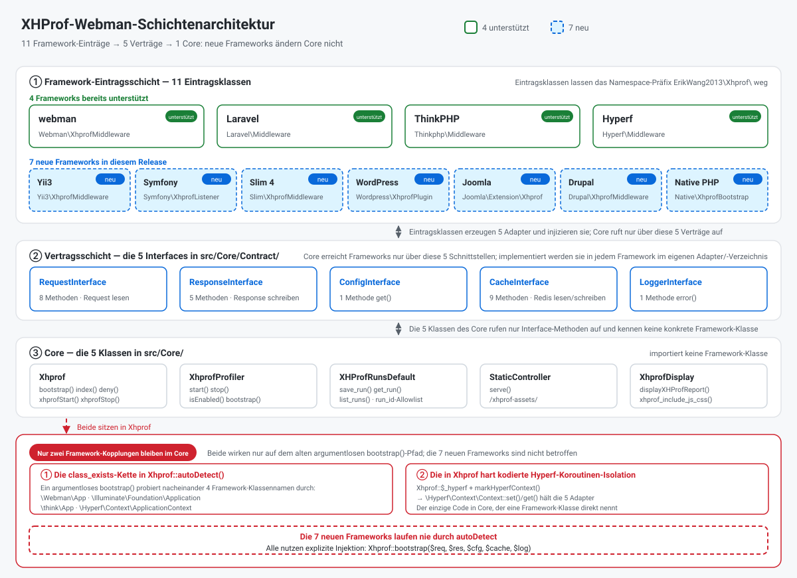
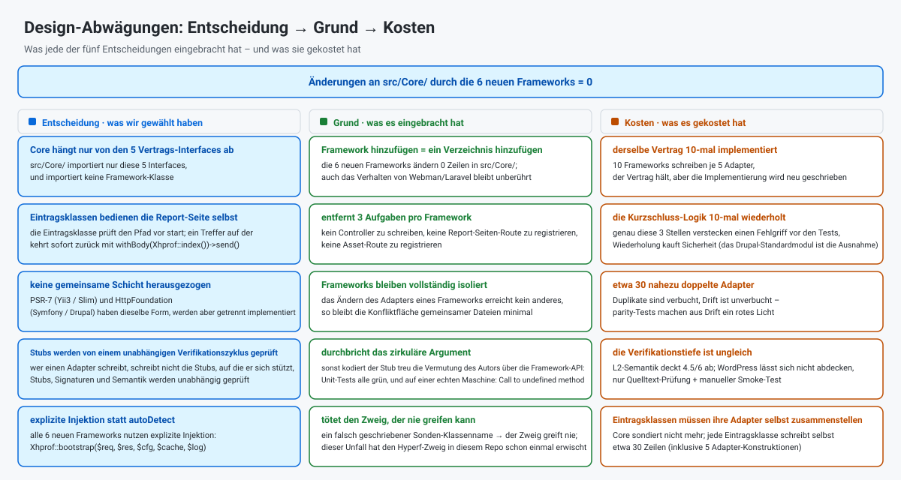
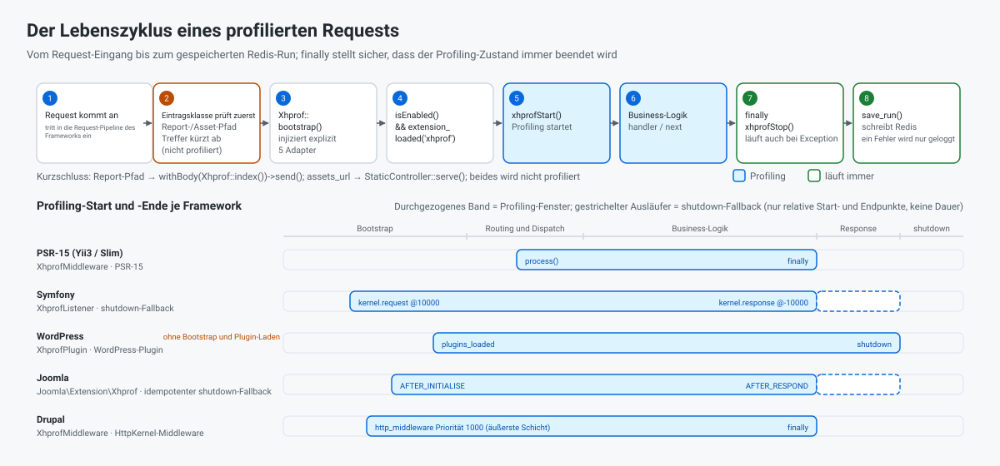

> **Maschinelle Übersetzung.** Diese deutsche Fassung wurde maschinell erzeugt und nicht von einem Muttersprachler gegengelesen. Verbindlich ist das englische Original: [README.EN.md](../../../README.EN.md).

[中文](../../../README.md) · [English](../../../README.EN.md) · [한국어](../ko/README.md) · [Русский](../ru/README.md) · **Deutsch** · [Français](../fr/README.md) · [Español](../es/README.md) · [Português](../pt/README.md) · [العربية](../ar/README.md) · [हिन्दी](../hi/README.md) · [বাংলা](../bn/README.md) · [Bahasa Indonesia](../id/README.md) · [日本語](../ja/README.md)

# XHProf Performance Profiler

Ein Plugin zur Performance-Profilerstellung für Code, kompatibel mit webman / Laravel / ThinkPHP / Hyperf / Yii3 / Symfony / Slim 4 / WordPress / Joomla und Drupal.

Sammelt Profiling-Daten über die xhprof-Erweiterung und legt sie in Redis ab. Entwickler erreichen die Performance-Analyseberichte schnell über den Browser und finden so Performance-Engpässe im Code auf.

## Voraussetzungen

- PHP >= 8.0
- xhprof-Erweiterung
- redis-Erweiterung
- Redis-Server

## Kompatible Frameworks und Mindestversionen

| Framework | Mindestversion | Mindest-PHP | Eintragsklasse | Einbindung |
|-----------|----------------|-------------|----------------|------------|
| webman | `workerman/webman ^2.1` | 8.0 | `Webman\XhprofMiddleware` | Globale Middleware in `config/middleware.php` registrieren |
| Laravel | `laravel/framework ^9.0\|^10.0\|^11.0` | 8.0 | `Laravel\Middleware` | Globale Middleware in `app/Http/Kernel.php` registrieren |
| ThinkPHP | `topthink/framework ^6.0\|^8.0` | 8.0 | `Thinkphp\Middleware` | Globale Middleware in `app/middleware.php` registrieren |
| Hyperf | `hyperf/framework ^3.0` | 8.0 | `Hyperf\Middleware` | Wird über den ConfigProvider automatisch registriert |
| Yii3 | `yiisoft/middleware-dispatcher ^5.0` | 8.1 | `Yii3\XhprofMiddleware` | In `config/web/di/application.php` registrieren, muss in der Middleware-Liste an erster Stelle stehen |
| Symfony | `symfony/http-kernel ^6.4\|^7.0` | 8.1 (6.4) / 8.2 (7.x) | `Symfony\XhprofListener` | Das Tag `kernel.event_subscriber` in `config/services.yaml` ergänzen |
| Slim 4 | `slim/slim ^4.12` | 8.0 | `Slim\XhprofMiddleware` | `$app->add(...)`, muss zuletzt hinzugefügt werden |
| WordPress | 6.4+ | 8.0 | `Wordpress\XhprofPlugin` | Nach `wp-content/mu-plugins/` kopieren |
| Joomla | 4.4 / 5.x | 8.1 | `Joomla\Extension\Xhprof` | Nach `plugins/system/` kopieren, über Discover installieren |
| Drupal | 10.x / 11.x | 8.1 (10.x) / 8.3 (11.x) | `xhprof`-Modul (`Drupal\XhprofMiddleware`) | Standardmodul, einfach aktivieren |

Alle Eintragsklassen liegen unter dem Namespace-Präfix `ErikWang2013\Xhprof\` (oben weggelassen). Von den sechs neuen Frameworks ist Drupal die Ausnahme — es liefert die Report-Seite über Modul-Routen aus — während die anderen fünf Eintragsklassen **die Report-Seite selbst ausliefern**, ohne Controller und ohne Routenregistrierung.

Dieses Paket deklariert `php >= 8.0`, aber die `yiisoft/*`-Komponenten, auf die sich Yii3 stützt, verlangen **PHP 8.1+**; **Yii3 ist auf PHP 8.0 daher nicht nutzbar**; Symfony 7.x und Drupal 11.x brauchen ebenso eine höhere PHP-Version. Die Schritt-für-Schritt-Einrichtung steht unten unter „Framework-Konfiguration".

## Installation

xhprof-Konfiguration in php.ini ergänzen:

```ini
[xhprof]
extension=xhprof.so
xhprof.output_dir=/tmp/xhprof
```

Über Composer installieren:

```sh
composer require aaron-dev/xhprof-webman
```

---

## Framework-Konfiguration

### Webman

**1. Globale Middleware registrieren** — `config/middleware.php`:

```php
return [
    '' => [
        ErikWang2013\Xhprof\Webman\XhprofMiddleware::class,
    ],
];
```

**2. Controller anlegen**:

```php
<?php

namespace app\controller;

use support\Request;
use ErikWang2013\Xhprof\Webman\Xhprof;

class XhprofController
{
    public function index(Request $request)
    {
        return Xhprof::index();
    }
}
```

**3. Routen registrieren** — `config/route.php`:

```php
use Webman\Route;
use ErikWang2013\Xhprof\Webman\StaticController;

Route::get('/xhprof', [app\controller\XhprofController::class, 'index']);
Route::get('/xhprof-assets/{path:.+}', [StaticController::class, 'serve']);

```

**4. Konfiguration** — siehe `config/plugin/aaron-dev/xhprof/xhprof.php`.

---

### Laravel

**1. Middleware registrieren** — `app/Http/Kernel.php`:

```php
protected $middleware = [
    // ...
    \ErikWang2013\Xhprof\Laravel\Middleware::class,
];
```

**2. Controller anlegen**:

```php
<?php

namespace App\Http\Controllers;

use Illuminate\Http\Request;
use ErikWang2013\Xhprof\Core\Xhprof;

class XhprofController extends Controller
{
    public function index(Request $request)
    {
        Xhprof::bootstrap();
        return Xhprof::index();
    }
}
```

**3. Routen registrieren** — `routes/web.php`:

```php
use App\Http\Controllers\XhprofController;
use ErikWang2013\Xhprof\Core\StaticController;
use Illuminate\Support\Facades\Route;

Route::get('/xhprof', [XhprofController::class, 'index']);
Route::get('/xhprof-assets/{path}', function ($path) {
    $req = new \ErikWang2013\Xhprof\Laravel\Adapter\RequestAdapter(request());
    $res = new \ErikWang2013\Xhprof\Laravel\Adapter\ResponseAdapter(response(''));
    return StaticController::serve($req, $res)->send();
})->where('path', '.*');

```

**4. Konfiguration veröffentlichen**:

```sh
php artisan vendor:publish --tag=xhprof-config
```

Die Konfigurationsdatei liegt unter `config/xhprof.php`. Laravel unterstützt die automatische Erkennung des ServiceProviders.

---

### ThinkPHP

**1. Middleware registrieren** — `app/middleware.php`:

```php
return [
    \ErikWang2013\Xhprof\Thinkphp\Middleware::class,
];
```

**2. Controller anlegen**:

```php
<?php

namespace app\controller;

use think\Request;
use ErikWang2013\Xhprof\Core\Xhprof;

class XhprofController
{
    public function index(Request $request)
    {
        Xhprof::bootstrap();
        return Xhprof::index();
    }
}
```

**3. Routen registrieren** — `route/app.php`:

```php
use think\facade\Route;
use ErikWang2013\Xhprof\Core\StaticController;
use ErikWang2013\Xhprof\Thinkphp\Adapter\RequestAdapter;
use ErikWang2013\Xhprof\Thinkphp\Adapter\ResponseAdapter;

Route::get('/xhprof', 'app\controller\XhprofController@index');
Route::get('/xhprof-assets/[:path]', function ($path = '') {
    $req = new RequestAdapter(app('request'));
    $res = new ResponseAdapter(response(''));
    return StaticController::serve($req, $res)->send();
})->pattern(['path' => '.*']);

```

**4. Konfiguration** — `vendor/aaron-dev/xhprof-webman/src/Thinkphp/config/xhprof.php` nach `config/xhprof.php` im Projekt kopieren.

---

### Hyperf

**1. Automatische Middleware-Registrierung** — der ConfigProvider hängt die Middleware automatisch an die HTTP-Middleware-Warteschlange an.

**2. Controller anlegen**:

```php
<?php

namespace App\Controller;

use Hyperf\HttpServer\Annotation\Controller;
use Hyperf\HttpServer\Annotation\RequestMapping;
use ErikWang2013\Xhprof\Core\Xhprof;

#[Controller(prefix: '/xhprof')]
class XhprofController
{
    #[RequestMapping(path: '')]
    public function index()
    {
        Xhprof::bootstrap();
        return Xhprof::index();
    }
}
```

**3. Routen für statische Assets** — `config/routes.php`:

```php
use Hyperf\HttpServer\Router\Router;
use ErikWang2013\Xhprof\Core\StaticController;
use ErikWang2013\Xhprof\Hyperf\Adapter\RequestAdapter;
use ErikWang2013\Xhprof\Hyperf\Adapter\ResponseAdapter;
use Hyperf\Context\ApplicationContext;

Router::get('/xhprof-assets/{path:.+}', function ($path) {
    $container = ApplicationContext::getContainer();
    $req = new RequestAdapter($container->get(\Hyperf\HttpServer\Contract\RequestInterface::class));
    $res = new ResponseAdapter($container->get(\Hyperf\HttpServer\Contract\ResponseInterface::class));
    return StaticController::serve($req, $res)->send();
});

```

**4. Konfiguration veröffentlichen**:

```sh
php bin/hyperf.php vendor:publish aaron-dev/xhprof-webman
```

Die Konfiguration landet unter `config/autoload/xhprof.php`.

---

### Yii3

**1. Middleware registrieren** — `config/web/di/application.php`:

```php
use ErikWang2013\Xhprof\Yii3\XhprofMiddleware;
use Yiisoft\Middleware\Dispatcher\MiddlewareDispatcher;

return [
    MiddlewareDispatcher::class => [
        'class' => MiddlewareDispatcher::class,
        // das erste Element ist die äußerste Middleware (läuft zuerst, endet zuletzt)
        'withMiddlewares()' => [[
            XhprofMiddleware::class,
            // ... weitere Middlewares
        ]],
    ],
];
```

Zwei naheliegende Fehler (beide vermessen):

- **Nicht** `'__construct()' => ['middlewares' => [...]]` schreiben: `MiddlewareDispatcher::__construct()` akzeptiert nur eine `MiddlewareFactory` und optional ein `EventDispatcherInterface` — einen Parameter `middlewares` gibt es **nicht**. Die Middleware-Liste lässt sich ausschließlich über die **Instanzmethode** `withMiddlewares()` injizieren.
- **Nicht** eine Instanz (`new XhprofMiddleware(...)`) in `withMiddlewares()` legen: Definitionen akzeptieren nur einen Klassen-String, eine Array-Definition oder ein Callable. Mit einer Instanz meldet die Registrierung nichts und `dispatch()` wirft einen `TypeError` (`MiddlewareFactory::create()` ist als `callable|array|string` typisiert).

**2. Report-Seite und statische Assets** — **kein Controller und keine Routenregistrierung nötig**: `XhprofMiddleware` ist eine PSR-15-Middleware. Bevor das Profiling startet, prüft sie den Request-Pfad: ein Treffer auf dem Report-Pfad `/xhprof` liefert sofort die Report-Seite zurück, ein Treffer auf dem Asset-Pfad (Standardpräfix `/xhprof-assets`) liefert direkt das statische Asset. Die Antwort der Report-Seite trägt von der Eintragsklasse einen expliziten `Content-Type: text/html; charset=UTF-8`: PSR-7-Antworten haben keinen Standard und der Response-Sender von Yii3 ergänzt auch keinen, ohne ihn rendern Browser den HTML-Report daher als Klartext.

**3. Konfiguration** — die Standardwerte liegen im Paket unter `src/Yii3/config/xhprof.php`; die Felder stehen unter „Konfigurationsreferenz". Zum Überschreiben `$config` per DI injizieren:

```php
XhprofMiddleware::class => [
    'class' => XhprofMiddleware::class,
    '__construct()' => [
        'config' => [
            'enable' => true,
            'auth_token' => 'your-token',
            'redis' => [
                'host' => '127.0.0.1',
                'port' => 6379,
                'password' => '',
                'database' => 0,
                'timeout' => 1.0,
            ],
        ],
    ],
],
```

Das Unter-Array `redis` ist Yii3-spezifisch: wenn keine `CacheInterface` injiziert wird, spricht die Middleware damit direkt mit phpredis. `assets_url` auf dem Standardwert belassen — jedes andere Präfix liefert nur eine 200 mit leerem Body (es ist eine hart kodierte Konstante im Core; siehe [Verifikation und bekannte Einschränkungen](#verifikation-und-bekannte-einschränkungen)).

**4. Versionsanforderung** — die `yiisoft/*`-Komponenten, auf die sich Yii3 stützt, verlangen PHP >= 8.1. Obwohl dieses Paket `php >= 8.0` deklariert, ist die Yii3-Integration auf PHP 8.0 nicht verwendbar.

---

### Symfony

**1. Event-Subscriber registrieren** — `config/services.yaml`:

```yaml
services:
    ErikWang2013\Xhprof\Symfony\XhprofListener:
        tags:
            - { name: kernel.event_subscriber }
```

**2. Report-Seite und statische Assets** — **kein Controller und keine Routenregistrierung nötig**: bevor das Profiling startet, prüft der Listener den Request-Pfad: ein Treffer auf dem Report-Pfad `/xhprof` liefert sofort die Report-Seite zurück, ein Treffer auf dem Asset-Pfad (Standardpräfix `/xhprof-assets`) liefert direkt das statische Asset.

**3. Konfiguration** — die Standardwerte liegen im Paket unter `src/Symfony/config/xhprof.php`; die Felder stehen unter „Konfigurationsreferenz".

**4. Sub-Requests und Exception-Fallback** — gelauscht wird auf `kernel.request` (Priorität 10000) und `kernel.response` (Priorität -10000). `isMainRequest()` filtert ESI-/Fragment-Sub-Requests heraus, die das Profiling sonst zu früh beenden würden; zusätzlich wird beim Start des Requests eine idempotente `register_shutdown_function` registriert — wirft HttpKernel eine Exception weiter, feuert `kernel.response` nie, und ohne diesen Fallback würde der Profiling-Zustand in den nächsten Request lecken.

---

### Slim 4

**1. Middleware registrieren** — `public/index.php`:

```php
use ErikWang2013\Xhprof\Slim\XhprofMiddleware;

$app->addRoutingMiddleware();

// muss zuletzt hinzugefügt werden: Slims Middleware-Stack ist LIFO, später hinzugefügt = weiter außen = läuft zuerst
$app->add(new XhprofMiddleware(
    $app->getResponseFactory()
));
```

Die übrigen drei Konstruktorargumente sind alle optional; weglassen heißt, die mitgelieferten Standardwerte verwenden:

- Argument 2, `array $config`: die eigene Konfiguration, gemischt über die mitgelieferte `src/Slim/config/xhprof.php` mit `array_replace` (Ersetzung ganzer Werte — Listen-Schlüssel wie `ignore_url_arr` werden nie rekursiv gemischt).
- Argument 3, `CacheInterface $cache`: weggelassen erfolgt träge ein `new \Redis()` (der Konstruktor fasst ext-redis bewusst nie an, damit eine fehlende Erweiterung beim Bauen des Adapters nicht auffällt). Für eine eigene Verbindung `new \ErikWang2013\Xhprof\Slim\Adapter\RedisAdapter($redis)` übergeben, oder irgendein Objekt, das `ErikWang2013\Xhprof\Core\Contract\CacheInterface` implementiert.
- Argument 4, `LoggerInterface $logger`: weggelassen ist es `new \ErikWang2013\Xhprof\Slim\Adapter\LogAdapter()` und **Logs werden stillschweigend verworfen** (Slim bringt keinen PSR-3-Logger mit). Zum Aufzeichnen `new LogAdapter($psrLogger)` übergeben, wobei `$psrLogger` ein bereits vorhandener PSR-3-Logger ist.

**Nicht** `$app->add(XhprofMiddleware::class)` schreiben: der `CallableResolver` von Slim macht daraus `new XhprofMiddleware($container)` — es wird nur der Container übergeben und die Auflösung bis zur Request-Zeit aufgeschoben. Die Folge: `add()` meldet nichts und der erste Request wirft einen `TypeError` — die am schwersten zu diagnostizierende Fehlerart. Immer das explizite `new` von oben verwenden.

**2. Report-Seite und statische Assets** — **kein Controller und keine Routenregistrierung nötig**: bevor das Profiling startet, prüft die Middleware den Request-Pfad: ein Treffer auf dem Report-Pfad `/xhprof` liefert sofort die Report-Seite zurück, ein Treffer auf dem Asset-Pfad (Standardpräfix `/xhprof-assets`) liefert direkt das statische Asset.

**3. Konfiguration** — die Standardwerte liegen im Paket unter `src/Slim/config/xhprof.php`; die Felder stehen unter „Konfigurationsreferenz".

**4. Einbindungsreihenfolge** — der Middleware-Stack von Slim ist LIFO (mit zwei Middlewares vermessen, die Ausführungsreihenfolge ist `B:before → A:before → A:after → B:after`): je später `add()` aufgerufen wird, desto weiter außen sitzt die Middleware und desto früher läuft sie. xhprof muss also **zuletzt** hinzugefügt werden, und **nach `addRoutingMiddleware()`** — sonst steht `/xhprof` nicht in der Routingtabelle, RoutingMiddleware wirft zuerst `HttpNotFoundException`, und der Request erreicht die Middleware nie. Die Antwort der Report-Seite trägt von der Eintragsklasse einen expliziten `Content-Type: text/html; charset=UTF-8`: PSR-7-Antworten haben keinen Standard und der `ResponseEmitter` von Slim ergänzt auch keinen, ohne ihn rendern Browser den HTML-Report daher als Klartext.

---

### WordPress

**1. mu-Plugin installieren** — die Bootstrap-Datei aus dem Paket nach `wp-content/mu-plugins/` kopieren:

```sh
cp vendor/aaron-dev/xhprof-webman/wordpress/xhprof-webman.php wp-content/mu-plugins/
```

`wordpress/xhprof-webman.php` trägt einen Plugin-Header und startet `Wordpress\XhprofPlugin`. mu-Plugins werden automatisch geladen — im wp-admin ist nichts zu aktivieren.

**2. Report-Seite und statische Assets** — **kein Controller und keine Routenregistrierung nötig**: bevor das Profiling startet, prüft die Eintragsklasse den Request-Pfad: ein Treffer auf dem Report-Pfad `/xhprof` liefert sofort die Report-Seite zurück, ein Treffer auf dem Asset-Pfad (Standardpräfix `/xhprof-assets`) liefert direkt das statische Asset.

**3. Konfiguration** — die Standardwerte liegen im Paket unter `src/Wordpress/config/xhprof.php`; die Felder stehen unter „Konfigurationsreferenz". Mit `ignore_url_arr` lassen sich hochfrequente Pfade wie `wp-cron.php` und `admin-ajax.php` ausschließen.

**4. Eine strukturelle Grenze des Profiling-Fensters** — das Fenster ist `plugins_loaded` → `shutdown`, was den `wp-settings.php`-Bootstrap und das Laden der Plugins selbst **nicht einschließt**. Das ist eine strukturelle Grenze von WordPress: Arbeit in dieser Phase lässt sich nicht profilieren.

---

### Joomla

**1. Plugin installieren** — das Verzeichnis `joomla/` aus dem Paket nach `plugins/system/xhprof/` der Seite kopieren:

```sh
cp -r vendor/aaron-dev/xhprof-webman/joomla/ plugins/system/xhprof/
```

Das Verzeichnis `joomla/` im Paket *ist* das Plugin: das Manifest `xhprof.xml`, `services/provider.php` und `src/Extension/Xhprof.php`. Die Eintragsklasse ist `ErikWang2013\Xhprof\Joomla\Extension\Xhprof` (ein `CMSPlugin`). Nach dem Kopieren unter „System → Verwalten → Erweiterungen → Discover" die Discover-Funktion ausführen und das Plugin installieren/aktivieren.

**2. Report-Seite und statische Assets** — **kein Controller und keine Routenregistrierung nötig**: bevor das Profiling startet, prüft das Plugin den Request-Pfad: ein Treffer auf dem Report-Pfad `/xhprof` liefert sofort die Report-Seite zurück, ein Treffer auf dem Asset-Pfad (Standardpräfix `/xhprof-assets`) liefert direkt das statische Asset.

**3. Konfiguration** — die Standardwerte liegen im Paket unter `src/Joomla/config/xhprof.php`; die Felder stehen unter „Konfigurationsreferenz". **Bekannte Abwägung**: gelesen wird die Konfigurationsdatei des Pakets statt der Plugin-Parameter — Plugin-Parameter verlangen einen Datenbankzugriff, und die Konfiguration wird bei jedem Request gelesen.

**4. Profiling-Grenzen** — das Fenster ist `ApplicationEvents::AFTER_INITIALISE` → `ApplicationEvents::AFTER_RESPOND`; in `AFTER_INITIALISE` wird zusätzlich eine idempotente `register_shutdown_function` registriert, weil `AFTER_RESPOND` auf dem Exception-Pfad nicht garantiert erreicht wird — ohne den Fallback würde der Profiling-Zustand in den nächsten Request lecken.

---

### Drupal

**1. Modul aktivieren** — `drupal/xhprof/` im Paket ist ein Standard-Drupal-Modul (`xhprof.info.yml` / `xhprof.routing.yml` / `xhprof.services.yml`). Es an `modules/custom/xhprof/` der eigenen Seite legen und dann auf der Seite „Erweitern" aktivieren (oder mit `drush en xhprof`).

**2. Report-Seite** — Drupal ist **das einzige der zehn Frameworks, das die Report-Seite über Modul-Routen ausliefert**: `xhprof.routing.yml` registriert den Report-Pfad `/xhprof`, und ein Modul-Controller rendert ihn. Die anderen fünf neuen Frameworks liefern Report-Seite und statische Assets selbst aus und registrieren keine Routen.

**3. Konfiguration** — die Konfiguration ist typisierte Konfiguration auf Modulebene: die Standardwerte liegen in `drupal/xhprof/config/install/xhprof.settings.yml`, das Schema in `drupal/xhprof/config/schema/xhprof.schema.yml`. Die Felder stehen unter „Konfigurationsreferenz".

**4. Middleware-Registrierung** — den Middleware-Service in `xhprof.services.yml` des Moduls registrieren:

```yaml
services:
  xhprof.http_middleware:
    class: ErikWang2013\Xhprof\Drupal\XhprofMiddleware
    arguments: ['@config.factory', '@logger.factory']
    tags:
      - { name: http_middleware, priority: 1000 }
```

Der innere Kernel wird von Drupals `StackedKernelPass` **automatisch als Konstruktorargument 0 vorangestellt** — **nicht selbst schreiben**: sonst entstehen zwei innere Kernel, was bei Drupal <= 11.2.x (inklusive aller 10.x) schon zur Container-Kompilierzeit scheitert und ab 11.3.0 bei jedem Request einen TypeError wirft. Das Profiling endet im `finally`.

**5. Hinweise**

- `priority: 1000` platziert die Middleware **außerhalb des Seitencaches** (die höchste vorhandene Priorität im Core ist negotiation: 400 bei D10, 500 bei D11, der Seitencache liegt bei 200), also werden **auch Requests profiliert, die aus Drupals Seitencache bedient werden**. Für ein Profiling-Werkzeug ist das das beabsichtigte Verhalten, die Nutzer sollten es aber wissen.
- Der Cache funktioniert ohne weiteres Zutun: die Middleware verwendet standardmäßig den mit diesem Paket gelieferten Redis-Adapter (das Paket hängt hart von ext-redis ab), und sie akzeptiert über `arguments` in `services.yml` zusätzlich ein optionales `CacheInterface`-Argument, um ihn zu überschreiben. Ist der Cache nicht verfügbar, wird ein fehlgeschlagenes Speichern von `XhprofProfiler::stop()` in einer einzigen Logzeile verschluckt — **es wird kein Fehler ausgelöst**.
- Requests auf die Report-Seite `/xhprof` und auf `/xhprof-assets/*` werden **nicht profiliert**: die Middleware überspringt das Profiling vor `xhprofStart()` anhand des Pfades. Die Antwort erzeugt trotzdem der Controller in `xhprof.routing.yml` (**das ist kein Kurzschluss**). Selbst wenn `ignore_url_arr` auf `[]` gesetzt ist (also nichts gefiltert wird), tauchen diese beiden Requests im Report nie auf.

---

## Konfigurationsreferenz

Alle Frameworks teilen diese Konfigurationsoptionen:

| Konfiguration | Typ | Standard | Beschreibung |
|---------------|-----|----------|--------------|
| `enable` | bool | `true` | Profiling ein-/ausschalten |
| `time_limit` | int | `0` | Nur Requests über n Sekunden profilieren, 0 bedeutet alle |
| `log_num` | int | `1000` | Maximale Anzahl Datensätze |
| `view_wtred` | int | `3` | Zeilen mit Antwortzeit > n Sekunden rot hervorheben |
| `ignore_url_arr` | array | `["/xhprof"]` | Zu ignorierende URL-Pfade |
| `assets_url` | string | `/xhprof-assets` | URL-Präfix für statische Assets |
| `auth_token` | string\|null | `null` | Wenn gesetzt, verlangt die Report-Seite `?token=xxx`; für öffentliche Deployments empfohlen |
| `key_prefix` | string | `xhprof` | Redis-Schlüsselpräfix; bei gemeinsam genutztem Redis je Projekt unterschiedlich setzen |
| `log_ttl` | int | `604800` | Aufbewahrungsdauer der Daten in Sekunden (Standard 7 Tage) |

Die bekannten Einschränkungen dieser Optionen auf den einzelnen Frameworks stehen unter [Verifikation und bekannte Einschränkungen](#verifikation-und-bekannte-einschränkungen).

---

## Manuelle Initialisierung

Wenn die automatische Framework-Erkennung fehlschlägt, können Adapter manuell injiziert werden:

```php
use ErikWang2013\Xhprof\Core\Xhprof;

Xhprof::bootstrap(
    new MyRequestAdapter($request),
    new MyResponseAdapter($response),
    new MyConfigAdapter(),
    new MyCacheAdapter(),
    new MyLoggerAdapter()
);
```

**Die sechs neuen Frameworks (Yii3 / Symfony / Slim 4 / WordPress / Joomla / Drupal) dürfen das argumentlose `Xhprof::bootstrap()` nicht aufrufen** — ohne Argumente läuft es durch `autoDetect()`, das nur die Zweige webman / Laravel / ThinkPHP / Hyperf kennt und bei diesen sechs `Unsupported framework` wirft. Alle 5 Adapter explizit übergeben, wie im Beispiel oben (die mit jedem Framework gelieferte Eintragsklasse erledigt das bereits für Sie).

---

## Architektur und Design

Core erreicht das Framework über genau 5 Verträge, alle in `src/Core/Contract/`:

| Vertrag | Methoden | Zweck |
|---------|----------|-------|
| `RequestInterface` | `get()` `all()` `method()` `header()` `host()` `uri()` `url()` `getRealIp()` | Request-Daten lesen, den Report-Pfad abgleichen, Links für die Report-Seite bauen |
| `ResponseInterface` | `withBody()` `withHeaders()` `withStatus()` `file()` `send()` | Report-Seite, statische Assets und 400/403 ausgeben |
| `ConfigInterface` | `get()` | Plugin-Konfiguration lesen: `get('xhprof')` für den ganzen Block, `get('xhprof.assets_url')` für ein Blatt |
| `CacheInterface` | `get()` `set()` `mget()` `incr()` `lPush()` `rPop()` `lRange()` `del()` `decr()` | Redis lesen und schreiben |
| `LoggerInterface` | `error()` | Warnungen bei fehlenden Erweiterungen und fehlgeschlagenem Speichern |

Jedes Framework stellt 5 Adapter bereit, die diese Verträge implementieren, und `Xhprof::bootstrap()` registriert sie im Core. Alles Framework-Spezifische bleibt im jeweiligen `src/<Fw>/`-Verzeichnis des Frameworks.

**Im Core verbleiben nur zwei Kopplungen an Frameworks**:

1. Die `class_exists()`-Kette in `Xhprof::autoDetect()` (`Webman\App` → `Illuminate\Foundation\Application` → `think\App` → `Hyperf\Context\ApplicationContext`), die nur das argumentlose `bootstrap()` erreicht.
2. Die hart kodierte Hyperf-Koroutinen-Weiche: `Xhprof::markHyperfContext()` plus die Existenzprüfungen auf `\Hyperf\Context\Context`, die entscheiden, ob Adapter in prozessweite statische Eigenschaften oder in den Koroutinen-Context wandern.

**Die sechs neuen Frameworks laufen nie durch `autoDetect()` — sie nutzen alle die explizite Injektion**: jede Eintragsklasse baut ihre eigenen 5 Adapter und übergibt sie an `Xhprof::bootstrap($req, $res, $cfg, $cache, $log)`. Der Grund: auf PSR-7-Frameworks sind Request/Response nur aus der Request-Pipeline zu bekommen, ein argumentloses `bootstrap()` kann also konstruktionsbedingt nicht funktionieren; ein zweiter Vorteil ist, dass `autoDetect()` bei seinen derzeitigen vier Frameworks eingefroren bleibt.



Das erste Diagramm zeigt die **Struktur**: die Eintragsklasse jedes der zehn Frameworks, die 5 Verträge, die drei Schichten des Core und die einzigen zwei verbliebenen Kopplungen.



Das zweite Diagramm zeigt die **Begründung**: fünf Abwägungen als Entscheidung / Grund / Kosten, angeführt von „Änderungen an `src/Core/` durch die sechs neuen Frameworks = 0".

---

## Request-Lebenszyklus

Ein profilierter Request:

1. **Bevor das Profiling startet**, prüft die Eintragsklasse den Pfad: ein Treffer auf dem Report-Pfad liefert sofort die Report-Seite, ein Treffer auf dem Asset-Pfad liefert sofort das statische Asset. Keiner der beiden Pfade wird profiliert, und keiner betritt den folgenden Ablauf.
2. `XhprofProfiler::isEnabled()` liest `enable` aus der Konfiguration; ist das Profiling aus oder fehlt eine Erweiterung, wird der ganze Block übersprungen.
3. `Xhprof::xhprofStart()` → `XhprofProfiler::start()` → `xhprof_enable(XHPROF_FLAGS_NO_BUILTINS + XHPROF_FLAGS_CPU + XHPROF_FLAGS_MEMORY)`.
4. Die Business-Logik läuft.
5. `finally { Xhprof::xhprofStop(); }` → `xhprof_disable()`, dann schreibt `XHProfRunsDefault::save_run()` nach Redis. `finally` statt einer schlichten Anweisung, damit auch eine geworfene Exception den Profiling-Zustand zurücksetzt und den Run speichert.
6. Der Browser öffnet die Report-Seite; `Xhprof::index()` liest die Daten aus Redis zurück und rendert sie.



| Framework | Profiling beginnt | Profiling endet |
|-----------|-------------------|-----------------|
| webman / Laravel / ThinkPHP / Hyperf | Middleware-Eintritt (`process()` / `handle()`) | `finally` |
| Yii3 / Slim 4 | PSR-15 `process()` | `finally` |
| Symfony | `kernel.request` (Priorität 10000) | `kernel.response` (Priorität -10000), plus shutdown-Fallback |
| WordPress | `plugins_loaded` | `shutdown` |
| Joomla | `onAfterInitialise` | `onAfterRespond`, plus shutdown-Fallback |
| Drupal | `http_middleware` (Priorität 1000, äußerste Schicht) | `finally` |

---

## Projektstruktur

```
xhprof-webman/
├── src/
│   ├── Core/                     # framework-agnostisch: Verträge, Report-Seite, Redis, Assets
│   │   ├── Contract/             # die 5 Vertrags-Interfaces
│   │   ├── XhprofLib/            # Report-Rendering und Run-Speicherung (aus phacility/xhprof)
│   │   ├── Xhprof.php            # statische Fassade: bootstrap() / index()
│   │   ├── XhprofProfiler.php    # xhprof_enable/disable und Konfiguration
│   │   ├── StaticController.php  # statische Assets unter /xhprof-assets
│   │   ├── MiddlewareTrait.php   # gemeinsamer Profiling-Wrapper für Laravel / ThinkPHP
│   │   └── RedisAdapterTrait.php # gemeinsame Redis-Adapter-Implementierung
│   ├── Webman/ Laravel/ Thinkphp/ Hyperf/            # die bestehenden 4 Frameworks
│   ├── Yii3/ Symfony/ Slim/ Wordpress/ Joomla/ Drupal/   # die 6 neuen Frameworks
│   └── html/                     # Assets der Report-Seite (css / js / images)
├── wordpress/                    # mu-Plugin-Bootstrap-Datei (mit Plugin-Header)
├── joomla/                       # Joomla-Plugin (CMSPlugin + Manifest)
├── drupal/xhprof/                # Standard-Drupal-Modul (info / routing / services + Controller)
├── tools/contracts/              # eigenständiger Verifikationszyklus: Signaturen und Semantik gegen echte Framework-Pakete
├── tests/                        # PHPUnit: Adapter, Verdrahtung, README-Parität
└── docs/images/                  # README-Diagramme
```

Außer bei Drupal hat jedes `src/<Fw>/`-Verzeichnis dieselbe Form:

```
src/<Fw>/
├── Adapter/{Request,Response,Config,Redis,Log}Adapter.php
├── <EntryClass>.php
└── config/xhprof.php             # dieselben 9 Konfigurationsschlüssel wie jedes andere Framework
```

`src/Drupal/` ist die eine Ausnahme: es hat kein `config/`-Verzeichnis — seine Konfiguration liegt in typisierter Konfiguration auf Modulebene (`drupal/xhprof/config/install/xhprof.settings.yml`).

---

## Verifikation und bekannte Einschränkungen

**Was mechanisch belegt ist**

| Punkt | Wie |
|-------|-----|
| Verhalten von Adaptern und Eintragsverdrahtung | `tests/Unit/Adapter/*Test.php`: aktiviert → gespeichert / deaktiviert → nicht gespeichert / Business-Exception → trotzdem über `finally` gespeichert |
| Alle zehn Frameworks teilen einen Satz von Konfigurationsschlüsseln | Parity-Test der Konfiguration (Schlüsselmengen, nicht byteweise; Kommentare dürfen abweichen) |
| Die beiden READMEs spiegeln einander | README-Parity-Test: vergleicht die Reihenfolge der `##`/`###`-Überschriften und die Anzahl der Codeblöcke |
| Die von den Adaptern aufgerufenen Methoden existieren wirklich | Verifikationszyklus in `tools/contracts/` (eigener CI-Job): installiert echte Framework-Pakete und prüft jede Methode / Konstante / globale Funktion per Reflection |
| Semantik der Adapter | Derselbe Zyklus instanziiert echte Request- und Response-Objekte und führt die Adapter aus, inklusive zweier Invarianten: `uri()` trägt kein Schema und keinen Host, und `withHeaders()` greift auch nach `file()` noch |

Die ersten drei Zeilen oben — Verhalten von Adaptern und Eintragsverdrahtung, ein gemeinsamer Satz von Konfigurationsschlüsseln über alle zehn Frameworks, und die beiden READMEs, die einander spiegeln — beschreiben **künftige Liefergegenstände** (die Verdrahtungsfälle der sechs Frameworks, den Konfigurations-Parity-Test, den README-Parity-Test), die zum Stand dieses Dokuments noch nicht vorhanden sind. Für die sechs neuen Frameworks gilt bis auf Weiteres die manuelle Smoke-Checkliste als maßgeblich.

**Nicht automatisch verifiziert (bitte nicht als „alle sechs wurden getestet" lesen)**

| Punkt | Warum nicht |
|-------|-------------|
| Die **Verdrahtung** jedes Frameworks (ist der Hook wirklich angehängt, feuert das Event wirklich) | Unit-Tests verwenden Stubs; die Verdrahtung lässt sich derzeit nur über manuelle Smoke-Tests bestätigen |
| WordPress von Ende zu Ende | Das tatsächliche Timing von `plugins_loaded`, ob `shutdown` bei einem fatalen Fehler feuert, und ob das mu-Plugin geladen wird, verlangen alle ein echtes WordPress |
| Plugin-Erkennung in Joomla und `$app->close()` | Verlangt das Ausführen von Discover in einem echten Joomla-Admin |
| Ob Drupals Priorität wirklich außerhalb des Seitencaches landet | Verlangt einen gebooteten Drupal-Kernel |
| Die Auto-Konfiguration von Symfonys `kernel.event_subscriber` | Verlangt eine echte Container-Kompilierung |
| Übersprechen von statischem Zustand in lang laufenden Prozessen | Aus der bestehenden Architektur geerbt (für Webman / Hyperf gilt dasselbe); hier unverändert |
| Echte Redis-I/O, Browser-Rendering, Profiling-Overhead unter echter Last | Außerhalb des Umfangs von Unit-Tests und Verifikationszyklus |

**Manuelle Smoke-Checkliste (drei Schritte pro Framework)**

| Schritt | Aktion | Erwartet |
|---------|--------|----------|
| 1 | Die Eintragsklasse wie unter „Framework-Konfiguration" beschrieben einbinden | Keine Fehler |
| 2 | Eine beliebige URL der Anwendung aufrufen | Die Länge des Schlüssels `xhprof:run_id` in Redis steigt um 1 |
| 3 | `/xhprof` öffnen | Die Report-Seite rendert mit ihren Styles; `/xhprof-assets/js/xhprof_report.js` liefert 200 |

**Bekannte Einschränkung: `host()` hat keinen Port**

Der Vertrag `host()` bedeutet „nur Host, kein Port", aber die Links in der Report-Liste werden als `host() . uri()` gebaut (`src/Core/XhprofLib/Utils/XHProfRunsDefault.php`). **Auf einem Nicht-Standard-Port (z. B. `:8080`) verlieren die Listen-Links also den Port und führen ins Leere**. Das ist ein latentes Problem der bestehenden Implementierung (es trifft webman / Laravel / ThinkPHP / Hyperf gleichermaßen), wird hier nicht behoben und ist als bekannte Einschränkung festgehalten.

**Bekannte Einschränkung: `assets_url` funktioniert nur, wenn es `/xhprof-assets` ist**

Das Asset-Präfix ist eine hart kodierte Konstante in `src/Core/StaticController.php` (`private const URI_PREFIX = '/xhprof-assets'`), während die CSS-/JS-Links der Report-Seite die Konfigurationsoption `assets_url` lesen (`src/Core/Xhprof.php`). Sobald die beiden auseinanderlaufen, liefert `getPathFromRequest()` `null` und `serve()` gibt `withBody('')->withHeaders([])` zurück — **eine leere 200-Antwort, kein 404**. Die Folge: wird `assets_url` auf irgendetwas anderes gesetzt, werden CSS/JS stillschweigend leer, und die Report-Seite bleibt ohne Fehlermeldung irgendeiner Art ungestylt. Anders gesagt ist `assets_url` derzeit eine Scheinoption, die nur auf ihrem Standardwert funktioniert. Das ist ein vorbestehendes Problem und wird hier nicht behoben.

**Bekannte Einschränkung: die Pfadprüfung versagt, wenn Drupal in einem Unterverzeichnis liegt**

Ist Drupal in einem Unterverzeichnis installiert (z. B. `/sites/app/xhprof`), kann die Pfadprüfung eine URI, die den Basispfad trägt, nicht abgleichen, und das Verhalten fällt auf „profiliert, aber nicht gespeichert" zurück (mit der Standardkonfiguration fängt `ignore_url_arr` das ab). Das ist dieselbe Klasse von Einschränkung wie das hart kodierte `assets_url`-Präfix.

**Symfony-6.4-Kompatibilität**

Die Symfony-6.4-Kompatibilität wurde vermessen (so wurden zwei auf 7.4 unsichtbare Überanpassungen behoben: `Request`-Eigenschaften tragen auf 6.4 keine native Typdeklaration, und der von `prepare()` ergänzte Charset unterscheidet sich in der Groß-/Kleinschreibung), aber der CI-Verifikationszyklus läuft nur auf 7.4.

---

## Autor

[erik](https://erik.xyz)

## Open Source unterstützen

<p align="center">
  
  
</p>

---

Dieses Plugin verweist auf [phacility/xhprof](https://github.com/phacility/xhprof) und [phpxxb/xhprof](https://github.com/xiexianbo123/xhprof).
