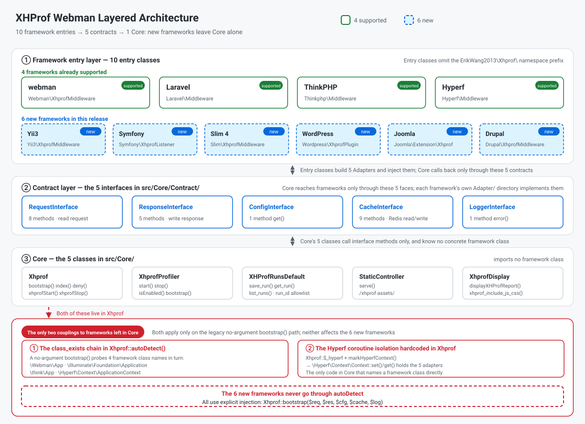
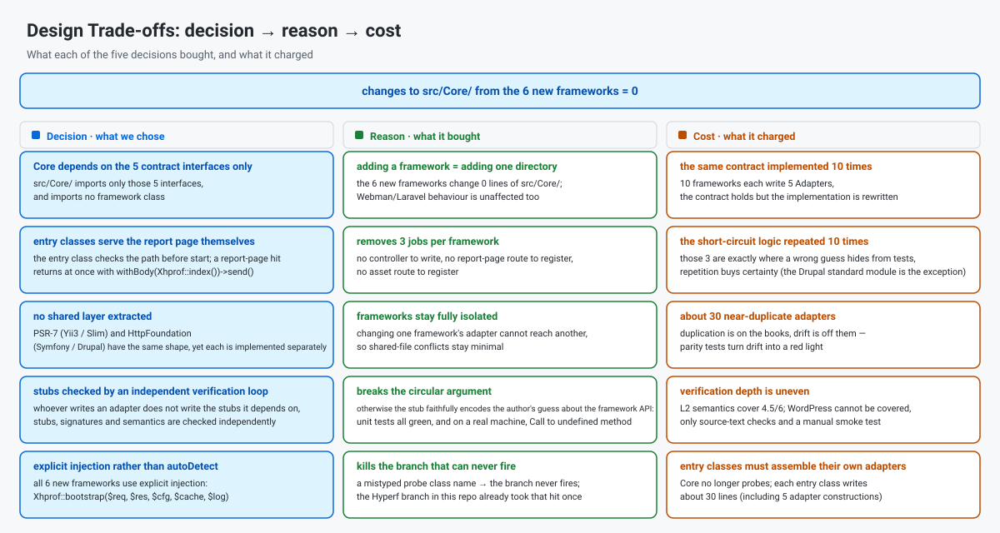
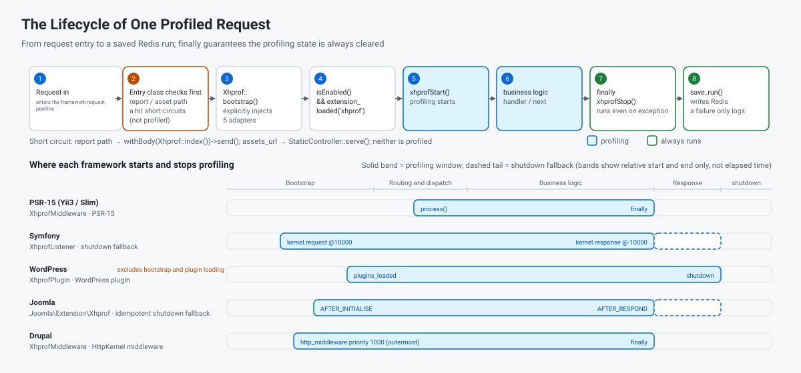

[中文](../../../README.md) · **English** · [한국어](../ko/README.md) · [Русский](../ru/README.md) · [Deutsch](../de/README.md) · [Français](../fr/README.md) · [Español](../es/README.md) · [Português](../pt/README.md) · [العربية](../ar/README.md) · [हिन्दी](../hi/README.md) · [বাংলা](../bn/README.md) · [Bahasa Indonesia](../id/README.md) · [日本語](../ja/README.md)

# XHProf Performance Profiler

A code performance profiling plugin compatible with webman / Laravel / ThinkPHP / Hyperf / Yii3 / Symfony / Slim 4 / WordPress / Joomla and Drupal.

Collects profiling data via the xhprof extension and stores it in Redis. Developers can quickly access performance analysis reports through a browser to identify code performance bottlenecks.


The same little flame is also the report page's site icon and the top-left brand icon (`src/html/pet.svg`, served under the `assets_url` prefix).

**Request Log**


**Single run report**


## Requirements

- PHP >= 8.0
- xhprof extension
- redis extension
- Redis server

## Compatible Frameworks and Minimum Versions

| Framework | Minimum version | Minimum PHP | Entry class | How to mount |
|-----------|----------------|-------------|-------------|--------------|
| webman | `workerman/webman ^2.1` | 8.0 | `Webman\XhprofMiddleware` | Register global middleware in `config/middleware.php` |
| Laravel | `laravel/framework ^9.0\|^10.0\|^11.0` | 8.0 | `Laravel\Middleware` | Register global middleware in `app/Http/Kernel.php` |
| ThinkPHP | `topthink/framework ^6.0\|^8.0` | 8.0 | `Thinkphp\Middleware` | Register global middleware in `app/middleware.php` |
| Hyperf | `hyperf/framework ^3.0` | 8.0 | `Hyperf\Middleware` | Auto-registered via ConfigProvider |
| Yii3 | `yiisoft/middleware-dispatcher ^5.0` | 8.1 | `Yii3\XhprofMiddleware` | Register in `config/web/di/application.php`, must be first in the middleware list |
| Symfony | `symfony/http-kernel ^6.4\|^7.0` | 8.1 (6.4) / 8.2 (7.x) | `Symfony\XhprofListener` | Add the `kernel.event_subscriber` tag in `config/services.yaml` |
| Slim 4 | `slim/slim ^4.12` | 8.0 | `Slim\XhprofMiddleware` | `$app->add(...)`, must be added last |
| WordPress | 6.4+ | 8.0 | `Wordpress\XhprofPlugin` | Copy into `wp-content/mu-plugins/` |
| Joomla | 4.4 / 5.x | 8.1 | `Joomla\Extension\Xhprof` | Copy into `plugins/system/`, install via Discover |
| Drupal | 10.x / 11.x | 8.1 (10.x) / 8.3 (11.x) | `xhprof` module (`Drupal\XhprofMiddleware`) | Standard module, just enable it |
| Native PHP (no framework) | — (no external package) | 8.0 | `Native\XhprofBootstrap` | One line at the top of the entry file, `XhprofBootstrap::start()`, no controller or route to register |

Entry classes all live under the `ErikWang2013\Xhprof\` namespace prefix (omitted above). None of the eleven needs you to register a controller or a route: the entry class serves the report page and the static assets itself (in Drupal's case, the module route does).

This package declares `php >= 8.0`, but the `yiisoft/*` components Yii3 relies on require **PHP 8.1+**, so **Yii3 is not usable on PHP 8.0**; Symfony 7.x and Drupal 11.x likewise need a higher PHP version. Step-by-step setup is in "Framework Configuration" below.

## Installation

Add xhprof configuration in php.ini:

```ini
[xhprof]
extension=xhprof.so
xhprof.output_dir=/tmp/xhprof
```

Install via Composer:

```sh
composer require aaron-dev/xhprof-webman
```

---

## Framework Configuration

### Webman

**1. Register global middleware** — `config/middleware.php`:

```php
return [
    '' => [
        ErikWang2013\Xhprof\Webman\XhprofMiddleware::class,
    ],
];
```

**2. Report page and static assets** — **no controller or route registration needed**: before sampling starts the middleware inspects the request path; a hit on the report path `/xhprof` returns the report page, and a hit on the asset path (prefix read from the `assets_url` option, default `/xhprof-assets`) serves the static asset directly.

**3. Configuration** — See `config/plugin/aaron-dev/xhprof/xhprof.php`.

---

### Laravel

**1. Register middleware** — `app/Http/Kernel.php`:

```php
protected $middleware = [
    // ...
    \ErikWang2013\Xhprof\Laravel\Middleware::class,
];
```

**2. Report page and static assets** — **no controller or route registration needed**: before sampling starts the middleware inspects the request path; a hit on the report path `/xhprof` returns the report page, and a hit on the asset path (prefix read from the `assets_url` option, default `/xhprof-assets`) serves the static asset directly.

**3. Publish config**:

```sh
php artisan vendor:publish --tag=xhprof-config
```

Config file at `config/xhprof.php`. Laravel supports auto-discovery of ServiceProvider.

---

### ThinkPHP

**1. Register middleware** — `app/middleware.php`:

```php
return [
    \ErikWang2013\Xhprof\Thinkphp\Middleware::class,
];
```

**2. Report page and static assets** — **no controller or route registration needed**: before sampling starts the middleware inspects the request path; a hit on the report path `/xhprof` returns the report page, and a hit on the asset path (prefix read from the `assets_url` option, default `/xhprof-assets`) serves the static asset directly.

**3. Configuration** — Copy `vendor/aaron-dev/xhprof-webman/src/Thinkphp/config/xhprof.php` to project `config/xhprof.php`.

---

### Hyperf

**1. Middleware auto-registration** — ConfigProvider automatically adds middleware to the HTTP middleware queue.

**2. Report page and static assets** — **no controller or route registration needed**: before sampling starts the middleware inspects the request path; a hit on the report path `/xhprof` returns the report page, and a hit on the asset path (prefix read from the `assets_url` option, default `/xhprof-assets`) serves the static asset directly.

**3. Publish config**:

```sh
php bin/hyperf.php vendor:publish aaron-dev/xhprof-webman
```

Config output at `config/autoload/xhprof.php`.

---

### Yii3

**1. Register the middleware** — `config/web/di/application.php`:

```php
use ErikWang2013\Xhprof\Yii3\XhprofMiddleware;
use Yiisoft\Middleware\Dispatcher\MiddlewareDispatcher;

return [
    MiddlewareDispatcher::class => [
        'class' => MiddlewareDispatcher::class,
        // the first element is the outermost middleware (runs first, finishes last)
        'withMiddlewares()' => [[
            XhprofMiddleware::class,
            // ... other middlewares
        ]],
    ],
];
```

Two easy mistakes (both measured):

- **Do not** write `'__construct()' => ['middlewares' => [...]]`: `MiddlewareDispatcher::__construct()` accepts only a `MiddlewareFactory` and an optional `EventDispatcherInterface` — there is **no** `middlewares` parameter. The middleware list can only be injected through the **instance method** `withMiddlewares()`.
- **Do not** put an instance (`new XhprofMiddleware(...)`) into `withMiddlewares()`: definitions accept only a class-string, an array definition, or a callable. With an instance, registration reports nothing and `dispatch()` throws a `TypeError` (`MiddlewareFactory::create()` is typed `callable|array|string`).

**2. Report page and static assets** — **no controller or route registration needed**: `XhprofMiddleware` is a PSR-15 middleware. Before profiling starts it inspects the request path: a hit on the report path `/xhprof` returns the report page immediately, and a hit on the asset path (default prefix `/xhprof-assets`) returns the static asset directly. The report page response carries an explicit `Content-Type: text/html; charset=UTF-8` from the entry class: PSR-7 responses have no default and Yii3's response sender does not add one, so without it browsers render the HTML report as plain text.

**3. Configuration** — defaults live in the package at `src/Yii3/config/xhprof.php`; see "Configuration Reference" for the fields. To override them, inject `$config` through DI:

```php
XhprofMiddleware::class => [
    'class' => XhprofMiddleware::class,
    '__construct()' => [
        'config' => [
            'enable' => true,
            'auth_token' => 'your-token',
            'redis' => [
                'host' => '127.0.0.1',
                'port' => 6379,
                'password' => '',
                'database' => 0,
                'timeout' => 1.0,
            ],
        ],
    ],
],
```

The `redis` sub-array is Yii3-specific: when no `CacheInterface` is injected, the middleware uses it to talk to phpredis directly. `assets_url` may be any prefix: the report page's CSS/JS links and `StaticController` read the same option (default `/xhprof-assets`). The remaining limitations under a subdirectory deployment are in [Verification and Known Limitations](#verification-and-known-limitations).

**4. Version requirement** — the `yiisoft/*` components Yii3 relies on require PHP >= 8.1. Although this package declares `php >= 8.0`, the Yii3 integration cannot be used on PHP 8.0.

---

### Symfony

**1. Register the event subscriber** — `config/services.yaml`:

```yaml
services:
    ErikWang2013\Xhprof\Symfony\XhprofListener:
        tags:
            - { name: kernel.event_subscriber }
```

**2. Report page and static assets** — **no controller or route registration needed**: before profiling starts the listener inspects the request path: a hit on the report path `/xhprof` returns the report page immediately, and a hit on the asset path (default prefix `/xhprof-assets`) returns the static asset directly.

**3. Configuration** — defaults live in the package at `src/Symfony/config/xhprof.php`; see "Configuration Reference" for the fields.

**4. Sub-requests and exception fallback** — it listens on `kernel.request` (priority 10000) and `kernel.response` (priority -10000). `isMainRequest()` filters out ESI/fragment sub-requests, which would otherwise stop profiling too early; an idempotent `register_shutdown_function` is also registered when the request starts — if HttpKernel rethrows an exception, `kernel.response` never fires, and without that fallback the profiling state would leak into the next request.

---

### Slim 4

**1. Register the middleware** — `public/index.php`:

```php
use ErikWang2013\Xhprof\Slim\XhprofMiddleware;

$app->addRoutingMiddleware();

// must be added last: Slim's middleware stack is LIFO, added later = further out = runs first
$app->add(new XhprofMiddleware(
    $app->getResponseFactory()
));
```

The remaining three constructor arguments are all optional; omit them to use the packaged defaults:

- Argument 2, `array $config`: your config array, merged over the packaged `src/Slim/config/xhprof.php` with `array_replace` (whole-value replacement — list keys such as `ignore_url_arr` are never merged recursively).
- Argument 3, `CacheInterface $cache`: omitted, it lazily does `new \Redis()` (the constructor deliberately never touches ext-redis, so a missing extension does not blow up while the adapter is being built). To inject your own connection pass `new \ErikWang2013\Xhprof\Slim\Adapter\RedisAdapter($redis)`, or any object implementing `ErikWang2013\Xhprof\Core\Contract\CacheInterface`.
- Argument 4, `LoggerInterface $logger`: omitted, it is `new \ErikWang2013\Xhprof\Slim\Adapter\LogAdapter()` and **logs are silently discarded** (Slim ships no PSR-3 logger). To record them pass `new LogAdapter($psrLogger)`, where `$psrLogger` is a PSR-3 logger you already have.

**Do not write `$app->add(XhprofMiddleware::class)`**: Slim's `CallableResolver` turns that class string into `new XhprofMiddleware($container)` — passing only the container, and deferring resolution until request time. The result is that `add()` reports nothing and the first request throws a `TypeError` — the hardest failure mode to diagnose. Always use the explicit `new` above.

**2. Report page and static assets** — **no controller or route registration needed**: before profiling starts the middleware inspects the request path: a hit on the report path `/xhprof` returns the report page immediately, and a hit on the asset path (default prefix `/xhprof-assets`) returns the static asset directly.

**3. Configuration** — defaults live in the package at `src/Slim/config/xhprof.php`; see "Configuration Reference" for the fields.

**4. Mounting order** — Slim's middleware stack is LIFO (measured with two middlewares, the execution order is `B:before → A:before → A:after → B:after`): the later you `add()`, the further out it sits and the earlier it runs. So xhprof must be added **last**, and **after `addRoutingMiddleware()`** — otherwise `/xhprof` is not in the routing table, RoutingMiddleware throws `HttpNotFoundException` first, and the request never reaches the middleware. The report page response carries an explicit `Content-Type: text/html; charset=UTF-8` from the entry class: PSR-7 responses have no default and Slim's `ResponseEmitter` does not add one, so without it browsers render the HTML report as plain text.

---

### WordPress

**1. Install the mu-plugin** — copy the bootstrap file from the package into `wp-content/mu-plugins/`:

```sh
cp vendor/aaron-dev/xhprof-webman/wordpress/xhprof-webman.php wp-content/mu-plugins/
```

`wordpress/xhprof-webman.php` carries a plugin header and boots `Wordpress\XhprofPlugin`. mu-plugins are loaded automatically — nothing to enable in wp-admin.

**2. Report page and static assets** — **no controller or route registration needed**: before profiling starts the entry class inspects the request path: a hit on the report path `/xhprof` returns the report page immediately, and a hit on the asset path (default prefix `/xhprof-assets`) returns the static asset directly.

**3. Configuration** — defaults live in the package at `src/Wordpress/config/xhprof.php`; see "Configuration Reference" for the fields. Use `ignore_url_arr` to exclude high-frequency paths such as `wp-cron.php` and `admin-ajax.php`.

**4. A structural limit of the profiling window** — the window is `plugins_loaded` → `shutdown`, which **does not include** the `wp-settings.php` bootstrap or plugin loading itself. That is a structural limit of WordPress: work done in that phase cannot be profiled.

---

### Joomla

**1. Install the plugin** — copy the package's `joomla/` directory into the site's `plugins/system/xhprof/`:

```sh
cp -r vendor/aaron-dev/xhprof-webman/joomla/ plugins/system/xhprof/
```

The package's `joomla/` directory *is* the plugin: the `xhprof.xml` manifest, `services/provider.php`, and `src/Extension/Xhprof.php`. The entry class is `ErikWang2013\Xhprof\Joomla\Extension\Xhprof` (a `CMSPlugin`). After copying, run Discover under "System → Manage → Extensions → Discover" and install/enable it.

**2. Report page and static assets** — **no controller or route registration needed**: before profiling starts the plugin inspects the request path: a hit on the report path `/xhprof` returns the report page immediately, and a hit on the asset path (default prefix `/xhprof-assets`) returns the static asset directly.

**3. Configuration** — defaults live in the package at `src/Joomla/config/xhprof.php`; see "Configuration Reference" for the fields. **Known trade-off**: this reads the package config file rather than plugin parameters — plugin parameters require a database read, and configuration is read on every request.

**4. Profiling boundaries** — the window is `ApplicationEvents::AFTER_INITIALISE` → `ApplicationEvents::AFTER_RESPOND`; an idempotent `register_shutdown_function` is also registered in `AFTER_INITIALISE`, because `AFTER_RESPOND` is not guaranteed to be reached on the exception path — without the fallback the profiling state would leak into the next request.

---

### Drupal

**1. Enable the module** — `drupal/xhprof/` in the package is a standard Drupal module (`xhprof.info.yml` / `xhprof.routing.yml` / `xhprof.services.yml`). Place it at `modules/custom/xhprof/` in your site, then enable it on the "Extend" page (or with `drush en xhprof`).

**2. Report page and static assets** — Drupal is the **one of the eleven that goes through a module + routes**: `xhprof.routing.yml` registers the report path `/xhprof` and the asset path `/xhprof-assets`, served by the module controller by default; the other ten entry classes short-circuit before sampling starts and serve the report page and the static assets themselves, registering no routes. **With a custom `assets_url` prefix the middleware serves the assets instead**: the module asset route path is hardcoded in `xhprof.routing.yml` (`/xhprof-assets/{file}`) and never matches another prefix.

**3. Configuration** — configuration is module-level typed config: defaults live in `drupal/xhprof/config/install/xhprof.settings.yml`, with the schema in `drupal/xhprof/config/schema/xhprof.schema.yml`. See "Configuration Reference" for the fields.

**4. Middleware registration** — register the middleware service in the module's `xhprof.services.yml`:

```yaml
services:
  xhprof.http_middleware:
    class: ErikWang2013\Xhprof\Drupal\XhprofMiddleware
    arguments: ['@config.factory', '@logger.factory']
    tags:
      - { name: http_middleware, priority: 1000 }
```

The inner kernel is **prepended automatically as constructor argument 0** by Drupal's `StackedKernelPass` — **do not write it yourself**: doing so yields two inner kernels, which fails at container compile time on Drupal <= 11.2.x (including all of 10.x) and throws a TypeError on every request on 11.3.0 and above. Profiling stops in `finally`.

**5. Notes**

- `priority: 1000` places the middleware **outside the page cache** (core's highest existing priority is negotiation: 400 on D10, 500 on D11, while the page cache is 200), so **requests served from Drupal's page cache are still profiled**. For a profiling tool that is the intended behaviour, but users should know it.
- The cache works out of the box: the middleware defaults to the Redis adapter shipped with this package (the package hard-depends on ext-redis), and it also accepts an optional `CacheInterface` argument via `arguments` in `services.yml` to override it. If the cache is unavailable, a failed save is swallowed by `XhprofProfiler::stop()` into a single log line — **no error is raised**.
- Requests to the report page `/xhprof` and to `/xhprof-assets/*` are **not profiled**: the middleware skips profiling by path before `xhprofStart()`. The response is still produced by the Controller in `xhprof.routing.yml` (**this is not a short-circuit**). So even with `ignore_url_arr` set to `[]` (filtering nothing), these two requests never show up in the report.

### Native PHP (no framework)

For an application with no framework and nothing but a front controller (`public/index.php` and the like).

**1. One line at the top of the entry file**:

```php
\ErikWang2013\Xhprof\Native\XhprofBootstrap::start();
```

To change configuration, pass an array into that line (same key set as the other ten; defaults live in `src/Native/config/xhprof.php`):

```php
\ErikWang2013\Xhprof\Native\XhprofBootstrap::start([
    'enable' => true,
    'auth_token' => 'xxx',
]);
```

The optional 2nd and 3rd arguments are injection points — `CacheInterface $cache` and `LoggerInterface $logger` (defaults: this package's Redis adapter and `error_log`). The return value is this request's entry instance (`stop()` is idempotent), which you call to stop sampling early inside the same process.

**2. Report page and static assets** — **no controller and no route to register**: before sampling starts, that line inspects the request path. The report path `/xhprof` is answered with the report page (carrying `Content-Type: text/html; charset=UTF-8` and `Cache-Control: no-cache, private`, with `auth_token` honoured as usual), and the asset path (prefix from the `assets_url` option, default `/xhprof-assets`) is answered with the static assets. **The cost is stated plainly**: both paths end in `exit` — the rest of this request (routing after that line, container boot, session start, and any request-shutdown logic your application registered) does not run.

**3. The sampling window = that line → process shutdown** (it registers a `register_shutdown_function`). **The boundaries, plainly**: it does not cover the code **before** that line (composer autoload, the front controller's boot), nor what other processes and extensions do (php-fpm's request parsing, anything on the nginx side). Normal termination, `exit`, and uncaught errors/exceptions all reach the stop point; `SIGKILL` and the OOM killer do not — the sampling state disappears with the process, so it is never left over for the next request. Narrow the window with the `ignore_url_arr` option (substring match against `uri()`, effective without a code change).

**4. Take it for a real run with `php -S`**:

```sh
# public/index.php has XhprofBootstrap::start() at the top and doubles as the router
php -S 127.0.0.1:8000 -t public public/index.php
```

Visit `http://127.0.0.1:8000/` to produce data, then `http://127.0.0.1:8000/xhprof` for the report — the two share one process, so the assets are verified in the same run.

---

## Configuration Reference

All frameworks share these configuration options:

| Config | Type | Default | Description |
|--------|------|---------|-------------|
| `enable` | bool | `true` | Enable/disable profiling |
| `time_limit` | int | `0` | Only profile requests exceeding n seconds, 0 means all |
| `log_num` | int | `1000` | Maximum number of records |
| `view_wtred` | int | `3` | Highlight rows with response time > n seconds in red |
| `ignore_url_arr` | array | `["/xhprof"]` | URL paths to ignore |
| `assets_url` | string | `/xhprof-assets` | Static asset URL prefix |
| `auth_token` | string\|null | `null` | When set, report page requires `?token=xxx`; recommended for public deployments |
| `key_prefix` | string | `xhprof` | Redis key prefix; set distinct values per project when sharing one Redis |
| `log_ttl` | int | `604800` | Data retention in seconds (default 7 days) |
| `locale` | string\|null | `null` | Report page language: `zh_CN`/`en`/`ko`/`ru`/`de`/`fr`/`es`/`pt`/`ar`/`hi`/`bn`/`id`/`ja`; `null` = follow the browser's `Accept-Language`, falling back to Chinese; `?lang=xx` overrides it for a single request |

Known limitations of these options on each framework are listed in [Verification and Known Limitations](#verification-and-known-limitations).

**Language switcher on the report page**

The dropdown on the right of the navigation bar lists the 13 languages by their **own names** (the `_meta.name` of each catalog, e.g. 한국어, 日本語). Each option's link is built from **the current page's query string** (`XhprofLib::report_url()`), so `?token=`, the sort order, `run` and every other parameter travel with it; switching language **never leaves the current view** — changing it on a run report keeps you on that same run.

**Diagnosis card on the report page**

The topmost card in the report body is "Diagnosis" (below the action bar and the run description): first "Why it is slow" (at most 3 attribution findings), then "Other findings" (at most 3 health checks). The "view" link after each finding opens that method's detail page; recursion (R4) carries a link only when the bare name really is in the symbol table — xhprof expands recursion into `fib@1`/`fib@2`, and if only the expanded names exist, looking `fib` up would miss. The six rules and their thresholds:

- **R1** exclusive time ≥ 10% of the request total;
- **R2** call count ≥ 1000;
- **R3** a single edge is called ≥ 500 times **and** the callee's exclusive time ≥ 5% of the request total;
- **R4** the same symbol appears at ≥ 2 different depths (recursion);
- **R5** exclusive peak memory ≥ 30% of the global peak;
- **R6** exclusive time > inclusive time (`excl_wt > wt`, logically impossible) — a data-integrity probe that never fires on healthy data.

The thresholds are constants in `src/Core/Analysis/Analyzer.php`, and **no configuration option** can change or disable the card today (with `enable` off nothing is sampled, so there is nothing to diagnose). It appears **only on the top-level single-run view**: neither the diff view nor the function detail page renders it — the `$symbol_tab`/`$totals` passed there are not single-run values (in diff mode they are the run2 − run1 deltas), so an analysis built on them would be meaningless.

---

## Manual Initialization

If automatic framework detection fails, you can manually inject adapters:

```php
use ErikWang2013\Xhprof\Core\Xhprof;

Xhprof::bootstrap(
    new MyRequestAdapter($request),
    new MyResponseAdapter($response),
    new MyConfigAdapter(),
    new MyCacheAdapter(),
    new MyLoggerAdapter()
);
```

**The six new frameworks (Yii3 / Symfony / Slim 4 / WordPress / Joomla / Drupal) must not call the no-argument `Xhprof::bootstrap()`** — with no arguments it goes through `autoDetect()`, which only knows the webman / Laravel / ThinkPHP / Hyperf branches and throws `Unsupported framework` on these six. Pass all 5 adapters explicitly as in the example above (the entry class shipped with each framework already does this for you).

---

## Architecture and Design

Core reaches the framework through exactly 5 contracts, all of them in `src/Core/Contract/`:

| Contract | Methods | Purpose |
|----------|---------|---------|
| `RequestInterface` | `get()` `all()` `method()` `header()` `host()` `uri()` `url()` `getRealIp()` | Read request data, match the report path, build report-page links |
| `ResponseInterface` | `withBody()` `withHeaders()` `withStatus()` `file()` `send()` | Emit the report page, static assets, and 400/403 |
| `ConfigInterface` | `get()` | Read plugin config: `get('xhprof')` for the whole block, `get('xhprof.assets_url')` for a leaf |
| `CacheInterface` | `get()` `set()` `mget()` `incr()` `lPush()` `rPop()` `lRange()` `del()` `decr()` | Redis reads and writes |
| `LoggerInterface` | `error()` | Warnings for missing extensions and failed saves |

Each framework provides 5 adapters implementing these contracts, registered into Core by `Xhprof::bootstrap()`. Everything framework-specific stays inside that framework's own `src/<Fw>/` directory.

**Only two framework couplings remain in Core**:

1. The `class_exists()` chain in `Xhprof::autoDetect()` (`Webman\App` → `Illuminate\Foundation\Application` → `think\App` → `Hyperf\Context\ApplicationContext`), reached only by the no-argument `bootstrap()`.
2. The hardcoded Hyperf coroutine switch: `Xhprof::markHyperfContext()` plus the `\Hyperf\Context\Context` existence checks, which decide whether adapters go into process-wide static properties or the coroutine Context.

**The six new frameworks never go through `autoDetect()` — they all use explicit injection**: each entry class constructs its own 5 adapters and passes them to `Xhprof::bootstrap($req, $res, $cfg, $cache, $log)`. The reason is that on PSR-7 frameworks the Request/Response can only be obtained from the request pipeline, so a no-argument `bootstrap()` cannot work by construction; a second benefit is that `autoDetect()` stays frozen at its current four frameworks.



The first diagram is the **structure**: each of the eleven frameworks' entry class, the 5 contracts, Core's three layers, and the only two couplings left.



The second diagram is the **reasoning**: five trade-offs laid out as decision / reason / cost, headed by "changes to `src/Core/` from the six new frameworks = 0".

---

## Request Lifecycle

One profiled request:

1. **Before profiling starts**, the entry class inspects the path: a hit on the report path returns the report page immediately; a hit on the asset path returns the static asset immediately. Neither path is profiled, and neither enters the flow below.
2. `XhprofProfiler::isEnabled()` reads `enable` from the config; if profiling is off or an extension is missing, the whole block is skipped.
3. `Xhprof::xhprofStart()` → `XhprofProfiler::start()` → `xhprof_enable(XHPROF_FLAGS_NO_BUILTINS + XHPROF_FLAGS_CPU + XHPROF_FLAGS_MEMORY)`.
4. Business logic runs.
5. `finally { Xhprof::xhprofStop(); }` → `xhprof_disable()`, then `XHProfRunsDefault::save_run()` writes to Redis. `finally` rather than a plain statement, so that a thrown exception still clears the profiling state and saves the run.
6. The browser opens the report page; `Xhprof::index()` reads the data back from Redis and renders it.



| Framework | Profiling starts | Profiling ends |
|-----------|-----------------|----------------|
| webman / Laravel / ThinkPHP / Hyperf | Middleware entry (`process()` / `handle()`) | `finally` |
| Yii3 / Slim 4 | PSR-15 `process()` | `finally` |
| Symfony | `kernel.request` (priority 10000) | `kernel.response` (priority -10000), plus a shutdown fallback |
| WordPress | `plugins_loaded` | `shutdown` |
| Joomla | `onAfterInitialise` | `onAfterRespond`, plus a shutdown fallback |
| Drupal | `http_middleware` (priority 1000, outermost) | `finally` |
| Native PHP (no framework) | One line at the top of the entry file, `XhprofBootstrap::start()` | Process shutdown (`register_shutdown_function`), with `stop()` available to stop earlier |

---

## Project Structure

```
xhprof-webman/
├── src/
│   ├── Core/                     # Framework-agnostic: contracts, report page, Redis, assets
│   │   ├── Contract/             # the 5 contract interfaces
│   │   ├── XhprofLib/            # report rendering and run storage (from phacility/xhprof)
│   │   ├── Xhprof.php            # static facade: bootstrap() / index()
│   │   ├── XhprofProfiler.php    # xhprof_enable/disable and config
│   │   ├── StaticController.php  # /xhprof-assets static assets
│   │   ├── MiddlewareTrait.php   # shared profiling wrapper for Laravel / ThinkPHP
│   │   └── RedisAdapterTrait.php # shared Redis adapter implementation
│   ├── Webman/ Laravel/ Thinkphp/ Hyperf/            # the existing 4 frameworks
│   ├── Yii3/ Symfony/ Slim/ Wordpress/ Joomla/ Drupal/   # the 6 new frameworks
│   ├── Native/                   # native PHP (no framework): entry class + 5 adapters
│   └── html/                     # report page assets (css / js / images / pet.svg site icon and brand icon)
├── wordpress/                    # mu-plugin bootstrap file (with plugin header)
├── joomla/                       # Joomla plugin (CMSPlugin + manifest)
├── drupal/xhprof/                # standard Drupal module (info / routing / services + controller)
├── tools/contracts/              # standalone verification loop: checks signatures and semantics against real framework packages (`legacy-symfony64/` is the 6.4 leg)
├── tools/i18n/                   # translation toolchain for the README and the three SVGs (generate / check / selftest)
├── docs/i18n/                    # the 12 translated deliverables (English, Korean, Russian, German, French, Spanish, Portuguese, Arabic, Hindi, Bengali, Indonesian, Japanese)
├── tests/                        # PHPUnit: adapter tests, wiring tests, Core tests, structural parity across all 14 READMEs
└── docs/images/                  # README diagrams
```

Except for Drupal, every `src/<Fw>/` directory has the same shape:

```
src/<Fw>/
├── Adapter/{Request,Response,Config,Redis,Log}Adapter.php
├── <EntryClass>.php
└── config/xhprof.php             # the same 10 config keys as every other framework
```

`src/Drupal/` is the one exception: it has no `config/` directory — its configuration lives in module-level typed config (`drupal/xhprof/config/install/xhprof.settings.yml`).

---

## Verification and Known Limitations

**What is mechanically proven**

| Item | How |
|------|-----|
| Adapter and entry-wiring behaviour | `tests/Unit/Adapter/*Test.php`: enabled → saved / disabled → not saved / business exception → still saved via `finally` |
| All eleven frameworks share one config key set | config parity test (key sets, not byte-for-byte; comments may differ) |
| The two READMEs mirror each other | README parity test: compares the `##` / `###` heading sequence and the number of code blocks |
| `tools/contracts/` verification loop (its own CI job, **two legs**: the main leg installs each framework's latest packages, and the separate `tools/contracts/legacy-symfony64` project runs the same Symfony case against 6.4): it installs real framework packages (real `drupal/core` for Drupal, two real CMS release packages for Joomla) and asserts via reflection that every method / constant / global function exists **for the eight frameworks in the loop** (Slim / Symfony / Yii3 / Joomla / WordPress / Drupal / Laravel / Webman); ThinkPHP / Hyperf are not in the loop — see below |
| The same loop instantiates real request and response objects and runs the adapters, including two invariants: `uri()` carries no scheme/host, and `withHeaders()` still applies after `file()`. The loop's SKIP count is a frozen constant (2 on the main leg, 0 on the 6.4 leg) and both skips sit in Joomla: the real read path of `#__extensions.params` and the installer shape, each of which needs a database or an installer to run |


**Not automatically verified (do not read this as "everything is covered")**

| Item | Why not |
|------|---------|
| Every framework's **wiring** (is the hook really attached, does the event really fire) | Unit tests use stubs; wiring can currently only be confirmed by manual smoke tests |
| Joomla's remaining two sub-items | The two things the loop still cannot reach, and both for the same reason (they need a database or an installer): the real read path of `#__extensions.params` (`PluginHelper::getPlugin()` → `bootPlugin()`) and the installer shape (namespace map written, `bootPlugin()` able to find the class) |
| Symfony's `kernel.event_subscriber` auto-configuration | Requires a real container compile |
| Static-state crosstalk in long-running processes | Unchanged on the Webman side (on Hyperf the 9 per-request render-state values are isolated in the coroutine Context, pinned by `tests/Unit/Lib/RenderStateCoroutineTest.php` with a genuinely yielding coroutine) |
| Real Redis I/O, browser rendering, profiling overhead under real load | Real Redis I/O is **in the loop** (`cases/Redis.php`: real phpredis + a real Slim request end to end — hit → persist → list page → report page); browser rendering and profiling overhead under real load stay outside the scope of unit tests and the loop |
| Adapter signatures and semantics for ThinkPHP / Hyperf | these two are not in the verification loop (it covers eight frameworks); their stubs are hand-written in `tests/Stubs/framework-stubs.php`, with no real-package comparison |

**Manual smoke checklist (three steps per framework)**

| Step | Action | Expected |
|------|--------|----------|
| 1 | Mount the entry class as described in "Framework Configuration" | No errors |
| 2 | Hit any application URL | The length of the `xhprof:run_id` key in Redis goes up by 1 |
| 3 | Open `/xhprof` | The report page renders with its styles; `/xhprof-assets/js/xhprof_report.js` returns 200 |

**Smoke-testing native PHP**: start the built-in server with `php -S 127.0.0.1:8000 -t public public/index.php` (step 4 under "Native PHP") and run the same three steps — the report page and the assets share the **same process** as the business request, so step 3 verifies them directly.

**Known limitation: the `request_uri` shown in the list has no port**

The `host()` contract means "host only, no port" (R-2), and all eleven frameworks honour it — only the implementation differs: PSR-7's `getHost()` never carries the port, Joomla / WordPress `parse_url` it out by hand, and Webman / ThinkPHP need the strict argument `host(true)` (the default returns the `Host` header verbatim, port and all). The `request_uri` shown in the list is built as `host() . uri()` (`src/Core/XhprofLib/Utils/XHProfRunsDefault.php`), so on a non-standard port (e.g. `:8080`) that URL **text** does not show the port. **The links themselves are unaffected**: the links in the list and in the report are all built by `XhprofLib::report_url()` as relative URLs (path + query only), so they open the right page and do not depend on `host()`.

**`assets_url` now supports a custom prefix**

The asset prefix is no longer a hardcoded constant: `src/Core/StaticController.php` matches asset paths against the `assets_url` option (default `/xhprof-assets`, trailing slash optional). **All eleven frameworks follow that option**: ten entry classes short-circuit before sampling starts and serve the assets themselves, while Drupal serves the default prefix through its module route + controller and hands a custom prefix to the middleware. **Boundary**: Laravel, Hyperf, Webman and ThinkPHP no longer need a controller or routes — the middleware runs first, so a controller and the two routes from the older instructions are merely shadowed: they do not error and are never reached. The remaining limitation under a subdirectory deployment is the Drupal one below.

**Known limitation: the path guard fails when Drupal lives in a subdirectory**

When Drupal is installed under a subdirectory (e.g. `/sites/app/xhprof`), the path guard cannot match a URI that carries the base path, so behaviour falls back to "profiled but not saved" (with the default config, `ignore_url_arr` catches it).

**Symfony 6.4 compatibility**

Symfony 6.4 compatibility has been measured (which is how two over-fits invisible on 7.4 were fixed: `Request` properties carry no native type declaration on 6.4, and the charset added by `prepare()` differs in case). **Both legs run in CI**: the main 7.x leg plus the separate `tools/contracts/legacy-symfony64` project, which runs the same case file without copying it — and both legs are in the tag gate as well.

---

## Author

[erik](https://erik.xyz)

This package is released under the MIT license (see `LICENSE`); `src/Core/XhprofLib/**`, `src/html/js/xhprof_report.js` and `src/html/css/xhprof.css` are derived from [phacility/xhprof](https://github.com/phacility/xhprof) (Apache-2.0) and keep its terms; the third-party front-end libraries are listed in `NOTICE`.

## Support Open Source

<p align="center">
  
  
</p>

---

This plugin references [phacility/xhprof](https://github.com/phacility/xhprof) and [xiexianbo123/xhprof](https://github.com/xiexianbo123/xhprof).
