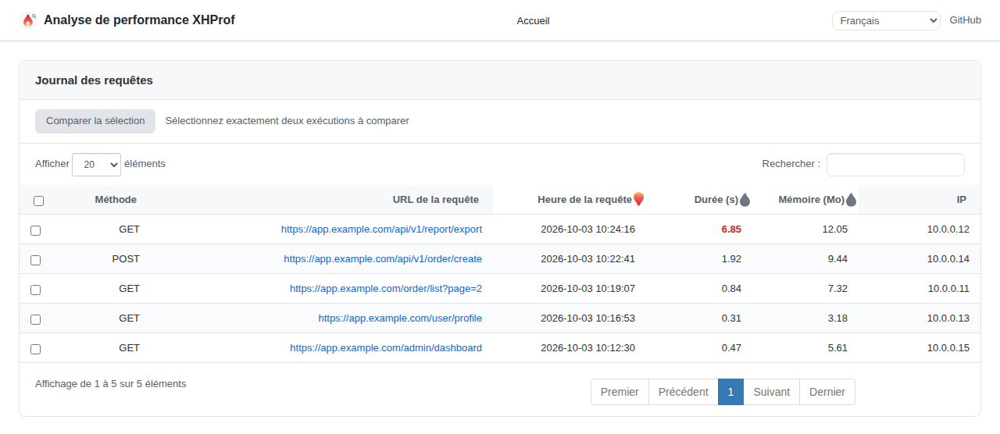
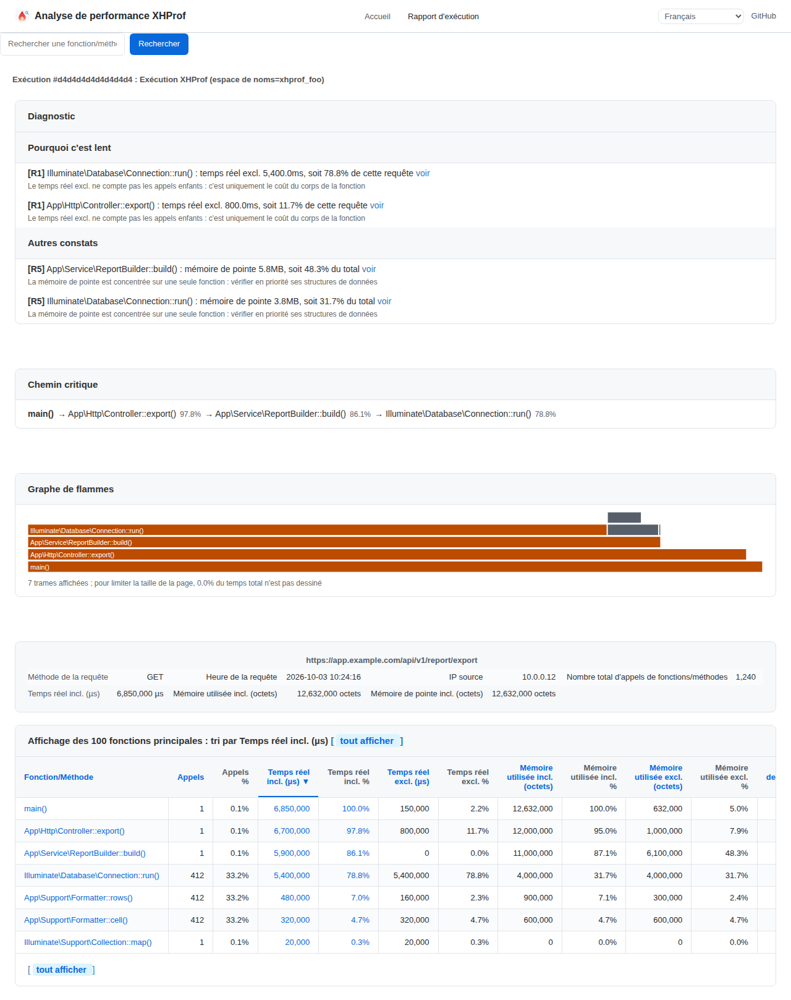
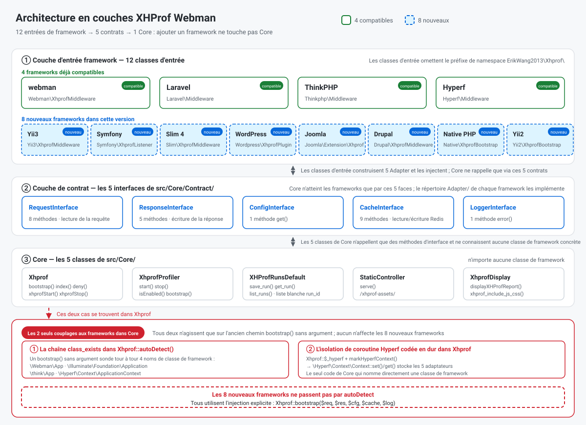
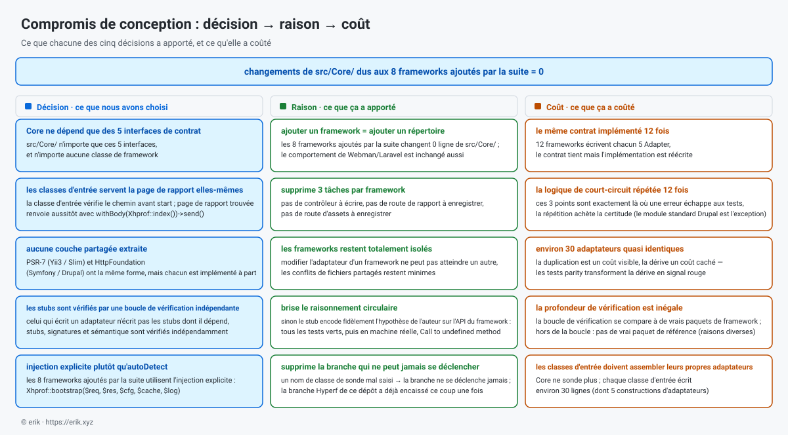
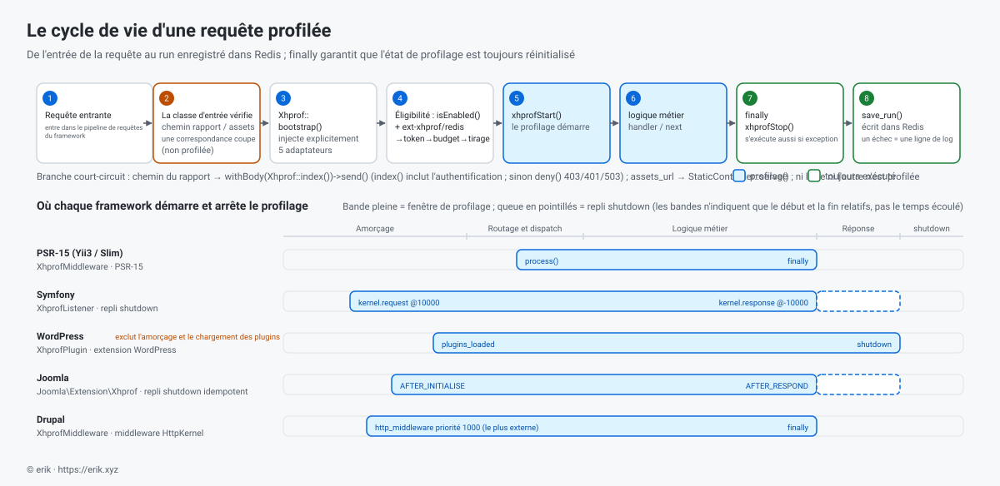

> **Traduction automatique.** Ce document a été traduit automatiquement et n'a pas été relu par un traducteur natif ; en cas de divergence, [la version anglaise](../en/README.md) fait foi.

[中文](../../../README.md) · [English](../en/README.md) · [한국어](../ko/README.md) · [Русский](../ru/README.md) · [Deutsch](../de/README.md) · **Français** · [Español](../es/README.md) · [Português](../pt/README.md) · [العربية](../ar/README.md) · [हिन्दी](../hi/README.md) · [বাংলা](../bn/README.md) · [Bahasa Indonesia](../id/README.md) · [日本語](../ja/README.md)

# Profileur de performance XHProf

   

Un plugin de profilage de performance du code, compatible avec webman / Laravel / ThinkPHP / Hyperf / Yii2 / Yii3 / Symfony / Slim 4 / WordPress / Joomla / Drupal et PHP natif (sans framework).

Il collecte les données de profilage via l'extension xhprof et les stocke dans Redis. Les développeurs accèdent rapidement, depuis un navigateur, aux rapports d'analyse de performance pour identifier les goulots d'étranglement du code.


La même petite flamme sert aussi d'icône de site, d'icône de marque en haut à gauche et d'icônes de tri dans les tableaux de la page de rapport (`src/html/pet.svg`, `src/html/images/sort_*.svg`, servie sous le préfixe `assets_url`).

**Journal des requêtes**



**Rapport d’une exécution**



**Comparer deux exécutions** — dans la liste du journal des requêtes, cochez exactement deux lignes (une case à cocher par ligne, une case « Tout sélectionner » dans l'en-tête) et cliquez sur « Comparer la sélection » pour ouvrir la vue diff. Les deux côtés sont ordonnés par heure (run1 = l'exécution la plus ancienne, run2 = la plus récente, indépendamment du tri courant de la liste) ; les couleurs signifient amélioration / régression « de run1 à run2 », et le lien « Inverser le rapport » de la page échange les deux côtés à tout moment.

## Prérequis

- PHP >= 8.0
- extension xhprof
- extension redis
- serveur Redis

## Frameworks compatibles et versions minimales

| Framework | Version minimale | PHP minimal | Classe d'entrée | Comment le monter |
|-----------|----------------|-------------|-------------|--------------|
| webman | `workerman/webman ^2.1` | 8.0 | `Webman\XhprofMiddleware` | Enregistrer le middleware global dans `config/middleware.php` |
| Laravel | `laravel/framework ^9.0\|^10.0\|^11.0` | 8.0 | `Laravel\Middleware` | Enregistrer le middleware global dans `app/Http/Kernel.php` |
| ThinkPHP | `topthink/framework ^6.0\|^8.0` | 8.0 | `Thinkphp\Middleware` | Enregistrer le middleware global dans `app/middleware.php` |
| Hyperf | `hyperf/framework ^3.0` | 8.0 | `Hyperf\Middleware` | Enregistrement automatique via ConfigProvider |
| Yii3 | `yiisoft/middleware-dispatcher ^5.0` | 8.1 | `Yii3\XhprofMiddleware` | À enregistrer dans `config/web/di/application.php`, en premier dans la liste des middlewares |
| Symfony | `symfony/http-kernel ^6.4\|^7.0` | 8.1 (6.4) / 8.2 (7.x) | `Symfony\XhprofListener` | Ajouter le tag `kernel.event_subscriber` dans `config/services.yaml` |
| Slim 4 | `slim/slim ^4.12` | 8.0 | `Slim\XhprofMiddleware` | `$app->add(...)`, à ajouter en dernier |
| WordPress | 6.4+ | 8.0 | `Wordpress\XhprofPlugin` | Copier dans `wp-content/mu-plugins/` |
| Joomla | 4.4 / 5.x | 8.1 | `Joomla\Extension\Xhprof` | Copier dans `plugins/system/`, installer via Discover |
| Drupal | 10.x / 11.x | 8.1 (10.x) / 8.3 (11.x) | module `xhprof` (`Drupal\XhprofMiddleware`) | Module standard, il suffit de l'activer |
| PHP natif (sans framework) | — (aucun paquet externe) | 8.0 | `Native\XhprofBootstrap` | Une ligne en haut du fichier d'entrée, `XhprofBootstrap::start()`, sans contrôleur ni route à enregistrer |
| Yii2 | `yiisoft/yii2 ^2.0` | 8.0 | `Yii2\XhprofBootstrap` | Enregistrer dans le tableau `bootstrap` de `config/web.php`, sans contrôleur ni route à enregistrer |

Les classes d'entrée vivent toutes sous le préfixe de namespace `ErikWang2013\Xhprof\` (omis ci-dessus).  Aucun des douze ne vous demande d'enregistrer un contrôleur ou une route : la page de rapport et les ressources statiques sont servies par la classe d'entrée elle-même (pour Drupal, par la route du module).

Ce paquet déclare `php >= 8.0`, mais les composants `yiisoft/*` dont Yii3 dépend exigent **PHP 8.1+**, donc **Yii3 n'est pas utilisable sur PHP 8.0** ; Symfony 7.x et Drupal 11.x demandent eux aussi une version de PHP plus élevée. La mise en place pas à pas se trouve dans « Configuration par framework » ci-dessous.

## Installation

Installez l'extension xhprof depuis PECL (2.3.x pour PHP 8) :

```sh
pecl install xhprof
```

Ajoutez la configuration xhprof dans php.ini :

```ini
[xhprof]
extension=xhprof.so
xhprof.output_dir=/tmp/xhprof
```

Installez via Composer :

```sh
composer require aaron-dev/xhprof-webman
```

### Démarrage rapide

Le chemin le plus court en trois étapes :

1. **Installer l'extension** — `pecl install xhprof`, et ajoutez une section `[xhprof]` au php.ini (`extension=xhprof.so`, `xhprof.output_dir=/tmp/xhprof`).
2. **Démarrer Redis** — `redis-server --daemonize yes`, ou utilisez une instance que vous avez déjà (les paramètres de connexion vont dans le sous-tableau `redis` du `config/xhprof.php` de chaque framework).
3. **Brancher et ouvrir la page de rapport** — `composer require aaron-dev/xhprof-webman`, montez la classe d'entrée dans un framework au choix en suivant « Configuration par framework », puis émettez une requête métier et ouvrez `http://<votre site>/xhprof`.

> **Pas envie d'installer quoi que ce soit ?** `demo/` fournit une démo docker compose prête à l'emploi (entrée PHP natif, sans aucun framework) : `cd demo && docker compose up -d`, puis ouvrez `http://127.0.0.1:8080/xhprof` pour voir une vraie page de rapport ; les explications sont dans `demo/README.md`.

### Dépannage rapide

| Symptôme | À vérifier en premier |
|---------|-------------|
| La page de rapport est vide et la liste ne contient aucune exécution | `enable` est-il à `true` ; `sample_rate` a-t-il été mis à `0` (seules les requêtes portant l'en-tête `X-Xhprof-Token` sont alors échantillonnées) ; `<key_prefix>:run_id` est-il vide dans Redis |
| La page de rapport renvoie 403 / 401 | 403 : `ip_allowlist` bloque l'IP courante (ou l'IP de la requête vient d'un en-tête de transfert alors que `trusted_proxies` est vide), ou `auth_token` est configuré et l'URL ne porte pas `?token=` ; 401 avec une invite d'identification du navigateur : `auth_basic` est configuré et le nom d'utilisateur / mot de passe saisi ne correspond pas |
| Erreurs de connexion à Redis | L'extension redis est-elle installée (`php -m` liste `redis`), Redis tourne-t-il, le host / port / password / database du sous-tableau `redis` correspondent-ils à l'instance |
| L'extension est installée mais les requêtes métier ne sont pas enregistrées | La classe d'entrée est-elle réellement montée (voir « Configuration par framework ») ; le chemin de la requête tombe-t-il dans `ignore_url_arr` ; `max_runs_per_minute` a-t-il atteint son plafond (plus rien n'est échantillonné avant la minute suivante) |
| La page de rapport s'ouvre mais son CSS/JS renvoie 404 | Le préfixe `assets_url` correspond-il au chemin déployé ; le reverse proxy transmet-il aussi ce préfixe à l'application |

---

## Configuration par framework

### Webman

**1. Enregistrer le middleware global** — `config/middleware.php` :

```php
return [
    '' => [
        ErikWang2013\Xhprof\Webman\XhprofMiddleware::class,
    ],
];
```

**2. Page de rapport et ressources statiques** — **aucun contrôleur ni route à enregistrer** : avant le début du profilage, le middleware inspecte le chemin de la requête : une correspondance sur le chemin de rapport `/xhprof` renvoie aussitôt la page de rapport, et une correspondance sur le chemin des ressources (préfixe lu depuis l'option `assets_url`, par défaut `/xhprof-assets`) renvoie directement la ressource statique.

**3. Configuration** — voir `config/plugin/aaron-dev/xhprof/xhprof.php`.

---

### Laravel

**1. Enregistrer le middleware** — `app/Http/Kernel.php` :

```php
protected $middleware = [
    // ...
    \ErikWang2013\Xhprof\Laravel\Middleware::class,
];
```

**2. Page de rapport et ressources statiques** — **aucun contrôleur ni route à enregistrer** : avant le début du profilage, le middleware inspecte le chemin de la requête : une correspondance sur le chemin de rapport `/xhprof` renvoie aussitôt la page de rapport, et une correspondance sur le chemin des ressources (préfixe lu depuis l'option `assets_url`, par défaut `/xhprof-assets`) renvoie directement la ressource statique.

**3. Publier la configuration** :

```sh
php artisan vendor:publish --tag=xhprof-config
```

Fichier de configuration dans `config/xhprof.php`. Laravel prend en charge l'auto-découverte du ServiceProvider.

---

### ThinkPHP

**1. Enregistrer le middleware** — `app/middleware.php` :

```php
return [
    \ErikWang2013\Xhprof\Thinkphp\Middleware::class,
];
```

**2. Page de rapport et ressources statiques** — **aucun contrôleur ni route à enregistrer** : avant le début du profilage, le middleware inspecte le chemin de la requête : une correspondance sur le chemin de rapport `/xhprof` renvoie aussitôt la page de rapport, et une correspondance sur le chemin des ressources (préfixe lu depuis l'option `assets_url`, par défaut `/xhprof-assets`) renvoie directement la ressource statique.

**3. Configuration** — copiez `vendor/aaron-dev/xhprof-webman/src/Thinkphp/config/xhprof.php` vers `config/xhprof.php` du projet.

---

### Hyperf

**1. Enregistrement automatique du middleware** — ConfigProvider ajoute automatiquement le middleware à la file des middlewares HTTP.

**2. Page de rapport et ressources statiques** — **aucun contrôleur ni route à enregistrer** : avant le début du profilage, le middleware inspecte le chemin de la requête : une correspondance sur le chemin de rapport `/xhprof` renvoie aussitôt la page de rapport, et une correspondance sur le chemin des ressources (préfixe lu depuis l'option `assets_url`, par défaut `/xhprof-assets`) renvoie directement la ressource statique.

**3. Publier la configuration** :

```sh
php bin/hyperf.php vendor:publish aaron-dev/xhprof-webman
```

Configuration produite dans `config/autoload/xhprof.php`.

---

### Yii3

**1. Enregistrer le middleware** — `config/web/di/application.php` :

```php
use ErikWang2013\Xhprof\Yii3\XhprofMiddleware;
use Yiisoft\Middleware\Dispatcher\MiddlewareDispatcher;

return [
    MiddlewareDispatcher::class => [
        'class' => MiddlewareDispatcher::class,
        // the first element is the outermost middleware (runs first, finishes last)
        'withMiddlewares()' => [[
            XhprofMiddleware::class,
            // ... other middlewares
        ]],
    ],
];
```

Deux erreurs faciles à commettre (toutes deux mesurées) :

- **N'écrivez pas** `'__construct()' => ['middlewares' => [...]]` : `MiddlewareDispatcher::__construct()` n'accepte qu'un `MiddlewareFactory` et un `EventDispatcherInterface` optionnel — il n'y a **aucun** paramètre `middlewares`. La liste des middlewares ne peut être injectée que par la **méthode d'instance** `withMiddlewares()`.
- **Ne mettez pas** une instance (`new XhprofMiddleware(...)`) dans `withMiddlewares()` : les définitions n'acceptent qu'une chaîne de classe, un tableau de définition ou un appelable. Avec une instance, l'enregistrement ne signale rien et `dispatch()` lève un `TypeError` (`MiddlewareFactory::create()` est typé `callable|array|string`).

**2. Page de rapport et ressources statiques** — **aucun contrôleur ni route à enregistrer** : `XhprofMiddleware` est un middleware PSR-15. Avant de démarrer le profilage, il inspecte le chemin de la requête : une correspondance sur le chemin de rapport `/xhprof` renvoie immédiatement la page de rapport, et une correspondance sur le chemin des ressources (préfixe par défaut `/xhprof-assets`) renvoie directement la ressource statique. La réponse de la page de rapport porte un `Content-Type: text/html; charset=UTF-8` explicite posé par la classe d'entrée : les réponses PSR-7 n'en ont aucun par défaut et l'émetteur de réponse de Yii3 n'en ajoute pas, donc sans cela les navigateurs affichent le rapport HTML en texte brut.

**3. Configuration** — les valeurs par défaut se trouvent dans le paquet, à `src/Yii3/config/xhprof.php` ; voir « Référence de configuration » pour les champs. Pour les remplacer, injectez `$config` via le DI :

```php
XhprofMiddleware::class => [
    'class' => XhprofMiddleware::class,
    '__construct()' => [
        'config' => [
            'enable' => true,
            'auth_token' => 'your-token',
            'redis' => [
                'host' => '127.0.0.1',
                'port' => 6379,
                'password' => '',
                'database' => 0,
                'timeout' => 1.0,
            ],
        ],
    ],
],
```

Le sous-tableau `redis` est spécifique à Yii3 : lorsqu'aucun `CacheInterface` n'est injecté, le middleware l'utilise pour parler directement à phpredis. Laissez `assets_url` peut être n'importe quel préfixe : les liens CSS/JS de la page de rapport et `StaticController` lisent la même option (par défaut `/xhprof-assets`). Les limites restantes en cas de déploiement dans un sous-répertoire sont dans [Vérification et limites connues](#vérification-et-limites-connues).

**4. Version requise** — les composants `yiisoft/*` dont Yii3 dépend exigent PHP >= 8.1. Bien que ce paquet déclare `php >= 8.0`, l'intégration Yii3 n'est pas utilisable sur PHP 8.0.

---

### Symfony

**1. Enregistrer l'abonné d'événements** — `config/services.yaml` :

```yaml
services:
    ErikWang2013\Xhprof\Symfony\XhprofListener:
        tags:
            - { name: kernel.event_subscriber }
```

**2. Page de rapport et ressources statiques** — **aucun contrôleur ni route à enregistrer** : avant de démarrer le profilage, l'écouteur inspecte le chemin de la requête : une correspondance sur le chemin de rapport `/xhprof` renvoie immédiatement la page de rapport, et une correspondance sur le chemin des ressources (préfixe par défaut `/xhprof-assets`) renvoie directement la ressource statique.

**3. Configuration** — les valeurs par défaut se trouvent dans le paquet, à `src/Symfony/config/xhprof.php` ; voir « Référence de configuration » pour les champs.

**4. Sous-requêtes et repli sur exception** — l'écouteur écoute `kernel.request` (priorité 10000) et `kernel.response` (priorité -10000). `isMainRequest()` filtre les sous-requêtes ESI/fragment, qui sinon arrêteraient le profilage trop tôt ; un `register_shutdown_function` idempotent est également enregistré au démarrage de la requête — si HttpKernel relance une exception, `kernel.response` n'est jamais déclenché, et sans ce repli l'état de profilage fuiterait dans la requête suivante.

---

### Slim 4

**1. Enregistrer le middleware** — `public/index.php` :

```php
use ErikWang2013\Xhprof\Slim\XhprofMiddleware;

$app->addRoutingMiddleware();

// must be added last: Slim's middleware stack is LIFO, added later = further out = runs first
$app->add(new XhprofMiddleware(
    $app->getResponseFactory()
));
```

Les trois autres arguments du constructeur sont tous optionnels ; omettez-les pour utiliser les valeurs par défaut du paquet :

- Argument 2, `array $config` : votre tableau de configuration, fusionné par-dessus `src/Slim/config/xhprof.php` du paquet avec `array_replace` (remplacement de valeur entière — les clés de type liste comme `ignore_url_arr` ne sont jamais fusionnées récursivement).
- Argument 3, `CacheInterface $cache` : omis, il fait paresseusement `new \Redis()` (le constructeur ne touche volontairement jamais à ext-redis, pour qu'une extension manquante ne fasse pas tout exploser pendant la construction de l'adaptateur). Pour injecter votre propre connexion, passez `new \ErikWang2013\Xhprof\Slim\Adapter\RedisAdapter($redis)`, ou tout objet implémentant `ErikWang2013\Xhprof\Core\Contract\CacheInterface`.
- Argument 4, `LoggerInterface $logger` : omis, c'est `new \ErikWang2013\Xhprof\Slim\Adapter\LogAdapter()` et **les logs sont silencieusement jetés** (Slim ne fournit aucun logger PSR-3). Pour les conserver, passez `new LogAdapter($psrLogger)`, où `$psrLogger` est un logger PSR-3 que vous avez déjà.

**N'écrivez pas `$app->add(XhprofMiddleware::class)`** : le `CallableResolver` de Slim transforme cette chaîne de classe en `new XhprofMiddleware($container)` — en ne passant que le conteneur, et en différant la résolution jusqu'au moment de la requête. Résultat : `add()` ne signale rien et la première requête lève un `TypeError` — le mode de défaillance le plus difficile à diagnostiquer. Utilisez toujours le `new` explicite ci-dessus.

**2. Page de rapport et ressources statiques** — **aucun contrôleur ni route à enregistrer** : avant de démarrer le profilage, le middleware inspecte le chemin de la requête : une correspondance sur le chemin de rapport `/xhprof` renvoie immédiatement la page de rapport, et une correspondance sur le chemin des ressources (préfixe par défaut `/xhprof-assets`) renvoie directement la ressource statique.

**3. Configuration** — les valeurs par défaut se trouvent dans le paquet, à `src/Slim/config/xhprof.php` ; voir « Référence de configuration » pour les champs.

**4. Ordre de montage** — la pile de middlewares de Slim est LIFO (mesuré avec deux middlewares, l'ordre d'exécution est `B:before → A:before → A:after → B:after`) : plus vous `add()` tard, plus le middleware est à l'extérieur et plus il s'exécute tôt. xhprof doit donc être ajouté **en dernier**, et **après `addRoutingMiddleware()`** — sinon `/xhprof` n'est pas dans la table de routage, RoutingMiddleware lève `HttpNotFoundException` en premier, et la requête n'atteint jamais le middleware. La réponse de la page de rapport porte un `Content-Type: text/html; charset=UTF-8` explicite posé par la classe d'entrée : les réponses PSR-7 n'en ont aucun par défaut et le `ResponseEmitter` de Slim n'en ajoute pas, donc sans cela les navigateurs affichent le rapport HTML en texte brut.

---

### WordPress

**1. Installer le mu-plugin** — copiez le fichier d'amorçage du paquet dans `wp-content/mu-plugins/` :

```sh
cp vendor/aaron-dev/xhprof-webman/wordpress/xhprof-webman.php wp-content/mu-plugins/
```

`wordpress/xhprof-webman.php` porte un en-tête de plugin et amorce `Wordpress\XhprofPlugin`. Les mu-plugins sont chargés automatiquement — rien à activer dans wp-admin.

**2. Page de rapport et ressources statiques** — **aucun contrôleur ni route à enregistrer** : avant de démarrer le profilage, la classe d'entrée inspecte le chemin de la requête : une correspondance sur le chemin de rapport `/xhprof` renvoie immédiatement la page de rapport, et une correspondance sur le chemin des ressources (préfixe par défaut `/xhprof-assets`) renvoie directement la ressource statique.

**3. Configuration** — les valeurs par défaut se trouvent dans le paquet, à `src/Wordpress/config/xhprof.php` ; voir « Référence de configuration » pour les champs. Utilisez `ignore_url_arr` pour exclure les chemins à forte fréquence comme `wp-cron.php` et `admin-ajax.php`.

Pour remplacer la configuration (adresse Redis, `auth_token`, …), définissez une constante dans `wp-config.php` (le mu-plugin est chargé suffisamment tard pour que la constante soit déjà disponible) :

```php
define('XHPROF_WEBMAN_CONFIG', [
    'auth_token' => 'your-token',
    'redis' => ['host' => '127.0.0.1', 'port' => 6379, 'password' => '', 'database' => 0],
]);
```

Vous pouvez aussi utiliser le filtre `xhprof_webman_config` (depuis un thème ou une extension) : il s'applique par-dessus la constante, avec la même forme de tableau.

**4. Une limite structurelle de la fenêtre de profilage** — la fenêtre va de `plugins_loaded` à `shutdown`, ce qui **n'inclut pas** l'amorçage de `wp-settings.php` ni le chargement des plugins lui-même. C'est une limite structurelle de WordPress : le travail effectué dans cette phase ne peut pas être profilé.

---

### Joomla

**1. Installer le plugin** — copiez le répertoire `joomla/` du paquet dans le `plugins/system/xhprof/` du site :

```sh
cp -r vendor/aaron-dev/xhprof-webman/joomla/ plugins/system/xhprof/
```

Le répertoire `joomla/` du paquet *est* le plugin : le manifeste `xhprof.xml`, `services/provider.php`, et `src/Extension/Xhprof.php`. La classe d'entrée est `ErikWang2013\Xhprof\Joomla\Extension\Xhprof` (un `CMSPlugin`). Après la copie, lancez Discover via « Système → Gérer → Extensions → Discover » puis installez/activez le plugin.

**2. Page de rapport et ressources statiques** — **aucun contrôleur ni route à enregistrer** : avant de démarrer le profilage, le plugin inspecte le chemin de la requête : une correspondance sur le chemin de rapport `/xhprof` renvoie immédiatement la page de rapport, et une correspondance sur le chemin des ressources (préfixe par défaut `/xhprof-assets`) renvoie directement la ressource statique.

**3. Configuration** — les valeurs par défaut se trouvent dans le paquet, à `src/Joomla/config/xhprof.php` ; voir « Référence de configuration » pour les champs. **Compromis connu** : le plugin lit le fichier de configuration du paquet plutôt que les paramètres du plugin — ces paramètres exigeraient une lecture en base de données, et la configuration est lue à chaque requête.

**4. Limites du profilage** — la fenêtre va de `ApplicationEvents::AFTER_INITIALISE` à `ApplicationEvents::AFTER_RESPOND` ; un `register_shutdown_function` idempotent est également enregistré dans `AFTER_INITIALISE`, car `AFTER_RESPOND` n'est pas garanti d'être atteint sur le chemin d'exception — sans ce repli, l'état de profilage fuiterait dans la requête suivante.

---

### Drupal

**1. Activer le module** — `drupal/xhprof/` dans le paquet est un module Drupal standard (`xhprof.info.yml` / `xhprof.routing.yml` / `xhprof.services.yml`). Placez-le dans `modules/custom/xhprof/` de votre site, puis activez-le sur la page « Étendre » (ou avec `drush en xhprof`).

**2. Page de rapport et ressources statiques** — Drupal est **le seul des douze frameworks à passer par « module + routes »** : `xhprof.routing.yml` enregistre le chemin de rapport `/xhprof` et celui des ressources `/xhprof-assets`, servis par défaut par le contrôleur du module ; les onze autres classes d'entrée court-circuitent avant le début du profilage et servent la page de rapport et les ressources statiques sans enregistrer de route. **Avec un préfixe `assets_url` personnalisé, les ressources passent au middleware** : le chemin de la route de ressources du module est figé dans `xhprof.routing.yml` (`/xhprof-assets/{file}`) et ne correspond jamais à un autre préfixe.

**3. Configuration** — la configuration est une configuration typée au niveau du module : les valeurs par défaut se trouvent dans `drupal/xhprof/config/install/xhprof.settings.yml`, avec le schéma dans `drupal/xhprof/config/schema/xhprof.schema.yml`. Voir « Référence de configuration » pour les champs.

**4. Enregistrement du middleware** — enregistrez le service de middleware dans le `xhprof.services.yml` du module :

```yaml
services:
  xhprof.http_middleware:
    class: ErikWang2013\Xhprof\Drupal\XhprofMiddleware
    arguments: ['@config.factory', '@logger.factory']
    tags:
      - { name: http_middleware, priority: 1000 }
```

Le kernel interne est **préfixé automatiquement comme argument de constructeur 0** par le `StackedKernelPass` de Drupal — **ne l'écrivez pas vous-même** : cela produirait deux kernels internes, ce qui échoue à la compilation du conteneur sur Drupal <= 11.2.x (y compris tous les 10.x) et lève un TypeError à chaque requête sur 11.3.0 et au-delà. Le profilage s'arrête dans `finally`.

**5. Remarques**

- `priority: 1000` place le middleware **en dehors du cache de page** (la priorité la plus haute déjà présente dans le core est negotiation : 400 sur D10, 500 sur D11, tandis que le cache de page est à 200), donc **les requêtes servies depuis le cache de page de Drupal sont tout de même profilées**. Pour un outil de profilage c'est le comportement attendu, mais les utilisateurs doivent le savoir.
- Le cache fonctionne sans configuration : le middleware utilise par défaut l'adaptateur Redis fourni avec ce paquet (le paquet dépend durement de ext-redis), et il accepte aussi un argument `CacheInterface` optionnel via `arguments` dans `services.yml` pour le remplacer. Si le cache est indisponible, un échec d'enregistrement est absorbé par `XhprofProfiler::stop()` en une seule ligne de log — **aucune erreur n'est levée**.
- Les requêtes vers la page de rapport `/xhprof` et vers `/xhprof-assets/*` **ne sont pas profilées** : le middleware ignore le profilage par chemin avant `xhprofStart()`. La réponse est tout de même produite par le Controller de `xhprof.routing.yml` (**ce n'est pas un court-circuit**). Donc même avec `ignore_url_arr` à `[]` (aucun filtrage), ces deux requêtes n'apparaissent jamais dans le rapport.

### PHP natif (sans framework)

Pour les applications sans framework, avec un seul contrôleur frontal (un `public/index.php` par exemple).

**1. Ajoutez une ligne en haut du fichier d'entrée** :

```php
\ErikWang2013\Xhprof\Native\XhprofBootstrap::start();
```

Pour changer la configuration, passez le tableau à cette ligne (même jeu de clés que les onze autres ; les valeurs par défaut sont dans `src/Native/config/xhprof.php`) :

```php
\ErikWang2013\Xhprof\Native\XhprofBootstrap::start([
    'enable' => true,
    'auth_token' => 'xxx',
]);
```

Les deuxième et troisième arguments sont des points d'injection facultatifs : `CacheInterface $cache` et `LoggerInterface $logger` (par défaut l'adaptateur Redis de ce paquet et `error_log`). La valeur de retour est l'instance d'entrée de cette requête (`stop()` est idempotente) ; appelez-la pour arrêter plus tôt dans le même processus.

**2. Page de rapport et ressources statiques** — **aucun contrôleur ni route à enregistrer** : cette ligne inspecte le chemin de la requête avant le début du profilage : une correspondance sur le chemin de rapport `/xhprof` renvoie aussitôt la page de rapport (avec `Content-Type: text/html; charset=UTF-8` et `Cache-Control: no-cache, private`, `auth_token` s'applique comme ailleurs), une correspondance sur le chemin des ressources (préfixe lu dans l'option `assets_url`, par défaut `/xhprof-assets`) renvoie directement la ressource statique. **Le coût est dit franchement** : une fois ces deux chemins traités, un `exit` suit — le reste de la requête (les routes après cette ligne, l'amorçage du conteneur, le démarrage de session, et la logique de fin enregistrée par l'application elle-même) ne s'exécute pas.

**3. Fenêtre de profilage = cette ligne → arrêt du processus** (c'est `register_shutdown_function` qui est enregistrée). **Les limites, sans arrondi** : elle n'inclut pas le code **avant** cette ligne (autoload composer, amorçage du contrôleur frontal), ni ce que font d'autres processus ou extensions (l'analyse de la requête côté php-fpm, le traitement côté nginx). Une fin normale, `exit`, un Error ou une exception non interceptée atteignent le point d'arrêt ; `SIGKILL` / l'OOM killer non — l'état du profilage disparaît avec le processus et ne subsiste pas pour la requête suivante. Pour resserrer la portée, l'option `ignore_url_arr` (correspondance de sous-chaîne sur `uri()`, effet sans toucher au code).

**4. Lancez-le pour de vrai avec `php -S`** :

```sh
# En haut de public/index.php se trouve XhprofBootstrap::start() ; ce fichier est le contrôleur frontal
php -S 127.0.0.1:8000 -t public public/index.php
```

Ouvrez `http://127.0.0.1:8000/` pour produire des données, puis `http://127.0.0.1:8000/xhprof` pour la page de rapport — les deux dans le même processus, et les ressources sont vérifiées au passage.

---

### Yii2

Pour Yii2 (`yiisoft/yii2 ^2.0`, PHP >= 8.0). **Ce n'est pas le même framework que Yii3** : Yii3 est la réécriture PSR-15, tandis que Yii2 embarque son propre couple `yii\web\Request` / `Response` et son propre cycle de vie applicatif, d'où une classe d'entrée distincte.

**1. Enregistrer la classe d'amorçage** — `config/web.php` :

```php
'bootstrap' => [
    [
        'class' => \ErikWang2013\Xhprof\Yii2\XhprofBootstrap::class,
        'config' => ['auth_token' => 'xxx'],   // optional; see src/Yii2/config/xhprof.php
    ],
],
```

C'est la forme standard du point d'extension officiel de Yii2, `yii\base\BootstrapInterface` : la clé `config` de la définition en tableau est affectée à la classe d'entrée comme **propriété publique** par le conteneur (`cache` / `logger` sont des points d'injection de la même façon — passez une instance pour remplacer l'adaptateur Redis par défaut ou `error_log`).

**2. Page de rapport et ressources statiques** — **aucun contrôleur, aucune route, aucune modification de l'urlManager** : la classe d'amorçage inspecte le chemin de la requête sur `Application::EVENT_BEFORE_REQUEST`, sert directement la page de rapport sur le chemin de rapport `/xhprof` et termine la requête, et sert les ressources statiques sur le préfixe des ressources (lu dans l'option `assets_url`, par défaut `/xhprof-assets`). Les deux chemins court-circuitent avant le début du profilage.

**3. Fenêtre de profilage = `EVENT_BEFORE_REQUEST` → `EVENT_AFTER_REQUEST`.** À noter que Yii2 déclenche `EVENT_AFTER_REQUEST` **avant** l'envoi de la réponse (`run()` dans `base/Application.php`), donc l'envoi de la réponse n'est pas dans la fenêtre. **Le chemin d'exception repose sur le repli shutdown** : `run()` n'attrape que `ExitException`, donc toute autre exception levée par votre code fait que `EVENT_AFTER_REQUEST` ne se déclenche jamais — la classe d'entrée enregistre donc un repli `register_shutdown_function` au démarrage du profilage (même forme que Symfony / Joomla).

**4. Les applications console ne sont pas touchées** — `yii\console\Application` ne redéfinit pas `run()`, donc les commandes CLI (cron, migrations, files d'attente) **déclenchent bel et bien** `EVENT_BEFORE_REQUEST` ; la classe d'entrée vérifie d'abord `instanceof yii\web\Application` dans `bootstrap()` et n'attache aucun hook pour les consoles.

**5. L'IP client suit la sémantique du framework** — `getRealIp()` délègue à `Request::getUserIP()` : par défaut, Yii2 filtre les en-têtes de transfert tels que `X-Forwarded-For` via `secureHeaders` (son défaut sûr), donc derrière un reverse proxy vous obtenez `REMOTE_ADDR`. Pour enregistrer la vraie IP client, configurez `trustedHosts` sur le composant request de l'application (une fois configuré, Yii2 renvoie la première adresse non fiable en parcourant de droite à gauche — délibérément différent des autres adaptateurs, qui prennent toujours la première entrée). C'est une décision de sécurité du framework lui-même ; ce paquet ne décide pas à qui un site doit faire confiance.

**6. Configuration** — les valeurs par défaut se trouvent dans `src/Yii2/config/xhprof.php` et se remplacent par la clé `config` de l'étape 1 ; le sous-tableau `redis` facultatif (utilisé pour se connecter directement à phpredis quand aucun `cache` n'est injecté) prend les mêmes clés que les autres frameworks : `host` / `port` / `password` / `database` / `timeout`.

---

## Référence de configuration

Tous les frameworks partagent ces options de configuration :

| Configuration | Type | Défaut | Description |
|--------|------|---------|-------------|
| `enable` | bool | `true` | Active/désactive le profilage |
| `sample_rate` | float | `1.0` | Échantillonnage proportionnel : chaque requête est enregistrée avec cette probabilité (p. ex. `0.05` = 5 % des requêtes) ; `1.0` = tout échantillonner, `<=0` ou `false` = ne rien échantillonner |
| `trigger_token` | string\|null | `null` | Échantillonnage à la demande : une fois défini, toute requête portant l'en-tête `X-Xhprof-Token: <value>` est **toujours échantillonnée** (ignore `sample_rate`, même `0`) ; `null` ou chaîne vide = désactivé, l'en-tête est alors totalement ignoré. En-tête uniquement, **jamais de paramètre de requête**. Il peut forcer l'échantillonnage complet de n'importe quelle requête : utilisez une valeur longue et aléatoire, et ne la partagez qu'avec des personnes de confiance |
| `auth_basic` | string\|null | `null` | Identifiant HTTP Basic (`user:password`, coupé au premier deux-points ; le mot de passe peut contenir des deux-points). Relation **ou** avec `auth_token` : l'un configuré est appliqué, l'un validé laisse passer ; aucun des deux = pas d'authentification. **Apache+CGI/FastCGI supprime l'en-tête `Authorization` par défaut** (nécessite `CGIPassAuth On`, 2.4.13+) ; nginx+php-fpm n'est pas concerné |
| `ip_allowlist` | array | `[]` | Liste d'autorisation d'IP de la page de rapport, comparée **octet par octet** : pas de plages CIDR, pas de normalisation IPv6 (`2001:0db8::1` et `2001:db8::1` sont deux chaînes différentes). Vide = désactivé ; une valeur qui n'est pas un tableau refuse tout (fail closed, une entrée d'erreur dans les logs). La valeur vient de `getRealIp()` et se lit avec `trusted_proxies` |
| `trusted_proxies` | array | `[]` | **Une déclaration de déploiement, pas une contrainte technique** : ce n'est qu'après avoir déclaré « il y a un proxy de confiance devant moi » que `ip_allowlist` acceptera une IP client tirée de `X-Forwarded-For`/`X-Real-IP`. La plupart des adaptateurs prennent les en-têtes de transfert sans condition — cette déclaration n'empêche **pas** un XFF falsifié, elle n'est donc sûre que derrière un proxy que vous contrôlez |
| `webhook_url` | string\|null | `null` | Après l'enregistrement d'une exécution lente (`wt >= view_wtred`), POST d'un JSON (`run_id`/`uri`/`wt`/`ct`/`ip`/`time`) vers cette adresse. Vide = rien n'est envoyé. **Ce n'est pas une file d'attente** : il n'attend pas de réponse, sans réessai ni repli sur disque ; un point de terminaison lent ou mort perd simplement cette notification |
| `sample_cli` | bool | `false` | Échantillonner aussi la CLI / les requêtes sans HTTP : à `true`, le `request_uri` enregistré d'une exécution vaut `cli:<nom du script>` ; `false` = toujours ignoré (le défaut, y compris les workers de file d'attente et les tâches planifiées) |
| `symbol_lookup_url` | string\|null | `null` | Modèle de lien vers le code source : la page de rapport rend `<modèle>?symbol=<nom de fonction urlencodé>` ; `null`/vide = aucun lien |
| `max_runs_per_minute` | int\|null | `null` | Budget adaptatif : nombre maximal d'exécutions enregistrées par minute (compteur par minute ; au-delà, plus rien n'est échantillonné) ; `null`/non positif = désactivé. Quand le cache est indisponible ou lève une exception, échec ouvert (fail-open) : l'échantillonnage suit `sample_rate` comme d'habitude ; **l'échantillonnage déclenché n'y est pas soumis** |
| `time_limit` | int | `0` | Ne profiler que les requêtes dépassant n secondes, 0 signifie toutes |
| `log_num` | int | `1000` | Nombre maximal d'enregistrements |
| `view_wtred` | int | `3` | Met en rouge les lignes dont le temps de réponse dépasse n secondes |
| `ignore_url_arr` | array | `["/xhprof"]` | Chemins d'URL à ignorer |
| `assets_url` | string | `/xhprof-assets` | Préfixe d'URL des ressources statiques |
| `auth_token` | string\|null | `null` | Si défini, la page de rapport exige `?token=xxx`. **Par défaut, `null` signifie aucune authentification** : la classe d'entrée prend en charge la page de rapport et ses ressources statiques **avant** que l'authentification de l'application hôte ne s'exécute (voir le compromis dans « Page de rapport et ressources statiques »), donc sans jeton, quiconque peut atteindre ce chemin peut lire l'URI de requête, l'IP source et les noms de fonctions de toutes les exécutions — les déploiements publics et multi-locataires **doivent** le définir ; s'il n'est pas défini, chaque rendu consigne un avertissement dans les logs |
| `key_prefix` | string | `xhprof` | Préfixe des clés Redis ; utilisez des valeurs distinctes par projet lorsque vous partagez un Redis |
| `log_ttl` | int | `604800` | Durée de conservation des données en secondes (7 jours par défaut) |
| `locale` | string\|null | `null` | Langue de la page de rapport : `zh_CN`/`en`/`ko`/`ru`/`de`/`fr`/`es`/`pt`/`ar`/`hi`/`bn`/`id`/`ja` ; `null` = suivre l'`Accept-Language` du navigateur, sinon le chinois ; `?lang=xx` la remplace pour une requête |

Les limites connues de ces options sur chaque framework sont listées dans [Vérification et limites connues](#vérification-et-limites-connues).

Réduire `sample_rate` est le seul moyen de réduire la surcharge proportionnellement (`0.05` n'enregistre que 5 % des requêtes) ; `ignore_url_arr` exclut toujours des chemins entiers, et les deux se cumulent. La décision est prise une fois par requête, au point d'entrée de l'échantillonnage, et n'affecte pas la lecture ni la conservation des données déjà enregistrées. Les valeurs invalides (p. ex. `'5%'`, `'disabled'`) retombent sur `1.0` : mieux vaut trop échantillonner que ne rien enregistrer en silence, ce qui ferait paraître la page de rapport cassée.

Pour purger les données de profilage : pour ne vider que la page de liste, utilisez `DEL <prefix>:run_id` — les clés de données expirent d'elles-mêmes via `log_ttl`, et les id orphelins laissés dans l'index sont ignorés par la liste ; pour tout purger, listez `<prefix>:request_log:*` et `<prefix>:xhprof_log:*` puis supprimez-les ainsi que la liste d'index (`DEL` n'accepte pas de jokers : listez d'abord les clés avec `redis-cli --scan --pattern '<prefix>:*'`, et n'utilisez pas `KEYS`). La liste d'index n'a volontairement pas de TTL : elle est bornée par `log_num` et n'est qu'une liste de pointeurs vers les clés de données (`<prefix>` est la valeur de `key_prefix` configurée pour ce projet).

**Échantillonnage déclenché (`trigger_token`)**

Le déclenchement à la demande et l'échantillonnage proportionnel sont deux axes indépendants — le déclencheur est jugé d'abord, le tirage ensuite : une fois `trigger_token` défini, la production peut abaisser `sample_rate` à `0` (aucun échantillonnage en fonctionnement normal) et, en cas de besoin d'investigation, envoyer une requête avec l'en-tête `X-Xhprof-Token`, qui sera alors échantillonnée intégralement. La clé est comparée avec `hash_equals`, à temps constant ; elle n'est acceptée que sur l'en-tête de requête — ne la passez pas dans la chaîne de requête (les chaînes de requête finissent dans les journaux d'accès, le `Referer` et l'historique du navigateur). Un déclenchement ne contourne pas `ignore_url_arr` (les requêtes vers la page de rapport et vers les ressources statiques restent ignorées même avec la clé), et `enable: false` reste l'interrupteur principal.

**Authentification de la page de rapport (`auth_token` et `auth_basic`)**

`auth_token` (`?token=xxx`) et `auth_basic` (HTTP Basic) sont en relation **ou** : l'un configuré est appliqué, l'un validé laisse passer ; aucun des deux = pas d'authentification (le défaut, avec une entrée d'avertissement dans les logs à chaque rendu). Un identifiant Basic a la forme `user:password` (coupé au premier deux-points ; le mot de passe peut contenir des deux-points, et les deux segments — nom d'utilisateur et mot de passe — sont comparés avec `hash_equals`) ; quand Basic est configuré et que la vérification échoue, la réponse est 401 avec `WWW-Authenticate` — la seule chose qui fait apparaître l'invite d'identification du navigateur — tandis qu'un échec du seul jeton renvoie 403. **Ne pas authentifier par défaut est une décision délibérée** : la classe d'entrée prend en charge la page de rapport **avant** l'authentification de l'application hôte, donc sans rien de configuré, quiconque peut atteindre ce chemin peut lire l'URI de requête, l'IP source et les noms de fonctions de toutes les exécutions — les déploiements publics et multi-locataires **doivent** configurer l'un des deux. **Piège de déploiement** : Apache + CGI/FastCGI supprime l'en-tête `Authorization` par défaut, donc Basic ne peut jamais correspondre (il renvoie simplement 401 en boucle) — il faut `CGIPassAuth On` (2.4.13+) ou une variable transférée équivalente ; nginx + php-fpm n'est pas concerné.

**Liste d'autorisation d'IP et proxys de confiance (`ip_allowlist` / `trusted_proxies`)**

La liste d'autorisation compare **octet par octet** : pas de plages CIDR et pas de normalisation IPv6 (`2001:0db8::1` et `2001:db8::1` sont deux chaînes différentes) ; vide = désactivé ; une valeur qui n'est pas un tableau **refuse tout** et consigne une entrée d'erreur (fail closed — la désactiver en silence reviendrait à abandonner discrètement une couche de contrôle de sécurité). La valeur vérifiée vient du `getRealIp()` de l'adaptateur, et la plupart des adaptateurs prennent l'en-tête de transfert **sans condition** quand ils voient `X-Forwarded-For` / `X-Real-IP` : comparer directement cette valeur permettrait à n'importe quel client de falsifier sa propre adresse et de contourner la liste d'autorisation. D'où `trusted_proxies` : quand la valeur d'IP vient précisément d'un en-tête de transfert, une déclaration `trusted_proxies` non vide est exigée, sinon la requête est refusée et consignée dans les logs. **C'est une déclaration de déploiement, pas une contrainte technique** : la déclarer n'empêche pas un XFF falsifié, et elle n'est sûre que lorsque l'application tourne réellement derrière un proxy que vous contrôlez — la confiance dans les sauts intermédiaires relève de votre configuration de proxy. Le filtre de la liste d'autorisation s'exécute avant la vérification des identifiants (un refus renvoie 403).

**Webhook des requêtes lentes (`webhook_url`)**

Après l'enregistrement d'une exécution dont le temps de réponse est `wt >= view_wtred`, un JSON (champs : `run_id` / `uri` / `wt` / `ct` / `ip` / `time`) est POSTé vers cette adresse. Vide = rien n'est envoyé. **Ce n'est pas une file d'attente** : fire-and-forget — connexion, écriture de la requête, fermeture de la socket, sans jamais attendre de réponse ni lire le code de statut, sans réessai ni repli sur disque ; un point de terminaison lent ou mort perd simplement cette notification (le délai de connexion est réduit à 200 ms, la résolution DNS n'y étant pas soumise). Toute défaillance consigne une entrée d'erreur et n'affecte jamais la requête métier. La liste met en rouge les lignes avec un `>` strict, alors que la condition du webhook est `>=` — la borne diffère d'un cran.

**Budget adaptatif (`max_runs_per_minute`)**

Nombre maximal d'exécutions enregistrées par minute : ce qui est compté est **le nombre de requêtes atteignant le point d'entrée de l'échantillonnage** (y compris celles qui perdent le tirage — il est jugé avant le tirage), au-delà plus rien n'est échantillonné jusqu'au passage à la minute suivante ; `null`/non positif = désactivé. Le compteur vit dans le cache : une clé `<key_prefix>:budget:<YmdHi>` (p. ex. `xhprof:budget:202610032316`) apparaît dans Redis, dotée d'un TTL de 120 secondes à son premier incr et expirant d'elle-même (retour à zéro) — la voir pendant une vérification d'exploitation est normal. Quand le cache est indisponible ou lève une exception, le mécanisme **échoue ouvert** (fail-open) : l'échantillonnage suit `sample_rate` comme d'habitude, et jamais le budget ne fait échouer une requête ni n'arrête silencieusement l'échantillonnage. **L'échantillonnage déclenché n'y est pas soumis** : quelqu'un qui détient le jeton pour investiguer ne doit pas être bloqué par le budget (ordre de décision : déclenchement → budget → tirage).

**Sélecteur de langue de la page de rapport**

La liste déroulante à droite de la navigation énumère les 13 langues par leur **nom propre** (le `_meta.name` de chaque catalogue, p. ex. 한국어, 日本語). Le lien de chaque option est construit à partir de **la chaîne de requête de la page courante** (`XhprofLib::report_url()`) : `?token=`, le tri, `run` et tous les autres paramètres suivent donc ; changer de langue **ne quitte pas la vue courante** — sur un rapport d'exécution, on reste sur la même exécution.

**Diagnostic sur la page de rapport**

La carte tout en haut du corps du rapport est le « Diagnostic » (juste sous la description de l'exécution) : d'abord « Pourquoi c'est lent » (3 causes au plus), puis « Autres constats » (3 points de contrôle au plus). Le lien « voir » après chaque constat ouvre la page de détail de la méthode ; la récursion (R4) ne porte un lien que si le nom simple est réellement présent dans la table des symboles — xhprof déploie la récursion en `fib@1`/`fib@2`, et s'il ne reste que les noms déployés, chercher `fib` ne trouve rien. Les six règles et leurs seuils :

- **R1** temps réel excl. ≥ 10 % du temps total de la requête ;
- **R2** nombre d'appels ≥ 1000 ;
- **R3** appels d'une même relation ≥ 500 **et** temps réel excl. de la fonction appelée ≥ 5 % du temps total de la requête ;
- **R4** un même symbole apparaît à ≥ 2 profondeurs différentes (récursion) ;
- **R5** mémoire de pointe propre ≥ 30 % de la pointe globale ;
- **R6** temps réel excl. > temps réel incl. (`excl_wt > wt`, logiquement impossible) — une sonde d'intégrité des données, qui ne se déclenche jamais sur des données saines.

Les seuils sont des constantes de `src/Core/Analysis/Analyzer.php`, et **aucune option de configuration** ne permet aujourd'hui de les modifier ni de désactiver la carte (`enable` désactivé, rien n'est échantillonné, donc il n'y a rien à diagnostiquer). Elle n'apparaît **que dans la vue d'exécution unique de premier niveau** : ni la vue diff ni la page de détail d'une méthode ne la rendent — les `$symbol_tab`/`$totals` qui y sont passés ne sont pas des valeurs d'une seule exécution (en mode diff, ce sont les deltas run2 − run1).

---

## Initialisation manuelle

Si la détection automatique du framework échoue, vous pouvez injecter les adaptateurs manuellement :

```php
use ErikWang2013\Xhprof\Core\Xhprof;

Xhprof::bootstrap(
    new MyRequestAdapter($request),
    new MyResponseAdapter($response),
    new MyConfigAdapter(),
    new MyCacheAdapter(),
    new MyLoggerAdapter()
);
```

**En dehors des quatre frameworks que connaît `autoDetect()`, les huit autres (Yii2 / Yii3 / Symfony / Slim 4 / WordPress / Joomla / Drupal / PHP natif) ne doivent pas appeler `Xhprof::bootstrap()` sans argument** — sans argument, il passe par `autoDetect()`, qui ne connaît que les branches webman / Laravel / ThinkPHP / Hyperf et lève `Unsupported framework` sur ces huit frameworks. Passez les 5 adaptateurs explicitement comme dans l'exemple ci-dessus (la classe d'entrée fournie avec chaque framework le fait déjà pour vous).

---

## Architecture et conception

Core atteint le framework par exactement 5 contrats, tous dans `src/Core/Contract/` :

| Contrat | Méthodes | Rôle |
|----------|---------|---------|
| `RequestInterface` | `get()` `all()` `method()` `header()` `host()` `uri()` `url()` `getRealIp()` | Lire les données de la requête, faire correspondre le chemin de rapport, construire les liens de la page de rapport |
| `ResponseInterface` | `withBody()` `withHeaders()` `withStatus()` `file()` `send()` | Émettre la page de rapport, les ressources statiques, et les 400/403 |
| `ConfigInterface` | `get()` | Lire la configuration du plugin : `get('xhprof')` pour le bloc entier, `get('xhprof.assets_url')` pour une feuille |
| `CacheInterface` | `get()` `set()` `mget()` `incr()` `lPush()` `rPop()` `lRange()` `del()` `decr()` | Lectures et écritures Redis |
| `LoggerInterface` | `error()` | Avertissements pour extensions manquantes et échecs d'enregistrement |

Chaque framework fournit 5 adaptateurs implémentant ces contrats, enregistrés dans Core par `Xhprof::bootstrap()`. Tout ce qui est spécifique à un framework reste dans son propre répertoire `src/<Fw>/`.

**Il ne reste que deux couplages aux frameworks dans Core** :

1. La chaîne `class_exists()` dans `Xhprof::autoDetect()` (`Webman\App` → `Illuminate\Foundation\Application` → `think\App` → `Hyperf\Context\ApplicationContext`), atteinte uniquement par le `bootstrap()` sans argument.
2. La bascule de coroutine Hyperf codée en dur : `Xhprof::markHyperfContext()` plus les vérifications d'existence de `\Hyperf\Context\Context`, qui décident si les adaptateurs vont dans des propriétés statiques globales au processus ou dans le Context de coroutine.

**Les huit autres frameworks ne passent jamais par `autoDetect()` — ils utilisent tous l'injection explicite** : chaque classe d'entrée construit ses propres 5 adaptateurs et les passe à `Xhprof::bootstrap($req, $res, $cfg, $cache, $log)`. La raison est que sur un framework PSR-7 ou doté de son propre objet de requête, la Request/Response ne peut être obtenue que depuis le pipeline de requête, donc un `bootstrap()` sans argument ne peut pas fonctionner par construction ; un second bénéfice est que `autoDetect()` reste figé sur ses quatre frameworks actuels.



Le premier diagramme est la **structure** : la classe d'entrée de chacun des douze frameworks, les 5 contrats, les trois couches de Core, et les deux seuls couplages restants.



Le second diagramme est le **raisonnement** : cinq compromis présentés en décision / raison / coût, coiffés par « changements de `src/Core/` dus aux huit nouveaux frameworks = 0 ».

---

## Cycle de vie d'une requête

Une requête profilée :

1. **Avant que le profilage ne démarre**, la classe d'entrée inspecte le chemin : une correspondance sur le chemin de rapport renvoie immédiatement la page de rapport ; une correspondance sur le chemin des ressources renvoie immédiatement la ressource statique. Aucun des deux chemins n'est profilé, et aucun n'entre dans le flux ci-dessous.
2. `XhprofProfiler::isEnabled()` lit `enable` dans la configuration ; si le profilage est désactivé ou qu'une extension manque, tout le bloc est ignoré.
3. `Xhprof::xhprofStart()` → `XhprofProfiler::start()` → `xhprof_enable(XHPROF_FLAGS_NO_BUILTINS + XHPROF_FLAGS_CPU + XHPROF_FLAGS_MEMORY)`.
4. La logique métier s'exécute.
5. `finally { Xhprof::xhprofStop(); }` → `xhprof_disable()`, puis `XHProfRunsDefault::save_run()` écrit dans Redis. `finally` plutôt qu'une instruction simple, afin qu'une exception levée réinitialise tout de même l'état de profilage et enregistre le run.
6. Le navigateur ouvre la page de rapport ; `Xhprof::index()` relit les données depuis Redis et les rend.



| Framework | Début du profilage | Fin du profilage |
|-----------|-----------------|----------------|
| webman / Laravel / ThinkPHP / Hyperf | Entrée du middleware (`process()` / `handle()`) | `finally` |
| Yii3 / Slim 4 | `process()` PSR-15 | `finally` |
| Symfony | `kernel.request` (priorité 10000) | `kernel.response` (priorité -10000), plus un repli shutdown |
| WordPress | `plugins_loaded` | `shutdown` |
| Joomla | `onAfterInitialise` | `onAfterRespond`, plus un repli shutdown |
| Drupal | `http_middleware` (priorité 1000, le plus externe) | `finally` |
| PHP natif (sans framework) | Une ligne `XhprofBootstrap::start()` en haut du fichier d'entrée | Arrêt du processus (`register_shutdown_function`), et `stop()` pour arrêter plus tôt |
| Yii2 | `EVENT_BEFORE_REQUEST` | `EVENT_AFTER_REQUEST` (déclenché avant l'envoi de la réponse), plus un repli shutdown |

---

## Structure du projet

```
xhprof-webman/
├── src/
│   ├── Core/                     # Indépendant du framework : contrats, page de rapport, Redis, assets
│   │   ├── Contract/             # les 5 interfaces de contrat
│   │   ├── XhprofLib/            # rendu du rapport et stockage des runs (issu de phacility/xhprof)
│   │   ├── Xhprof.php            # façade statique : bootstrap() / index()
│   │   ├── XhprofProfiler.php    # xhprof_enable/disable et configuration
│   │   ├── StaticController.php  # ressources statiques /xhprof-assets
│   │   ├── MiddlewareTrait.php   # enveloppe de profilage partagée Laravel / ThinkPHP
│   │   └── RedisAdapterTrait.php # implémentation partagée des adaptateurs Redis
│   ├── Webman/ Laravel/ Thinkphp/ Hyperf/            # les 4 frameworks existants
│   ├── Yii3/ Symfony/ Slim/ Wordpress/ Joomla/ Drupal/   # les 6 nouveaux frameworks
│   ├── Yii2/                     # Yii2 : classe d'entrée BootstrapInterface et 5 adaptateurs
│   ├── Native/                   # PHP natif (sans framework) : classe d'entrée et 5 adaptateurs
│   └── html/                     # ressources de la page de rapport (css / js / images / pet.svg icône de site et icône de marque)
├── wordpress/                    # fichier d'amorçage mu-plugin (avec en-tête de plugin)
├── joomla/                       # plugin Joomla (CMSPlugin + manifeste)
├── drupal/xhprof/                # module Drupal standard (info / routing / services + contrôleur)
├── tools/contracts/              # boucle de vérification autonome : signatures et sémantique face aux vrais paquets de framework (`legacy-symfony64/` est la jambe 6.4)
├── tools/i18n/                   # chaîne d'outils de traduction pour le README et les trois SVG (générer / vérifier / autotest)
├── docs/i18n/                    # les 12 livrables traduits (anglais, coréen, russe, allemand, français, espagnol, portugais, arabe, hindi, bengali, indonésien, japonais)
├── tests/                        # PHPUnit : tests des adaptateurs, du câblage, du Core, et parité structurelle des 14 README
├── demo/                         # démo docker compose (entrée PHP natif, page de rapport sans rien installer)
└── docs/images/                  # schémas du README
```

Sauf pour Drupal, chaque répertoire `src/<Fw>/` a la même forme :

```
src/<Fw>/
├── Adapter/{Request,Response,Config,Redis,Log}Adapter.php
├── <EntryClass>.php
└── config/xhprof.php             # les mêmes 19 clés de configuration que tout autre framework
```

`src/Drupal/` est la seule exception : il n'a pas de répertoire `config/` — sa configuration vit dans la configuration typée au niveau du module (`drupal/xhprof/config/install/xhprof.settings.yml`).

---

## Vérification et limites connues

**Ce qui est mécaniquement prouvé**

| Élément | Comment |
|------|-----|
| Comportement des adaptateurs et du câblage des entrées | `tests/Unit/Adapter/*Test.php` : activé → enregistré / désactivé → non enregistré / exception métier → enregistré tout de même via `finally` |
| Les douze frameworks partagent un même jeu de clés de configuration | test de parité de configuration (jeux de clés, pas octet par octet ; les commentaires peuvent différer) |
| Les deux README se correspondent | test de parité des README : compare la séquence de titres `##` / `###` et le nombre de blocs de code |
| Les méthodes appelées par les adaptateurs existent réellement | boucle de vérification `tools/contracts/` (job CI dédié, **deux jambes** : la jambe principale installe les paquets les plus récents de chaque framework, et le projet séparé `tools/contracts/legacy-symfony64` exécute le même cas Symfony contre 6.4) : elle installe de vrais paquets de framework (un vrai `drupal/core` pour Drupal, deux vrais paquets de version du CMS pour Joomla) et vérifie par réflexion que chaque méthode / constante / fonction globale existe **pour les neuf frameworks de la boucle** (Slim / Symfony / Yii3 / Yii2 / Joomla / WordPress / Drupal / Laravel / Webman) ; PHP natif / ThinkPHP / Hyperf ne sont pas dans la boucle, chacun pour une raison différente — voir ci-dessous |
| Sémantique des adaptateurs | La même boucle instancie de vrais objets de requête et de réponse et exécute les adaptateurs, avec deux invariants : `uri()` ne porte pas de scheme/host, et `withHeaders()` s'applique encore après `file()`. Le nombre de SKIP de la boucle est une constante gelée (2 sur la jambe principale, 0 sur la jambe 6.4) et les deux SKIP sont dans Joomla : le vrai chemin de lecture de `#__extensions.params` et la forme de l'installeur — les deux exigent une base de données ou un installeur pour tourner |


**Non vérifié automatiquement (à ne pas lire comme « tout est couvert »)**

| Élément | Pourquoi non |
|------|---------|
| Le **câblage** de chaque framework (le hook est-il vraiment attaché, l'événement se déclenche-t-il vraiment) | Les tests unitaires utilisent des stubs ; le câblage ne peut actuellement être confirmé que par des tests de fumée manuels |
| Les deux sous-points restants de Joomla | Les deux choses que la boucle n'atteint toujours pas, et pour la même raison (il faut une base de données ou un installeur) : le vrai chemin de lecture de `#__extensions.params` (`PluginHelper::getPlugin()` → `bootPlugin()`) et la forme de l'installeur (namespacemap écrit, `bootPlugin()` retrouve la classe) |
| L'auto-configuration `kernel.event_subscriber` de Symfony | Nécessite une vraie compilation du conteneur |
| Interférences d'état statique dans les processus longue durée | Côté Webman inchangé (côté Hyperf les 9 valeurs d'état de rendu par requête sont isolées dans le Context de coroutine, épinglées par `tests/Unit/Lib/RenderStateCoroutineTest.php` avec une coroutine qui cède réellement) |
| E/S Redis réelles, rendu navigateur, surcoût du profilage sous charge réelle | Les E/S Redis réelles sont **désormais dans la boucle** (`cases/Redis.php` : vrai phpredis + une vraie requête Slim de bout en bout — requête → persistance → liste → page de rapport) ; le rendu navigateur et le surcoût sous charge réelle restent hors du périmètre des tests unitaires et de la boucle |
| Signatures et sémantique des adaptateurs pour PHP natif / ThinkPHP / Hyperf | ces trois-là ne sont pas dans la boucle de vérification (elle couvre neuf frameworks), chacun pour une raison différente : **PHP natif n'a aucun paquet tiers à installer** — la boucle se compare à de vrais paquets de framework, et il n'en existe aucun pour lui, donc la sémantique de ses adaptateurs est couverte par `tests/Unit/Adapter/NativeTest.php`, via de vraies superglobales et un vrai aller-retour `php -S` (une surface d'observation plus forte que le CLI de la boucle) ; **ThinkPHP / Hyperf ont de vrais paquets qui ne sont simplement pas installés**, donc leurs stubs sont écrits à la main dans `tests/Stubs/framework-stubs.php`, sans comparaison avec un vrai paquet |

**Liste de vérification manuelle (trois étapes par framework)**

| Étape | Action | Attendu |
|------|--------|----------|
| 1 | Monter la classe d'entrée comme décrit dans « Configuration par framework » | Aucune erreur |
| 2 | Appeler n'importe quelle URL de l'application | La longueur de la clé `xhprof:run_id` dans Redis augmente de 1 |
| 3 | Ouvrir `/xhprof` | La page de rapport s'affiche avec ses styles ; `/xhprof-assets/js/xhprof_report.js` renvoie 200 |

**Test de fumée pour PHP natif** : lancez le serveur intégré avec `php -S 127.0.0.1:8000 -t public public/index.php` (étape 4 de « PHP natif »), puis faites les trois étapes — la page de rapport et les ressources sont dans le **même processus** que les requêtes métier, l'étape 3 est donc vérifiable directement.

**Limite connue : le `request_uri` affiché dans la liste n'a pas de port**

Le contrat `host()` signifie « hôte seul, sans port » (R-2), et les douze frameworks le respectent — seule l'implémentation diffère : le `getHost()` de PSR-7 ne porte jamais le port, Joomla / WordPress le retirent à la main via `parse_url`, et Webman / ThinkPHP ont besoin de l'argument strict `host(true)` (la valeur par défaut renvoie l'en-tête `Host` tel quel, port compris). Le `request_uri` affiché dans la liste est construit en `host() . uri()` (`src/Core/XhprofLib/Utils/XHProfRunsDefault.php`) ; sur un port non standard (par ex. `:8080`), le **texte** de cette ligne ne montre donc pas le port. **Les liens eux-mêmes ne sont pas affectés** : les liens de la liste et du rapport sont tous construits par `XhprofLib::report_url()` en URL relatives (chemin + query uniquement) ; ils ouvrent la bonne page et ne dépendent pas de `host()`.

**`assets_url` accepte désormais un préfixe personnalisé**

Le préfixe des ressources n'est plus une constante codée en dur : `src/Core/StaticController.php` fait correspondre les chemins de ressources à l'option `assets_url` (par défaut `/xhprof-assets`, barre oblique finale facultative). La limite restante en cas de déploiement dans un sous-répertoire est celle de Drupal, ci-dessous. **Les douze frameworks suivent cette option** : onze classes d'entrée court-circuitent elles-mêmes le chemin des ressources avant le début du profilage et les servent, tandis que Drupal sert le préfixe par défaut via la route du module + contrôleur et confie un préfixe personnalisé au middleware. **Limite** : Laravel, Hyperf, Webman et ThinkPHP n'ont plus besoin de contrôleur ni de routes — le middleware passe en premier, si bien que les deux routes enregistrées selon les anciennes instructions ne sont que masquées : elles ne produisent aucune erreur et ne sont plus jamais atteintes.

**Limite connue : le garde de chemin échoue quand Drupal est dans un sous-répertoire**

Quand Drupal est installé dans un sous-répertoire (par ex. `/sites/app/xhprof`), le garde de chemin ne peut pas faire correspondre une URI qui porte le chemin de base, donc le comportement retombe sur « profilé mais non enregistré » (avec la configuration par défaut, `ignore_url_arr` l'attrape).

**Compatibilité Symfony 6.4**

La compatibilité avec Symfony 6.4 a été mesurée (c'est ainsi que deux sur-ajustements invisibles en 7.4 ont été corrigés : les propriétés de `Request` ne portent aucune déclaration de type natif en 6.4, et le charset ajouté par `prepare()` diffère en casse). **Les deux jambes tournent en CI** : la jambe principale 7.x plus le projet séparé `tools/contracts/legacy-symfony64`, qui exécute le même fichier de cas sans le copier — et les deux jambes sont aussi dans le gate des tags.

---

## Auteur

[erik](https://erik.xyz)

Ce paquet est publié sous licence MIT (voir `LICENSE`) ; `src/Core/XhprofLib/**`, `src/html/js/xhprof_report.js` et `src/html/css/xhprof.css` dérivent de [phacility/xhprof](https://github.com/phacility/xhprof) (Apache-2.0) et restent sous ses termes ; la liste des bibliothèques front-end tierces figure dans `NOTICE`.

## Soutenir l'open source

<p align="center">
  
  
</p>

---

Ce plugin s'appuie sur [phacility/xhprof](https://github.com/phacility/xhprof) et [xiexianbo123/xhprof](https://github.com/xiexianbo123/xhprof).
