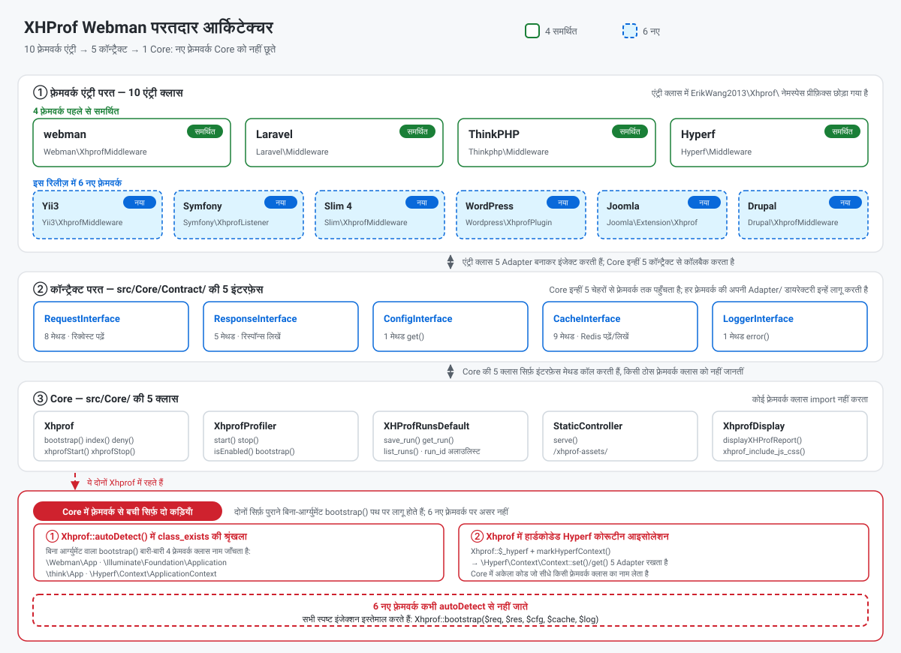
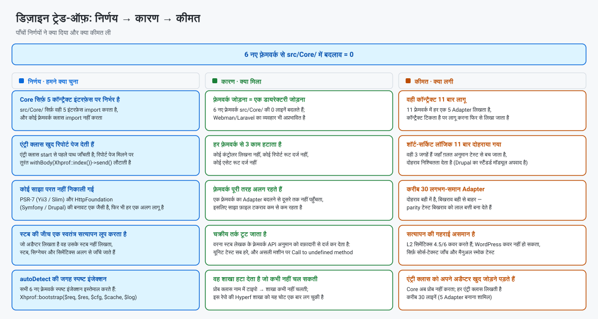
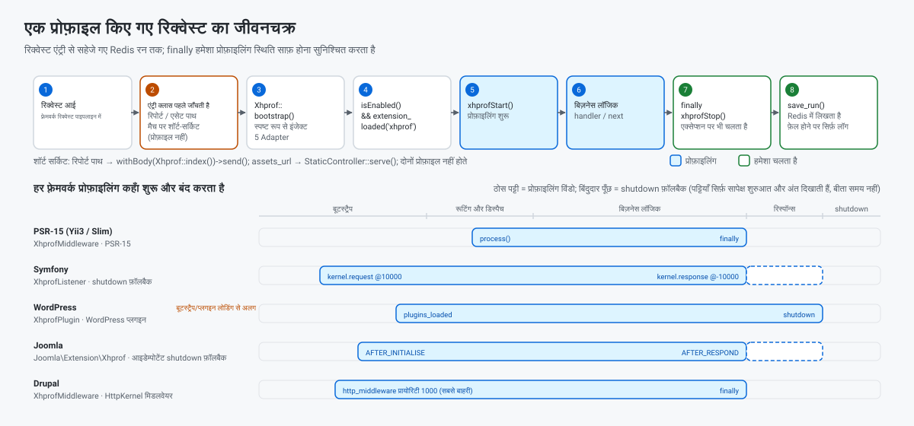

> **मशीन अनुवाद।** यह दस्तावेज़ स्वचालित रूप से अनुवादित है और किसी मातृभाषी द्वारा समीक्षित नहीं है। अंग्रेज़ी मूल [README.EN.md](../../../README.EN.md) ही प्रामाणिक है।

[中文](../../../README.md) · [English](../../../README.EN.md) · [한국어](../ko/README.md) · [Русский](../ru/README.md) · [Deutsch](../de/README.md) · [Français](../fr/README.md) · [Español](../es/README.md) · [Português](../pt/README.md) · [العربية](../ar/README.md) · **हिन्दी** · [বাংলা](../bn/README.md) · [Bahasa Indonesia](../id/README.md) · [日本語](../ja/README.md)

# XHProf प्रदर्शन प्रोफ़ाइलर

webman / Laravel / ThinkPHP / Hyperf / Yii3 / Symfony / Slim 4 / WordPress / Joomla और Drupal के साथ संगत कोड प्रदर्शन प्रोफ़ाइलिंग प्लगइन।

यह xhprof एक्सटेंशन के ज़रिए प्रोफ़ाइलिंग डेटा जमा करता है और उसे Redis में रखता है। डेवलपर ब्राउज़र से प्रदर्शन विश्लेषण रिपोर्ट तुरंत खोलकर कोड की प्रदर्शन अड़चनें पहचान सकते हैं।

## आवश्यकताएँ

- PHP >= 8.0
- xhprof एक्सटेंशन
- redis एक्सटेंशन
- Redis सर्वर

## संगत फ़्रेमवर्क और न्यूनतम वर्शन

| फ़्रेमवर्क | न्यूनतम वर्शन | न्यूनतम PHP | एंट्री क्लास | कैसे लगाएँ |
|-----------|----------------|-------------|-------------|--------------|
| webman | `workerman/webman ^2.1` | 8.0 | `Webman\XhprofMiddleware` | `config/middleware.php` में ग्लोबल मिडलवेयर दर्ज करें |
| Laravel | `laravel/framework ^9.0\|^10.0\|^11.0` | 8.0 | `Laravel\Middleware` | `app/Http/Kernel.php` में ग्लोबल मिडलवेयर दर्ज करें |
| ThinkPHP | `topthink/framework ^6.0\|^8.0` | 8.0 | `Thinkphp\Middleware` | `app/middleware.php` में ग्लोबल मिडलवेयर दर्ज करें |
| Hyperf | `hyperf/framework ^3.0` | 8.0 | `Hyperf\Middleware` | ConfigProvider से अपने आप दर्ज हो जाता है |
| Yii3 | `yiisoft/middleware-dispatcher ^5.0` | 8.1 | `Yii3\XhprofMiddleware` | `config/web/di/application.php` में दर्ज करें, मिडलवेयर सूची में सबसे पहले होना चाहिए |
| Symfony | `symfony/http-kernel ^6.4\|^7.0` | 8.1 (6.4) / 8.2 (7.x) | `Symfony\XhprofListener` | `config/services.yaml` में `kernel.event_subscriber` टैग जोड़ें |
| Slim 4 | `slim/slim ^4.12` | 8.0 | `Slim\XhprofMiddleware` | `$app->add(...)`, सबसे आख़िर में जोड़ना चाहिए |
| WordPress | 6.4+ | 8.0 | `Wordpress\XhprofPlugin` | `wp-content/mu-plugins/` में कॉपी करें |
| Joomla | 4.4 / 5.x | 8.1 | `Joomla\Extension\Xhprof` | `plugins/system/` में कॉपी करें, Discover से इंस्टॉल करें |
| Drupal | 10.x / 11.x | 8.1 (10.x) / 8.3 (11.x) | `xhprof` मॉड्यूल (`Drupal\XhprofMiddleware`) | स्टैंडर्ड मॉड्यूल, बस इनेबल कर दें |

सभी एंट्री क्लास `ErikWang2013\Xhprof\` नेमस्पेस प्रीफ़िक्स के अंदर रहती हैं (ऊपर छोड़ा गया है)। छह नए फ़्रेमवर्क में Drupal अपवाद है — वह रिपोर्ट पेज मॉड्यूल रूट से देता है — जबकि बाक़ी पाँचों की एंट्री क्लास **खुद रिपोर्ट पेज देती हैं**, किसी कंट्रोलर या रूट दर्ज करने की ज़रूरत नहीं।

यह पैकेज `php >= 8.0` घोषित करता है, पर Yii3 जिन `yiisoft/*` कॉम्पोनेंट पर टिका है वे **PHP 8.1+** माँगते हैं, इसलिए **PHP 8.0 पर Yii3 इस्तेमाल नहीं हो सकता**; वैसे ही Symfony 7.x और Drupal 11.x को भी ऊँचा PHP वर्शन चाहिए। चरण-दर-चरण सेटअप नीचे "फ़्रेमवर्क कॉन्फ़िगरेशन" में है।

## इंस्टॉलेशन

php.ini में xhprof कॉन्फ़िगरेशन जोड़ें:

```ini
[xhprof]
extension=xhprof.so
xhprof.output_dir=/tmp/xhprof
```

Composer से इंस्टॉल करें:

```sh
composer require aaron-dev/xhprof-webman
```

---

## फ़्रेमवर्क कॉन्फ़िगरेशन

### Webman

**1. ग्लोबल मिडलवेयर दर्ज करें** — `config/middleware.php`:

```php
return [
    '' => [
        ErikWang2013\Xhprof\Webman\XhprofMiddleware::class,
    ],
];
```

**2. कंट्रोलर बनाएँ**:

```php
<?php

namespace app\controller;

use support\Request;
use ErikWang2013\Xhprof\Webman\Xhprof;

class XhprofController
{
    public function index(Request $request)
    {
        return Xhprof::index();
    }
}
```

**3. रूट दर्ज करें** — `config/route.php`:

```php
use Webman\Route;
use ErikWang2013\Xhprof\Webman\StaticController;

Route::get('/xhprof', [app\controller\XhprofController::class, 'index']);
Route::get('/xhprof-assets/{path:.+}', [StaticController::class, 'serve']);

```

**4. कॉन्फ़िगरेशन** — `config/plugin/aaron-dev/xhprof/xhprof.php` देखें।

---

### Laravel

**1. मिडलवेयर दर्ज करें** — `app/Http/Kernel.php`:

```php
protected $middleware = [
    // ...
    \ErikWang2013\Xhprof\Laravel\Middleware::class,
];
```

**2. कंट्रोलर बनाएँ**:

```php
<?php

namespace App\Http\Controllers;

use Illuminate\Http\Request;
use ErikWang2013\Xhprof\Core\Xhprof;

class XhprofController extends Controller
{
    public function index(Request $request)
    {
        Xhprof::bootstrap();
        return Xhprof::index();
    }
}
```

**3. रूट दर्ज करें** — `routes/web.php`:

```php
use App\Http\Controllers\XhprofController;
use ErikWang2013\Xhprof\Core\StaticController;
use Illuminate\Support\Facades\Route;

Route::get('/xhprof', [XhprofController::class, 'index']);
Route::get('/xhprof-assets/{path}', function ($path) {
    $req = new \ErikWang2013\Xhprof\Laravel\Adapter\RequestAdapter(request());
    $res = new \ErikWang2013\Xhprof\Laravel\Adapter\ResponseAdapter(response(''));
    return StaticController::serve($req, $res)->send();
})->where('path', '.*');

```

**4. कॉन्फ़िग पब्लिश करें**:

```sh
php artisan vendor:publish --tag=xhprof-config
```

कॉन्फ़िग फ़ाइल `config/xhprof.php` पर है। Laravel ServiceProvider की ऑटो-डिस्कवरी समर्थित करता है।

---

### ThinkPHP

**1. मिडलवेयर दर्ज करें** — `app/middleware.php`:

```php
return [
    \ErikWang2013\Xhprof\Thinkphp\Middleware::class,
];
```

**2. कंट्रोलर बनाएँ**:

```php
<?php

namespace app\controller;

use think\Request;
use ErikWang2013\Xhprof\Core\Xhprof;

class XhprofController
{
    public function index(Request $request)
    {
        Xhprof::bootstrap();
        return Xhprof::index();
    }
}
```

**3. रूट दर्ज करें** — `route/app.php`:

```php
use think\facade\Route;
use ErikWang2013\Xhprof\Core\StaticController;
use ErikWang2013\Xhprof\Thinkphp\Adapter\RequestAdapter;
use ErikWang2013\Xhprof\Thinkphp\Adapter\ResponseAdapter;

Route::get('/xhprof', 'app\controller\XhprofController@index');
Route::get('/xhprof-assets/[:path]', function ($path = '') {
    $req = new RequestAdapter(app('request'));
    $res = new ResponseAdapter(response(''));
    return StaticController::serve($req, $res)->send();
})->pattern(['path' => '.*']);

```

**4. कॉन्फ़िगरेशन** — `vendor/aaron-dev/xhprof-webman/src/Thinkphp/config/xhprof.php` को प्रोजेक्ट के `config/xhprof.php` पर कॉपी करें।

---

### Hyperf

**1. मिडलवेयर ऑटो-रजिस्ट्रेशन** — ConfigProvider अपने आप मिडलवेयर को HTTP मिडलवेयर कतार में जोड़ देता है।

**2. कंट्रोलर बनाएँ**:

```php
<?php

namespace App\Controller;

use Hyperf\HttpServer\Annotation\Controller;
use Hyperf\HttpServer\Annotation\RequestMapping;
use ErikWang2013\Xhprof\Core\Xhprof;

#[Controller(prefix: '/xhprof')]
class XhprofController
{
    #[RequestMapping(path: '')]
    public function index()
    {
        Xhprof::bootstrap();
        return Xhprof::index();
    }
}
```

**3. स्टैटिक एसेट रूट** — `config/routes.php`:

```php
use Hyperf\HttpServer\Router\Router;
use ErikWang2013\Xhprof\Core\StaticController;
use ErikWang2013\Xhprof\Hyperf\Adapter\RequestAdapter;
use ErikWang2013\Xhprof\Hyperf\Adapter\ResponseAdapter;
use Hyperf\Context\ApplicationContext;

Router::get('/xhprof-assets/{path:.+}', function ($path) {
    $container = ApplicationContext::getContainer();
    $req = new RequestAdapter($container->get(\Hyperf\HttpServer\Contract\RequestInterface::class));
    $res = new ResponseAdapter($container->get(\Hyperf\HttpServer\Contract\ResponseInterface::class));
    return StaticController::serve($req, $res)->send();
});

```

**4. कॉन्फ़िग पब्लिश करें**:

```sh
php bin/hyperf.php vendor:publish aaron-dev/xhprof-webman
```

कॉन्फ़िग `config/autoload/xhprof.php` पर बनती है।

---

### Yii3

**1. मिडलवेयर दर्ज करें** — `config/web/di/application.php`:

```php
use ErikWang2013\Xhprof\Yii3\XhprofMiddleware;
use Yiisoft\Middleware\Dispatcher\MiddlewareDispatcher;

return [
    MiddlewareDispatcher::class => [
        'class' => MiddlewareDispatcher::class,
        // पहला तत्व सबसे बाहरी मिडलवेयर है (पहले चलता है, आख़िर में ख़त्म होता है)
        'withMiddlewares()' => [[
            XhprofMiddleware::class,
            // ... बाक़ी मिडलवेयर
        ]],
    ],
];
```

दो आसान ग़लतियाँ (दोनों मापी गई हैं):

- **ऐसा न लिखें** `'__construct()' => ['middlewares' => [...]]`: `MiddlewareDispatcher::__construct()` सिर्फ़ एक `MiddlewareFactory` और वैकल्पिक `EventDispatcherInterface` लेता है — कोई `middlewares` पैरामीटर **नहीं** है। मिडलवेयर सूची सिर्फ़ **इंस्टेंस मेथड** `withMiddlewares()` से ही इंजेक्ट हो सकती है।
- **`withMiddlewares()` में इंस्टेंस (`new XhprofMiddleware(...)`) न डालें**: डेफ़िनिशन सिर्फ़ class-string, array definition या callable स्वीकार करते हैं। इंस्टेंस देने पर रजिस्ट्रेशन कुछ नहीं बताता और `dispatch()` एक `TypeError` फेंकता है (`MiddlewareFactory::create()` का टाइप `callable|array|string` है)।

**2. रिपोर्ट पेज और स्टैटिक एसेट** — **किसी कंट्रोलर या रूट दर्ज करने की ज़रूरत नहीं**: `XhprofMiddleware` एक PSR-15 मिडलवेयर है। प्रोफ़ाइलिंग शुरू होने से पहले यह रिक्वेस्ट पाथ देखता है: रिपोर्ट पाथ `/xhprof` पर मैच होने पर रिपोर्ट पेज तुरंत लौटा दिया जाता है, और एसेट पाथ (डिफ़ॉल्ट प्रीफ़िक्स `/xhprof-assets`) पर मैच होने पर स्टैटिक एसेट सीधे लौटा दिया जाता है। रिपोर्ट पेज का रिस्पॉन्स एंट्री क्लास की ओर से स्पष्ट `Content-Type: text/html; charset=UTF-8` साथ लाता है: PSR-7 रिस्पॉन्स में कोई डिफ़ॉल्ट नहीं होता और Yii3 का रिस्पॉन्स सेंडर भी नहीं जोड़ता, इसलिए उसके बिना ब्राउज़र HTML रिपोर्ट को सादे टेक्स्ट की तरह दिखाते हैं।

**3. कॉन्फ़िगरेशन** — डिफ़ॉल्ट पैकेज में `src/Yii3/config/xhprof.php` पर हैं; फ़ील्ड के लिए "कॉन्फ़िगरेशन संदर्भ" देखें। इन्हें बदलने के लिए DI से `$config` इंजेक्ट करें:

```php
XhprofMiddleware::class => [
    'class' => XhprofMiddleware::class,
    '__construct()' => [
        'config' => [
            'enable' => true,
            'auth_token' => 'your-token',
            'redis' => [
                'host' => '127.0.0.1',
                'port' => 6379,
                'password' => '',
                'database' => 0,
                'timeout' => 1.0,
            ],
        ],
    ],
],
```

`redis` सब-ऐरे Yii3 के लिए ख़ास है: जब कोई `CacheInterface` इंजेक्ट नहीं होता, तब मिडलवेयर इसी से सीधे phpredis से बात करता है। `assets_url` को उसके डिफ़ॉल्ट पर ही रखें — कोई भी दूसरा प्रीफ़िक्स ख़ाली बॉडी के साथ 200 ही देता है (यह Core में हार्डकोडेड कॉन्स्टेंट है; देखें [सत्यापन और ज्ञात सीमाएँ](#सत्यापन-और-ज्ञात-सीमाएँ))।

**4. वर्शन की शर्त** — Yii3 जिन `yiisoft/*` कॉम्पोनेंट पर टिका है वे PHP >= 8.1 माँगते हैं। यह पैकेज `php >= 8.0` घोषित करता है, फिर भी Yii3 इंटीग्रेशन PHP 8.0 पर इस्तेमाल नहीं हो सकता।

---

### Symfony

**1. इवेंट सबस्क्राइबर दर्ज करें** — `config/services.yaml`:

```yaml
services:
    ErikWang2013\Xhprof\Symfony\XhprofListener:
        tags:
            - { name: kernel.event_subscriber }
```

**2. रिपोर्ट पेज और स्टैटिक एसेट** — **किसी कंट्रोलर या रूट दर्ज करने की ज़रूरत नहीं**: प्रोफ़ाइलिंग शुरू होने से पहले लिसनर रिक्वेस्ट पाथ देखता है: रिपोर्ट पाथ `/xhprof` पर मैच होने पर रिपोर्ट पेज तुरंत लौटा दिया जाता है, और एसेट पाथ (डिफ़ॉल्ट प्रीफ़िक्स `/xhprof-assets`) पर मैच होने पर स्टैटिक एसेट सीधे लौटा दिया जाता है।

**3. कॉन्फ़िगरेशन** — डिफ़ॉल्ट पैकेज में `src/Symfony/config/xhprof.php` पर हैं; फ़ील्ड के लिए "कॉन्फ़िगरेशन संदर्भ" देखें।

**4. सब-रिक्वेस्ट और एक्सेप्शन फ़ॉलबैक** — यह `kernel.request` (प्रायोरिटी 10000) और `kernel.response` (प्रायोरिटी -10000) सुनता है। `isMainRequest()` ESI/फ़्रैगमेंट सब-रिक्वेस्ट छान देता है, वरना वे प्रोफ़ाइलिंग बहुत जल्दी रोक देते; रिक्वेस्ट शुरू होते समय एक आइडेम्पोटेंट `register_shutdown_function` भी दर्ज होता है — अगर HttpKernel कोई एक्सेप्शन दोबारा फेंके तो `kernel.response` कभी नहीं चलता, और उस फ़ॉलबैक के बिना प्रोफ़ाइलिंग स्थिति अगली रिक्वेस्ट में रिस जाती।

---

### Slim 4

**1. मिडलवेयर दर्ज करें** — `public/index.php`:

```php
use ErikWang2013\Xhprof\Slim\XhprofMiddleware;

$app->addRoutingMiddleware();

// सबसे आख़िर में जोड़ना चाहिए: Slim का मिडलवेयर स्टैक LIFO है, बाद में जोड़ा गया = और बाहर = पहले चलता है
$app->add(new XhprofMiddleware(
    $app->getResponseFactory()
));
```

बाक़ी तीन कंस्ट्रक्टर आर्ग्युमेंट सब वैकल्पिक हैं; पैकेज के डिफ़ॉल्ट इस्तेमाल करने के लिए इन्हें छोड़ दें:

- आर्ग्युमेंट 2, `array $config`: आपका कॉन्फ़िग ऐरे, जो पैकेज के `src/Slim/config/xhprof.php` के ऊपर `array_replace` से मिलाया जाता है (पूरे मान का बदलाव — `ignore_url_arr` जैसी list keys कभी रिकर्सिव तौर पर नहीं मिलाई जातीं)।
- आर्ग्युमेंट 3, `CacheInterface $cache`: छोड़ने पर यह आलसी तरीक़े से `new \Redis()` करता है (कंस्ट्रक्टर जानबूझकर ext-redis को कभी नहीं छूता, इसलिए अडैप्टर बनते समय गुम एक्सटेंशन कुछ नहीं तोड़ता)। अपना कनेक्शन इंजेक्ट करने के लिए `new \ErikWang2013\Xhprof\Slim\Adapter\RedisAdapter($redis)` दें, या कोई भी ऑब्जेक्ट जो `ErikWang2013\Xhprof\Core\Contract\CacheInterface` लागू करता हो।
- आर्ग्युमेंट 4, `LoggerInterface $logger`: छोड़ने पर यह `new \ErikWang2013\Xhprof\Slim\Adapter\LogAdapter()` होता है और **लॉग चुपचाप गिरा दिए जाते हैं** (Slim कोई PSR-3 लॉगर नहीं देता)। इन्हें दर्ज करने के लिए `new LogAdapter($psrLogger)` दें, जहाँ `$psrLogger` आपका पहले से मौजूद PSR-3 लॉगर है।

**`$app->add(XhprofMiddleware::class)` न लिखें**: Slim का `CallableResolver` उस class string को `new XhprofMiddleware($container)` बना देता है — सिर्फ़ कंटेनर देता है, और हल करना रिक्वेस्ट के समय तक टाल देता है। नतीजा यह कि `add()` कुछ नहीं बताता और पहली रिक्वेस्ट पर एक `TypeError` आता है — सबसे मुश्किल से पकड़ में आने वाली विफलता। हमेशा ऊपर वाला स्पष्ट `new` इस्तेमाल करें।

**2. रिपोर्ट पेज और स्टैटिक एसेट** — **किसी कंट्रोलर या रूट दर्ज करने की ज़रूरत नहीं**: प्रोफ़ाइलिंग शुरू होने से पहले मिडलवेयर रिक्वेस्ट पाथ देखता है: रिपोर्ट पाथ `/xhprof` पर मैच होने पर रिपोर्ट पेज तुरंत लौटा दिया जाता है, और एसेट पाथ (डिफ़ॉल्ट प्रीफ़िक्स `/xhprof-assets`) पर मैच होने पर स्टैटिक एसेट सीधे लौटा दिया जाता है।

**3. कॉन्फ़िगरेशन** — डिफ़ॉल्ट पैकेज में `src/Slim/config/xhprof.php` पर हैं; फ़ील्ड के लिए "कॉन्फ़िगरेशन संदर्भ" देखें।

**4. लगाने का क्रम** — Slim का मिडलवेयर स्टैक LIFO है (दो मिडलवेयर से मापा गया, चलने का क्रम है `B:before → A:before → A:after → B:after`): `add()` जितना बाद में, उतना और बाहर, और उतना ही पहले चलता है। इसलिए xhprof **सबसे आख़िर में** जोड़ा जाना चाहिए, और **`addRoutingMiddleware()` के बाद** — वरना `/xhprof` रूटिंग टेबल में नहीं होता, RoutingMiddleware पहले `HttpNotFoundException` फेंकता है, और रिक्वेस्ट कभी मिडलवेयर तक नहीं पहुँचती। रिपोर्ट पेज का रिस्पॉन्स एंट्री क्लास की ओर से स्पष्ट `Content-Type: text/html; charset=UTF-8` साथ लाता है: PSR-7 रिस्पॉन्स में कोई डिफ़ॉल्ट नहीं होता और Slim का `ResponseEmitter` भी नहीं जोड़ता, इसलिए उसके बिना ब्राउज़र HTML रिपोर्ट को सादे टेक्स्ट की तरह दिखाते हैं।

---

### WordPress

**1. mu-plugin इंस्टॉल करें** — पैकेज से बूटस्ट्रैप फ़ाइल `wp-content/mu-plugins/` में कॉपी करें:

```sh
cp vendor/aaron-dev/xhprof-webman/wordpress/xhprof-webman.php wp-content/mu-plugins/
```

`wordpress/xhprof-webman.php` में प्लगइन हेडर है और यह `Wordpress\XhprofPlugin` को बूट करता है। mu-plugins अपने आप लोड हो जाते हैं — wp-admin में कुछ इनेबल करने की ज़रूरत नहीं।

**2. रिपोर्ट पेज और स्टैटिक एसेट** — **किसी कंट्रोलर या रूट दर्ज करने की ज़रूरत नहीं**: प्रोफ़ाइलिंग शुरू होने से पहले एंट्री क्लास रिक्वेस्ट पाथ देखती है: रिपोर्ट पाथ `/xhprof` पर मैच होने पर रिपोर्ट पेज तुरंत लौटा दिया जाता है, और एसेट पाथ (डिफ़ॉल्ट प्रीफ़िक्स `/xhprof-assets`) पर मैच होने पर स्टैटिक एसेट सीधे लौटा दिया जाता है।

**3. कॉन्फ़िगरेशन** — डिफ़ॉल्ट पैकेज में `src/Wordpress/config/xhprof.php` पर हैं; फ़ील्ड के लिए "कॉन्फ़िगरेशन संदर्भ" देखें। `wp-cron.php` और `admin-ajax.php` जैसे बहुत बार आने वाले पाथ छोड़ने के लिए `ignore_url_arr` इस्तेमाल करें।

**4. प्रोफ़ाइलिंग विंडो की एक ढाँचागत सीमा** — विंडो `plugins_loaded` → `shutdown` है, जिसमें `wp-settings.php` बूटस्ट्रैप या ख़ुद प्लगइन लोडिंग **शामिल नहीं** है। यह WordPress की ढाँचागत सीमा है: उस चरण में हुआ काम प्रोफ़ाइल नहीं हो सकता।

---

### Joomla

**1. प्लगइन इंस्टॉल करें** — पैकेज की `joomla/` डायरेक्टरी साइट की `plugins/system/xhprof/` में कॉपी करें:

```sh
cp -r vendor/aaron-dev/xhprof-webman/joomla/ plugins/system/xhprof/
```

पैकेज की `joomla/` डायरेक्टरी *ही* प्लगइन है: `xhprof.xml` मैनिफ़ेस्ट, `services/provider.php`, और `src/Extension/Xhprof.php`। एंट्री क्लास `ErikWang2013\Xhprof\Joomla\Extension\Xhprof` है (एक `CMSPlugin`)। कॉपी करने के बाद "System → Manage → Extensions → Discover" में Discover चलाएँ और इसे इंस्टॉल/इनेबल करें।

**2. रिपोर्ट पेज और स्टैटिक एसेट** — **किसी कंट्रोलर या रूट दर्ज करने की ज़रूरत नहीं**: प्रोफ़ाइलिंग शुरू होने से पहले प्लगइन रिक्वेस्ट पाथ देखता है: रिपोर्ट पाथ `/xhprof` पर मैच होने पर रिपोर्ट पेज तुरंत लौटा दिया जाता है, और एसेट पाथ (डिफ़ॉल्ट प्रीफ़िक्स `/xhprof-assets`) पर मैच होने पर स्टैटिक एसेट सीधे लौटा दिया जाता है।

**3. कॉन्फ़िगरेशन** — डिफ़ॉल्ट पैकेज में `src/Joomla/config/xhprof.php` पर हैं; फ़ील्ड के लिए "कॉन्फ़िगरेशन संदर्भ" देखें। **ज्ञात समझौता**: यह प्लगइन पैरामीटर के बजाय पैकेज की कॉन्फ़िग फ़ाइल पढ़ता है — प्लगइन पैरामीटर के लिए डेटाबेस पढ़ना पड़ता, और कॉन्फ़िगरेशन हर रिक्वेस्ट पर पढ़ी जाती है।

**4. प्रोफ़ाइलिंग की सीमाएँ** — विंडो `ApplicationEvents::AFTER_INITIALISE` → `ApplicationEvents::AFTER_RESPOND` है; `AFTER_INITIALISE` में एक आइडेम्पोटेंट `register_shutdown_function` भी दर्ज होता है, क्योंकि एक्सेप्शन वाले रास्ते पर `AFTER_RESPOND` तक पहुँचना तय नहीं है — उस फ़ॉलबैक के बिना प्रोफ़ाइलिंग स्थिति अगली रिक्वेस्ट में रिस जाती।

---

### Drupal

**1. मॉड्यूल इनेबल करें** — पैकेज में `drupal/xhprof/` एक स्टैंडर्ड Drupal मॉड्यूल है (`xhprof.info.yml` / `xhprof.routing.yml` / `xhprof.services.yml`)। इसे अपनी साइट में `modules/custom/xhprof/` पर रखें, फिर "Extend" पेज से इनेबल करें (या `drush en xhprof`)।

**2. रिपोर्ट पेज** — दस फ़्रेमवर्क में Drupal **अकेला** है जो रिपोर्ट पेज मॉड्यूल रूट से देता है: `xhprof.routing.yml` रिपोर्ट पाथ `/xhprof` दर्ज करता है और एक मॉड्यूल कंट्रोलर उसे रेंडर करता है। बाक़ी पाँच नए फ़्रेमवर्क रिपोर्ट पेज और स्टैटिक एसेट ख़ुद देते हैं और कोई रूट दर्ज नहीं करते।

**3. कॉन्फ़िगरेशन** — कॉन्फ़िगरेशन मॉड्यूल-स्तर की typed config है: डिफ़ॉल्ट `drupal/xhprof/config/install/xhprof.settings.yml` में हैं, और स्कीमा `drupal/xhprof/config/schema/xhprof.schema.yml` में। फ़ील्ड के लिए "कॉन्फ़िगरेशन संदर्भ" देखें।

**4. मिडलवेयर रजिस्ट्रेशन** — मिडलवेयर सर्विस को मॉड्यूल के `xhprof.services.yml` में दर्ज करें:

```yaml
services:
  xhprof.http_middleware:
    class: ErikWang2013\Xhprof\Drupal\XhprofMiddleware
    arguments: ['@config.factory', '@logger.factory']
    tags:
      - { name: http_middleware, priority: 1000 }
```

भीतरी kernel Drupal का `StackedKernelPass` **अपने आप कंस्ट्रक्टर आर्ग्युमेंट 0 के रूप में आगे जोड़ देता है** — **इसे ख़ुद न लिखें**: ऐसा करने पर दो भीतरी kernel बन जाते हैं, जो Drupal <= 11.2.x (सारे 10.x समेत) पर कंटेनर कंपाइल के समय ही विफल होता है और 11.3.0 और उससे ऊपर हर रिक्वेस्ट पर TypeError फेंकता है। प्रोफ़ाइलिंग `finally` में रुकती है।

**5. नोट्स**

- `priority: 1000` मिडलवेयर को **पेज कैश के बाहर** रखता है (कोर की सबसे ऊँची मौजूदा प्रायोरिटी negotiation है: D10 पर 400, D11 पर 500, जबकि पेज कैश 200 है), इसलिए **Drupal के पेज कैश से दिए गए रिस्पॉन्स भी प्रोफ़ाइल होते हैं**। प्रोफ़ाइलिंग टूल के लिए यही मंशा है, पर उपयोगकर्ताओं को यह पता होना चाहिए।
- कैश बिना कुछ किए चलता है: मिडलवेयर डिफ़ॉल्ट रूप से इसी पैकेज के साथ आने वाला Redis अडैप्टर लेता है (पैकेज की ext-redis पर सख़्त निर्भरता है), और `services.yml` के `arguments` से वैकल्पिक `CacheInterface` आर्ग्युमेंट देकर उसे बदला भी जा सकता है। कैश उपलब्ध न हो तो विफल सेव को `XhprofProfiler::stop()` एक लॉग लाइन में निगल जाता है — **कोई त्रुटि नहीं उठती**।
- रिपोर्ट पेज `/xhprof` और `/xhprof-assets/*` की रिक्वेस्ट **प्रोफ़ाइल नहीं होतीं**: मिडलवेयर `xhprofStart()` से पहले पाथ देखकर प्रोफ़ाइलिंग छोड़ देता है। रिस्पॉन्स फिर भी `xhprof.routing.yml` का Controller ही बनाता है (**यह शॉर्ट-सर्किट नहीं है**)। इसलिए `ignore_url_arr` को `[]` (कुछ भी फ़िल्टर नहीं) रखने पर भी ये दोनों रिक्वेस्ट रिपोर्ट में कभी नहीं दिखतीं।

---

## कॉन्फ़िगरेशन संदर्भ

सभी फ़्रेमवर्क ये कॉन्फ़िगरेशन विकल्प साझा करते हैं:

| कॉन्फ़िग | टाइप | डिफ़ॉल्ट | विवरण |
|--------|------|---------|-------------|
| `enable` | bool | `true` | प्रोफ़ाइलिंग चालू/बंद करें |
| `time_limit` | int | `0` | सिर्फ़ n सेकंड से ज़्यादा लेने वाली रिक्वेस्ट प्रोफ़ाइल करें, 0 का मतलब सभी |
| `log_num` | int | `1000` | रिकॉर्ड की अधिकतम संख्या |
| `view_wtred` | int | `3` | n सेकंड से ज़्यादा रिस्पॉन्स समय वाली पंक्तियाँ लाल में दिखाएँ |
| `ignore_url_arr` | array | `["/xhprof"]` | छोड़ने योग्य URL पाथ |
| `assets_url` | string | `/xhprof-assets` | स्टैटिक एसेट URL प्रीफ़िक्स |
| `auth_token` | string\|null | `null` | सेट होने पर रिपोर्ट पेज के लिए `?token=xxx` ज़रूरी होता है; सार्वजनिक डिप्लॉयमेंट के लिए सलाह दी जाती है |
| `key_prefix` | string | `xhprof` | Redis key प्रीफ़िक्स; एक ही Redis साझा करते समय हर प्रोजेक्ट के लिए अलग मान रखें |
| `log_ttl` | int | `604800` | डेटा रखने की अवधि सेकंड में (डिफ़ॉल्ट 7 दिन) |

हर फ़्रेमवर्क पर इन विकल्पों की ज्ञात सीमाएँ [सत्यापन और ज्ञात सीमाएँ](#सत्यापन-और-ज्ञात-सीमाएँ) में दी गई हैं।

---

## मैनुअल इनिशियलाइज़ेशन

अगर फ़्रेमवर्क का अपने आप पता लगाना विफल हो, तो आप अडैप्टर ख़ुद इंजेक्ट कर सकते हैं:

```php
use ErikWang2013\Xhprof\Core\Xhprof;

Xhprof::bootstrap(
    new MyRequestAdapter($request),
    new MyResponseAdapter($response),
    new MyConfigAdapter(),
    new MyCacheAdapter(),
    new MyLoggerAdapter()
);
```

**छह नए फ़्रेमवर्क (Yii3 / Symfony / Slim 4 / WordPress / Joomla / Drupal) को बिना आर्ग्युमेंट वाला `Xhprof::bootstrap()` नहीं बुलाना चाहिए** — बिना आर्ग्युमेंट यह `autoDetect()` से जाता है, जो सिर्फ़ webman / Laravel / ThinkPHP / Hyperf शाखाएँ जानता है और इन छह पर `Unsupported framework` फेंकता है। ऊपर के उदाहरण की तरह पाँचों अडैप्टर स्पष्ट रूप से दें (हर फ़्रेमवर्क के साथ आने वाली एंट्री क्लास यह आपके लिए पहले ही करती है)।

---

## आर्किटेक्चर और डिज़ाइन

Core फ़्रेमवर्क तक ठीक 5 कॉन्ट्रैक्ट से पहुँचता है, और वे सब `src/Core/Contract/` में हैं:

| कॉन्ट्रैक्ट | मेथड | मक़सद |
|----------|---------|---------|
| `RequestInterface` | `get()` `all()` `method()` `header()` `host()` `uri()` `url()` `getRealIp()` | रिक्वेस्ट डेटा पढ़ना, रिपोर्ट पाथ मिलाना, रिपोर्ट पेज के लिंक बनाना |
| `ResponseInterface` | `withBody()` `withHeaders()` `withStatus()` `file()` `send()` | रिपोर्ट पेज, स्टैटिक एसेट और 400/403 देना |
| `ConfigInterface` | `get()` | प्लगइन कॉन्फ़िग पढ़ना: पूरे ब्लॉक के लिए `get('xhprof')`, किसी leaf के लिए `get('xhprof.assets_url')` |
| `CacheInterface` | `get()` `set()` `mget()` `incr()` `lPush()` `rPop()` `lRange()` `del()` `decr()` | Redis पढ़ना और लिखना |
| `LoggerInterface` | `error()` | गुम एक्सटेंशन और विफल सेव की चेतावनियाँ |

हर फ़्रेमवर्क इन कॉन्ट्रैक्ट को लागू करने वाले 5 अडैप्टर देता है, जिन्हें `Xhprof::bootstrap()` Core में दर्ज करता है। फ़्रेमवर्क-ख़ास हर चीज़ उसी फ़्रेमवर्क की अपनी `src/<Fw>/` डायरेक्टरी के अंदर रहती है।

**Core में फ़्रेमवर्क से जुड़ी सिर्फ़ दो कड़ियाँ बची हैं**:

1. `Xhprof::autoDetect()` में `class_exists()` की श्रृंखला (`Webman\App` → `Illuminate\Foundation\Application` → `think\App` → `Hyperf\Context\ApplicationContext`), जहाँ सिर्फ़ बिना आर्ग्युमेंट वाला `bootstrap()` पहुँचता है।
2. हार्डकोडेड Hyperf कोरूटीन स्विच: `Xhprof::markHyperfContext()` और `\Hyperf\Context\Context` के मौजूदगी की जाँचें, जो तय करती हैं कि अडैप्टर प्रोसेस-व्यापी स्टैटिक प्रॉपर्टी में जाएँ या कोरूटीन Context में।

**छह नए फ़्रेमवर्क कभी `autoDetect()` से नहीं जाते — वे सब स्पष्ट इंजेक्शन इस्तेमाल करते हैं**: हर एंट्री क्लास अपने 5 अडैप्टर ख़ुद बनाती है और उन्हें `Xhprof::bootstrap($req, $res, $cfg, $cache, $log)` को देती है। वजह यह है कि PSR-7 फ़्रेमवर्क पर Request/Response सिर्फ़ रिक्वेस्ट पाइपलाइन से ही मिल सकते हैं, इसलिए बिना आर्ग्युमेंट वाला `bootstrap()` बनावट से ही काम नहीं कर सकता; दूसरा फ़ायदा यह है कि `autoDetect()` अपने मौजूदा चार फ़्रेमवर्क पर जमा रहता है।



पहला चित्र **संरचना** दिखाता है: दसों फ़्रेमवर्क की एंट्री क्लास, 5 कॉन्ट्रैक्ट, Core की तीन परतें, और बची हुई अकेली दो कड़ियाँ।



दूसरा चित्र **तर्क** दिखाता है: निर्णय / कारण / कीमत के रूप में पाँच समझौते, जिनके ऊपर लिखा है "छह नए फ़्रेमवर्क से `src/Core/` में बदलाव = 0"।

---

## रिक्वेस्ट जीवनचक्र

एक प्रोफ़ाइल की गई रिक्वेस्ट:

1. **प्रोफ़ाइलिंग शुरू होने से पहले**, एंट्री क्लास पाथ देखती है: रिपोर्ट पाथ पर मैच होने पर रिपोर्ट पेज तुरंत लौटता है; एसेट पाथ पर मैच होने पर स्टैटिक एसेट तुरंत लौटता है। इनमें से कोई भी पाथ प्रोफ़ाइल नहीं होता, और कोई भी नीचे के प्रवाह में नहीं जाता।
2. `XhprofProfiler::isEnabled()` कॉन्फ़िग से `enable` पढ़ता है; अगर प्रोफ़ाइलिंग बंद है या कोई एक्सटेंशन गुम है, तो पूरा ब्लॉक छोड़ दिया जाता है।
3. `Xhprof::xhprofStart()` → `XhprofProfiler::start()` → `xhprof_enable(XHPROF_FLAGS_NO_BUILTINS + XHPROF_FLAGS_CPU + XHPROF_FLAGS_MEMORY)`।
4. बिज़नेस लॉजिक चलता है।
5. `finally { Xhprof::xhprofStop(); }` → `xhprof_disable()`, फिर `XHProfRunsDefault::save_run()` Redis में लिखता है। सादे कथन के बजाय `finally`, ताकि फेंका गया एक्सेप्शन भी प्रोफ़ाइलिंग स्थिति साफ़ करे और रन सहेज दे।
6. ब्राउज़र रिपोर्ट पेज खोलता है; `Xhprof::index()` Redis से डेटा वापस पढ़कर उसे रेंडर करता है।



| फ़्रेमवर्क | प्रोफ़ाइलिंग शुरू | प्रोफ़ाइलिंग ख़त्म |
|-----------|-----------------|----------------|
| webman / Laravel / ThinkPHP / Hyperf | मिडलवेयर एंट्री (`process()` / `handle()`) | `finally` |
| Yii3 / Slim 4 | PSR-15 `process()` | `finally` |
| Symfony | `kernel.request` (प्रायोरिटी 10000) | `kernel.response` (प्रायोरिटी -10000), साथ में शटडाउन फ़ॉलबैक |
| WordPress | `plugins_loaded` | `shutdown` |
| Joomla | `onAfterInitialise` | `onAfterRespond`, साथ में शटडाउन फ़ॉलबैक |
| Drupal | `http_middleware` (प्रायोरिटी 1000, सबसे बाहरी) | `finally` |

---

## प्रोजेक्ट संरचना

```
xhprof-webman/
├── src/
│   ├── Core/                     # फ़्रेमवर्क-निरपेक्ष: कॉन्ट्रैक्ट, रिपोर्ट पेज, Redis, एसेट
│   │   ├── Contract/             # 5 कॉन्ट्रैक्ट इंटरफ़ेस
│   │   ├── XhprofLib/            # रिपोर्ट रेंडरिंग और रन स्टोरेज (phacility/xhprof से)
│   │   ├── Xhprof.php            # स्टैटिक फ़साड: bootstrap() / index()
│   │   ├── XhprofProfiler.php    # xhprof_enable/disable और कॉन्फ़िग
│   │   ├── StaticController.php  # /xhprof-assets स्टैटिक एसेट
│   │   ├── MiddlewareTrait.php   # Laravel / ThinkPHP के लिए साझा प्रोफ़ाइलिंग रैपर
│   │   └── RedisAdapterTrait.php # साझा Redis अडैप्टर कार्यान्वयन
│   ├── Webman/ Laravel/ Thinkphp/ Hyperf/            # मौजूदा 4 फ़्रेमवर्क
│   ├── Yii3/ Symfony/ Slim/ Wordpress/ Joomla/ Drupal/   # 6 नए फ़्रेमवर्क
│   └── html/                     # रिपोर्ट पेज एसेट (css / js / images)
├── wordpress/                    # mu-plugin बूटस्ट्रैप फ़ाइल (प्लगइन हेडर समेत)
├── joomla/                       # Joomla प्लगइन (CMSPlugin + मैनिफ़ेस्ट)
├── drupal/xhprof/                # स्टैंडर्ड Drupal मॉड्यूल (info / routing / services + कंट्रोलर)
├── tools/contracts/              # स्वतंत्र सत्यापन लूप: असली फ़्रेमवर्क पैकेजों के सामने सिग्नेचर और सिमेंटिक्स
├── tests/                        # PHPUnit: अडैप्टर, वायरिंग, README पैरिटी
└── docs/images/                  # README चित्र
```

Drupal के अलावा हर `src/<Fw>/` डायरेक्टरी की बनावट एक जैसी है:

```
src/<Fw>/
├── Adapter/{Request,Response,Config,Redis,Log}Adapter.php
├── <EntryClass>.php
└── config/xhprof.php             # हर दूसरे फ़्रेमवर्क जैसी वही 9 कॉन्फ़िग keys
```

`src/Drupal/` अकेला अपवाद है: उसकी कोई `config/` डायरेक्टरी नहीं — उसका कॉन्फ़िगरेशन मॉड्यूल-स्तर की typed config में रहता है (`drupal/xhprof/config/install/xhprof.settings.yml`)।

---

## सत्यापन और ज्ञात सीमाएँ

**जो यंत्रवत रूप से प्रमाणित है**

| मद | कैसे |
|------|-----|
| अडैप्टर और एंट्री-वायरिंग का व्यवहार | `tests/Unit/Adapter/*Test.php`: इनेबल → सहेजा गया / डिसेबल → नहीं सहेजा गया / बिज़नेस एक्सेप्शन → फिर भी `finally` से सहेजा गया |
| सभी दस फ़्रेमवर्क एक ही कॉन्फ़िग key सेट साझा करते हैं | कॉन्फ़िग पैरिटी टेस्ट (key सेट, बाइट-दर-बाइट नहीं; टिप्पणियाँ अलग हो सकती हैं) |
| दोनों README एक दूसरे के प्रतिबिंब हैं | README पैरिटी टेस्ट: `##` / `###` शीर्षकों का क्रम और कोड ब्लॉकों की संख्या की तुलना करता है |
| अडैप्टर जो मेथड कॉल करते हैं वे सचमुच मौजूद हैं | `tools/contracts/` सत्यापन लूप (उसका अपना CI जॉब): असली फ़्रेमवर्क पैकेज इंस्टॉल करके रिफ़्लेक्शन से हर मेथड / कॉन्स्टेंट / ग्लोबल फ़ंक्शन जाँचता है |
| अडैप्टर सिमेंटिक्स | वही लूप असली रिक्वेस्ट और रिस्पॉन्स ऑब्जेक्ट बनाकर अडैप्टर चलाता है, जिसमें दो अपरिवर्तनीय शर्तें भी हैं: `uri()` में कोई scheme/host नहीं होता, और `file()` के बाद भी `withHeaders()` लागू होता है |

ऊपर की पहली तीन पंक्तियाँ — अडैप्टर और एंट्री-वायरिंग का व्यवहार, सभी दस फ़्रेमवर्क में एक साझा कॉन्फ़िग key सेट, और दोनों README का एक दूसरे के प्रतिबिंब होना — **भविष्य में देने योग्य चीज़ें** बताती हैं (छह-फ़्रेमवर्क वायरिंग केस, कॉन्फ़िग पैरिटी टेस्ट, README पैरिटी टेस्ट) जो इस दस्तावेज़ के समय तक मौजूद नहीं हैं। छह नए फ़्रेमवर्क के लिए अभी मैनुअल स्मोक चेकलिस्ट को ही सच मानें।

**जो अपने आप सत्यापित नहीं होता (इसे "छहों टेस्ट हो चुके" न पढ़ें)**

| मद | क्यों नहीं |
|------|---------|
| हर फ़्रेमवर्क की **वायरिंग** (हुक सचमुच लगा है या नहीं, इवेंट सचमुच चलता है या नहीं) | यूनिट टेस्ट स्टब इस्तेमाल करते हैं; वायरिंग अभी सिर्फ़ मैनुअल स्मोक टेस्ट से ही पक्की हो सकती है |
| WordPress का शुरू से आख़िर तक | असली `plugins_loaded` समय, fatal error पर `shutdown` चलता है या नहीं, और mu-plugin लोड होता है या नहीं — तीनों के लिए असली WordPress चाहिए |
| Joomla की प्लगइन खोज और `$app->close()` | असली Joomla admin में Discover चलाना पड़ता है |
| Drupal की प्रायोरिटी सचमुच पेज कैश के बाहर पड़ती है या नहीं | बूट किया हुआ Drupal kernel चाहिए |
| Symfony का `kernel.event_subscriber` ऑटो-कॉन्फ़िगरेशन | असली कंटेनर कंपाइल चाहिए |
| लंबे समय तक चलने वाले प्रोसेस में स्टैटिक-स्टेट का क्रॉसटॉक | मौजूदा आर्किटेक्चर से विरासत में मिला है (Webman / Hyperf पर भी यही सच है); यहाँ कुछ नहीं बदला |
| असली Redis I/O, ब्राउज़र रेंडरिंग, असली लोड पर प्रोफ़ाइलिंग ओवरहेड | यूनिट टेस्ट और सत्यापन लूप के दायरे से बाहर |

**मैनुअल स्मोक चेकलिस्ट (हर फ़्रेमवर्क के लिए तीन चरण)**

| चरण | क्रिया | अपेक्षित |
|------|--------|----------|
| 1 | "फ़्रेमवर्क कॉन्फ़िगरेशन" में बताए अनुसार एंट्री क्लास लगाएँ | कोई त्रुटि नहीं |
| 2 | ऐप्लिकेशन का कोई भी URL खोलें | Redis में `xhprof:run_id` key की लंबाई 1 बढ़ जाती है |
| 3 | `/xhprof` खोलें | रिपोर्ट पेज अपनी स्टाइल के साथ रेंडर होता है; `/xhprof-assets/js/xhprof_report.js` 200 लौटाता है |

**ज्ञात सीमा: `host()` में पोर्ट नहीं होता**

`host()` कॉन्ट्रैक्ट का मतलब है "सिर्फ़ host, पोर्ट नहीं", पर रिपोर्ट सूची के लिंक `host() . uri()` से बनते हैं (`src/Core/XhprofLib/Utils/XHProfRunsDefault.php`)। इसलिए **ग़ैर-मानक पोर्ट पर (जैसे `:8080`) सूची के लिंक पोर्ट खो देते हैं और कहीं नहीं ले जाते**। यह मौजूदा कार्यान्वयन की छिपी समस्या है (webman / Laravel / ThinkPHP / Hyperf पर बराबर लागू), यहाँ ठीक नहीं की गई, और ज्ञात सीमा के रूप में दर्ज है।

**ज्ञात सीमा: `assets_url` सिर्फ़ तब काम करता है जब वह `/xhprof-assets` हो**

एसेट प्रीफ़िक्स `src/Core/StaticController.php` में हार्डकोडेड कॉन्स्टेंट है (`private const URI_PREFIX = '/xhprof-assets'`), जबकि रिपोर्ट पेज के CSS/JS लिंक `assets_url` कॉन्फ़िग विकल्प पढ़ते हैं (`src/Core/Xhprof.php`)। दोनों में मतभेद होते ही `getPathFromRequest()` `null` लौटाता है और `serve()` `withBody('')->withHeaders([])` लौटाता है — **200 ख़ाली रिस्पॉन्स, 404 नहीं**। नतीजा: `assets_url` को कुछ और सेट करें तो CSS/JS चुपचाप ख़ाली हो जाते हैं और रिपोर्ट पेज बिना स्टाइल के रह जाता है, किसी भी तरह की त्रुटि के बिना। दूसरे शब्दों में, `assets_url` अभी एक नक़ली विकल्प है जो सिर्फ़ डिफ़ॉल्ट पर छोड़ने पर काम करता है। यह पहले से मौजूद समस्या है और यहाँ ठीक नहीं की गई।

**ज्ञात सीमा: Drupal सबडायरेक्टरी में हो तो पाथ गार्ड विफल होता है**

जब Drupal किसी सबडायरेक्टरी के नीचे इंस्टॉल हो (जैसे `/sites/app/xhprof`), तब पाथ गार्ड ऐसी URI से मेल नहीं खा पाता जिसमें base path हो, इसलिए व्यवहार "प्रोफ़ाइल हुई पर सहेजी नहीं गई" पर लौट जाता है (डिफ़ॉल्ट कॉन्फ़िग में `ignore_url_arr` उसे पकड़ लेता है)। यह उसी तरह की सीमा है जैसी हार्डकोडेड `assets_url` प्रीफ़िक्स की है।

**Symfony 6.4 संगतता**

Symfony 6.4 संगतता मापी गई है (इसी से 7.4 पर अदृश्य दो ओवर-फ़िट ठीक हुए: `Request` की प्रॉपर्टी पर 6.4 में कोई नेटिव टाइप घोषणा नहीं होती, और `prepare()` का जोड़ा गया charset केस में अलग होता है), पर CI सत्यापन लूप सिर्फ़ 7.4 पर चलता है।

---

## लेखक

[erik](https://erik.xyz)

## ओपन सोर्स का साथ दें

<p align="center">
  
  
</p>

---

यह प्लगइन [phacility/xhprof](https://github.com/phacility/xhprof) और [phpxxb/xhprof](https://github.com/xiexianbo123/xhprof) को संदर्भित करता है।
