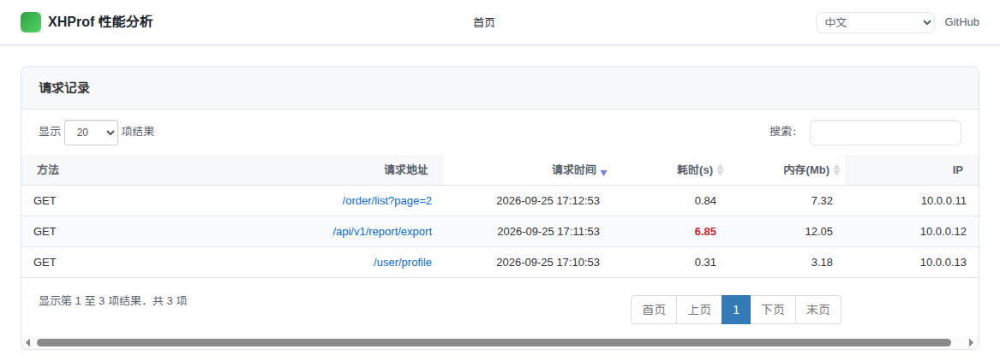
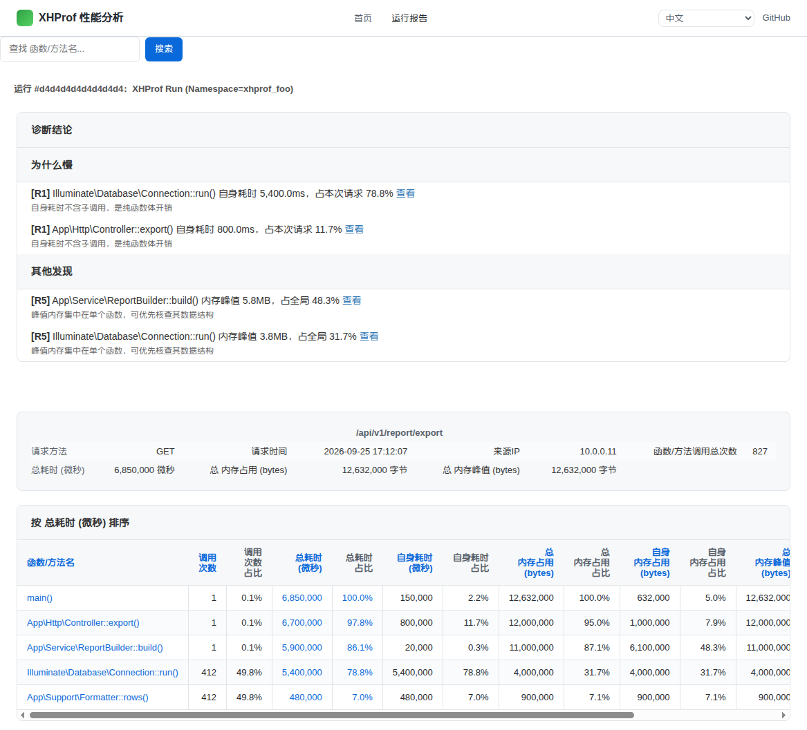
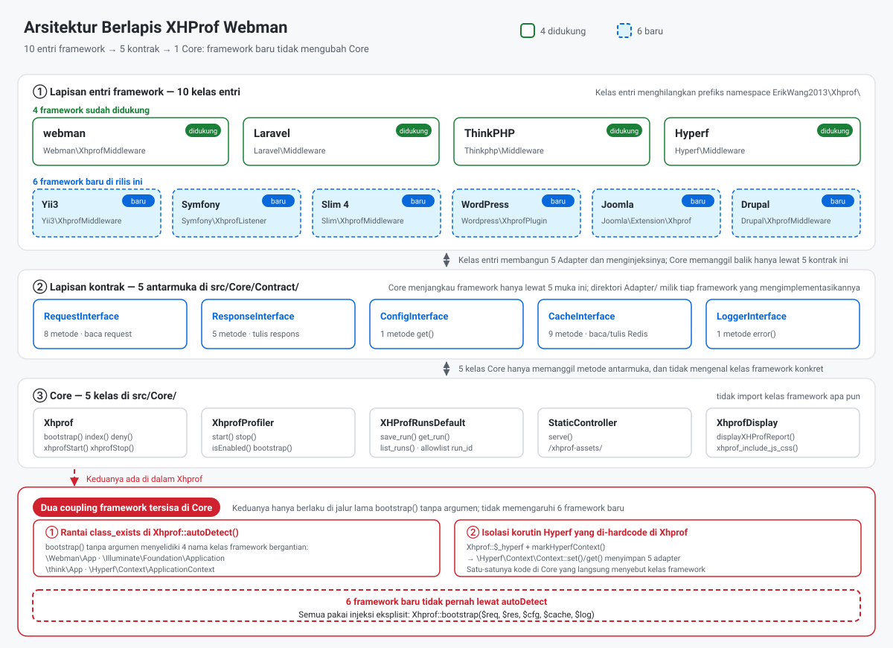
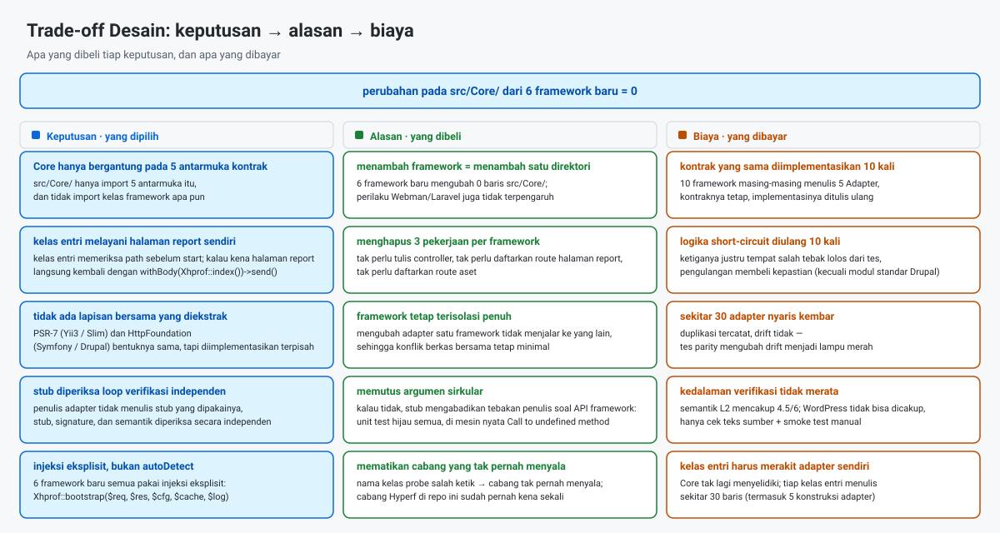
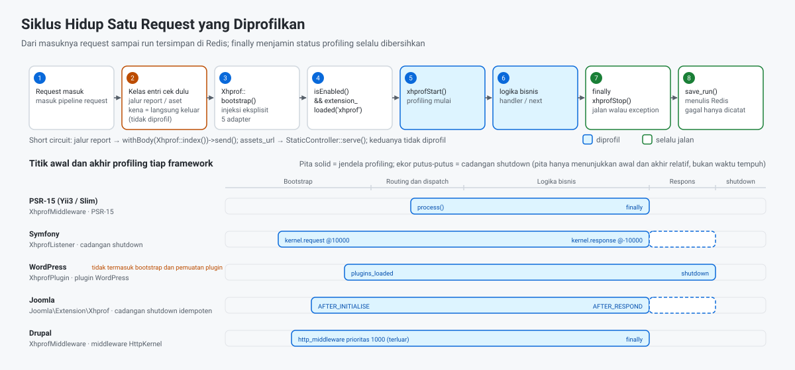

> **Terjemahan mesin.** Dokumen ini diterjemahkan secara otomatis dan belum diperiksa oleh penutur asli. Acuan resminya adalah [versi bahasa Inggris](../en/README.md).

[中文](../../../README.md) · [English](../en/README.md) · [한국어](../ko/README.md) · [Русский](../ru/README.md) · [Deutsch](../de/README.md) · [Français](../fr/README.md) · [Español](../es/README.md) · [Português](../pt/README.md) · [العربية](../ar/README.md) · [हिन्दी](../hi/README.md) · [বাংলা](../bn/README.md) · **Bahasa Indonesia** · [日本語](../ja/README.md)

# XHProf Profiler Performa

Plugin profiling performa kode yang kompatibel dengan webman / Laravel / ThinkPHP / Hyperf / Yii3 / Symfony / Slim 4 / WordPress / Joomla, dan Drupal.

Mengumpulkan data profiling lewat ekstensi xhprof dan menyimpannya di Redis. Pengembang dapat dengan cepat membuka laporan analisis performa melalui browser untuk menemukan hambatan performa kode.


Api kecil yang sama juga menjadi ikon situs dan ikon merek di kiri atas halaman report (`src/html/pet.svg`, disajikan di bawah prefiks `assets_url`).

**Riwayat Request**



**Laporan satu eksekusi**



## Persyaratan

- PHP >= 8.0
- ekstensi xhprof
- ekstensi redis
- server Redis

## Framework yang Kompatibel dan Versi Minimum

| Framework | Versi minimum | PHP minimum | Kelas entri | Cara memasang |
|-----------|----------------|-------------|-------------|--------------|
| webman | `workerman/webman ^2.1` | 8.0 | `Webman\XhprofMiddleware` | Daftarkan middleware global di `config/middleware.php` |
| Laravel | `laravel/framework ^9.0\|^10.0\|^11.0` | 8.0 | `Laravel\Middleware` | Daftarkan middleware global di `app/Http/Kernel.php` |
| ThinkPHP | `topthink/framework ^6.0\|^8.0` | 8.0 | `Thinkphp\Middleware` | Daftarkan middleware global di `app/middleware.php` |
| Hyperf | `hyperf/framework ^3.0` | 8.0 | `Hyperf\Middleware` | Terdaftar otomatis lewat ConfigProvider |
| Yii3 | `yiisoft/middleware-dispatcher ^5.0` | 8.1 | `Yii3\XhprofMiddleware` | Daftarkan di `config/web/di/application.php`, harus paling depan di daftar middleware |
| Symfony | `symfony/http-kernel ^6.4\|^7.0` | 8.1 (6.4) / 8.2 (7.x) | `Symfony\XhprofListener` | Tambahkan tag `kernel.event_subscriber` di `config/services.yaml` |
| Slim 4 | `slim/slim ^4.12` | 8.0 | `Slim\XhprofMiddleware` | `$app->add(...)`, harus ditambahkan paling akhir |
| WordPress | 6.4+ | 8.0 | `Wordpress\XhprofPlugin` | Salin ke `wp-content/mu-plugins/` |
| Joomla | 4.4 / 5.x | 8.1 | `Joomla\Extension\Xhprof` | Salin ke `plugins/system/`, pasang lewat Discover |
| Drupal | 10.x / 11.x | 8.1 (10.x) / 8.3 (11.x) | modul `xhprof` (`Drupal\XhprofMiddleware`) | Modul standar, cukup diaktifkan |
| PHP murni (tanpa framework) | — (tanpa paket eksternal) | 8.0 | `Native\XhprofBootstrap` | Satu baris di atas berkas entri, `XhprofBootstrap::start()`, tanpa mendaftarkan controller atau route |

Semua kelas entri berada di bawah prefiks namespace `ErikWang2013\Xhprof\` (dihilangkan di atas).  Tidak satu pun dari sebelas yang meminta Anda mendaftarkan controller atau route: halaman report dan aset statis dilayani oleh kelas entri itu sendiri (pada Drupal, oleh route modul).

Paket ini mendeklarasikan `php >= 8.0`, tetapi komponen `yiisoft/*` yang diandalkan Yii3 mensyaratkan **PHP 8.1+**, jadi **Yii3 tidak bisa dipakai di PHP 8.0**; Symfony 7.x dan Drupal 11.x juga butuh versi PHP yang lebih tinggi. Langkah pemasangan terperinci ada di "Konfigurasi Framework" di bawah.

## Instalasi

Tambahkan konfigurasi xhprof di php.ini:

```ini
[xhprof]
extension=xhprof.so
xhprof.output_dir=/tmp/xhprof
```

Pasang lewat Composer:

```sh
composer require aaron-dev/xhprof-webman
```

---

## Konfigurasi Framework

### Webman

**1. Daftarkan middleware global** — `config/middleware.php`:

```php
return [
    '' => [
        ErikWang2013\Xhprof\Webman\XhprofMiddleware::class,
    ],
];
```

**2. Halaman report dan aset statis** — **tidak perlu controller atau pendaftaran route**: sebelum profiling dimulai middleware memeriksa path request: kecocokan pada path report `/xhprof` langsung mengembalikan halaman report, dan kecocokan pada path aset (prefiks dibaca dari opsi `assets_url`, default `/xhprof-assets`) langsung mengembalikan aset statisnya.

**3. Konfigurasi** — Lihat `config/plugin/aaron-dev/xhprof/xhprof.php`.

---

### Laravel

**1. Daftarkan middleware** — `app/Http/Kernel.php`:

```php
protected $middleware = [
    // ...
    \ErikWang2013\Xhprof\Laravel\Middleware::class,
];
```

**2. Halaman report dan aset statis** — **tidak perlu controller atau pendaftaran route**: sebelum profiling dimulai middleware memeriksa path request: kecocokan pada path report `/xhprof` langsung mengembalikan halaman report, dan kecocokan pada path aset (prefiks dibaca dari opsi `assets_url`, default `/xhprof-assets`) langsung mengembalikan aset statisnya.

**3. Publikasikan konfigurasi**:

```sh
php artisan vendor:publish --tag=xhprof-config
```

Berkas konfigurasi ada di `config/xhprof.php`. Laravel mendukung penemuan otomatis ServiceProvider.

---

### ThinkPHP

**1. Daftarkan middleware** — `app/middleware.php`:

```php
return [
    \ErikWang2013\Xhprof\Thinkphp\Middleware::class,
];
```

**2. Halaman report dan aset statis** — **tidak perlu controller atau pendaftaran route**: sebelum profiling dimulai middleware memeriksa path request: kecocokan pada path report `/xhprof` langsung mengembalikan halaman report, dan kecocokan pada path aset (prefiks dibaca dari opsi `assets_url`, default `/xhprof-assets`) langsung mengembalikan aset statisnya.

**3. Konfigurasi** — Salin `vendor/aaron-dev/xhprof-webman/src/Thinkphp/config/xhprof.php` ke `config/xhprof.php` proyek.

---

### Hyperf

**1. Pendaftaran middleware otomatis** — ConfigProvider otomatis menambahkan middleware ke antrean middleware HTTP.

**2. Halaman report dan aset statis** — **tidak perlu controller atau pendaftaran route**: sebelum profiling dimulai middleware memeriksa path request: kecocokan pada path report `/xhprof` langsung mengembalikan halaman report, dan kecocokan pada path aset (prefiks dibaca dari opsi `assets_url`, default `/xhprof-assets`) langsung mengembalikan aset statisnya.

**3. Publikasikan konfigurasi**:

```sh
php bin/hyperf.php vendor:publish aaron-dev/xhprof-webman
```

Hasil konfigurasi ada di `config/autoload/xhprof.php`.

---

### Yii3

**1. Daftarkan middleware** — `config/web/di/application.php`:

```php
use ErikWang2013\Xhprof\Yii3\XhprofMiddleware;
use Yiisoft\Middleware\Dispatcher\MiddlewareDispatcher;

return [
    MiddlewareDispatcher::class => [
        'class' => MiddlewareDispatcher::class,
        // elemen pertama adalah middleware paling luar (jalan paling awal, selesai paling akhir)
        'withMiddlewares()' => [[
            XhprofMiddleware::class,
            // ... middleware lain
        ]],
    ],
];
```

Dua kesalahan yang mudah terjadi (keduanya sudah diukur):

- **Jangan** tulis `'__construct()' => ['middlewares' => [...]]`: `MiddlewareDispatcher::__construct()` hanya menerima `MiddlewareFactory` dan `EventDispatcherInterface` opsional — **tidak ada** parameter `middlewares`. Daftar middleware hanya bisa disuntikkan lewat **metode instance** `withMiddlewares()`.
- **Jangan** taruh instance (`new XhprofMiddleware(...)`) ke dalam `withMiddlewares()`: definisi hanya menerima class-string, definisi array, atau callable. Kalau diberi instance, pendaftaran tidak melaporkan apa pun dan `dispatch()` melempar `TypeError` (`MiddlewareFactory::create()` bertipe `callable|array|string`).

**2. Halaman report dan aset statis** — **tidak perlu controller atau pendaftaran route**: `XhprofMiddleware` adalah middleware PSR-15. Sebelum profiling dimulai ia memeriksa path request: jika kena path report `/xhprof` ia langsung mengembalikan halaman report, dan jika kena path aset (prefiks default `/xhprof-assets`) ia langsung mengembalikan aset statisnya. Respons halaman report membawa `Content-Type: text/html; charset=UTF-8` eksplisit dari kelas entri: respons PSR-7 tidak punya nilai default dan pengirim respons Yii3 tidak menambahkannya, jadi tanpa itu browser menampilkan laporan HTML sebagai teks biasa.

**3. Konfigurasi** — nilai default ada di dalam paket pada `src/Yii3/config/xhprof.php`; lihat "Referensi Konfigurasi" untuk daftar kolomnya. Untuk menimpanya, suntikkan `$config` lewat DI:

```php
XhprofMiddleware::class => [
    'class' => XhprofMiddleware::class,
    '__construct()' => [
        'config' => [
            'enable' => true,
            'auth_token' => 'your-token',
            'redis' => [
                'host' => '127.0.0.1',
                'port' => 6379,
                'password' => '',
                'database' => 0,
                'timeout' => 1.0,
            ],
        ],
    ],
],
```

Sub-array `redis` khusus untuk Yii3: kalau tidak ada `CacheInterface` yang disuntikkan, middleware memakainya untuk berbicara langsung dengan phpredis. Biarkan `assets_url` boleh prefiks apa pun: tautan CSS/JS halaman report dan `StaticController` membaca opsi yang sama (default `/xhprof-assets`). Keterbatasan yang tersisa saat deployment di subdirektori ada di [Verifikasi dan Keterbatasan yang Diketahui](#verifikasi-dan-keterbatasan-yang-diketahui).

**4. Syarat versi** — komponen `yiisoft/*` yang diandalkan Yii3 mensyaratkan PHP >= 8.1. Walaupun paket ini mendeklarasikan `php >= 8.0`, integrasi Yii3 tidak bisa dipakai di PHP 8.0.

---

### Symfony

**1. Daftarkan event subscriber** — `config/services.yaml`:

```yaml
services:
    ErikWang2013\Xhprof\Symfony\XhprofListener:
        tags:
            - { name: kernel.event_subscriber }
```

**2. Halaman report dan aset statis** — **tidak perlu controller atau pendaftaran route**: sebelum profiling dimulai listener memeriksa path request: jika kena path report `/xhprof` ia langsung mengembalikan halaman report, dan jika kena path aset (prefiks default `/xhprof-assets`) ia langsung mengembalikan aset statisnya.

**3. Konfigurasi** — nilai default ada di dalam paket pada `src/Symfony/config/xhprof.php`; lihat "Referensi Konfigurasi" untuk daftar kolomnya.

**4. Sub-request dan cadangan exception** — ia mendengarkan `kernel.request` (prioritas 10000) dan `kernel.response` (prioritas -10000). `isMainRequest()` menyaring sub-request ESI/fragment, yang kalau tidak akan menghentikan profiling terlalu dini; `register_shutdown_function` yang idempoten juga didaftarkan saat request dimulai — kalau HttpKernel melempar ulang exception, `kernel.response` tidak pernah menyala, dan tanpa cadangan itu status profiling akan bocor ke request berikutnya.

---

### Slim 4

**1. Daftarkan middleware** — `public/index.php`:

```php
use ErikWang2013\Xhprof\Slim\XhprofMiddleware;

$app->addRoutingMiddleware();

// harus ditambahkan paling akhir: tumpukan middleware Slim bersifat LIFO, makin akhir ditambahkan = makin luar = makin awal jalan
$app->add(new XhprofMiddleware(
    $app->getResponseFactory()
));
```

Tiga argumen konstruktor lainnya semuanya opsional; hilangkan saja untuk memakai nilai default bawaan paket:

- Argumen 2, `array $config`: array konfigurasi Anda, digabungkan di atas `src/Slim/config/xhprof.php` bawaan paket memakai `array_replace` (penggantian utuh — key berupa list seperti `ignore_url_arr` tidak pernah digabung secara rekursif).
- Argumen 3, `CacheInterface $cache`: kalau dihilangkan, ia malas melakukan `new \Redis()` (konstruktornya sengaja tidak pernah menyentuh ext-redis, agar ekstensi yang hilang tidak meledak saat adapter sedang dibangun). Untuk menyuntikkan koneksi sendiri, kirim `new \ErikWang2013\Xhprof\Slim\Adapter\RedisAdapter($redis)`, atau objek apa pun yang mengimplementasikan `ErikWang2013\Xhprof\Core\Contract\CacheInterface`.
- Argumen 4, `LoggerInterface $logger`: kalau dihilangkan, nilainya `new \ErikWang2013\Xhprof\Slim\Adapter\LogAdapter()` dan **log dibuang diam-diam** (Slim tidak membawa logger PSR-3). Untuk merekamnya, kirim `new LogAdapter($psrLogger)`, dengan `$psrLogger` adalah logger PSR-3 yang sudah Anda punya.

**Jangan** tulis `$app->add(XhprofMiddleware::class)`: `CallableResolver` milik Slim mengubah class string itu menjadi `new XhprofMiddleware($container)` — hanya memberikan container, dan menunda penyelesaiannya sampai waktu request. Akibatnya `add()` tidak melaporkan apa pun dan request pertama melempar `TypeError` — mode kegagalan yang paling sulit didiagnosis. Selalu pakai `new` eksplisit seperti di atas.

**2. Halaman report dan aset statis** — **tidak perlu controller atau pendaftaran route**: sebelum profiling dimulai middleware memeriksa path request: jika kena path report `/xhprof` ia langsung mengembalikan halaman report, dan jika kena path aset (prefiks default `/xhprof-assets`) ia langsung mengembalikan aset statisnya.

**3. Konfigurasi** — nilai default ada di dalam paket pada `src/Slim/config/xhprof.php`; lihat "Referensi Konfigurasi" untuk daftar kolomnya.

**4. Urutan pemasangan** — tumpukan middleware Slim bersifat LIFO (diukur dengan dua middleware, urutan eksekusinya `B:before → A:before → A:after → B:after`): makin akhir Anda `add()`, makin luar posisinya dan makin awal ia jalan. Jadi xhprof harus ditambahkan **paling akhir**, dan **setelah `addRoutingMiddleware()`** — kalau tidak, `/xhprof` tidak ada di tabel routing, RoutingMiddleware lebih dulu melempar `HttpNotFoundException`, dan request tidak pernah sampai ke middleware. Respons halaman report membawa `Content-Type: text/html; charset=UTF-8` eksplisit dari kelas entri: respons PSR-7 tidak punya nilai default dan `ResponseEmitter` milik Slim tidak menambahkannya, jadi tanpa itu browser menampilkan laporan HTML sebagai teks biasa.

---

### WordPress

**1. Pasang mu-plugin** — salin berkas bootstrap dari paket ke `wp-content/mu-plugins/`:

```sh
cp vendor/aaron-dev/xhprof-webman/wordpress/xhprof-webman.php wp-content/mu-plugins/
```

`wordpress/xhprof-webman.php` membawa header plugin dan mem-boot `Wordpress\XhprofPlugin`. mu-plugin dimuat otomatis — tidak ada yang perlu diaktifkan di wp-admin.

**2. Halaman report dan aset statis** — **tidak perlu controller atau pendaftaran route**: sebelum profiling dimulai kelas entri memeriksa path request: jika kena path report `/xhprof` ia langsung mengembalikan halaman report, dan jika kena path aset (prefiks default `/xhprof-assets`) ia langsung mengembalikan aset statisnya.

**3. Konfigurasi** — nilai default ada di dalam paket pada `src/Wordpress/config/xhprof.php`; lihat "Referensi Konfigurasi" untuk daftar kolomnya. Pakai `ignore_url_arr` untuk mengecualikan path berfrekuensi tinggi seperti `wp-cron.php` dan `admin-ajax.php`.

**4. Batas struktural jendela profiling** — jendelanya adalah `plugins_loaded` → `shutdown`, yang **tidak mencakup** bootstrap `wp-settings.php` maupun pemuatan plugin itu sendiri. Itu batas struktural WordPress: pekerjaan yang dilakukan pada fase tersebut tidak bisa diprofilkan.

---

### Joomla

**1. Pasang plugin** — salin direktori `joomla/` dari paket ke `plugins/system/xhprof/` situs:

```sh
cp -r vendor/aaron-dev/xhprof-webman/joomla/ plugins/system/xhprof/
```

Direktori `joomla/` di paket *adalah* pluginnya: manifes `xhprof.xml`, `services/provider.php`, dan `src/Extension/Xhprof.php`. Kelas entrinya adalah `ErikWang2013\Xhprof\Joomla\Extension\Xhprof` (sebuah `CMSPlugin`). Setelah menyalin, jalankan Discover di "System → Manage → Extensions → Discover" lalu pasang/aktifkan.

**2. Halaman report dan aset statis** — **tidak perlu controller atau pendaftaran route**: sebelum profiling dimulai plugin memeriksa path request: jika kena path report `/xhprof` ia langsung mengembalikan halaman report, dan jika kena path aset (prefiks default `/xhprof-assets`) ia langsung mengembalikan aset statisnya.

**3. Konfigurasi** — nilai default ada di dalam paket pada `src/Joomla/config/xhprof.php`; lihat "Referensi Konfigurasi" untuk daftar kolomnya. **Trade-off yang diketahui**: konfigurasi dibaca dari berkas config paket, bukan dari parameter plugin — parameter plugin butuh pembacaan database, sedangkan konfigurasi dibaca pada setiap request.

**4. Batas profiling** — jendelanya adalah `ApplicationEvents::AFTER_INITIALISE` → `ApplicationEvents::AFTER_RESPOND`; `register_shutdown_function` yang idempoten juga didaftarkan di `AFTER_INITIALISE`, karena `AFTER_RESPOND` tidak dijamin tercapai pada jalur exception — tanpa cadangan itu status profiling akan bocor ke request berikutnya.

---

### Drupal

**1. Aktifkan modul** — `drupal/xhprof/` di dalam paket adalah modul Drupal standar (`xhprof.info.yml` / `xhprof.routing.yml` / `xhprof.services.yml`). Letakkan di `modules/custom/xhprof/` situs Anda, lalu aktifkan di halaman "Extend" (atau dengan `drush en xhprof`).

**2. Halaman report dan aset statis** — Drupal adalah **satu-satunya dari sebelas framework yang lewat jalur «modul + route»**: `xhprof.routing.yml` mendaftarkan path report `/xhprof` dan path aset `/xhprof-assets`, yang secara default dilayani controller modul; sepuluh kelas entri lainnya memintas sendiri sebelum profiling dimulai dan melayani halaman report beserta aset statisnya tanpa mendaftarkan route. **Dengan prefiks `assets_url` kustom, aset dilayani middleware**: path route aset modul ditulis mati di `xhprof.routing.yml` (`/xhprof-assets/{file}`) dan tidak akan pernah cocok dengan prefiks lain.

**3. Konfigurasi** — konfigurasinya adalah config bertipe tingkat modul: nilai default ada di `drupal/xhprof/config/install/xhprof.settings.yml`, dengan skemanya di `drupal/xhprof/config/schema/xhprof.schema.yml`. Lihat "Referensi Konfigurasi" untuk daftar kolomnya.

**4. Pendaftaran middleware** — daftarkan layanan middleware di `xhprof.services.yml` milik modul:

```yaml
services:
  xhprof.http_middleware:
    class: ErikWang2013\Xhprof\Drupal\XhprofMiddleware
    arguments: ['@config.factory', '@logger.factory']
    tags:
      - { name: http_middleware, priority: 1000 }
```

Kernel dalam **diberikan otomatis sebagai argumen konstruktor ke-0** oleh `StackedKernelPass` milik Drupal — **jangan menulisnya sendiri**: kalau ditulis, akan ada dua kernel dalam, yang gagal saat kompilasi container di Drupal <= 11.2.x (termasuk seluruh 10.x) dan melempar TypeError pada setiap request di 11.3.0 ke atas. Profiling berhenti di dalam `finally`.

**5. Catatan**

- `priority: 1000` menempatkan middleware **di luar page cache** (prioritas tertinggi yang sudah ada di core adalah negotiation: 400 di D10, 500 di D11, sedangkan page cache 200), jadi **request yang dilayani dari page cache Drupal tetap diprofilkan**. Untuk alat profiling, itu perilaku yang diinginkan, tetapi pengguna perlu mengetahuinya.
- Cache-nya bekerja langsung tanpa penyetelan: middleware memakai adapter Redis bawaan paket ini (paket ini bergantung keras pada ext-redis), dan ia juga menerima argumen `CacheInterface` opsional lewat `arguments` di `services.yml` untuk menimpanya. Kalau cache tidak tersedia, penyimpanan yang gagal ditelan oleh `XhprofProfiler::stop()` menjadi satu baris log — **tidak ada error yang dilempar**.
- Request ke halaman report `/xhprof` dan ke `/xhprof-assets/*` **tidak diprofilkan**: middleware melewati profiling berdasarkan path sebelum `xhprofStart()`. Responsnya tetap dihasilkan oleh Controller di `xhprof.routing.yml` (**ini bukan short-circuit**). Jadi meskipun `ignore_url_arr` diisi `[]` (tidak menyaring apa pun), kedua request itu tidak pernah muncul di laporan.

### PHP murni (tanpa framework)

Untuk aplikasi tanpa framework yang hanya punya satu front controller (`public/index.php` dan sejenisnya).

**1. Tambahkan satu baris di bagian atas berkas entri**:

```php
\ErikWang2013\Xhprof\Native\XhprofBootstrap::start();
```

Untuk mengubah konfigurasi, berikan array-nya pada baris ini (set key-nya sama dengan sepuluh yang lain; nilai default ada di `src/Native/config/xhprof.php`):

```php
\ErikWang2013\Xhprof\Native\XhprofBootstrap::start([
    'enable' => true,
    'auth_token' => 'xxx',
]);
```

Argumen kedua dan ketiga adalah titik injeksi opsional: `CacheInterface $cache` dan `LoggerInterface $logger` (default: adapter Redis paket ini dan `error_log`). Nilai kembaliannya adalah instans entri untuk request ini (`stop()` idempoten); panggil untuk berhenti lebih awal di proses yang sama.

**2. Halaman report dan aset statis** — **tidak perlu controller atau pendaftaran route**: sebelum profiling dimulai baris ini memeriksa path request: kecocokan pada path report `/xhprof` langsung mengembalikan halaman report (dengan `Content-Type: text/html; charset=UTF-8` dan `Cache-Control: no-cache, private`; `auth_token` tetap berlaku), dan kecocokan pada path aset (prefiks dibaca dari opsi `assets_url`, default `/xhprof-assets`) langsung mengembalikan aset statisnya. **Biayanya ditulis terang-terangan**: setelah kedua path itu dilayani, terjadilah `exit` — sisa request tersebut (route setelah baris ini, bootstrap container, mulai sesi, dan logika penutup yang didaftarkan aplikasi sendiri) tidak dijalankan.

**3. Jendela profiling = baris ini → shutdown proses** (yang didaftarkan adalah `register_shutdown_function`). **Batasnya apa adanya**: tidak mencakup kode **sebelum** baris ini (autoload composer, bootstrap front controller), juga bukan yang dikerjakan proses/ekstensi lain (parsing request di php-fpm, pemrosesan di sisi nginx). Akhir normal, `exit`, serta Error / exception yang tak tertangkap semuanya sampai ke titik akhir; `SIGKILL` / OOM killer tidak — status profiling hilang bersama proses dan tidak tertinggal untuk request berikutnya. Untuk mempersempit cakupan gunakan opsi `ignore_url_arr` (kecocokan substring pada `uri()`, berlaku tanpa mengubah kode).

**4. Jalankan sekali sungguhan dengan `php -S`**:

```sh
# Di bagian atas public/index.php ada XhprofBootstrap::start(), dan berkas itu adalah front controller-nya
php -S 127.0.0.1:8000 -t public public/index.php
```

Buka `http://127.0.0.1:8000/` untuk menghasilkan data, lalu `http://127.0.0.1:8000/xhprof` untuk halaman report — keduanya di proses yang sama, dan asetnya ikut terverifikasi.

---

## Referensi Konfigurasi

Semua framework berbagi opsi konfigurasi berikut:

| Konfigurasi | Tipe | Default | Deskripsi |
|--------|------|---------|-------------|
| `enable` | bool | `true` | Aktifkan/nonaktifkan profiling |
| `time_limit` | int | `0` | Hanya profilkan request yang melebihi n detik, 0 berarti semua |
| `log_num` | int | `1000` | Jumlah maksimum rekaman |
| `view_wtred` | int | `3` | Sorot merah baris dengan waktu respons > n detik |
| `ignore_url_arr` | array | `["/xhprof"]` | Path URL yang diabaikan |
| `assets_url` | string | `/xhprof-assets` | Prefiks URL aset statis |
| `auth_token` | string\|null | `null` | Kalau diisi, halaman report mensyaratkan `?token=xxx`; disarankan untuk deployment publik |
| `key_prefix` | string | `xhprof` | Prefiks key Redis; isi nilai berbeda per proyek bila berbagi satu Redis |
| `log_ttl` | int | `604800` | Masa simpan data dalam detik (default 7 hari) |
| `locale` | string\|null | `null` | Bahasa halaman report: `zh_CN`/`en`/`ko`/`ru`/`de`/`fr`/`es`/`pt`/`ar`/`hi`/`bn`/`id`/`ja`; `null` = ikuti `Accept-Language` peramban, kalau tidak ada yang cocok pakai bahasa Mandarin; `?lang=xx` menimpanya untuk satu permintaan |

Keterbatasan yang diketahui dari opsi-opsi ini pada tiap framework tercantum di [Verifikasi dan Keterbatasan yang Diketahui](#verifikasi-dan-keterbatasan-yang-diketahui).

**Pengalih bahasa halaman report**

Dropdown di kanan navigasi mencantumkan 13 bahasa dengan **nama masing-masing** (`_meta.name` tiap katalog, misalnya 한국어, 日本語). Tautan setiap opsi dibuat dari **string kueri halaman saat ini** (`XhprofLib::report_url()`), jadi `?token=`, urutan, `run`, dan parameter lain ikut terbawa; mengganti bahasa **tidak meninggalkan tampilan saat ini** — di laporan eksekusi Anda tetap berada di eksekusi yang sama.

**Area diagnosis halaman report**

Kartu paling atas di badan laporan adalah "Kesimpulan Diagnosis" (tepat di bawah keterangan eksekusi): pertama "Mengapa lambat" (maksimal 3 penyebab), lalu "Temuan lain" (maksimal 3 pemeriksaan). Tautan "lihat" setelah tiap kesimpulan membuka halaman detail metode tersebut; rekursi (R4) punya tautan hanya bila nama polos benar-benar ada di tabel simbol — xhprof menjabarkan rekursi menjadi `fib@1`/`fib@2`, dan bila hanya nama terjabar yang tersisa, halaman detail tidak menemukan `fib`. Enam aturan dan ambangnya:

- **R1** waktu sendiri ≥ 10% dari total waktu request;
- **R2** jumlah panggilan ≥ 1000;
- **R3** panggilan satu relasi ≥ 500 **dan** waktu sendiri fungsi yang dipanggil ≥ 5% dari total waktu request;
- **R4** simbol yang sama muncul pada ≥ 2 kedalaman berbeda (rekursi);
- **R5** memori puncak sendiri ≥ 30% dari puncak global;
- **R6** waktu sendiri > waktu total (`excl_wt > wt`, mustahil secara logika) — probe integritas data yang tidak pernah menyala pada data yang sehat.

Ambangnya dipatok sebagai konstanta di `src/Core/Analysis/Analyzer.php`, dan saat ini **tidak ada opsi konfigurasi** yang bisa mengubahnya atau mematikan area ini (`enable` dimatikan berarti tidak ada sampling, jadi tidak ada yang bisa didiagnosis). Area ini **hanya muncul di tampilan eksekusi tunggal tingkat atas**: baik tampilan diff maupun halaman detail metode tidak merendernya — `$symbol_tab`/`$totals` yang dikirim ke sana bukan nilai satu eksekusi (dalam mode diff nilainya adalah selisih run2 − run1).

---

## Inisialisasi Manual

Kalau deteksi framework otomatis gagal, Anda bisa menyuntikkan adapter secara manual:

```php
use ErikWang2013\Xhprof\Core\Xhprof;

Xhprof::bootstrap(
    new MyRequestAdapter($request),
    new MyResponseAdapter($response),
    new MyConfigAdapter(),
    new MyCacheAdapter(),
    new MyLoggerAdapter()
);
```

**Keenam framework baru (Yii3 / Symfony / Slim 4 / WordPress / Joomla / Drupal) tidak boleh memanggil `Xhprof::bootstrap()` tanpa argumen** — tanpa argumen ia melewati `autoDetect()`, yang hanya mengenal cabang webman / Laravel / ThinkPHP / Hyperf dan melempar `Unsupported framework` untuk keenam framework ini. Kirimkan kelima adapter secara eksplisit seperti pada contoh di atas (kelas entri yang disertakan tiap framework sudah melakukannya untuk Anda).

---

## Arsitektur dan Desain

Core menjangkau framework lewat tepat 5 kontrak, semuanya di `src/Core/Contract/`:

| Kontrak | Metode | Tujuan |
|----------|---------|---------|
| `RequestInterface` | `get()` `all()` `method()` `header()` `host()` `uri()` `url()` `getRealIp()` | Membaca data request, mencocokkan path report, menyusun tautan halaman report |
| `ResponseInterface` | `withBody()` `withHeaders()` `withStatus()` `file()` `send()` | Mengeluarkan halaman report, aset statis, dan 400/403 |
| `ConfigInterface` | `get()` | Membaca konfigurasi plugin: `get('xhprof')` untuk seluruh blok, `get('xhprof.assets_url')` untuk satu daun |
| `CacheInterface` | `get()` `set()` `mget()` `incr()` `lPush()` `rPop()` `lRange()` `del()` `decr()` | Baca dan tulis Redis |
| `LoggerInterface` | `error()` | Peringatan untuk ekstensi yang hilang dan penyimpanan yang gagal |

Setiap framework menyediakan 5 adapter yang mengimplementasikan kontrak-kontrak ini, didaftarkan ke Core oleh `Xhprof::bootstrap()`. Semua yang spesifik framework tetap berada di dalam direktori `src/<Fw>/` milik framework itu sendiri.

**Hanya dua coupling ke framework yang tersisa di Core**:

1. Rantai `class_exists()` di `Xhprof::autoDetect()` (`Webman\App` → `Illuminate\Foundation\Application` → `think\App` → `Hyperf\Context\ApplicationContext`), yang hanya dicapai oleh `bootstrap()` tanpa argumen.
2. Sakelar korutin Hyperf yang di-hardcode: `Xhprof::markHyperfContext()` plus pemeriksaan keberadaan `\Hyperf\Context\Context`, yang menentukan apakah adapter masuk ke properti statis seluruh proses atau ke Context korutin.

**Keenam framework baru tidak pernah lewat `autoDetect()` — semuanya memakai injeksi eksplisit**: setiap kelas entri membangun sendiri 5 adapter-nya dan mengirimkannya ke `Xhprof::bootstrap($req, $res, $cfg, $cache, $log)`. Alasannya, pada framework PSR-7 Request/Response hanya bisa diperoleh dari pipeline request, jadi `bootstrap()` tanpa argumen memang tidak mungkin bekerja; manfaat keduanya, `autoDetect()` tetap beku pada empat framework yang sekarang.



Diagram pertama adalah **strukturnya**: kelas entri dari kesebelas framework, 5 kontraknya, tiga lapisan Core, dan satu-satunya dua coupling yang tersisa.



Diagram kedua adalah **penalarannya**: lima trade-off yang disusun sebagai keputusan / alasan / biaya, dengan judul "perubahan pada `src/Core/` dari keenam framework baru = 0".

---

## Siklus Hidup Request

Satu request yang diprofilkan:

1. **Sebelum profiling dimulai**, kelas entri memeriksa path: jika kena path report, halaman report langsung dikembalikan; jika kena path aset, aset statisnya langsung dikembalikan. Kedua path ini tidak diprofilkan, dan keduanya tidak masuk ke alur di bawah.
2. `XhprofProfiler::isEnabled()` membaca `enable` dari konfigurasi; kalau profiling mati atau ada ekstensi yang hilang, seluruh blok dilewati.
3. `Xhprof::xhprofStart()` → `XhprofProfiler::start()` → `xhprof_enable(XHPROF_FLAGS_NO_BUILTINS + XHPROF_FLAGS_CPU + XHPROF_FLAGS_MEMORY)`.
4. Logika bisnis berjalan.
5. `finally { Xhprof::xhprofStop(); }` → `xhprof_disable()`, lalu `XHProfRunsDefault::save_run()` menulis ke Redis. Memakai `finally` dan bukan pernyataan biasa, supaya exception yang dilempar tetap membersihkan status profiling dan menyimpan run-nya.
6. Browser membuka halaman report; `Xhprof::index()` membaca kembali datanya dari Redis dan merendernya.



| Framework | Profiling mulai | Profiling berakhir |
|-----------|-----------------|----------------|
| webman / Laravel / ThinkPHP / Hyperf | Masuk middleware (`process()` / `handle()`) | `finally` |
| Yii3 / Slim 4 | PSR-15 `process()` | `finally` |
| Symfony | `kernel.request` (prioritas 10000) | `kernel.response` (prioritas -10000), plus cadangan shutdown |
| WordPress | `plugins_loaded` | `shutdown` |
| Joomla | `onAfterInitialise` | `onAfterRespond`, plus cadangan shutdown |
| Drupal | `http_middleware` (prioritas 1000, terluar) | `finally` |
| PHP murni (tanpa framework) | Satu baris `XhprofBootstrap::start()` di atas berkas entri | Shutdown proses (`register_shutdown_function`), plus `stop()` untuk berhenti lebih awal |

---

## Struktur Proyek

```
xhprof-webman/
├── src/
│   ├── Core/                     # Tanpa ketergantungan framework: kontrak, halaman report, Redis, aset
│   │   ├── Contract/             # 5 antarmuka kontrak
│   │   ├── XhprofLib/            # rendering laporan dan penyimpanan run (dari phacility/xhprof)
│   │   ├── Xhprof.php            # fasad statis: bootstrap() / index()
│   │   ├── XhprofProfiler.php    # xhprof_enable/disable dan konfigurasi
│   │   ├── StaticController.php  # aset statis /xhprof-assets
│   │   ├── MiddlewareTrait.php   # pembungkus profiling bersama untuk Laravel / ThinkPHP
│   │   └── RedisAdapterTrait.php # implementasi adapter Redis bersama
│   ├── Webman/ Laravel/ Thinkphp/ Hyperf/            # 4 framework yang sudah ada
│   ├── Yii3/ Symfony/ Slim/ Wordpress/ Joomla/ Drupal/   # 6 framework baru
│   ├── Native/                   # PHP murni (tanpa framework): kelas entri dan 5 adapter
│   └── html/                     # aset halaman report (css / js / images / pet.svg ikon situs dan ikon merek)
├── wordpress/                    # berkas bootstrap mu-plugin (dengan header plugin)
├── joomla/                       # plugin Joomla (CMSPlugin + manifes)
├── drupal/xhprof/                # modul Drupal standar (info / routing / services + controller)
├── tools/contracts/              # loop verifikasi mandiri: signature dan semantik terhadap paket framework asli (`legacy-symfony64/` adalah leg 6.4)
├── tools/i18n/                   # rantai alat terjemahan untuk README dan ketiga SVG (generate / check / selftest)
├── docs/i18n/                    # 12 hasil terjemahan (Inggris, Korea, Rusia, Jerman, Prancis, Spanyol, Portugis, Arab, Hindi, Bengali, Indonesia, Jepang)
├── tests/                        # PHPUnit: test adapter, test wiring, test Core, paritas struktural di 14 README
└── docs/images/                  # diagram README
```

Kecuali Drupal, setiap direktori `src/<Fw>/` memiliki bentuk yang sama:

```
src/<Fw>/
├── Adapter/{Request,Response,Config,Redis,Log}Adapter.php
├── <EntryClass>.php
└── config/xhprof.php             # 10 key konfigurasi yang sama seperti framework lain
```

`src/Drupal/` adalah satu-satunya pengecualian: ia tidak punya direktori `config/` — konfigurasinya berada di config bertipe tingkat modul (`drupal/xhprof/config/install/xhprof.settings.yml`).

---

## Verifikasi dan Keterbatasan yang Diketahui

**Apa yang sudah dibuktikan secara mekanis**

| Butir | Caranya |
|------|-----|
| Perilaku adapter dan wiring kelas entri | `tests/Unit/Adapter/*Test.php`: aktif → tersimpan / nonaktif → tidak tersimpan / exception bisnis → tetap tersimpan lewat `finally` |
| Kesebelas framework berbagi satu set key konfigurasi | tes paritas konfigurasi (set key, bukan byte per byte; komentar boleh berbeda) |
| Kedua README saling mencerminkan | tes paritas README: membandingkan urutan judul `##` / `###` dan jumlah blok kode |
| Metode yang dipanggil adapter benar-benar ada | loop verifikasi `tools/contracts/` (job CI tersendiri, **dua leg**: leg utama memasang paket terbaru tiap framework, dan proyek terpisah `tools/contracts/legacy-symfony64` menjalankan case Symfony yang sama terhadap 6.4): memasang paket framework asli (`drupal/core` asli untuk Drupal, dua paket rilis CMS asli untuk Joomla) dan memastikan lewat reflection bahwa setiap metode / konstanta / fungsi global ada **untuk delapan framework yang masuk loop** (Slim / Symfony / Yii3 / Joomla / WordPress / Drupal / Laravel / Webman); ThinkPHP / Hyperf tidak masuk loop — lihat di bawah |
| Semantik adapter | Loop yang sama menginstansiasi objek request dan response asli lalu menjalankan adapter-nya, dengan dua invarian: `uri()` tidak membawa scheme/host, dan `withHeaders()` tetap berlaku setelah `file()`. Jumlah SKIP loop adalah konstanta beku (2 di leg utama, 0 di leg 6.4) dan keduanya ada di Joomla: jalur baca asli `#__extensions.params` dan bentuk installer, keduanya butuh database atau installer untuk dijalankan |


**Tidak diverifikasi otomatis (jangan baca ini sebagai «semuanya sudah tercakup»)**

| Butir | Kenapa tidak |
|------|---------|
| **Wiring** setiap framework (apakah hook-nya benar-benar terpasang, apakah event-nya benar-benar menyala) | Unit test memakai stub; wiring saat ini hanya bisa dipastikan lewat smoke test manual |
| Dua sub-item Joomla yang tersisa | Dua hal yang masih belum terjangkau loop, dan keduanya karena alasan yang sama (butuh database atau installer): jalur baca asli `#__extensions.params` (`PluginHelper::getPlugin()` → `bootPlugin()`) dan bentuk installer (namespacemap tertulis, `bootPlugin()` menemukan kelasnya) |
| Konfigurasi otomatis `kernel.event_subscriber` Symfony | Membutuhkan kompilasi container asli |
| Cakap-silang state statis di proses berjalan lama | Sisi Webman tidak diubah (di Hyperf sudah diisolasi: 9 nilai state render per permintaan melewati Context coroutine, dipatok oleh `tests/Unit/Lib/RenderStateCoroutineTest.php` dengan coroutine yang benar-benar menyerahkan kendali) |
| I/O Redis asli, rendering browser, overhead profiling di bawah beban nyata | I/O Redis asli **kini ada di dalam loop** (`cases/Redis.php`: phpredis asli + permintaan Slim asli dari awal sampai akhir — permintaan → penyimpanan → halaman daftar → halaman laporan); rendering browser dan overhead di bawah beban nyata tetap di luar cakupan unit test dan loop |
| Signature dan semantik adapter untuk ThinkPHP / Hyperf | keduanya tidak masuk loop verifikasi (loop mencakup delapan framework); stub-nya ditulis tangan di dalam paket, di `tests/Stubs/framework-stubs.php`, tanpa pembandingan dengan paket asli |

**Daftar periksa smoke manual (tiga langkah per framework)**

| Langkah | Tindakan | Yang diharapkan |
|------|--------|----------|
| 1 | Pasang kelas entri seperti dijelaskan di "Konfigurasi Framework" | Tidak ada error |
| 2 | Buka URL aplikasi mana pun | Panjang key `xhprof:run_id` di Redis naik 1 |
| 3 | Buka `/xhprof` | Halaman report ter-render dengan gayanya; `/xhprof-assets/js/xhprof_report.js` mengembalikan 200 |

**Smoke test PHP murni**: jalankan server bawaan dengan `php -S 127.0.0.1:8000 -t public public/index.php` (langkah 4 di "PHP murni"), lalu lakukan ketiga langkahnya — halaman report dan aset berada di **proses yang sama** dengan request bisnis, jadi langkah 3 bisa langsung diverifikasi.

**Keterbatasan yang diketahui: `request_uri` yang ditampilkan di daftar tidak punya port**

Kontrak `host()` berarti "hanya host, tanpa port" (R-2), dan kesebelas framework mematuhinya — hanya implementasinya yang berbeda: `getHost()` dari PSR-7 tidak pernah membawa port, Joomla / WordPress memotongnya sendiri dengan `parse_url`, dan Webman / ThinkPHP butuh argumen ketat `host(true)` (nilai default mengembalikan header `Host` apa adanya, termasuk port). `request_uri` yang ditampilkan di daftar disusun sebagai `host() . uri()` (`src/Core/XhprofLib/Utils/XHProfRunsDefault.php`), jadi pada port non-standar (misalnya `:8080`) **teks** baris itu tidak menampilkan port. **Tautannya sendiri tidak terpengaruh**: tautan di daftar dan di laporan semuanya dibuat `XhprofLib::report_url()` sebagai URL relatif (hanya path + query), membuka halaman yang benar, dan tidak bergantung pada `host()`.

**`assets_url` kini mendukung prefiks khusus**

Prefiks aset bukan lagi konstanta yang di-hardcode: `src/Core/StaticController.php` mencocokkan path aset dengan opsi `assets_url` (default `/xhprof-assets`, garis miring di akhir opsional). Keterbatasan yang tersisa saat deployment di subdirektori adalah keterbatasan Drupal di bawah. **Kesebelas framework mengikuti opsi ini**: sepuluh kelas entri memintas jalur aset sendiri sebelum profiling dimulai dan melayaninya, sedangkan Drupal melayani prefiks default lewat route modul + controller dan menyerahkan prefiks kustom ke middleware. **Batas**: Laravel, Hyperf, Webman, dan ThinkPHP tidak lagi perlu controller atau route — middleware berjalan lebih dulu, jadi controller dan dua route yang didaftarkan menurut petunjuk lama hanya tertutupi: tidak error dan tidak pernah lagi tersentuh.

**Keterbatasan yang diketahui: penjaga path gagal kalau Drupal berada di subdirektori**

Kalau Drupal dipasang di bawah subdirektori (misalnya `/sites/app/xhprof`), penjaga path tidak bisa mencocokkan URI yang membawa base path, sehingga perilakunya jatuh kembali ke "diprofilkan tetapi tidak disimpan" (dengan konfigurasi default, `ignore_url_arr` yang menangkapnya).

**Kompatibilitas Symfony 6.4**

Kompatibilitas Symfony 6.4 sudah diukur (dari situlah dua over-fit yang tak terlihat di 7.4 diperbaiki: properti `Request` tidak membawa deklarasi tipe native di 6.4, dan charset yang ditambahkan `prepare()` berbeda huruf besar-kecilnya). **Kedua leg berjalan di CI**: leg utama 7.x plus proyek terpisah `tools/contracts/legacy-symfony64`, yang menjalankan file case yang sama tanpa menyalinnya — dan kedua leg juga ada di gate tag.

---

## Penulis

[erik](https://erik.xyz)

Paket ini dirilis dengan lisensi MIT (lihat `LICENSE`); `src/Core/XhprofLib/**`, `src/html/js/xhprof_report.js`, dan `src/html/css/xhprof.css` berasal dari [phacility/xhprof](https://github.com/phacility/xhprof) (Apache-2.0) dan tetap tunduk pada ketentuannya; daftar pustaka front-end pihak ketiga ada di `NOTICE`.

## Dukung Open Source

<p align="center">
  
  
</p>

---

Plugin ini merujuk pada [phacility/xhprof](https://github.com/phacility/xhprof) dan [xiexianbo123/xhprof](https://github.com/xiexianbo123/xhprof).
