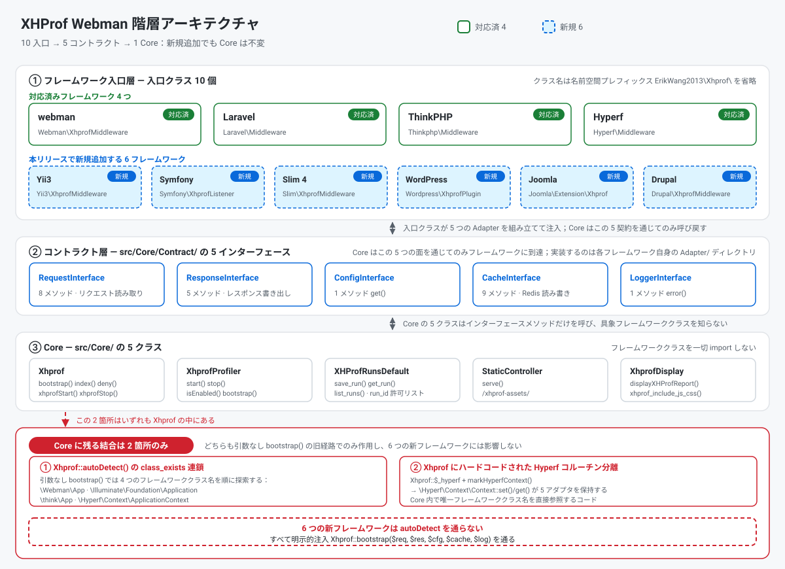
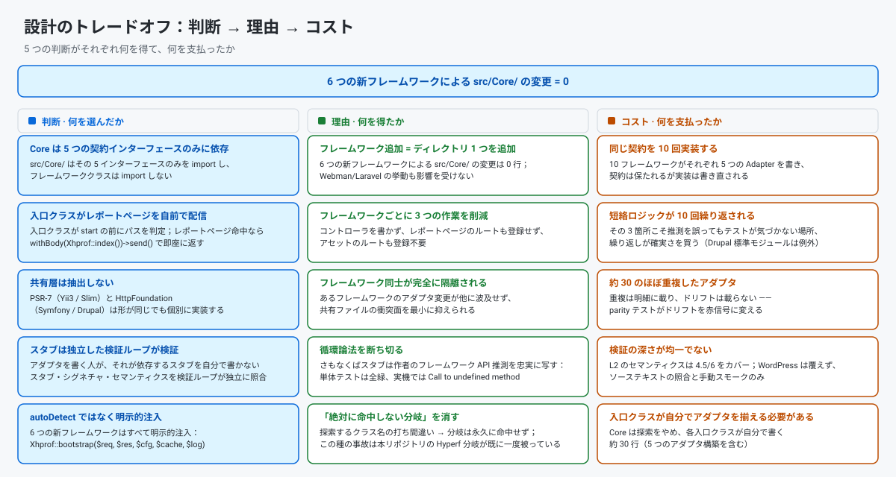
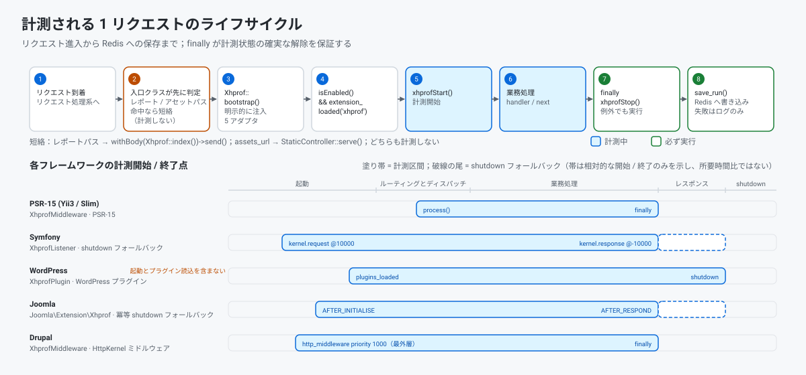

> **機械翻訳。** この文書は自動翻訳されたもので、母語話者による校閲を受けていません。内容が食い違う場合は [英語版](../en/README.md) を正とします。

[中文](../../../README.md) · [English](../en/README.md) · [한국어](../ko/README.md) · [Русский](../ru/README.md) · [Deutsch](../de/README.md) · [Français](../fr/README.md) · [Español](../es/README.md) · [Português](../pt/README.md) · [العربية](../ar/README.md) · [हिन्दी](../hi/README.md) · [বাংলা](../bn/README.md) · [Bahasa Indonesia](../id/README.md) · **日本語**

# XHProf パフォーマンスプロファイラ

webman / Laravel / ThinkPHP / Hyperf / Yii3 / Symfony / Slim 4 / WordPress / Joomla / Drupal に対応したコードパフォーマンス計測プラグインです。

xhprof 拡張で計測データを収集し、Redis に保存します。開発者はブラウザからパフォーマンス解析レポートをすばやく確認でき、コードのパフォーマンスボトルネックを特定できます。


同じ小さな炎は、レポートページのサイトアイコンと左上のブランドアイコンでもあります（`src/html/pet.svg`、`assets_url` プレフィックスで配信）。

**リクエスト記録**


**単一実行のレポート**


## 動作要件

- PHP >= 8.0
- xhprof 拡張
- redis 拡張
- Redis サーバー

## 対応フレームワークと最低バージョン

| フレームワーク | 最低バージョン | 最低 PHP | 入口クラス | 組み込み方 |
|-----------|----------------|-------------|-------------|--------------|
| webman | `workerman/webman ^2.1` | 8.0 | `Webman\XhprofMiddleware` | `config/middleware.php` にグローバルミドルウェアを登録 |
| Laravel | `laravel/framework ^9.0\|^10.0\|^11.0` | 8.0 | `Laravel\Middleware` | `app/Http/Kernel.php` にグローバルミドルウェアを登録 |
| ThinkPHP | `topthink/framework ^6.0\|^8.0` | 8.0 | `Thinkphp\Middleware` | `app/middleware.php` にグローバルミドルウェアを登録 |
| Hyperf | `hyperf/framework ^3.0` | 8.0 | `Hyperf\Middleware` | ConfigProvider 経由で自動登録 |
| Yii3 | `yiisoft/middleware-dispatcher ^5.0` | 8.1 | `Yii3\XhprofMiddleware` | `config/web/di/application.php` に登録。ミドルウェア一覧の先頭に置く必要がある |
| Symfony | `symfony/http-kernel ^6.4\|^7.0` | 8.1 (6.4) / 8.2 (7.x) | `Symfony\XhprofListener` | `config/services.yaml` に `kernel.event_subscriber` タグを追加 |
| Slim 4 | `slim/slim ^4.12` | 8.0 | `Slim\XhprofMiddleware` | `$app->add(...)`。最後に追加する必要がある |
| WordPress | 6.4+ | 8.0 | `Wordpress\XhprofPlugin` | `wp-content/mu-plugins/` にコピー |
| Joomla | 4.4 / 5.x | 8.1 | `Joomla\Extension\Xhprof` | `plugins/system/` にコピーし、Discover でインストール |
| Drupal | 10.x / 11.x | 8.1 (10.x) / 8.3 (11.x) | `xhprof` モジュール（`Drupal\XhprofMiddleware`） | 標準モジュール。有効化するだけ |

入口クラスはすべて `ErikWang2013\Xhprof\` 名前空間プレフィックスの下にあります（上の表では省略）。10 のうちどれも、コントローラやルートの登録を求めてきません。レポートページと静的アセットは入口クラス自身が配信します（Drupal の場合はモジュールのルート）。

本パッケージは `php >= 8.0` を宣言していますが、Yii3 が依存する `yiisoft/*` コンポーネントは **PHP 8.1 以上**を要求するため、**Yii3 は PHP 8.0 では使用できません**。同様に Symfony 7.x と Drupal 11.x もより高い PHP バージョンが必要です。手順の詳細は後述の「フレームワーク設定」にあります。

## インストール

php.ini に xhprof の設定を追加します。

```ini
[xhprof]
extension=xhprof.so
xhprof.output_dir=/tmp/xhprof
```

Composer でインストールします。

```sh
composer require aaron-dev/xhprof-webman
```

---

## フレームワーク設定

### Webman

**1. グローバルミドルウェアを登録** — `config/middleware.php`：

```php
return [
    '' => [
        ErikWang2013\Xhprof\Webman\XhprofMiddleware::class,
    ],
];
```

**2. レポートページと静的アセット** — **コントローラもルート登録も不要です**。計測が始まる前にミドルウェアがリクエストパスを判定し、レポートパス `/xhprof` に一致すればレポートページをそのまま返し、アセットパス（プレフィックスは `assets_url` 設定から読み取り、既定は `/xhprof-assets`）に一致すれば静的アセットを直接返します。

**3. 設定** — `config/plugin/aaron-dev/xhprof/xhprof.php` を参照してください。

---

### Laravel

**1. ミドルウェアを登録** — `app/Http/Kernel.php`：

```php
protected $middleware = [
    // ...
    \ErikWang2013\Xhprof\Laravel\Middleware::class,
];
```

**2. レポートページと静的アセット** — **コントローラもルート登録も不要です**。計測が始まる前にミドルウェアがリクエストパスを判定し、レポートパス `/xhprof` に一致すればレポートページをそのまま返し、アセットパス（プレフィックスは `assets_url` 設定から読み取り、既定は `/xhprof-assets`）に一致すれば静的アセットを直接返します。

**3. 設定を publish**：

```sh
php artisan vendor:publish --tag=xhprof-config
```

設定ファイルは `config/xhprof.php` に出力されます。Laravel は ServiceProvider の自動検出に対応しています。

---

### ThinkPHP

**1. ミドルウェアを登録** — `app/middleware.php`：

```php
return [
    \ErikWang2013\Xhprof\Thinkphp\Middleware::class,
];
```

**2. レポートページと静的アセット** — **コントローラもルート登録も不要です**。計測が始まる前にミドルウェアがリクエストパスを判定し、レポートパス `/xhprof` に一致すればレポートページをそのまま返し、アセットパス（プレフィックスは `assets_url` 設定から読み取り、既定は `/xhprof-assets`）に一致すれば静的アセットを直接返します。

**3. 設定** — `vendor/aaron-dev/xhprof-webman/src/Thinkphp/config/xhprof.php` をプロジェクトの `config/xhprof.php` にコピーしてください。

---

### Hyperf

**1. ミドルウェアの自動登録** — ConfigProvider が HTTP ミドルウェアキューにミドルウェアを自動追加します。

**2. レポートページと静的アセット** — **コントローラもルート登録も不要です**。計測が始まる前にミドルウェアがリクエストパスを判定し、レポートパス `/xhprof` に一致すればレポートページをそのまま返し、アセットパス（プレフィックスは `assets_url` 設定から読み取り、既定は `/xhprof-assets`）に一致すれば静的アセットを直接返します。

**3. 設定を publish**：

```sh
php bin/hyperf.php vendor:publish aaron-dev/xhprof-webman
```

設定は `config/autoload/xhprof.php` に出力されます。

---

### Yii3

**1. ミドルウェアを登録** — `config/web/di/application.php`：

```php
use ErikWang2013\Xhprof\Yii3\XhprofMiddleware;
use Yiisoft\Middleware\Dispatcher\MiddlewareDispatcher;

return [
    MiddlewareDispatcher::class => [
        'class' => MiddlewareDispatcher::class,
        // the first element is the outermost middleware (runs first, finishes last)
        'withMiddlewares()' => [[
            XhprofMiddleware::class,
            // ... other middlewares
        ]],
    ],
];
```

ありがちな間違いが 2 つあります（どちらも実測済み）。

- `'__construct()' => ['middlewares' => [...]]` と書いてはいけません。`MiddlewareDispatcher::__construct()` が受け取るのは `MiddlewareFactory` と省略可能な `EventDispatcherInterface` だけで、`middlewares` パラメータは**存在しません**。ミドルウェア一覧を注入できるのは**インスタンスメソッド** `withMiddlewares()` 経由だけです。
- `withMiddlewares()` にインスタンス（`new XhprofMiddleware(...)`）を入れてはいけません。定義が受け取れるのはクラス文字列、配列定義、callable のみです。インスタンスを渡すと登録時は何も報告されず、`dispatch()` で `TypeError` が投げられます（`MiddlewareFactory::create()` の型は `callable|array|string` です）。

**2. レポートページと静的アセット** — **コントローラもルート登録も不要**です。`XhprofMiddleware` は PSR-15 ミドルウェアです。計測開始前にリクエストパスを調べ、レポートパス `/xhprof` に命中すればレポートページを即座に返し、アセットパス（既定プレフィックス `/xhprof-assets`）に命中すれば静的アセットをそのまま返します。レポートページのレスポンスには入口クラスが明示的に `Content-Type: text/html; charset=UTF-8` を付けます。PSR-7 のレスポンスには既定値がなく、Yii3 のレスポンス送信側も付与しないため、これがないとブラウザは HTML レポートをプレーンテキストとして描画してしまいます。

**3. 設定** — 既定値はパッケージ内の `src/Yii3/config/xhprof.php` にあり、項目は「設定リファレンス」を参照してください。上書きするには DI 経由で `$config` を注入します。

```php
XhprofMiddleware::class => [
    'class' => XhprofMiddleware::class,
    '__construct()' => [
        'config' => [
            'enable' => true,
            'auth_token' => 'your-token',
            'redis' => [
                'host' => '127.0.0.1',
                'port' => 6379,
                'password' => '',
                'database' => 0,
                'timeout' => 1.0,
            ],
        ],
    ],
],
```

`redis` サブ配列は Yii3 固有です。`CacheInterface` が注入されていない場合、ミドルウェアはこれを使って phpredis に直接接続します。`assets_url` は任意のプレフィックスに変更できます。レポートページの CSS / JS リンクと `StaticController` が同じ設定項目を読みます（既定は `/xhprof-assets`）。サブディレクトリ配置での残りの制限は[検証と既知の制限](#検証と既知の制限)を参照してください。

**4. バージョン要件** — Yii3 が依存する `yiisoft/*` コンポーネントは PHP >= 8.1 を要求します。本パッケージは `php >= 8.0` を宣言していますが、Yii3 連携は PHP 8.0 では使えません。

---

### Symfony

**1. イベントサブスクライバを登録** — `config/services.yaml`：

```yaml
services:
    ErikWang2013\Xhprof\Symfony\XhprofListener:
        tags:
            - { name: kernel.event_subscriber }
```

**2. レポートページと静的アセット** — **コントローラもルート登録も不要**です。計測開始前にリスナーがリクエストパスを調べ、レポートパス `/xhprof` に命中すればレポートページを即座に返し、アセットパス（既定プレフィックス `/xhprof-assets`）に命中すれば静的アセットをそのまま返します。

**3. 設定** — 既定値はパッケージ内の `src/Symfony/config/xhprof.php` にあり、項目は「設定リファレンス」を参照してください。

**4. サブリクエストと例外時のフォールバック** — リスナーは `kernel.request`（優先度 10000）と `kernel.response`（優先度 -10000）を購読します。`isMainRequest()` が ESI / フラグメントのサブリクエストを除外します。これがないと計測が早すぎるタイミングで止まってしまいます。またリクエスト開始時に冪等な `register_shutdown_function` も登録します。HttpKernel が例外を再スローすると `kernel.response` が発火せず、このフォールバックがないと計測状態が次のリクエストに漏れ出すためです。

---

### Slim 4

**1. ミドルウェアを登録** — `public/index.php`：

```php
use ErikWang2013\Xhprof\Slim\XhprofMiddleware;

$app->addRoutingMiddleware();

// must be added last: Slim's middleware stack is LIFO, added later = further out = runs first
$app->add(new XhprofMiddleware(
    $app->getResponseFactory()
));
```

残り 3 つのコンストラクタ引数はすべて省略可能で、省略するとパッケージ同梱の既定値が使われます。

- 引数 2 の `array $config`：設定配列。パッケージ同梱の `src/Slim/config/xhprof.php` に対して `array_replace` でマージされます（値ごとの置換であり、`ignore_url_arr` のようなリストのキーが再帰的にマージされることはありません）。
- 引数 3 の `CacheInterface $cache`：省略すると遅延で `new \Redis()` を実行します（コンストラクタは意図的に ext-redis に触れないため、アダプタ構築中に拡張がなくても落ちません）。自前の接続を注入するには `new \ErikWang2013\Xhprof\Slim\Adapter\RedisAdapter($redis)`、または `ErikWang2013\Xhprof\Core\Contract\CacheInterface` を実装した任意のオブジェクトを渡します。
- 引数 4 の `LoggerInterface $logger`：省略すると `new \ErikWang2013\Xhprof\Slim\Adapter\LogAdapter()` になり、**ログは黙って捨てられます**（Slim は PSR-3 ロガーを同梱していません）。記録するには `new LogAdapter($psrLogger)` を渡します。`$psrLogger` は既にお持ちの PSR-3 ロガーです。

**`$app->add(XhprofMiddleware::class)` と書いてはいけません**。Slim の `CallableResolver` はそのクラス文字列を `new XhprofMiddleware($container)` に変換し、コンテナだけを渡したうえで解決をリクエスト時まで遅延させます。結果として `add()` は何も報告せず、最初のリクエストで `TypeError` が投げられます。最も原因を特定しにくい失敗の仕方です。必ず上記のように `new` を明示してください。

**2. レポートページと静的アセット** — **コントローラもルート登録も不要**です。計測開始前にミドルウェアがリクエストパスを調べ、レポートパス `/xhprof` に命中すればレポートページを即座に返し、アセットパス（既定プレフィックス `/xhprof-assets`）に命中すれば静的アセットをそのまま返します。

**3. 設定** — 既定値はパッケージ内の `src/Slim/config/xhprof.php` にあり、項目は「設定リファレンス」を参照してください。

**4. 登録順序** — Slim のミドルウェアスタックは LIFO です（ミドルウェア 2 つで実測したところ、実行順は `B:before → A:before → A:after → B:after`）。`add()` が後であるほど外側に位置し、より早く実行されます。したがって xhprof は**最後に**、かつ **`addRoutingMiddleware()` より後に**追加する必要があります。そうしないと `/xhprof` がルーティングテーブルに存在せず、RoutingMiddleware が先に `HttpNotFoundException` を投げ、リクエストがミドルウェアに到達しません。レポートページのレスポンスには入口クラスが明示的に `Content-Type: text/html; charset=UTF-8` を付けます。PSR-7 のレスポンスには既定値がなく、Slim の `ResponseEmitter` も付与しないため、これがないとブラウザは HTML レポートをプレーンテキストとして描画してしまいます。

---

### WordPress

**1. mu-plugin をインストール** — パッケージのブートストラップファイルを `wp-content/mu-plugins/` にコピーします。

```sh
cp vendor/aaron-dev/xhprof-webman/wordpress/xhprof-webman.php wp-content/mu-plugins/
```

`wordpress/xhprof-webman.php` にはプラグインヘッダが付いており、`Wordpress\XhprofPlugin` を起動します。mu-plugins は自動的に読み込まれるため、wp-admin で有効化する操作は不要です。

**2. レポートページと静的アセット** — **コントローラもルート登録も不要**です。計測開始前に入口クラスがリクエストパスを調べ、レポートパス `/xhprof` に命中すればレポートページを即座に返し、アセットパス（既定プレフィックス `/xhprof-assets`）に命中すれば静的アセットをそのまま返します。

**3. 設定** — 既定値はパッケージ内の `src/Wordpress/config/xhprof.php` にあり、項目は「設定リファレンス」を参照してください。`wp-cron.php` や `admin-ajax.php` のような高頻度パスは `ignore_url_arr` で除外してください。

**4. 計測区間の構造的な限界** — 区間は `plugins_loaded` → `shutdown` で、`wp-settings.php` の起動処理とプラグインの読み込み自体は**含まれません**。これは WordPress の構造的な限界で、この段階で行われる処理は計測できません。

---

### Joomla

**1. プラグインをインストール** — パッケージの `joomla/` ディレクトリをサイトの `plugins/system/xhprof/` にコピーします。

```sh
cp -r vendor/aaron-dev/xhprof-webman/joomla/ plugins/system/xhprof/
```

パッケージの `joomla/` ディレクトリがそのままプラグインです。`xhprof.xml` マニフェスト、`services/provider.php`、`src/Extension/Xhprof.php` が含まれます。入口クラスは `ErikWang2013\Xhprof\Joomla\Extension\Xhprof`（`CMSPlugin`）です。コピー後に「システム → 管理 → 拡張機能 → Discover」で Discover を実行し、インストールして有効化してください。

**2. レポートページと静的アセット** — **コントローラもルート登録も不要**です。計測開始前にプラグインがリクエストパスを調べ、レポートパス `/xhprof` に命中すればレポートページを即座に返し、アセットパス（既定プレフィックス `/xhprof-assets`）に命中すれば静的アセットをそのまま返します。

**3. 設定** — 既定値はパッケージ内の `src/Joomla/config/xhprof.php` にあり、項目は「設定リファレンス」を参照してください。**既知のトレードオフ**：プラグインパラメータではなくパッケージの設定ファイルを読みます。プラグインパラメータの取得にはデータベース読み取りが必要で、設定はリクエストごとに読まれるためです。

**4. 計測の境界** — 区間は `ApplicationEvents::AFTER_INITIALISE` → `ApplicationEvents::AFTER_RESPOND` です。加えて `AFTER_INITIALISE` で冪等な `register_shutdown_function` も登録します。例外経路では `AFTER_RESPOND` に到達することが保証されず、このフォールバックがないと計測状態が次のリクエストに漏れ出すためです。

---

### Drupal

**1. モジュールを有効化** — パッケージの `drupal/xhprof/` は標準的な Drupal モジュールです（`xhprof.info.yml` / `xhprof.routing.yml` / `xhprof.services.yml`）。サイトの `modules/custom/xhprof/` に配置し、「Extend」ページ（または `drush en xhprof`）で有効化してください。

**2. レポートページと静的アセット** — Drupal は**10 フレームワーク中で唯一「モジュール + ルート」の形をとります**。`xhprof.routing.yml` がレポートパス `/xhprof` とアセットパス `/xhprof-assets` を登録し、既定ではモジュールのコントローラが配信します。残り 9 つの入口クラスは計測開始前に自前でショートサーキットしてレポートページと静的アセットを配信し、ルートを登録しません。**`assets_url` を独自プレフィックスにするとアセットはミドルウェアが配信します**: モジュールのアセットルートの path は `xhprof.routing.yml` に固定されており（`/xhprof-assets/{file}`）、別のプレフィックスには決して一致しません。

**3. 設定** — 設定はモジュールレベルの typed config です。既定値は `drupal/xhprof/config/install/xhprof.settings.yml` にあり、スキーマは `drupal/xhprof/config/schema/xhprof.schema.yml` にあります。項目は「設定リファレンス」を参照してください。

**4. ミドルウェアの登録** — モジュールの `xhprof.services.yml` にミドルウェアサービスを登録します。

```yaml
services:
  xhprof.http_middleware:
    class: ErikWang2013\Xhprof\Drupal\XhprofMiddleware
    arguments: ['@config.factory', '@logger.factory']
    tags:
      - { name: http_middleware, priority: 1000 }
```

内側のカーネルは Drupal の `StackedKernelPass` が**コンストラクタ引数 0 として自動的に先頭へ挿入します**。**自分で書いてはいけません**。書くと内側カーネルが 2 つになり、Drupal <= 11.2.x（10.x 系を含む）ではコンテナのコンパイル時に失敗し、11.3.0 以降ではリクエストごとに TypeError が投げられます。計測は `finally` で停止します。

**5. 注意点**

- `priority: 1000` はミドルウェアを**ページキャッシュの外側**に置きます（コアに既存の最高優先度は negotiation の 400（D10）/ 500（D11）で、ページキャッシュは 200 です）。したがって **Drupal のページキャッシュから返されるリクエストも計測されます**。計測ツールとしては意図した挙動ですが、利用者は知っておくべきです。
- キャッシュはすぐに動作します。ミドルウェアは既定で本パッケージ同梱の Redis アダプタを使い（本パッケージは ext-redis にハード依存しています）、`services.yml` の `arguments` で省略可能な `CacheInterface` 引数を渡して上書きもできます。キャッシュが使えない場合、保存の失敗は `XhprofProfiler::stop()` が 1 行のログに飲み込み、**エラーは発生しません**。
- レポートページ `/xhprof` と `/xhprof-assets/*` へのリクエストは**計測されません**。ミドルウェアが `xhprofStart()` より前にパスで計測対象外と判断するためです。レスポンス自体は `xhprof.routing.yml` の Controller が生成します（**これは短絡ではありません**）。そのため `ignore_url_arr` を `[]`（何も除外しない）にしても、この 2 つのリクエストがレポートに現れることはありません。

---

## 設定リファレンス

すべてのフレームワークが以下の設定項目を共有します。

| 設定 | 型 | 既定値 | 説明 |
|--------|------|---------|-------------|
| `enable` | bool | `true` | 計測の有効 / 無効 |
| `time_limit` | int | `0` | n 秒を超えたリクエストのみ計測。0 はすべて |
| `log_num` | int | `1000` | 最大記録件数 |
| `view_wtred` | int | `3` | レスポンスタイムが n 秒を超える行を赤で強調 |
| `ignore_url_arr` | array | `["/xhprof"]` | 無視する URL パス |
| `assets_url` | string | `/xhprof-assets` | 静的アセットの URL プレフィックス |
| `auth_token` | string\|null | `null` | 設定するとレポートページに `?token=xxx` が必要。公開環境での利用を推奨 |
| `key_prefix` | string | `xhprof` | Redis のキープレフィックス。1 つの Redis を共有する場合はプロジェクトごとに別の値を設定 |
| `log_ttl` | int | `604800` | データ保持期間（秒、既定 7 日） |
| `locale` | string\|null | `null` | レポートページの言語：`zh_CN`/`en`/`ko`/`ru`/`de`/`fr`/`es`/`pt`/`ar`/`hi`/`bn`/`id`/`ja`。`null` = ブラウザの `Accept-Language` に従い、一致しなければ中国語。`?lang=xx` で 1 リクエストだけ上書きできます |

各設定項目のフレームワークごとの既知の制限は[検証と既知の制限](#検証と既知の制限)にまとめています。

**レポートページの言語切り替え**

ナビゲーション右側のドロップダウンは 13 の言語を**それぞれの自称**で並べます（各語彙の `_meta.name`。例：한국어、日本語）。各項目のリンクは**現在のページのクエリ文字列**から生成されるため（`XhprofLib::report_url()`）、`?token=`・並び順・`run` などのパラメータもそのまま引き継がれます。言語を切り替えても**現在のビューから離れません** — 実行レポートで切り替えれば同じ実行にとどまります。

**レポートページの診断エリア**

レポート本文のいちばん上のカードが「診断結果」です（実行の説明のすぐ下）。まず「なぜ遅いのか」（最大 3 件の原因）、次に「その他の検出事項」（最大 3 件の確認項目）を並べます。各結論の後ろの「表示」リンクはそのメソッドの詳細ページへ移動します。ただし再帰（R4）には、裸の名前が実際にシンボル表にある場合だけリンクが付きます — xhprof は再帰を `fib@1`/`fib@2` に展開するため、展開後の名前しかなければ詳細ページは `fib` で引いても見つかりません。6 つのルールとしきい値：

- **R1** 自身実時間がリクエストの合計実時間の 10% 以上。
- **R2** 呼び出し回数が 1000 以上。
- **R3** 1 本の呼び出し関係の呼び出し回数が 500 以上、**かつ**呼ばれる側の自身実時間がリクエストの合計実時間の 5% 以上。
- **R4** 同じ名前のシンボルが 2 つ以上の異なる深度に現れる（再帰）。
- **R5** 自身のピークメモリが全体のピークの 30% 以上。
- **R6** 自身実時間 > 合計実時間（`excl_wt > wt`、論理的にありえません）— データ整合性のプローブで、健全なデータでは発火しません。

しきい値は `src/Core/Analysis/Analyzer.php` の定数に固定されており、現時点でこれを変更したり診断エリアを無効化したりできる**設定項目はありません**（`enable` を切るとサンプリング自体が行われないため、診断する対象もありません）。このエリアは**最上位の単一実行ビューにのみ**表示されます。diff 比較ビューとメソッド詳細ページでは描画されません — それらに渡される `$symbol_tab`/`$totals` は単一実行の値ではないからです（diff モードでは run2 − run1 の差分になります）。

---

## 手動初期化

フレームワークの自動判別が失敗する場合は、アダプタを手動で注入できます。

```php
use ErikWang2013\Xhprof\Core\Xhprof;

Xhprof::bootstrap(
    new MyRequestAdapter($request),
    new MyResponseAdapter($response),
    new MyConfigAdapter(),
    new MyCacheAdapter(),
    new MyLoggerAdapter()
);
```

**新規 6 フレームワーク（Yii3 / Symfony / Slim 4 / WordPress / Joomla / Drupal）は、引数なしの `Xhprof::bootstrap()` を呼んではいけません**。引数なしでは `autoDetect()` を通り、そこが知っているのは webman / Laravel / ThinkPHP / Hyperf の分岐だけで、この 6 つでは `Unsupported framework` が投げられます。上の例のように 5 つのアダプタをすべて明示的に渡してください（各フレームワークに同梱の入口クラスが既にそうしています）。

---

## アーキテクチャと設計

Core はフレームワークに、`src/Core/Contract/` にあるちょうど 5 つの契約を通じて到達します。

| 契約 | メソッド | 目的 |
|----------|---------|---------|
| `RequestInterface` | `get()` `all()` `method()` `header()` `host()` `uri()` `url()` `getRealIp()` | リクエストデータの読み取り、レポートパスの判定、レポートページのリンク生成 |
| `ResponseInterface` | `withBody()` `withHeaders()` `withStatus()` `file()` `send()` | レポートページ、静的アセット、400/403 の出力 |
| `ConfigInterface` | `get()` | プラグイン設定の読み取り。`get('xhprof')` でブロック全体、`get('xhprof.assets_url')` で個別の値 |
| `CacheInterface` | `get()` `set()` `mget()` `incr()` `lPush()` `rPop()` `lRange()` `del()` `decr()` | Redis の読み書き |
| `LoggerInterface` | `error()` | 拡張の欠落と保存失敗の警告 |

各フレームワークはこれらの契約を実装した 5 つのアダプタを提供し、`Xhprof::bootstrap()` がそれらを Core に登録します。フレームワーク固有のものはすべて、そのフレームワーク自身の `src/<Fw>/` ディレクトリ内に留まります。

**Core に残っているフレームワークとの結合は 2 箇所だけです**。

1. `Xhprof::autoDetect()` の `class_exists()` 連鎖（`Webman\App` → `Illuminate\Foundation\Application` → `think\App` → `Hyperf\Context\ApplicationContext`）。引数なしの `bootstrap()` からのみ到達します。
2. ハードコードされた Hyperf のコルーチン切り替え：`Xhprof::markHyperfContext()` と `\Hyperf\Context\Context` の存在チェックで、アダプタをプロセス全体の静的プロパティに置くかコルーチンの Context に置くかを決めます。

**新規 6 フレームワークは `autoDetect()` を通らず、すべて明示的注入を使います**。各入口クラスが自分で 5 つのアダプタを構築し、`Xhprof::bootstrap($req, $res, $cfg, $cache, $log)` に渡します。理由は、PSR-7 系フレームワークでは Request / Response がリクエストパイプラインからしか取得できないため、引数なしの `bootstrap()` は構造上動作しえないことです。副次的な利点として、`autoDetect()` は現在の 4 フレームワークのまま凍結できます。



1 枚目は**構造**の図です。10 フレームワークそれぞれの入口クラス、5 つの契約、Core の 3 層、そして残った 2 箇所の結合を示します。



2 枚目は**根拠**の図です。5 つのトレードオフを判断 / 理由 / コストとして並べ、「新規 6 フレームワークによる `src/Core/` の変更 = 0」を掲げています。

---

## リクエストライフサイクル

計測対象リクエスト 1 件の流れ：

1. **計測を開始する前に**、入口クラスがパスを調べます。レポートパスに命中すればレポートページを即座に返し、アセットパスに命中すれば静的アセットを即座に返します。どちらのパスも計測されず、以下の流れにも入りません。
2. `XhprofProfiler::isEnabled()` が設定から `enable` を読みます。計測が無効か拡張が欠けていれば、ブロック全体がスキップされます。
3. `Xhprof::xhprofStart()` → `XhprofProfiler::start()` → `xhprof_enable(XHPROF_FLAGS_NO_BUILTINS + XHPROF_FLAGS_CPU + XHPROF_FLAGS_MEMORY)`。
4. 業務処理が実行されます。
5. `finally { Xhprof::xhprofStop(); }` → `xhprof_disable()`、続いて `XHProfRunsDefault::save_run()` が Redis に書き込みます。単純な文ではなく `finally` なのは、例外が投げられても計測状態が確実に解除され、run が保存されるようにするためです。
6. ブラウザがレポートページを開きます。`Xhprof::index()` が Redis からデータを読み戻して描画します。



| フレームワーク | 計測開始 | 計測終了 |
|-----------|-----------------|----------------|
| webman / Laravel / ThinkPHP / Hyperf | ミドルウェア入口（`process()` / `handle()`） | `finally` |
| Yii3 / Slim 4 | PSR-15 の `process()` | `finally` |
| Symfony | `kernel.request`（優先度 10000） | `kernel.response`（優先度 -10000）、加えて shutdown フォールバック |
| WordPress | `plugins_loaded` | `shutdown` |
| Joomla | `onAfterInitialise` | `onAfterRespond`、加えて shutdown フォールバック |
| Drupal | `http_middleware`（優先度 1000、最外層） | `finally` |

---

## プロジェクト構成

```
xhprof-webman/
├── src/
│   ├── Core/                     # フレームワーク非依存：契約、レポートページ、Redis 保存、アセット
│   │   ├── Contract/             # 5 つの契約インターフェース
│   │   ├── XhprofLib/            # レポート描画と run 保存（phacility/xhprof 由来）
│   │   ├── Xhprof.php            # 静的ファサード：bootstrap() / index()
│   │   ├── XhprofProfiler.php    # xhprof_enable/disable と設定
│   │   ├── StaticController.php  # /xhprof-assets の静的アセット
│   │   ├── MiddlewareTrait.php   # Laravel / ThinkPHP 共通の計測ラッパー
│   │   └── RedisAdapterTrait.php # 各フレームワーク Redis アダプタの共通実装
│   ├── Webman/ Laravel/ Thinkphp/ Hyperf/            # 既存の 4 フレームワーク
│   ├── Yii3/ Symfony/ Slim/ Wordpress/ Joomla/ Drupal/   # 新規 6 フレームワーク
│   └── html/                     # レポートページのアセット（css / js / images / pet.svg サイトアイコンとブランドアイコン）
├── wordpress/                    # mu-plugin ブートストラップファイル（プラグインヘッダ付き）
├── joomla/                       # Joomla プラグイン（CMSPlugin + マニフェスト）
├── drupal/xhprof/                # 標準 Drupal モジュール（info / routing / services + Controller）
├── tools/contracts/              # 独立検証ループ：実フレームワークパッケージに対するシグネチャとセマンティクスの検証（`legacy-symfony64/` は 6.4 レグ）
├── tools/i18n/                   # README と 3 枚の SVG の翻訳ツールチェーン（生成 / 検証 / 自己テスト）
├── docs/i18n/                    # 12 言語の訳文成果物（英語、韓国語、ロシア語、ドイツ語、フランス語、スペイン語、ポルトガル語、アラビア語、ヒンディー語、ベンガル語、インドネシア語、日本語）
├── tests/                        # PHPUnit：アダプタ・配線・Core のテスト、14 の README の構造一致
└── docs/images/                  # README の図
```

Drupal を除き、すべての `src/<Fw>/` ディレクトリは同じ形です。

```
src/<Fw>/
├── Adapter/{Request,Response,Config,Redis,Log}Adapter.php
├── <EntryClass>.php
└── config/xhprof.php             # 他のフレームワークと同じ 10 つの設定キー
```

`src/Drupal/` だけが例外です。`config/` ディレクトリを持たず、設定はモジュールレベルの typed config（`drupal/xhprof/config/install/xhprof.settings.yml`）にあります。

---

## 検証と既知の制限

**機械的に証明されていること**

| 項目 | 方法 |
|------|-----|
| アダプタと入口の配線の挙動 | `tests/Unit/Adapter/*Test.php`：有効 → 保存 / 無効 → 保存しない / 業務例外 → `finally` 経由で保存される |
| 10 フレームワークが 1 つの設定キー集合を共有 | 設定パリティテスト（キー集合のみで、バイト単位の一致は見ない。コメントは差異を許容） |
| 2 つの README が対応している | README パリティテスト：`##` / `###` の見出し列とコードブロック数を比較 |
| アダプタが呼ぶメソッドが実在する | `tools/contracts/` の検証ループ（専用の CI ジョブ、**2 本のレグ**: 主レグは各フレームワークの最新パッケージを入れ、別プロジェクト `tools/contracts/legacy-symfony64` が同じ Symfony ケースを 6.4 に対して実行します）: 実フレームワークパッケージを導入し（Drupal は実物の `drupal/core`、Joomla は実物の CMS リリースパッケージ 2 本）、すべてのメソッド / 定数 / グローバル関数の存在をリフレクションで検証します — **ループに入っている 8 つのフレームワーク**（Slim / Symfony / Yii3 / Joomla / WordPress / Drupal / Laravel / Webman）について。ThinkPHP / Hyperf はループ外です（下記参照） |
| アダプタのセマンティクス | 同じループが実際の request / response オブジェクトを生成してアダプタを走らせ、2 つの不変条件（`uri()` が scheme/host を含まないこと、`file()` の後でも `withHeaders()` が適用されること）を確認します。ループの SKIP 数は凍結された定数（主レグ 2、6.4 レグ 0）で、どちらも Joomla にあります: `#__extensions.params` の実際の読み取り経路とインストーラの形態で、どちらも実行にデータベースかインストーラが要ります |


**自動検証されていないもの（「すべて網羅した」と読まないでください）**

| 項目 | 理由 |
|------|---------|
| 各フレームワークの**配線**（フックが本当に付いているか、イベントが本当に発火するか） | 単体テストはスタブを使う。配線は現状、手動スモークテストでしか確認できない |
| Joomla の残り 2 つのサブ項目 | ループがまだ届かない 2 点で、どちらも理由は同じです（データベースかインストーラが必要）: `#__extensions.params` の実際の読み取り経路（`PluginHelper::getPlugin()` → `bootPlugin()`）とインストーラの形態（namespacemap が書かれ、`bootPlugin()` がクラスを見つけられること） |
| Symfony の `kernel.event_subscriber` 自動設定 | 実際のコンテナコンパイルが必要 |
| 長時間稼働プロセスでの静的状態の混線 | Webman 側は未変更（Hyperf 側は隔離済み：描画期の 9 つの値はリクエストごとにコルーチン Context を通り、`tests/Unit/Lib/RenderStateCoroutineTest.php` が実際に yield するコルーチンで固定している） |
| 実際の Redis I/O、ブラウザ描画、実負荷での計測オーバーヘッド | 実際の Redis I/O は**検証ループに入りました**（`cases/Redis.php`: 実 phpredis + 実 Slim リクエストを端から端まで —— リクエスト → 保存 → 一覧ページ → レポートページ）。ブラウザ描画と実負荷でのオーバーヘッドは従来どおり単体テストと検証ループの範囲外です |
| ThinkPHP / Hyperf のアダプタのシグネチャとセマンティクス | この 2 つは検証ループに入っていません（ループが覆うのは 8 つのフレームワーク）。スタブはパッケージ内の `tests/Stubs/framework-stubs.php` に手書きで、実パッケージとの突き合わせはありません |

**手動スモークチェックリスト（フレームワークごとに 3 ステップ）**

| 手順 | 操作 | 期待結果 |
|------|--------|----------|
| 1 | 「フレームワーク設定」のとおりに入口クラスを組み込む | エラーが出ない |
| 2 | アプリの任意の URL にアクセスする | Redis の `xhprof:run_id` キーの長さが 1 増える |
| 3 | `/xhprof` を開く | レポートページがスタイル付きで描画される。`/xhprof-assets/js/xhprof_report.js` が 200 を返す |

**既知の制限：一覧に表示される `request_uri` にポートがない**

`host()` 契約は「ホストのみ、ポートを含まない」（R-2）を意味し、10 のフレームワークすべてが従っています。違うのは実装方法だけです。PSR-7 の `getHost()` はポートを含みません。Joomla / WordPress は手動で `parse_url` に一度かけます。Webman と ThinkPHP は厳格引数 `host(true)` を渡す必要があります（既定の引数は `Host` ヘッダーをポートごとそのまま返します）。一覧に表示される `request_uri` は `host() . uri()` で組み立てられるため（`src/Core/XhprofLib/Utils/XHProfRunsDefault.php`）、非標準ポート（例：`:8080`）ではその行の**テキスト**にポートが現れません。**リンク自体は影響を受けません**：一覧とレポート内のリンクはすべて `XhprofLib::report_url()` が生成する相対 URL（パス + クエリのみ）で、正しいページを開き、host に依存しません。

**`assets_url` がカスタムプレフィックスに対応しました**

アセットのプレフィックスはもうハードコード定数ではありません。`src/Core/StaticController.php` が `assets_url` 設定でアセットのパスを照合します（既定 `/xhprof-assets`、末尾スラッシュは有無どちらでも可）。サブディレクトリ配置での残りの制限は下の Drupal の項目です。 **10 フレームワークすべてがこの設定に従います**。9 つの入口クラスは計測開始前にアセットパスを自前でショートサーキットして配信し、Drupal は既定プレフィックスをモジュールルート + コントローラで、独自プレフィックスをミドルウェアで配信します。**境界**: Laravel、Hyperf、Webman、ThinkPHP はもうコントローラもルートも不要です — ミドルウェアが先に走るため、旧手順どおりに登録したコントローラと 2 本のルートは覆い隠されるだけ: エラーにはならず、二度と到達しません。

**既知の制限：Drupal がサブディレクトリにあるとパス判定が効かない**

Drupal がサブディレクトリ（例：`/sites/app/xhprof`）にインストールされている場合、パス判定がベースパスを含む URI に一致できないため、挙動は「計測するが保存されない」に落ちます（既定設定では `ignore_url_arr` が拾います）。

**Symfony 6.4 互換性**

Symfony 6.4 互換性は実測済みです（7.4 では見えない 2 つの過剰適合がこれで修正されました: 6.4 では `Request` のプロパティにネイティブの型宣言がなく、`prepare()` が付ける charset は大文字小文字が異なります）。**両方のレグが CI で走ります**: 主レグの 7.x に加えて、別プロジェクト `tools/contracts/legacy-symfony64` が同じ case ファイルを複製せずに実行し、両レグとも tag ゲートに入っています。

---

## 作者

[erik](https://erik.xyz)

本パッケージは MIT ライセンスで公開しています（`LICENSE` 参照）。`src/Core/XhprofLib/**`、`src/html/js/xhprof_report.js`、`src/html/css/xhprof.css` は [phacility/xhprof](https://github.com/phacility/xhprof)（Apache-2.0）から派生したもので、その条件が引き続き適用されます。サードパーティ製フロントエンドライブラリの一覧は `NOTICE` にあります。

## オープンソースを支援

<p align="center">
  
  
</p>

---

本プラグインは [phacility/xhprof](https://github.com/phacility/xhprof) と [xiexianbo123/xhprof](https://github.com/xiexianbo123/xhprof) を参考にしています。
