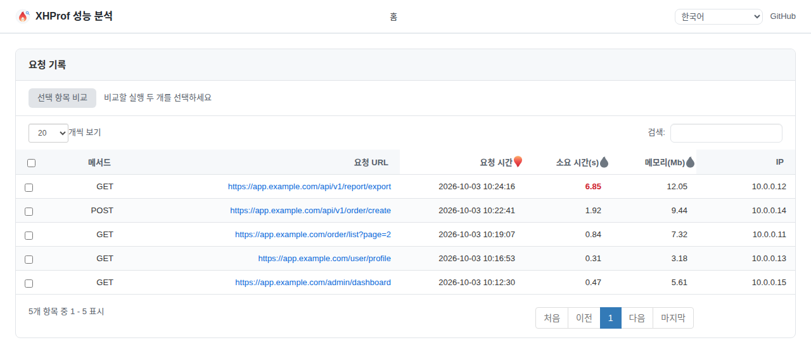
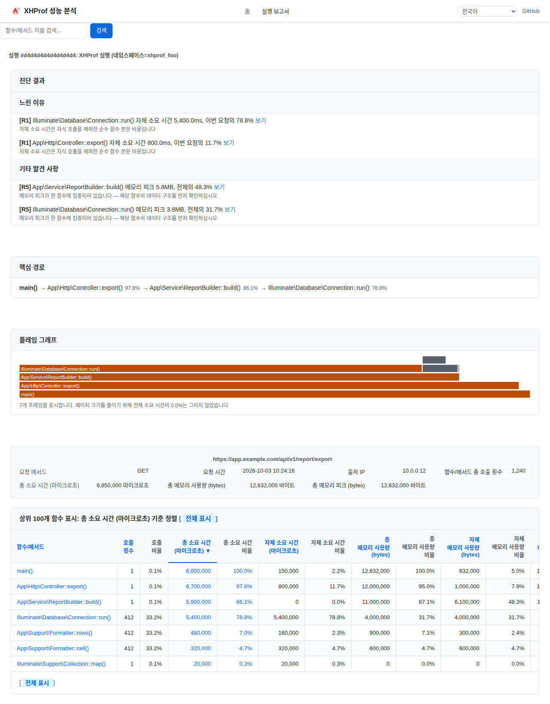
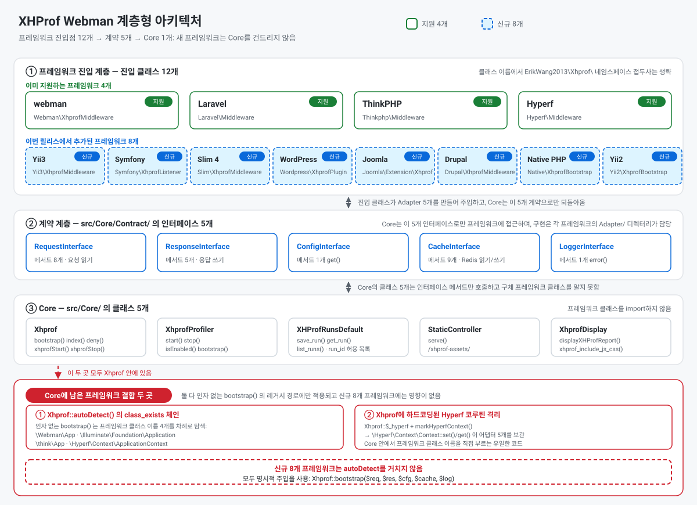
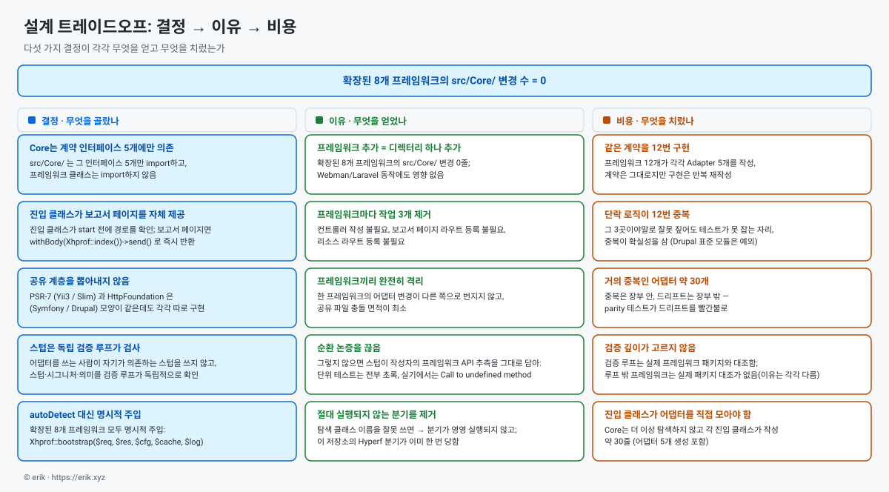
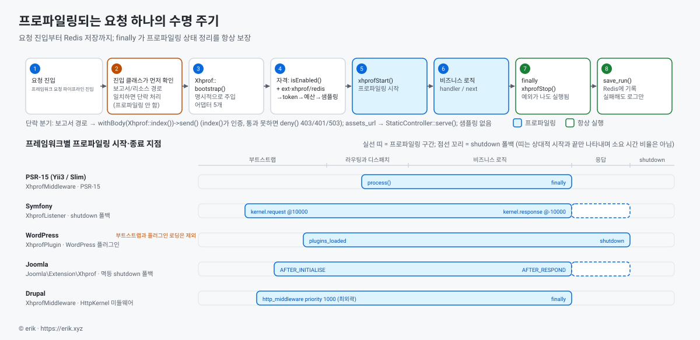

> **기계 번역.** 이 문서는 기계 번역한 결과이며 한국어 원어민의 검수를 받지 않았습니다. 내용이 어긋날 경우 [영문판](../en/README.md)을 기준으로 하십시오.

[中文](../../../README.md) · [English](../en/README.md) · **한국어** · [Русский](../ru/README.md) · [Deutsch](../de/README.md) · [Français](../fr/README.md) · [Español](../es/README.md) · [Português](../pt/README.md) · [العربية](../ar/README.md) · [हिन्दी](../hi/README.md) · [বাংলা](../bn/README.md) · [Bahasa Indonesia](../id/README.md) · [日本語](../ja/README.md)

# XHProf 성능 프로파일러

   

webman / Laravel / ThinkPHP / Hyperf / Yii2 / Yii3 / Symfony / Slim 4 / WordPress / Joomla / Drupal / 순수 PHP(프레임워크 없음)과 호환되는 코드 성능 프로파일링 플러그인입니다.

xhprof 확장으로 프로파일링 데이터를 수집해 Redis에 저장합니다. 개발자는 브라우저로 성능 분석 보고서를 빠르게 열어 코드의 성능 병목을 찾아낼 수 있습니다.


같은 작은 불꽃이 보고서 페이지의 사이트 아이콘, 왼쪽 위 브랜드 아이콘, 그리고 표 정렬 아이콘이기도 합니다(`src/html/pet.svg`, `src/html/images/sort_*.svg`, `assets_url` 접두사로 제공).

**요청 기록**



**단일 실행 보고서**



**두 실행 비교** — 「요청 기록」 목록에서 정확히 두 행을 선택하고(행마다 체크박스 하나, 표 헤더에서 전체 선택 가능) 「선택 항목 비교」를 누르면 diff 뷰가 열립니다. 두 쪽은 시간 순서로 정해집니다(run1 = 이른 쪽, run2 = 늦은 쪽이며, 목록의 현재 정렬과는 무관합니다). 색은 「run1 → run2」 방향의 개선 / 회귀를 뜻하고, 페이지 안의 「보고서 반전」 링크로 언제든 두 쪽을 바꿀 수 있습니다.

## 요구 사항

- PHP >= 8.0
- xhprof 확장
- redis 확장
- Redis 서버

## 호환 프레임워크와 최소 버전

| 프레임워크 | 최소 버전 | 최소 PHP | 진입 클래스 | 마운트 방법 |
|-----------|----------------|-------------|-------------|--------------|
| webman | `workerman/webman ^2.1` | 8.0 | `Webman\XhprofMiddleware` | `config/middleware.php` 에 전역 미들웨어 등록 |
| Laravel | `laravel/framework ^9.0\|^10.0\|^11.0` | 8.0 | `Laravel\Middleware` | `app/Http/Kernel.php` 에 전역 미들웨어 등록 |
| ThinkPHP | `topthink/framework ^6.0\|^8.0` | 8.0 | `Thinkphp\Middleware` | `app/middleware.php` 에 전역 미들웨어 등록 |
| Hyperf | `hyperf/framework ^3.0` | 8.0 | `Hyperf\Middleware` | ConfigProvider로 자동 등록 |
| Yii3 | `yiisoft/middleware-dispatcher ^5.0` | 8.1 | `Yii3\XhprofMiddleware` | `config/web/di/application.php` 에 등록, 미들웨어 목록의 맨 앞이어야 함 |
| Symfony | `symfony/http-kernel ^6.4\|^7.0` | 8.1 (6.4) / 8.2 (7.x) | `Symfony\XhprofListener` | `config/services.yaml` 에 `kernel.event_subscriber` 태그 추가 |
| Slim 4 | `slim/slim ^4.12` | 8.0 | `Slim\XhprofMiddleware` | `$app->add(...)`, 맨 마지막에 추가해야 함 |
| WordPress | 6.4+ | 8.0 | `Wordpress\XhprofPlugin` | `wp-content/mu-plugins/` 로 복사 |
| Joomla | 4.4 / 5.x | 8.1 | `Joomla\Extension\Xhprof` | `plugins/system/` 로 복사 후 Discover로 설치 |
| Drupal | 10.x / 11.x | 8.1 (10.x) / 8.3 (11.x) | `xhprof` 모듈 (`Drupal\XhprofMiddleware`) | 표준 모듈, 활성화만 하면 됨 |
| 순수 PHP(프레임워크 없음) | —(외부 패키지 없음) | 8.0 | `Native\XhprofBootstrap` | 진입 파일 맨 위에 한 줄 `XhprofBootstrap::start()`, 컨트롤러나 라우트 등록 불필요 |
| Yii2 | `yiisoft/yii2 ^2.0` | 8.0 | `Yii2\XhprofBootstrap` | `config/web.php` 의 `bootstrap` 배열에 등록, 컨트롤러나 라우트 등록 불필요 |

진입 클래스는 모두 `ErikWang2013\Xhprof\` 네임스페이스 접두사 아래에 있습니다(위 표에서는 생략했습니다).  열두 개 중 어느 것도 컨트롤러나 라우트 등록을 요구하지 않습니다. 보고서 페이지와 정적 리소스는 진입 클래스가 직접 제공합니다(Drupal의 경우 모듈 라우트가 제공합니다).

이 패키지는 `php >= 8.0` 을 선언하지만, Yii3가 의존하는 `yiisoft/*` 컴포넌트는 **PHP 8.1 이상**을 요구하므로 **PHP 8.0에서는 Yii3를 사용할 수 없습니다**. Symfony 7.x와 Drupal 11.x도 마찬가지로 더 높은 PHP 버전이 필요합니다. 단계별 설정 방법은 아래 "프레임워크 설정"에 있습니다.

## 설치

xhprof 확장은 PECL에서 설치합니다(PHP 8 기준 현재 2.3.x):

```sh
pecl install xhprof
```

php.ini 에 xhprof 설정을 추가합니다:

```ini
[xhprof]
extension=xhprof.so
xhprof.output_dir=/tmp/xhprof
```

Composer로 설치합니다:

```sh
composer require aaron-dev/xhprof-webman
```

### 빠른 시작

가장 짧은 경로, 세 단계:

1. **확장 설치** — `pecl install xhprof`, 그리고 php.ini 에 `[xhprof]` 섹션을 추가합니다(`extension=xhprof.so`, `xhprof.output_dir=/tmp/xhprof`).
2. **Redis 시작** — `redis-server --daemonize yes`, 또는 이미 쓰고 있는 인스턴스를 사용합니다(접속 파라미터는 각 프레임워크 설정 파일 `config/xhprof.php` 의 `redis` 하위 배열에 들어갑니다).
3. **연결하고 보고서 페이지 열기** — `composer require aaron-dev/xhprof-webman`, 아무 프레임워크 하나에서 "프레임워크 설정"대로 진입 클래스를 마운트한 뒤, 비즈니스 요청을 한 번 발생시키고 `http://<사이트 주소>/xhprof` 에 접속합니다.

> **환경 설치 없이 바로 보고 싶다면?** `demo/` 에는 바로 실행해 볼 수 있는 docker compose 데모가 들어 있습니다(네이티브 PHP 진입점, 프레임워크 의존 없음): `cd demo && docker compose up -d` 를 실행한 뒤 `http://127.0.0.1:8080/xhprof` 를 열면 실제 보고서 페이지를 볼 수 있습니다; 설명은 `demo/README.md` 를 참고하십시오.

### 문제 해결 빠른 점검

| 증상 | 먼저 확인할 것 |
|------|---------|
| 보고서 페이지가 비어 있고 목록에 기록이 없음 | `enable` 이 `true` 인지; `sample_rate` 를 `0` 으로 해 두지 않았는지(이때는 `X-Xhprof-Token` 헤더가 붙은 요청만 샘플링됩니다); Redis 의 `<key_prefix>:run_id` 가 비어 있지 않은지 |
| 보고서 페이지가 403 / 401 을 반환 | 403: `ip_allowlist` 가 현재 IP를 막고 있거나(또는 요청 IP가 전달 헤더에서 왔는데 `trusted_proxies` 가 비어 있거나), `auth_token` 을 설정했는데 URL에 `?token=` 이 없는 경우; 401 과 브라우저 자격 증명 창: `auth_basic` 을 설정했는데 입력한 사용자 이름 / 비밀번호가 맞지 않는 경우 |
| Redis 에 연결할 수 없다는 오류 | redis 확장이 설치되어 있는지(`php -m` 출력에 `redis` 가 있는지), Redis 가 실행 중인지, `redis` 하위 배열의 host / port / password / database 가 인스턴스와 일치하는지 |
| 확장은 설치했는데 비즈니스 요청이 저장되지 않음 | 진입 클래스가 실제로 마운트되었는지("프레임워크 설정" 참조); 요청 경로가 `ignore_url_arr` 에 걸리는지; `max_runs_per_minute` 가 상한에 도달했는지(초과하면 다음 분까지 샘플링되지 않습니다) |
| 보고서 페이지는 열리는데 스타일 / 스크립트가 404 | `assets_url` 접두사가 배포 경로와 일치하는지; 리버스 프록시가 그 접두사도 애플리케이션으로 전달하는지 |

---

## 프레임워크 설정

### Webman

**1. 전역 미들웨어 등록** — `config/middleware.php`:

```php
return [
    '' => [
        ErikWang2013\Xhprof\Webman\XhprofMiddleware::class,
    ],
];
```

**2. 보고서 페이지와 정적 리소스** — **컨트롤러도 라우트 등록도 필요하지 않습니다**. 프로파일링이 시작되기 전에 미들웨어가 요청 경로를 확인해 보고서 경로 `/xhprof` 에 맞으면 보고서 페이지를 그대로 반환하고, 리소스 경로(접두사는 `assets_url` 설정에서 읽으며 기본값 `/xhprof-assets`)에 맞으면 정적 리소스를 곧바로 반환합니다.

**3. 설정** — `config/plugin/aaron-dev/xhprof/xhprof.php` 를 참고하십시오.

---

### Laravel

**1. 미들웨어 등록** — `app/Http/Kernel.php`:

```php
protected $middleware = [
    // ...
    \ErikWang2013\Xhprof\Laravel\Middleware::class,
];
```

**2. 보고서 페이지와 정적 리소스** — **컨트롤러도 라우트 등록도 필요하지 않습니다**. 프로파일링이 시작되기 전에 미들웨어가 요청 경로를 확인해 보고서 경로 `/xhprof` 에 맞으면 보고서 페이지를 그대로 반환하고, 리소스 경로(접두사는 `assets_url` 설정에서 읽으며 기본값 `/xhprof-assets`)에 맞으면 정적 리소스를 곧바로 반환합니다.

**3. 설정 파일 배포**:

```sh
php artisan vendor:publish --tag=xhprof-config
```

설정 파일은 `config/xhprof.php` 입니다. Laravel은 ServiceProvider 자동 탐색을 지원합니다.

---

### ThinkPHP

**1. 미들웨어 등록** — `app/middleware.php`:

```php
return [
    \ErikWang2013\Xhprof\Thinkphp\Middleware::class,
];
```

**2. 보고서 페이지와 정적 리소스** — **컨트롤러도 라우트 등록도 필요하지 않습니다**. 프로파일링이 시작되기 전에 미들웨어가 요청 경로를 확인해 보고서 경로 `/xhprof` 에 맞으면 보고서 페이지를 그대로 반환하고, 리소스 경로(접두사는 `assets_url` 설정에서 읽으며 기본값 `/xhprof-assets`)에 맞으면 정적 리소스를 곧바로 반환합니다.

**3. 설정** — `vendor/aaron-dev/xhprof-webman/src/Thinkphp/config/xhprof.php` 를 프로젝트의 `config/xhprof.php` 로 복사합니다.

---

### Hyperf

**1. 미들웨어 자동 등록** — ConfigProvider가 HTTP 미들웨어 큐에 미들웨어를 자동으로 추가합니다.

**2. 보고서 페이지와 정적 리소스** — **컨트롤러도 라우트 등록도 필요하지 않습니다**. 프로파일링이 시작되기 전에 미들웨어가 요청 경로를 확인해 보고서 경로 `/xhprof` 에 맞으면 보고서 페이지를 그대로 반환하고, 리소스 경로(접두사는 `assets_url` 설정에서 읽으며 기본값 `/xhprof-assets`)에 맞으면 정적 리소스를 곧바로 반환합니다.

**3. 설정 파일 배포**:

```sh
php bin/hyperf.php vendor:publish aaron-dev/xhprof-webman
```

설정은 `config/autoload/xhprof.php` 에 출력됩니다.

---

### Yii3

**1. 미들웨어 등록** — `config/web/di/application.php`:

```php
use ErikWang2013\Xhprof\Yii3\XhprofMiddleware;
use Yiisoft\Middleware\Dispatcher\MiddlewareDispatcher;

return [
    MiddlewareDispatcher::class => [
        'class' => MiddlewareDispatcher::class,
        // the first element is the outermost middleware (runs first, finishes last)
        'withMiddlewares()' => [[
            XhprofMiddleware::class,
            // ... other middlewares
        ]],
    ],
];
```

흔히 하는 실수 두 가지(둘 다 실측으로 확인했습니다):

- `'__construct()' => ['middlewares' => [...]]` 라고 **쓰면 안 됩니다**. `MiddlewareDispatcher::__construct()` 는 `MiddlewareFactory` 와 선택적 `EventDispatcherInterface` 만 받으며 `middlewares` 파라미터는 **없습니다**. 미들웨어 목록은 **인스턴스 메서드** `withMiddlewares()` 로만 주입할 수 있습니다.
- `withMiddlewares()` 에 인스턴스(`new XhprofMiddleware(...)`)를 **넣으면 안 됩니다**. 정의는 클래스 문자열, 배열 정의, 콜러블만 받습니다. 인스턴스를 넣으면 등록은 아무것도 보고하지 않고 `dispatch()` 가 `TypeError` 를 던집니다(`MiddlewareFactory::create()` 의 타입은 `callable|array|string` 입니다).

**2. 보고서 페이지와 정적 리소스** — **컨트롤러도 라우트 등록도 필요하지 않습니다**. `XhprofMiddleware` 는 PSR-15 미들웨어입니다. 프로파일링을 시작하기 전에 요청 경로를 확인해, 보고서 경로 `/xhprof` 에 맞으면 보고서 페이지를 즉시 반환하고, 리소스 경로(기본 접두사 `/xhprof-assets`)에 맞으면 정적 리소스를 바로 반환합니다. 보고서 페이지 응답에는 진입 클래스가 `Content-Type: text/html; charset=UTF-8` 을 명시적으로 붙입니다. PSR-7 응답에는 기본값이 없고 Yii3의 응답 송신기도 이를 붙이지 않으므로, 이것이 없으면 브라우저가 HTML 보고서를 일반 텍스트로 렌더링합니다.

**3. 설정** — 기본값은 패키지의 `src/Yii3/config/xhprof.php` 에 있습니다. 각 필드는 "설정 레퍼런스"를 참고하십시오. 값을 덮어쓰려면 DI로 `$config` 를 주입합니다:

```php
XhprofMiddleware::class => [
    'class' => XhprofMiddleware::class,
    '__construct()' => [
        'config' => [
            'enable' => true,
            'auth_token' => 'your-token',
            'redis' => [
                'host' => '127.0.0.1',
                'port' => 6379,
                'password' => '',
                'database' => 0,
                'timeout' => 1.0,
            ],
        ],
    ],
],
```

`redis` 하위 배열은 Yii3 전용입니다. `CacheInterface` 를 주입하지 않으면 미들웨어가 이 값으로 phpredis와 직접 통신합니다. `assets_url` 은 어떤 접두사로든 바꿀 수 있습니다. 보고서 페이지의 CSS/JS 링크와 `StaticController` 가 같은 설정 항목을 읽습니다(기본값 `/xhprof-assets`). 하위 디렉터리 배포에서 남는 제한은 [검증과 알려진 제한 사항](#검증과-알려진-제한-사항)을 참고하십시오.

**4. 버전 요구 사항** — Yii3가 의존하는 `yiisoft/*` 컴포넌트는 PHP >= 8.1을 요구합니다. 이 패키지가 `php >= 8.0` 을 선언하더라도 Yii3 연동은 PHP 8.0에서 사용할 수 없습니다.

---

### Symfony

**1. 이벤트 구독자 등록** — `config/services.yaml`:

```yaml
services:
    ErikWang2013\Xhprof\Symfony\XhprofListener:
        tags:
            - { name: kernel.event_subscriber }
```

**2. 보고서 페이지와 정적 리소스** — **컨트롤러도 라우트 등록도 필요하지 않습니다**. 프로파일링을 시작하기 전에 리스너가 요청 경로를 확인해, 보고서 경로 `/xhprof` 에 맞으면 보고서 페이지를 즉시 반환하고, 리소스 경로(기본 접두사 `/xhprof-assets`)에 맞으면 정적 리소스를 바로 반환합니다.

**3. 설정** — 기본값은 패키지의 `src/Symfony/config/xhprof.php` 에 있습니다. 각 필드는 "설정 레퍼런스"를 참고하십시오.

**4. 서브 요청과 예외 폴백** — `kernel.request`(우선순위 10000)와 `kernel.response`(우선순위 -10000)를 수신합니다. `isMainRequest()` 가 ESI/프래그먼트 서브 요청을 걸러내는데, 그렇지 않으면 프로파일링이 너무 일찍 끝나 버립니다. 요청이 시작될 때 멱등한 `register_shutdown_function` 도 함께 등록합니다. HttpKernel이 예외를 다시 던지면 `kernel.response` 가 아예 발생하지 않으므로, 이 폴백이 없으면 프로파일링 상태가 다음 요청으로 새어 나갑니다.

---

### Slim 4

**1. 미들웨어 등록** — `public/index.php`:

```php
use ErikWang2013\Xhprof\Slim\XhprofMiddleware;

$app->addRoutingMiddleware();

// must be added last: Slim's middleware stack is LIFO, added later = further out = runs first
$app->add(new XhprofMiddleware(
    $app->getResponseFactory()
));
```

나머지 생성자 인자 세 개는 모두 선택 사항이며, 생략하면 패키지의 기본값을 씁니다:

- 두 번째 인자 `array $config`: 직접 만든 설정 배열로, 패키지의 `src/Slim/config/xhprof.php` 위에 `array_replace` 로 병합됩니다(값 전체를 교체하며, `ignore_url_arr` 같은 리스트 키는 재귀 병합되지 않습니다).
- 세 번째 인자 `CacheInterface $cache`: 생략하면 지연 초기화로 `new \Redis()` 를 실행합니다(생성자는 의도적으로 ext-redis를 건드리지 않으므로, 확장이 없어도 어댑터를 만드는 중에 터지지 않습니다). 직접 연결을 주입하려면 `new \ErikWang2013\Xhprof\Slim\Adapter\RedisAdapter($redis)` 를 넘기거나 `ErikWang2013\Xhprof\Core\Contract\CacheInterface` 를 구현한 아무 객체나 넘기면 됩니다.
- 네 번째 인자 `LoggerInterface $logger`: 생략하면 `new \ErikWang2013\Xhprof\Slim\Adapter\LogAdapter()` 가 되고 **로그는 조용히 버려집니다**(Slim은 PSR-3 로거를 제공하지 않습니다). 기록하려면 `new LogAdapter($psrLogger)` 를 넘기십시오. `$psrLogger` 는 이미 가지고 있는 PSR-3 로거입니다.

**`$app->add(XhprofMiddleware::class)` 라고 쓰지 마십시오**: Slim의 `CallableResolver` 가 그 클래스 문자열을 `new XhprofMiddleware($container)` 로 바꿔 버려, 컨테이너만 넘기고 해석을 요청 시점까지 미룹니다. 그 결과 `add()` 는 아무것도 보고하지 않고 첫 요청에서 `TypeError` 가 납니다. 진단하기 가장 어려운 실패 방식입니다. 항상 위 예시처럼 `new` 를 명시하십시오.

**2. 보고서 페이지와 정적 리소스** — **컨트롤러도 라우트 등록도 필요하지 않습니다**. 프로파일링을 시작하기 전에 미들웨어가 요청 경로를 확인해, 보고서 경로 `/xhprof` 에 맞으면 보고서 페이지를 즉시 반환하고, 리소스 경로(기본 접두사 `/xhprof-assets`)에 맞으면 정적 리소스를 바로 반환합니다.

**3. 설정** — 기본값은 패키지의 `src/Slim/config/xhprof.php` 에 있습니다. 각 필드는 "설정 레퍼런스"를 참고하십시오.

**4. 마운트 순서** — Slim의 미들웨어 스택은 LIFO입니다(미들웨어 두 개로 실측한 실행 순서는 `B:before → A:before → A:after → B:after`). 늦게 `add()` 할수록 바깥에 놓여 먼저 실행됩니다. 따라서 xhprof는 **맨 마지막에**, 그리고 **`addRoutingMiddleware()` 뒤에** 추가해야 합니다. 그렇지 않으면 `/xhprof` 가 라우팅 테이블에 없어 RoutingMiddleware가 먼저 `HttpNotFoundException` 을 던지고, 요청이 미들웨어까지 도달하지 못합니다. 보고서 페이지 응답에는 진입 클래스가 `Content-Type: text/html; charset=UTF-8` 을 명시적으로 붙입니다. PSR-7 응답에는 기본값이 없고 Slim의 `ResponseEmitter` 도 이를 붙이지 않으므로, 이것이 없으면 브라우저가 HTML 보고서를 일반 텍스트로 렌더링합니다.

---

### WordPress

**1. mu-plugin 설치** — 패키지의 부트스트랩 파일을 `wp-content/mu-plugins/` 로 복사합니다:

```sh
cp vendor/aaron-dev/xhprof-webman/wordpress/xhprof-webman.php wp-content/mu-plugins/
```

`wordpress/xhprof-webman.php` 에는 플러그인 헤더가 있고 `Wordpress\XhprofPlugin` 을 부팅합니다. mu-plugin은 자동으로 로드되므로 wp-admin에서 활성화할 것은 없습니다.

**2. 보고서 페이지와 정적 리소스** — **컨트롤러도 라우트 등록도 필요하지 않습니다**. 프로파일링을 시작하기 전에 진입 클래스가 요청 경로를 확인해, 보고서 경로 `/xhprof` 에 맞으면 보고서 페이지를 즉시 반환하고, 리소스 경로(기본 접두사 `/xhprof-assets`)에 맞으면 정적 리소스를 바로 반환합니다.

**3. 설정** — 기본값은 패키지의 `src/Wordpress/config/xhprof.php` 에 있습니다. 각 필드는 "설정 레퍼런스"를 참고하십시오. `ignore_url_arr` 로 `wp-cron.php` 나 `admin-ajax.php` 같은 고빈도 경로를 제외할 수 있습니다.

설정(Redis 주소, `auth_token` 등)을 덮어써야 할 때는 `wp-config.php` 에 상수를 정의하면 됩니다(mu-plugin 로드 시점에는 상수를 이미 쓸 수 있습니다):

```php
define('XHPROF_WEBMAN_CONFIG', [
    'auth_token' => 'your-token',
    'redis' => ['host' => '127.0.0.1', 'port' => 6379, 'password' => '', 'database' => 0],
]);
```

또는 `xhprof_webman_config` 필터를 걸 수 있습니다(테마나 플러그인에서): 이 필터는 상수 위에 겹쳐 적용되며, 반환값은 위 배열과 같은 형태입니다.

**4. 프로파일링 구간의 구조적 한계** — 구간은 `plugins_loaded` → `shutdown` 이며, 여기에는 `wp-settings.php` 부트스트랩과 플러그인 로딩 자체가 **포함되지 않습니다**. 이는 WordPress의 구조적 한계로, 그 단계에서 수행되는 작업은 프로파일링할 수 없습니다.

---

### Joomla

**1. 플러그인 설치** — 패키지의 `joomla/` 디렉터리를 사이트의 `plugins/system/xhprof/` 로 복사합니다:

```sh
cp -r vendor/aaron-dev/xhprof-webman/joomla/ plugins/system/xhprof/
```

패키지의 `joomla/` 디렉터리 자체가 플러그인입니다. `xhprof.xml` 매니페스트, `services/provider.php`, `src/Extension/Xhprof.php` 로 구성됩니다. 진입 클래스는 `ErikWang2013\Xhprof\Joomla\Extension\Xhprof` (`CMSPlugin`)입니다. 복사한 뒤 "시스템 → 관리 → 확장 → 발견"에서 Discover를 실행하고 설치·활성화하십시오.

**2. 보고서 페이지와 정적 리소스** — **컨트롤러도 라우트 등록도 필요하지 않습니다**. 프로파일링을 시작하기 전에 플러그인이 요청 경로를 확인해, 보고서 경로 `/xhprof` 에 맞으면 보고서 페이지를 즉시 반환하고, 리소스 경로(기본 접두사 `/xhprof-assets`)에 맞으면 정적 리소스를 바로 반환합니다.

**3. 설정** — 기본값은 패키지의 `src/Joomla/config/xhprof.php` 에 있습니다. 각 필드는 "설정 레퍼런스"를 참고하십시오. **알려진 트레이드오프**: 플러그인 파라미터가 아니라 패키지 설정 파일을 읽습니다. 플러그인 파라미터는 데이터베이스 조회가 필요하고, 설정은 요청마다 읽히기 때문입니다.

**4. 프로파일링 경계** — 구간은 `ApplicationEvents::AFTER_INITIALISE` → `ApplicationEvents::AFTER_RESPOND` 이며, `AFTER_INITIALISE` 에서 멱등한 `register_shutdown_function` 도 함께 등록합니다. 예외 경로에서는 `AFTER_RESPOND` 에 도달한다는 보장이 없어, 이 폴백이 없으면 프로파일링 상태가 다음 요청으로 새어 나갑니다.

---

### Drupal

**1. 모듈 활성화** — 패키지의 `drupal/xhprof/` 는 표준 Drupal 모듈입니다(`xhprof.info.yml` / `xhprof.routing.yml` / `xhprof.services.yml`). 사이트의 `modules/custom/xhprof/` 에 놓은 뒤 "확장" 페이지에서 활성화하십시오(`drush en xhprof` 도 가능합니다).

**2. 보고서 페이지와 정적 리소스** — Drupal은 **열두 개 프레임워크 중 유일하게 «모듈 + 라우트» 형태를 씁니다**: `xhprof.routing.yml` 이 보고서 경로 `/xhprof` 와 리소스 경로 `/xhprof-assets` 를 등록하고 기본적으로 모듈 컨트롤러가 제공합니다. 나머지 열한 개 진입 클래스는 프로파일링 전에 직접 단축 처리해 보고서 페이지와 정적 리소스를 제공하며 라우트를 등록하지 않습니다. **`assets_url` 을 사용자 지정 접두사로 바꾸면 리소스는 미들웨어가 제공합니다**: 모듈 리소스 라우트의 path는 `xhprof.routing.yml` 에 고정되어 있어(`/xhprof-assets/{file}`) 다른 접두사와는 절대 맞지 않습니다.

**3. 설정** — 설정은 모듈 수준의 타입 지정 config입니다. 기본값은 `drupal/xhprof/config/install/xhprof.settings.yml` 에 있고 스키마는 `drupal/xhprof/config/schema/xhprof.schema.yml` 에 있습니다. 각 필드는 "설정 레퍼런스"를 참고하십시오.

**4. 미들웨어 등록** — 모듈의 `xhprof.services.yml` 에 미들웨어 서비스를 등록합니다:

```yaml
services:
  xhprof.http_middleware:
    class: ErikWang2013\Xhprof\Drupal\XhprofMiddleware
    arguments: ['@config.factory', '@logger.factory']
    tags:
      - { name: http_middleware, priority: 1000 }
```

안쪽 커널은 Drupal의 `StackedKernelPass` 가 **생성자 인자 0번으로 자동으로 앞에 붙입니다**. **직접 쓰지 마십시오**: 직접 쓰면 안쪽 커널이 둘이 되어, Drupal <= 11.2.x(10.x 전체 포함)에서는 컨테이너 컴파일 시점에 실패하고 11.3.0 이상에서는 모든 요청에서 TypeError가 납니다. 프로파일링은 `finally` 에서 멈춥니다.

**5. 참고**

- `priority: 1000` 은 미들웨어를 **페이지 캐시 바깥**에 놓습니다(코어에 이미 있는 가장 높은 우선순위는 negotiation으로 D10에서 400, D11에서 500이고, 페이지 캐시는 200입니다). 그래서 **Drupal 페이지 캐시에서 처리되는 요청도 여전히 프로파일링됩니다**. 프로파일링 도구로서는 의도한 동작이지만, 사용자는 이 점을 알아 두는 편이 좋습니다.
- 캐시는 별도 설정 없이 동작합니다. 미들웨어는 기본적으로 이 패키지에 포함된 Redis 어댑터를 사용하며(패키지는 ext-redis에 하드 의존합니다), `services.yml` 의 `arguments` 로 선택적 `CacheInterface` 인자를 받아 이를 덮어쓸 수도 있습니다. 캐시를 쓸 수 없으면 저장 실패는 `XhprofProfiler::stop()` 이 로그 한 줄로 삼켜 버리며 **오류는 발생하지 않습니다**.
- 보고서 페이지 `/xhprof` 와 `/xhprof-assets/*` 로 가는 요청은 **프로파일링되지 않습니다**. 미들웨어가 `xhprofStart()` 전에 경로로 걸러내기 때문입니다. 응답은 여전히 `xhprof.routing.yml` 의 Controller가 생성합니다(**이것은 단락이 아닙니다**). 따라서 `ignore_url_arr` 를 `[]` 로 두어 아무것도 걸러내지 않아도 이 두 요청은 보고서에 나타나지 않습니다.

### 순수 PHP(프레임워크 없음)

프레임워크 없이 프런트 컨트롤러 하나만 있는 애플리케이션용입니다(`public/index.php` 등).

**1. 진입 파일 맨 위에 한 줄을 추가합니다**:

```php
\ErikWang2013\Xhprof\Native\XhprofBootstrap::start();
```

설정을 바꾸려면 이 줄에 배열을 넘깁니다(키 집합은 나머지 열한 곳과 동일하고, 기본값은 `src/Native/config/xhprof.php` 에 있습니다):

```php
\ErikWang2013\Xhprof\Native\XhprofBootstrap::start([
    'enable' => true,
    'auth_token' => 'xxx',
]);
```

두 번째와 세 번째 인자는 선택적 주입 지점입니다: `CacheInterface $cache` 와 `LoggerInterface $logger`(기본값은 이 패키지의 Redis 어댑터와 `error_log`). 반환값은 이 요청의 진입 인스턴스이며(`stop()` 은 멱등), 같은 프로세스에서 더 일찍 멈추려면 그 메서드를 호출하십시오.

**2. 보고서 페이지와 정적 리소스** — **컨트롤러도 라우트 등록도 필요하지 않습니다**: 이 줄이 프로파일링 전에 요청 경로를 확인해 보고서 경로 `/xhprof` 에 맞으면 보고서 페이지를 그대로 반환하고(`Content-Type: text/html; charset=UTF-8` 과 `Cache-Control: no-cache, private` 포함, `auth_token` 도 그대로 적용), 리소스 경로(접두사는 `assets_url` 설정에서 읽으며 기본값 `/xhprof-assets`)에 맞으면 정적 리소스를 곧바로 반환합니다. **대가는 명시해 둡니다**: 이 두 경로를 처리한 뒤에는 `exit` 합니다 — 그 요청의 나머지(이 줄 이후의 라우트, 컨테이너 부트스트랩, 세션 시작, 애플리케이션이 직접 등록한 마무리 로직)는 실행되지 않습니다.

**3. 프로파일링 구간 = 이 줄 → 프로세스 shutdown** (`register_shutdown_function` 을 등록합니다). **경계는 있는 그대로 적습니다**: 이 줄 **이전**의 코드(composer autoload, 프런트 컨트롤러 부트스트랩)는 포함하지 않고, 다른 프로세스나 확장이 하는 일(php-fpm 의 요청 파싱, nginx 측 처리)도 포함하지 않습니다. 정상 종료, `exit`, 잡히지 않은 Error / 예외는 모두 종점에 도달하지만 `SIGKILL` / OOM killer 는 도달하지 않습니다 — 프로파일링 상태는 프로세스와 함께 사라지고 다음 요청에 남지 않습니다. 범위를 좁히려면 `ignore_url_arr` 설정(`uri()` 에 대한 부분 문자열 일치, 코드 수정 없이 적용)을 쓰십시오.

**4. `php -S` 로 실제로 한 번 돌려 봅니다**:

```sh
# public/index.php 맨 위에 XhprofBootstrap::start() 가 있고, 이 파일이 프런트 컨트롤러입니다
php -S 127.0.0.1:8000 -t public public/index.php
```

`http://127.0.0.1:8000/` 에 접속해 데이터를 만들고, 이어서 `http://127.0.0.1:8000/xhprof` 에서 보고서 페이지를 확인합니다 — 둘 다 같은 프로세스 안이라 리소스까지 함께 검증됩니다.

---

### Yii2

Yii2(`yiisoft/yii2 ^2.0`, PHP >= 8.0)용입니다. **Yii3와는 같은 프레임워크가 아닙니다**: Yii3는 PSR-15로 다시 쓴 판이고, Yii2는 자체 `yii\web\Request` / `Response` 와 애플리케이션 수명 주기를 쓰므로 진입 클래스도 따로 둡니다.

**1. 부트스트랩 클래스 등록** — `config/web.php`:

```php
'bootstrap' => [
    [
        'class' => \ErikWang2013\Xhprof\Yii2\XhprofBootstrap::class,
        'config' => ['auth_token' => 'xxx'],   // optional; see src/Yii2/config/xhprof.php
    ],
],
```

이것이 Yii2 자체 확장점 `yii\base\BootstrapInterface` 의 표준 등록 형태입니다: 배열 정의의 `config` 키는 컨테이너가 진입 클래스의 **공용 프로퍼티**로 대입합니다(`cache` / `logger` 도 같은 방식의 주입 지점이라, 인스턴스를 넘기면 기본 Redis 어댑터나 `error_log` 를 바꿀 수 있습니다).

**2. 보고서 페이지와 정적 리소스** — **컨트롤러도, 라우트도, urlManager 변경도 필요하지 않습니다**: 부트스트랩 클래스가 `Application::EVENT_BEFORE_REQUEST` 에서 요청 경로를 확인해, 보고서 경로 `/xhprof` 에 맞으면 보고서 페이지를 그대로 반환하고 요청을 끝내며, 리소스 경로(접두사는 `assets_url` 설정에서 읽으며 기본값 `/xhprof-assets`)에 맞으면 정적 리소스를 반환합니다. 두 경로 모두 프로파일링이 시작되기 전에 단축 처리됩니다.

**3. 프로파일링 구간 = `EVENT_BEFORE_REQUEST` → `EVENT_AFTER_REQUEST`**. Yii2의 `EVENT_AFTER_REQUEST` 는 응답이 **나가기 전에** 발생하므로(`base/Application.php` 의 `run()`), 응답 전송 자체는 구간에 들어가지 않습니다. **예외 경로는 shutdown 폴백에 기댑니다**: `run()` 은 `ExitException` 만 잡기 때문에, 비즈니스 코드가 던진 다른 throwable은 `EVENT_AFTER_REQUEST` 를 영영 발생시키지 않습니다 — 그래서 진입 클래스는 프로파일링을 시작할 때 `register_shutdown_function` 폴백을 함께 등록합니다(Symfony / Joomla와 같은 형태입니다).

**4. 콘솔 애플리케이션은 영향을 받지 않습니다** — `yii\console\Application` 은 `run()` 을 재정의하지 않으므로 CLI 명령(cron, 마이그레이션, 큐)도 `EVENT_BEFORE_REQUEST` 를 **발생시킵니다**. 진입 클래스는 `bootstrap()` 에서 `instanceof yii\web\Application` 을 먼저 확인하고 콘솔에는 훅을 하나도 붙이지 않습니다.

**5. 클라이언트 IP는 프레임워크 자체 의미를 따릅니다** — `getRealIp()` 는 `Request::getUserIP()` 에 위임합니다: Yii2는 기본적으로 `X-Forwarded-For` 같은 전달 헤더를 `secureHeaders` 로 걸러내므로(안전한 기본값) 리버스 프록시 뒤에서는 `REMOTE_ADDR` 이 잡힙니다. 실제 클라이언트 IP를 기록하려면 애플리케이션의 request 컴포넌트에 `trustedHosts` 를 설정하십시오(설정하면 Yii2는 오른쪽에서 왼쪽으로 훑어 처음 만난 신뢰할 수 없는 주소를 돌려줍니다 — 첫 항목을 무조건 쓰는 다른 어댑터와 일부러 다릅니다). 이는 프레임워크 자체의 보안 판단이며, 이 패키지는 사이트가 누구를 신뢰할지 대신 정하지 않습니다.

**6. 설정** — 기본값은 패키지의 `src/Yii2/config/xhprof.php` 에 있고 1단계의 `config` 키로 덮어씁니다. 선택적인 `redis` 하위 배열(`cache` 를 주입하지 않았을 때 phpredis로 직접 연결할 때 씁니다)은 다른 프레임워크와 같은 키를 받습니다: `host` / `port` / `password` / `database` / `timeout`.

---

## 설정 레퍼런스

모든 프레임워크가 다음 설정 옵션을 공통으로 씁니다:

| 설정 | 타입 | 기본값 | 설명 |
|--------|------|---------|-------------|
| `enable` | bool | `true` | 프로파일링 활성화/비활성화 |
| `sample_rate` | float | `1.0` | 비례 샘플링: 각 요청은 이 확률로 기록됩니다(예: `0.05` = 요청의 5%가 샘플링됨); `1.0` = 전부 샘플링, `<=0` 또는 `false` = 샘플링 안 함 |
| `trigger_token` | string\|null | `null` | 온디맨드 트리거 샘플링: 설정하면 요청 헤더 `X-Xhprof-Token: <값>` 을 붙인 요청이 **강제 샘플링**됩니다(`sample_rate` 를 무시하고 `0` 이어도 샘플링); `null` 또는 빈 문자열 = 끔(해당 헤더는 완전히 무시됩니다). 헤더만 인정하고 **query 는 인정하지 않습니다**(query 는 접근 로그와 `Referer` 에 남습니다). 임의 요청을 전부 샘플링하도록 강제할 수 있으므로, 키는 충분히 긴 난수열로 두고 신뢰하는 사람에게만 공유하십시오 |
| `auth_basic` | string\|null | `null` | HTTP Basic 자격 증명(`user:password`, 첫 콜론에서 나누며 비밀번호에 콜론이 들어갈 수 있습니다). `auth_token` 과 **OR** 관계입니다: 둘 중 하나만 설정해도 적용되고, 둘 중 하나만 통과해도 들어올 수 있습니다; 둘 다 설정하지 않으면 인증하지 않습니다. **Apache+CGI/FastCGI 는 `Authorization` 헤더를 기본으로 제거합니다**(`CGIPassAuth On` 필요, 2.4.13+); nginx+php-fpm 은 해당 없음 |
| `ip_allowlist` | array | `[]` | 보고서 페이지 IP 허용 목록, **문자열 그대로 비교**: CIDR 대역을 지원하지 않고 IPv6 정규화도 하지 않습니다(`2001:0db8::1` 과 `2001:db8::1` 은 서로 다른 두 문자열입니다). 빈 값 = 끔; 배열이 아닌 값을 넣으면 **전부 거부**합니다(fail closed, error 로그 한 줄). 값은 `getRealIp()` 에서 오며 `trusted_proxies` 와 함께 이해해야 합니다 |
| `trusted_proxies` | array | `[]` | **배포 선언이며 기술적 강제가 아닙니다**: "내 앞에 신뢰할 수 있는 프록시가 있다"고 선언해야 `ip_allowlist` 가 `X-Forwarded-For`/`X-Real-IP` 에서 가져온 클라이언트 IP를 받아들입니다. 대부분의 어댑터는 전달 헤더를 무조건 취합니다 — 선언해도 **위조된 XFF 를 막지 못하며**, 신뢰하는 프록시 뒤에 있을 때만 안전합니다 |
| `webhook_url` | string\|null | `null` | 느린 요청(`wt >= view_wtred`)이 저장된 뒤 JSON(`run_id`/`uri`/`wt`/`ct`/`ip`/`time`)을 이 주소로 POST 합니다. 비워 두면 = 보내지 않습니다. **큐가 아닙니다**: 응답을 기다리지 않고 재시도도, 디스크 보정도 없으며, 엔드포인트가 느리거나 죽어 있으면 이 알림 하나를 잃을 뿐입니다 |
| `sample_cli` | bool | `false` | CLI/HTTP 없는 요청도 샘플링: `true` 면 저장되는 `request_uri` 가 `cli:<스크립트 이름>` 으로 기록됩니다; `false` = 항상 무시(기본값, 큐 워커와 예약 작업 포함) |
| `symbol_lookup_url` | string\|null | `null` | 소스 링크 템플릿: 보고서 페이지가 `<템플릿>?symbol=<urlencoded 함수 이름>` 을 렌더링합니다; `null`/빈 값 = 링크를 표시하지 않습니다 |
| `max_runs_per_minute` | int\|null | `null` | 적응형 예산: 분당 최대 몇 건을 기록할지(분 버킷 카운트, 초과분은 샘플링하지 않음); `null`/0 이하 = 끔. 캐시를 쓸 수 없거나 예외가 나면 fail-open(평소대로 `sample_rate` 를 따릅니다); **트리거 샘플링은 이 제한을 받지 않습니다** |
| `time_limit` | int | `0` | n초를 초과한 요청만 프로파일링, 0은 전체 |
| `log_num` | int | `1000` | 최대 기록 수 |
| `view_wtred` | int | `3` | 응답 시간이 n초를 넘는 행을 빨간색으로 강조 |
| `ignore_url_arr` | array | `["/xhprof"]` | 무시할 URL 경로 |
| `assets_url` | string | `/xhprof-assets` | 정적 리소스 URL 접두사 |
| `auth_token` | string\|null | `null` | 설정하면 보고서 페이지에 `?token=xxx` 가 필요합니다. **기본값 `null` 은 곧 인증 없음**: 보고서 페이지와 정적 리소스는 진입 클래스가 호스트 애플리케이션의 인증 **전에** 가로챕니다(대가는 「보고서 페이지와 정적 리소스」 절 참조). 따라서 토큰을 설정하지 않으면 그 경로에 접근할 수 있는 사람은 누구나 모든 run의 요청 URI, 출처 IP와 함수 이름을 읽을 수 있습니다 — 공용·멀티 테넌트 배포는 **반드시** 설정해야 합니다; 미설정 시 렌더링할 때마다 경고 로그를 한 줄 기록합니다 |
| `key_prefix` | string | `xhprof` | Redis 키 접두사. Redis를 공유할 때 프로젝트마다 다른 값을 설정하십시오 |
| `log_ttl` | int | `604800` | 데이터 보존 기간(초), 기본 7일 |
| `locale` | string\|null | `null` | 보고서 페이지 언어: `zh_CN`/`en`/`ko`/`ru`/`de`/`fr`/`es`/`pt`/`ar`/`hi`/`bn`/`id`/`ja`; `null` = 브라우저 `Accept-Language` 를 따르고, 맞는 언어가 없으면 중국어; `?lang=xx` 는 요청 하나에 대해 이를 덮어씁니다 |

각 프레임워크에서 이 옵션들의 알려진 제한은 [검증과 알려진 제한 사항](#검증과-알려진-제한-사항)에 정리되어 있습니다.

`sample_rate` 를 낮추는 것이 비례적으로 부하를 줄이는 유일한 수단입니다(`0.05` = 요청의 5%만 기록); `ignore_url_arr` 는 여전히 경로 전체를 배제하는 안전장치이고, 둘은 겹쳐 쓸 수 있습니다. 판정은 샘플링 진입점에서 요청마다 한 번 일어나며, 이미 저장된 데이터의 읽기와 보존에는 영향을 주지 않습니다. 잘못된 값(예: `'5%'`, `'disabled'`)은 `1.0` 으로 처리합니다: 많이 샘플링하는 편이, 조용히 「아무것도 기록하지 않음」이 되어 보고서 페이지가 고장 난 것처럼 보이는 것보다 낫습니다.

프로파일링 데이터를 정리하려면: 목록 페이지만 비울 때는 `DEL <prefix>:run_id` 를 씁니다 — 데이터 키는 `log_ttl` 에 따라 자연히 만료되고, 인덱스에 남은 끊긴 id는 목록에서 건너뜁니다. 전부 지울 때는 `<prefix>:request_log:*` 와 `<prefix>:xhprof_log:*` 를 스캔해 인덱스 목록과 함께 삭제합니다(`DEL` 은 와일드카드를 받지 않으므로 `redis-cli --scan --pattern '<prefix>:*'` 로 먼저 키를 나열한 뒤 지우십시오 — `KEYS` 는 쓰지 마십시오). 인덱스 목록에 TTL이 없는 것은 의도된 것입니다: `log_num` 으로 상한이 정해져 있고, 데이터 키를 가리키는 포인터 목록일 뿐입니다(`<prefix>` 는 이 프로젝트에 설정된 `key_prefix` 값입니다).

**트리거 샘플링(`trigger_token`)**

온디맨드 트리거와 비례 샘플링은 서로 독립된 두 축입니다 — 트리거를 먼저 판정하고, 그다음에 추첨합니다: `trigger_token` 을 설정해 두면 운영 환경에서 `sample_rate` 를 `0` 까지 낮춰 두고(평소에는 전혀 샘플링하지 않음) 조사가 필요할 때 특정 요청에 `X-Xhprof-Token` 헤더를 붙이면 그 요청이 전부 샘플링됩니다. 키 비교는 상수 시간 `hash_equals` 를 씁니다. 요청 헤더에서만 인정하며, query 로 넘기지 마십시오(접근 로그, `Referer`, 브라우저 기록에 남습니다). 트리거는 `ignore_url_arr` 를 우회하지 않고(보고서 페이지/정적 리소스 요청은 키가 있어도 그대로 건너뜁니다), `enable: false` 는 여전히 최상위 스위치입니다.

**보고서 페이지 인증(`auth_token` 과 `auth_basic`)**

`auth_token`(`?token=xxx`)과 `auth_basic`(HTTP Basic)은 **OR** 관계입니다: 둘 중 하나만 설정해도 적용되고, 둘 중 하나만 통과해도 들어올 수 있습니다; 둘 다 설정하지 않으면 인증하지 않습니다(기본값이며, 렌더링할 때마다 경고 로그 한 줄을 기록합니다). Basic 자격 증명은 `user:password` 형태이고(첫 콜론에서 나누며 비밀번호에 콜론이 들어갈 수 있고, 사용자 이름과 비밀번호 두 부분 모두 `hash_equals` 로 비교합니다); Basic 을 설정했는데 검증에 실패하면 401 과 함께 `WWW-Authenticate` 를 반환합니다 — 브라우저 자격 증명 창이 뜨는 유일한 방식이며, 토큰만 쓰는데 실패하면 403 을 반환합니다. **기본값이 인증 없음인 것은 의도된 결정입니다**: 보고서 페이지는 진입 클래스가 호스트 애플리케이션의 인증 **전에** 가로채므로, 아무것도 설정하지 않으면 그 경로에 접근할 수 있는 사람은 누구나 모든 run 의 요청 URI, 출처 IP와 함수 이름을 읽을 수 있습니다 — 공용·멀티 테넌트 배포는 **반드시** 둘 중 하나를 설정해야 합니다. **배포 함정**: Apache + CGI/FastCGI 는 `Authorization` 헤더를 기본으로 제거하므로 Basic 은 영영 통과하지 못합니다(계속 401 만 반환). `CGIPassAuth On`(2.4.13+) 또는 이에 준하는 전달 변수가 필요하며, nginx + php-fpm 은 해당 없음입니다.

**IP 허용 목록과 신뢰 프록시(`ip_allowlist` / `trusted_proxies`)**

허용 목록은 **문자열 그대로 비교**합니다: CIDR 대역을 지원하지 않고 IPv6 정규화도 하지 않으며(`2001:0db8::1` 과 `2001:db8::1` 은 서로 다른 두 문자열입니다); 빈 값 = 끔; 배열이 아닌 값을 넣으면 **전부 거부**하고 error 로그 한 줄을 남깁니다(fail closed — 조용히 끄는 것은 보안 통제 한 층을 소리 없이 걷어내는 일입니다). 판정에 쓰는 값은 어댑터의 `getRealIp()` 에서 오며, 대부분의 어댑터는 `X-Forwarded-For` / `X-Real-IP` 가 보이면 전달 헤더를 **무조건** 취합니다: 그 값을 그대로 비교하면 어떤 클라이언트든 스스로 주소를 위조해 허용 목록을 우회할 수 있습니다. 그래서 `trusted_proxies` 를 함께 봅니다: IP 값이 전달 헤더에서 온 경우 `trusted_proxies` 선언이 비어 있지 않아야 하며, 그렇지 않으면 거부하고 로그를 남깁니다. **이것은 배포 선언이지 기술적 강제가 아닙니다**: 선언해도 위조된 XFF 를 막지 못하고, 정말로 내가 통제하는 프록시 뒤에서 돌 때만 안전합니다 — 중간 홉을 신뢰할지는 프록시 설정의 책임입니다. 허용 목록 게이트는 자격 증명 검증보다 먼저 실행됩니다(거부는 403).

**느린 요청 웹훅(`webhook_url`)**

응답 시간이 `wt >= view_wtred` 인 run 이 저장된 뒤, 이 주소로 JSON(필드: `run_id` / `uri` / `wt` / `ct` / `ip` / `time`)을 POST 합니다. 비워 두면 = 보내지 않습니다. **큐가 아닙니다**: fire-and-forget — 연결하고, 요청을 쓰고, 즉시 끊습니다. 응답을 기다리지 않고 상태 코드도 읽지 않으며, 재시도도 디스크 보정도 없습니다; 엔드포인트가 느리거나 죽어 있으면 이 알림 하나를 잃을 뿐입니다(연결 타임아웃은 200ms 로 눌러 두었지만 DNS 해석에는 적용되지 않습니다). 어떤 실패든 error 로그 한 줄만 남기고 비즈니스 요청에는 절대 영향을 주지 않습니다. 목록 페이지의 빨간 강조는 엄격한 `>` 를 쓰고 웹훅 조건은 `>=` 라서 경계가 한 칸 다릅니다.

**적응형 예산(`max_runs_per_minute`)**

분당 최대 몇 건을 기록할지: 세는 것은 **샘플링 진입점에 도달한 요청 수**입니다(추첨에서 떨어진 요청도 포함되며, 추첨 전에 판정합니다). 초과하면 그 분에는 더 샘플링하지 않고 다음 분에 자동으로 0 이 됩니다; `null`/0 이하 = 끔. 카운트는 캐시를 씁니다: Redis 에 `<key_prefix>:budget:<YmdHi>` 키(예: `xhprof:budget:202610032316`)가 생기고, 첫 incr 때 120초 TTL 이 붙어 스스로 만료되어 0 으로 돌아갑니다 — 운영 점검 중에 이 키가 보이는 것은 정상입니다. 캐시를 쓸 수 없거나 예외가 나면 **fail-open** 입니다: 평소대로 `sample_rate` 에 따라 샘플링하며, 예산 때문에 요청이 실패하거나 샘플링이 조용히 멈추는 일은 없습니다. **트리거 샘플링은 이 제한을 받지 않습니다**: 키를 들고 조사하러 온 사람이 예산에 막혀서는 안 됩니다(판정 순서: 트리거 → 예산 → 추첨).

**보고서 페이지의 언어 전환기**

내비게이션 오른쪽의 드롭다운은 13개 언어를 **각 언어의 자기 이름**으로 나열합니다(각 단어장의 `_meta.name`, 예: 「한국어」「日本語」). 각 옵션의 링크는 **현재 페이지의 쿼리 문자열**로 만들어지므로(`XhprofLib::report_url()`) `?token=`, 정렬, `run` 등 모든 파라미터가 함께 따라갑니다. 언어를 바꿔도 **현재 뷰를 벗어나지 않습니다** — 실행 보고서에서 언어를 바꾸면 같은 실행에 그대로 머무릅니다.

**보고서 페이지의 진단 영역**

보고서 본문의 첫 번째 카드가 「진단 결과」입니다(실행 설명 바로 아래). 먼저 「느린 이유」(최대 3건의 원인)를, 그다음 「기타 발견 사항」(최대 3건의 점검 항목)을 나열합니다. 각 결론 뒤의 「보기」 링크는 해당 메서드 상세 페이지로 이동합니다. 다만 재귀(R4)에는, 맨이름이 실제로 심볼 표에 있을 때만 링크가 붙습니다 — xhprof는 재귀를 `fib@1`/`fib@2`로 펼치므로, 펼쳐진 이름만 남아 있으면 상세 페이지는 `fib`로 조회해도 찾지 못합니다. 여섯 가지 규칙과 임계값:

- **R1** 자체 소요 시간이 요청 총 소요 시간의 10% 이상;
- **R2** 호출 횟수 1000 이상;
- **R3** 단일 에지의 호출 횟수가 500 이상이면서 피호출자의 자체 소요 시간이 요청 총 소요 시간의 5% 이상;
- **R4** 같은 이름의 심볼이 서로 다른 깊이에 2개 이상 등장(재귀);
- **R5** 자체 메모리 피크가 전역 메모리 피크의 30% 이상;
- **R6** 자체 소요 시간 > 총 소요 시간(`excl_wt > wt`, 논리적으로 불가능) — 데이터 무결성 프로브이며 건강한 데이터에서는 발생하지 않습니다.

임계값은 `src/Core/Analysis/Analyzer.php` 의 상수에 하드코딩되어 있고, 현재 진단 영역을 조정하거나 끌 수 있는 **설정 항목은 없습니다**(`enable` 을 끄면 샘플링 데이터가 없으니 진단도 없습니다). 이 영역은 **최상위 단일 실행 뷰에서만** 나타납니다. diff 비교 뷰와 함수 상세 페이지에서는 렌더링되지 않습니다 — 그 두 곳에 전달되는 `$symbol_tab`/`$totals` 는 단일 실행의 값이 아니기 때문입니다(diff 모드에서는 run2 − run1 의 증분입니다).

---

## 수동 초기화

프레임워크 자동 감지가 실패하면 어댑터를 직접 주입할 수 있습니다:

```php
use ErikWang2013\Xhprof\Core\Xhprof;

Xhprof::bootstrap(
    new MyRequestAdapter($request),
    new MyResponseAdapter($response),
    new MyConfigAdapter(),
    new MyCacheAdapter(),
    new MyLoggerAdapter()
);
```

**`autoDetect()` 가 아는 네 프레임워크를 제외한 나머지 여덟(Yii2 / Yii3 / Symfony / Slim 4 / WordPress / Joomla / Drupal / 순수 PHP)은 인자 없는 `Xhprof::bootstrap()` 을 호출하면 안 됩니다**. 인자가 없으면 `autoDetect()` 를 거치는데, 이 함수는 webman / Laravel / ThinkPHP / Hyperf 분기만 알고 있어 이 여덟 프레임워크에서는 `Unsupported framework` 를 던집니다. 위 예시처럼 5개 어댑터를 모두 명시적으로 넘기십시오(각 프레임워크에 포함된 진입 클래스가 이미 이렇게 하고 있습니다).

---

## 아키텍처와 설계

Core는 정확히 5개의 계약을 통해 프레임워크에 접근하며, 모두 `src/Core/Contract/` 에 있습니다:

| 계약 | 메서드 | 용도 |
|----------|---------|---------|
| `RequestInterface` | `get()` `all()` `method()` `header()` `host()` `uri()` `url()` `getRealIp()` | 요청 데이터 읽기, 보고서 경로 매칭, 보고서 페이지 링크 생성 |
| `ResponseInterface` | `withBody()` `withHeaders()` `withStatus()` `file()` `send()` | 보고서 페이지, 정적 리소스, 400/403 전송 |
| `ConfigInterface` | `get()` | 플러그인 설정 읽기: `get('xhprof')` 는 블록 전체, `get('xhprof.assets_url')` 은 개별 값 |
| `CacheInterface` | `get()` `set()` `mget()` `incr()` `lPush()` `rPop()` `lRange()` `del()` `decr()` | Redis 읽기와 쓰기 |
| `LoggerInterface` | `error()` | 확장 누락과 저장 실패에 대한 경고 |

각 프레임워크는 이 계약들을 구현한 어댑터 5개를 제공하고, `Xhprof::bootstrap()` 이 이를 Core에 등록합니다. 프레임워크별 코드는 모두 해당 프레임워크의 `src/<Fw>/` 디렉터리 안에 남습니다.

**Core에 남은 프레임워크 결합은 두 곳뿐입니다**:

1. `Xhprof::autoDetect()` 의 `class_exists()` 체인 (`Webman\App` → `Illuminate\Foundation\Application` → `think\App` → `Hyperf\Context\ApplicationContext`)이며, 인자 없는 `bootstrap()` 으로만 도달합니다.
2. 하드코딩된 Hyperf 코루틴 전환: `Xhprof::markHyperfContext()` 와 `\Hyperf\Context\Context` 존재 여부 검사로, 어댑터를 프로세스 전역 정적 프로퍼티에 넣을지 코루틴 Context에 넣을지 결정합니다.

**나머지 여덟 프레임워크는 `autoDetect()` 를 거치지 않고 모두 명시적 주입을 씁니다**: 각 진입 클래스가 자체적으로 어댑터 5개를 만들어 `Xhprof::bootstrap($req, $res, $cfg, $cache, $log)` 에 넘깁니다. PSR-7이나 프레임워크 자체의 요청 객체는 요청 파이프라인에서만 얻을 수 있어 인자 없는 `bootstrap()` 은 구조적으로 동작할 수 없고, 덕분에 `autoDetect()` 는 현재의 네 프레임워크에 그대로 고정됩니다.



첫 번째 그림은 **구조**입니다. 열두 프레임워크 각각의 진입 클래스, 5개 계약, Core의 세 계층, 그리고 남은 결합 두 곳을 보여 줍니다.



두 번째 그림은 **근거**입니다. "신규 8개 프레임워크의 `src/Core/` 변경 = 0" 을 머리에 두고 다섯 가지 트레이드오프를 결정 / 이유 / 비용으로 정리했습니다.

---

## 요청 수명 주기

프로파일링되는 요청 하나:

1. **프로파일링이 시작되기 전에** 진입 클래스가 경로를 확인합니다. 보고서 경로에 맞으면 보고서 페이지를 즉시 반환하고, 리소스 경로에 맞으면 정적 리소스를 즉시 반환합니다. 어느 쪽도 프로파일링되지 않고 아래 흐름에 들어가지 않습니다.
2. `XhprofProfiler::isEnabled()` 가 설정에서 `enable` 을 읽습니다. 프로파일링이 꺼져 있거나 확장이 없으면 블록 전체를 건너뜁니다.
3. `Xhprof::xhprofStart()` → `XhprofProfiler::start()` → `xhprof_enable(XHPROF_FLAGS_NO_BUILTINS + XHPROF_FLAGS_CPU + XHPROF_FLAGS_MEMORY)`.
4. 비즈니스 로직이 실행됩니다.
5. `finally { Xhprof::xhprofStop(); }` → `xhprof_disable()`, 이어서 `XHProfRunsDefault::save_run()` 이 Redis에 기록합니다. 단순 문장이 아니라 `finally` 를 쓰는 이유는, 예외가 던져져도 프로파일링 상태를 정리하고 실행 결과를 저장하기 위해서입니다.
6. 브라우저가 보고서 페이지를 엽니다. `Xhprof::index()` 가 Redis에서 데이터를 다시 읽어 렌더링합니다.



| 프레임워크 | 프로파일링 시작 | 프로파일링 종료 |
|-----------|-----------------|----------------|
| webman / Laravel / ThinkPHP / Hyperf | 미들웨어 진입 (`process()` / `handle()`) | `finally` |
| Yii3 / Slim 4 | PSR-15 `process()` | `finally` |
| Symfony | `kernel.request` (우선순위 10000) | `kernel.response` (우선순위 -10000), 그리고 shutdown 폴백 |
| WordPress | `plugins_loaded` | `shutdown` |
| Joomla | `onAfterInitialise` | `onAfterRespond`, 그리고 shutdown 폴백 |
| Drupal | `http_middleware` (우선순위 1000, 최외곽) | `finally` |
| 순수 PHP(프레임워크 없음) | 진입 파일 맨 위에 한 줄 `XhprofBootstrap::start()` | 프로세스 shutdown(`register_shutdown_function`), `stop()` 으로 더 일찍 중지 가능 |
| Yii2 | `EVENT_BEFORE_REQUEST` | `EVENT_AFTER_REQUEST` (응답을 보내기 전에 발생), 그리고 shutdown 폴백 |

---

## 프로젝트 구조

```
xhprof-webman/
├── src/
│   ├── Core/                     # Framework-agnostic: contracts, report page, Redis, assets
│   │   ├── Contract/             # the 5 contract interfaces
│   │   ├── XhprofLib/            # report rendering and run storage (from phacility/xhprof)
│   │   ├── Xhprof.php            # static facade: bootstrap() / index()
│   │   ├── XhprofProfiler.php    # xhprof_enable/disable and config
│   │   ├── StaticController.php  # /xhprof-assets static assets
│   │   ├── MiddlewareTrait.php   # shared profiling wrapper for Laravel / ThinkPHP
│   │   └── RedisAdapterTrait.php # shared Redis adapter implementation
│   ├── Webman/ Laravel/ Thinkphp/ Hyperf/            # the existing 4 frameworks
│   ├── Yii3/ Symfony/ Slim/ Wordpress/ Joomla/ Drupal/   # the 6 new frameworks
│   ├── Yii2/                     # Yii2: BootstrapInterface 진입 클래스와 어댑터 5개
│   ├── Native/                   # 순수 PHP(프레임워크 없음): 진입 클래스와 어댑터 5개
│   └── html/                     # report page assets (css / js / images / pet.svg site icon and brand icon)
├── wordpress/                    # mu-plugin bootstrap file (with plugin header)
├── joomla/                       # Joomla plugin (CMSPlugin + manifest)
├── drupal/xhprof/                # standard Drupal module (info / routing / services + controller)
├── tools/contracts/              # standalone verification loop: signatures and semantics against real framework packages (`legacy-symfony64/` is the 6.4 leg)
├── tools/i18n/                   # translation toolchain for the README and the three SVGs (generate / check / selftest)
├── docs/i18n/                    # the 12 translated deliverables (English, Korean, Russian, German, French, Spanish, Portuguese, Arabic, Hindi, Bengali, Indonesian, Japanese)
├── tests/                        # PHPUnit: adapter tests, wiring tests, Core tests, structural parity across all 14 READMEs
├── demo/                         # docker compose 데모(네이티브 PHP 진입점, 환경 설치 없이 보고서 페이지 확인)
└── docs/images/                  # README diagrams
```

Drupal을 제외하면 모든 `src/<Fw>/` 디렉터리가 같은 모양입니다:

```
src/<Fw>/
├── Adapter/{Request,Response,Config,Redis,Log}Adapter.php
├── <EntryClass>.php
└── config/xhprof.php             # the same 19 config keys as every other framework
```

`src/Drupal/` 이 유일한 예외입니다. `config/` 디렉터리가 없고, 설정은 모듈 수준의 타입 지정 config(`drupal/xhprof/config/install/xhprof.settings.yml`)에 있습니다.

---

## 검증과 알려진 제한 사항

**기계적으로 입증된 것**

| 항목 | 방법 |
|------|-----|
| 어댑터와 진입 배선 동작 | `tests/Unit/Adapter/*Test.php`: 활성화 → 저장 / 비활성화 → 저장 안 함 / 비즈니스 예외 → `finally` 로 여전히 저장 |
| 열두 프레임워크가 하나의 설정 키 집합을 공유 | config parity 테스트(키 집합 기준이며 바이트 단위가 아님, 주석은 달라도 됨) |
| 두 README가 서로 대응 | README parity 테스트: `##` / `###` 제목 순서와 코드 블록 수를 비교 |
| 어댑터가 호출하는 메서드가 실제로 존재 | `tools/contracts/` 검증 루프(별도 CI 잡, **두 개의 leg**: 메인 leg는 각 프레임워크의 최신 패키지를 설치하고, 별도 `tools/contracts/legacy-symfony64` 프로젝트가 같은 Symfony case를 6.4에 대해 실행합니다): 실제 프레임워크 패키지를 설치하고(Drupal은 실제 `drupal/core`, Joomla는 실제 CMS 릴리스 패키지 두 개) 모든 메서드 / 상수 / 전역 함수의 존재를 리플렉션으로 단언합니다 — **루프에 들어간 9개 프레임워크**(Slim / Symfony / Yii3 / Yii2 / Joomla / WordPress / Drupal / Laravel / Webman)에 대해. 순수 PHP / ThinkPHP / Hyperf는 루프 밖이며, 이유는 각각 다릅니다(아래 참조) |
| 어댑터의 의미 | 같은 루프가 실제 request·response 객체를 만들어 어댑터를 실행하며, 두 불변식(`uri()` 에 scheme/host가 없을 것, `file()` 뒤에도 `withHeaders()` 가 적용될 것)을 확인합니다. 루프의 SKIP 수는 동결된 상수(메인 leg 2, 6.4 leg 0)이며 둘 다 Joomla에 있습니다: `#__extensions.params` 의 실제 읽기 경로와 설치 프로그램 형태이고, 둘 다 실행하려면 데이터베이스나 설치 프로그램이 필요합니다 |


**자동으로 검증되지 않은 항목(«모두 커버되었다»로 읽지 마십시오)**

| 항목 | 이유 |
|------|---------|
| 각 프레임워크의 **배선**(훅이 실제로 붙는지, 이벤트가 실제로 발생하는지) | 단위 테스트는 스텁을 쓰므로, 배선은 현재 수동 스모크 테스트로만 확인할 수 있습니다 |
| Joomla의 남은 두 하위 항목 | 루프가 아직 닿지 못하는 두 가지이며, 둘 다 이유가 같습니다(데이터베이스나 설치 프로그램이 필요): `#__extensions.params` 의 실제 읽기 경로(`PluginHelper::getPlugin()` → `bootPlugin()`)와 설치 프로그램 형태(namespacemap 이 기록되고 `bootPlugin()` 이 클래스를 찾을 수 있을 것) |
| Symfony의 `kernel.event_subscriber` 자동 구성 | 실제 컨테이너 컴파일이 필요합니다 |
| 장수명 프로세스에서의 정적 상태 간섭 | Webman 쪽은 미변경 (Hyperf 쪽은 격리됨: 렌더링 시점의 9개 값이 요청별로 코루틴 Context를 거치며, `tests/Unit/Lib/RenderStateCoroutineTest.php` 가 실제로 양보하는 코루틴으로 고정한다) |
| 실제 Redis I/O, 브라우저 렌더링, 실제 부하에서의 프로파일링 오버헤드 | 실제 Redis I/O는 **이제 검증 루프 안에 있습니다**(`cases/Redis.php`: 실제 phpredis + 실제 Slim 요청을 끝에서 끝까지 — 요청 → 저장 → 목록 페이지 → 보고서 페이지). 브라우저 렌더링과 실제 부하에서의 오버헤드는 여전히 단위 테스트와 루프의 범위 밖입니다 |
| 순수 PHP / ThinkPHP / Hyperf 어댑터의 시그니처와 시맨틱스 | 이 세 프레임워크는 검증 루프에 들어 있지 않습니다(루프는 9개 프레임워크를 커버합니다). 이유는 각각 다릅니다: **순수 PHP는 설치할 서드파티 패키지가 없습니다** — 루프의 대조 대상은 실제 프레임워크 패키지인데 그것이 존재하지 않으므로, 이 어댑터의 시맨틱스는 `tests/Unit/Adapter/NativeTest.php` 가 실제 슈퍼글로벌과 실제 `php -S` 왕복으로 커버합니다(관측면이 루프의 CLI보다 강합니다); **ThinkPHP / Hyperf는 실제 패키지가 있지만 설치되지 않았습니다** — 스텁은 패키지 안의 `tests/Stubs/framework-stubs.php`에 손으로 작성되어 있고, 실제 패키지와의 대조가 없습니다 |

**수동 스모크 체크리스트 (프레임워크당 세 단계)**

| 단계 | 작업 | 기대 결과 |
|------|--------|----------|
| 1 | "프레임워크 설정"대로 진입 클래스를 마운트 | 오류 없음 |
| 2 | 애플리케이션 URL 아무거나 요청 | Redis의 `xhprof:run_id` 키 길이가 1 증가 |
| 3 | `/xhprof` 열기 | 보고서 페이지가 스타일과 함께 렌더링되고 `/xhprof-assets/js/xhprof_report.js` 가 200을 반환 |

**순수 PHP 스모크**: `php -S 127.0.0.1:8000 -t public public/index.php` 로 내장 서버를 띄우고("순수 PHP" 4단계) 세 단계를 그대로 수행합니다 — 보고서 페이지와 리소스가 업무 요청과 **같은 프로세스**에 있으므로 3단계가 곧바로 검증됩니다.

**알려진 제한: 목록에 표시되는 `request_uri` 에 포트가 없음**

`host()` 계약은 "포트 없이 호스트만"(R-2)을 뜻하며, 열두 개 프레임워크가 모두 이를 지킵니다. 다만 구현 방식은 다릅니다. PSR-7 의 `getHost()` 는 포트를 담지 않고, Joomla / WordPress 는 직접 `parse_url` 로 한 번 잘라내며, Webman 과 ThinkPHP 는 엄격 인자 `host(true)` 를 넘겨야 합니다(기본 인자는 `Host` 헤더를 포트까지 그대로 돌려줍니다). 목록에 표시되는 `request_uri` 는 `host() . uri()` 로 만들어지므로(`src/Core/XhprofLib/Utils/XHProfRunsDefault.php`), 비표준 포트(예: `:8080`) 배포에서는 목록의 그 URL **텍스트**에 포트가 드러나지 않습니다. **링크 자체는 영향을 받지 않습니다**: 목록과 보고서 안의 링크는 모두 `XhprofLib::report_url()` 이 만드는 상대 URL(경로 + 쿼리만)이라 클릭하면 올바른 페이지로 가며 host 에 의존하지 않습니다.

**`assets_url` 이 사용자 정의 접두사를 지원합니다**

정적 리소스 접두사는 더 이상 하드코딩된 상수가 아닙니다: `src/Core/StaticController.php` 가 `assets_url` 설정값으로 리소스 경로를 맞춥니다(기본값 `/xhprof-assets`, 끝 슬래시는 있어도 없어도 됩니다). 하위 디렉터리 배포에서 남는 제한은 아래 Drupal 항목을 참고하십시오. **열두 개 프레임워크 모두 이 설정을 따릅니다**: 열한 개 진입 클래스는 프로파일링 전에 리소스 경로를 직접 단축 처리해 제공하고, Drupal은 기본 접두사를 모듈 라우트 + 컨트롤러로, 사용자 지정 접두사를 미들웨어로 제공합니다. **경계**: Laravel, Hyperf, Webman, ThinkPHP는 이제 컨트롤러도 라우트도 필요하지 않습니다 — 미들웨어가 먼저 실행되므로 예전 안내대로 등록한 컨트롤러와 두 라우트는 그저 가려질 뿐입니다: 오류가 나지 않고 다시는 도달하지 않습니다.

**알려진 제한: Drupal이 하위 디렉터리에 있으면 경로 가드가 실패**

Drupal을 하위 디렉터리(예: `/sites/app/xhprof`)에 설치하면 기본 경로가 붙은 URI를 경로 가드가 맞추지 못해, 동작이 "프로파일링은 되지만 저장되지 않음"으로 떨어집니다(기본 설정에서는 `ignore_url_arr` 이 이를 잡아냅니다).

**Symfony 6.4 호환성**

Symfony 6.4 호환성은 실측으로 확인했습니다(7.4에서는 보이지 않던 과적합 두 가지를 이 과정에서 고쳤습니다: 6.4에서는 `Request` 프로퍼티에 네이티브 타입 선언이 없고, `prepare()` 가 붙이는 charset의 대소문자가 다릅니다). **두 leg 모두 CI에서 실행됩니다**: 메인 7.x leg와 별도 `tools/contracts/legacy-symfony64` 프로젝트가 같은 case 파일을 복사하지 않고 실행하며, 두 leg 모두 tag 게이트에 들어 있습니다.

---

## 작성자

[erik](https://erik.xyz)

이 패키지는 MIT 라이선스로 배포됩니다(`LICENSE` 참고). `src/Core/XhprofLib/**`, `src/html/js/xhprof_report.js`, `src/html/css/xhprof.css`는 [phacility/xhprof](https://github.com/phacility/xhprof)(Apache-2.0)에서 파생되었으며 그 조건이 그대로 적용됩니다. 서드파티 프런트엔드 라이브러리 목록은 `NOTICE`에 있습니다.

## 오픈 소스 후원

<p align="center">
  
  
</p>

---

이 플러그인은 [phacility/xhprof](https://github.com/phacility/xhprof) 와 [xiexianbo123/xhprof](https://github.com/xiexianbo123/xhprof) 를 참고했습니다.
