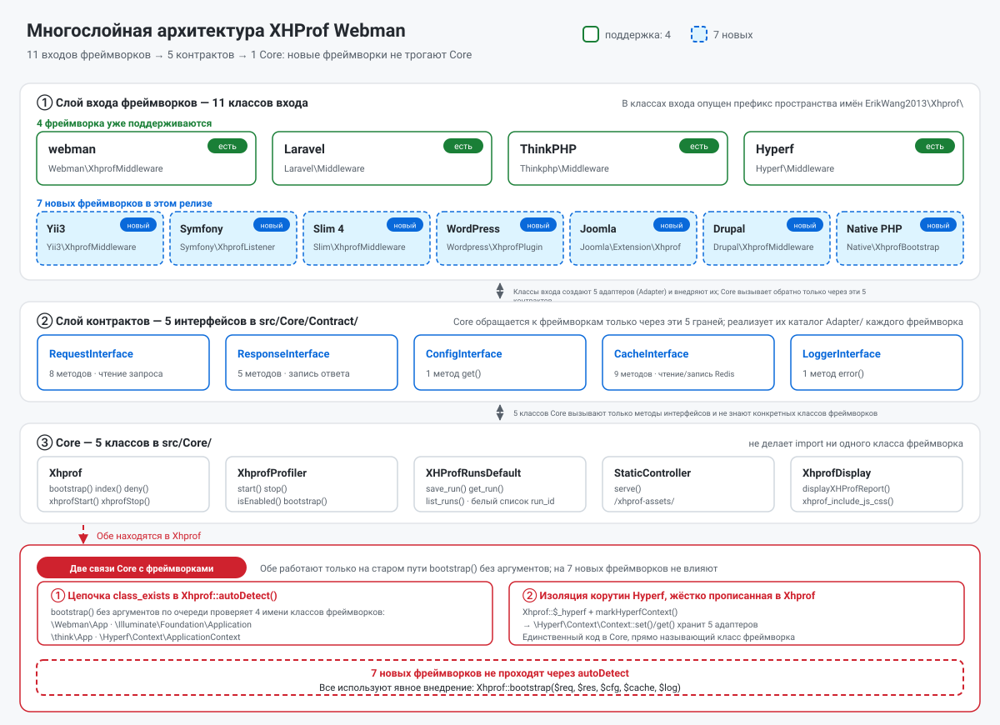
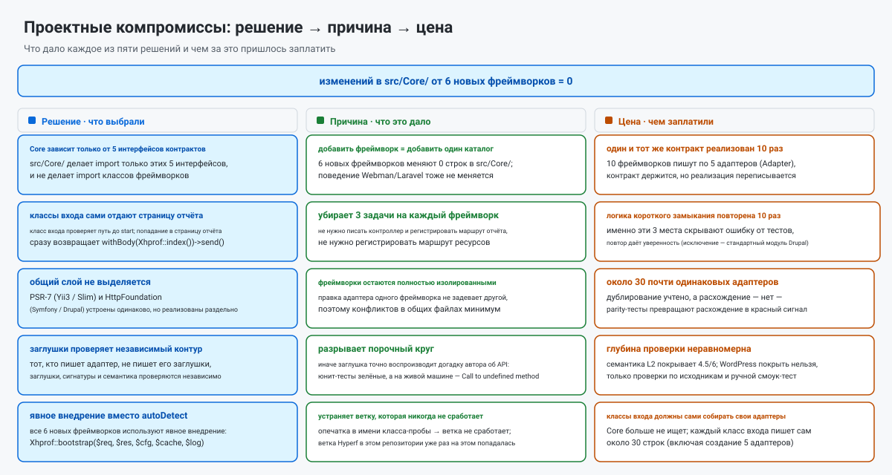
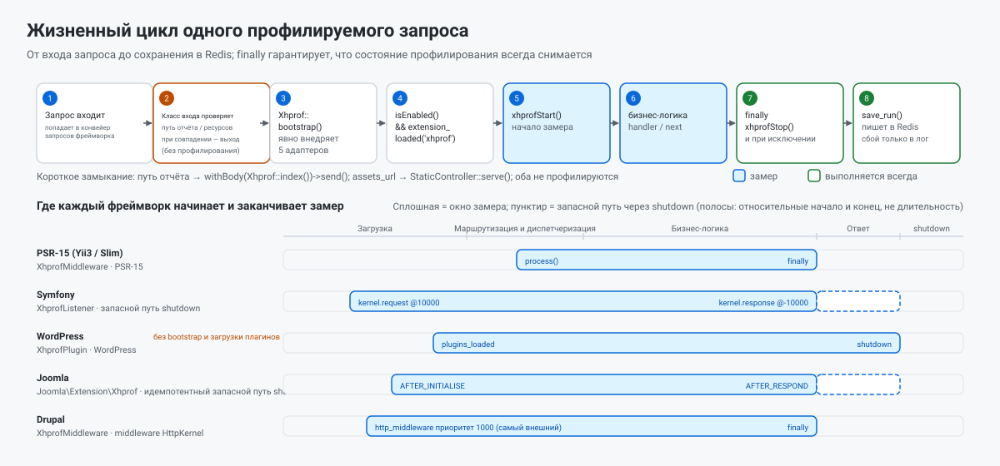

> **Машинный перевод.** Этот документ переведён автоматически и не проверен носителем языка; при расхождениях верен английский оригинал — [README.EN.md](../../../README.EN.md).

[中文](../../../README.md) · [English](../../../README.EN.md) · [한국어](../ko/README.md) · **Русский** · [Deutsch](../de/README.md) · [Français](../fr/README.md) · [Español](../es/README.md) · [Português](../pt/README.md) · [العربية](../ar/README.md) · [हिन्दी](../hi/README.md) · [বাংলা](../bn/README.md) · [Bahasa Indonesia](../id/README.md) · [日本語](../ja/README.md)

# Профайлер производительности XHProf

Плагин профилирования производительности кода, совместимый с webman / Laravel / ThinkPHP / Hyperf / Yii3 / Symfony / Slim 4 / WordPress / Joomla и Drupal.

Собирает данные профилирования через расширение xhprof и складывает их в Redis. Разработчик быстро открывает отчёты об анализе производительности в браузере и находит узкие места в коде.

## Требования

- PHP >= 8.0
- расширение xhprof
- расширение redis
- сервер Redis

## Совместимые фреймворки и минимальные версии

| Фреймворк | Минимальная версия | Минимальный PHP | Класс входа | Как подключить |
|-----------|----------------|-------------|-------------|--------------|
| webman | `workerman/webman ^2.1` | 8.0 | `Webman\XhprofMiddleware` | Зарегистрировать глобальное middleware в `config/middleware.php` |
| Laravel | `laravel/framework ^9.0\|^10.0\|^11.0` | 8.0 | `Laravel\Middleware` | Зарегистрировать глобальное middleware в `app/Http/Kernel.php` |
| ThinkPHP | `topthink/framework ^6.0\|^8.0` | 8.0 | `Thinkphp\Middleware` | Зарегистрировать глобальное middleware в `app/middleware.php` |
| Hyperf | `hyperf/framework ^3.0` | 8.0 | `Hyperf\Middleware` | Регистрируется автоматически через ConfigProvider |
| Yii3 | `yiisoft/middleware-dispatcher ^5.0` | 8.1 | `Yii3\XhprofMiddleware` | Зарегистрировать в `config/web/di/application.php`, должен быть первым в списке middleware |
| Symfony | `symfony/http-kernel ^6.4\|^7.0` | 8.1 (6.4) / 8.2 (7.x) | `Symfony\XhprofListener` | Добавить тег `kernel.event_subscriber` в `config/services.yaml` |
| Slim 4 | `slim/slim ^4.12` | 8.0 | `Slim\XhprofMiddleware` | `$app->add(...)`, добавлять последним |
| WordPress | 6.4+ | 8.0 | `Wordpress\XhprofPlugin` | Скопировать в `wp-content/mu-plugins/` |
| Joomla | 4.4 / 5.x | 8.1 | `Joomla\Extension\Xhprof` | Скопировать в `plugins/system/`, установить через «Обнаружение» |
| Drupal | 10.x / 11.x | 8.1 (10.x) / 8.3 (11.x) | модуль `xhprof` (`Drupal\XhprofMiddleware`) | Обычный модуль, достаточно включить |

Все классы входа лежат под префиксом пространства имён `ErikWang2013\Xhprof\` (в таблице он опущен). Из шести новых фреймворков исключение составляет Drupal — он отдаёт страницу отчёта через маршруты модуля, — а остальные пять классов входа **сами отдают страницу отчёта**, без контроллера и без регистрации маршрутов.

Пакет объявляет `php >= 8.0`, но компоненты `yiisoft/*`, на которые опирается Yii3, требуют **PHP 8.1+**, поэтому **на PHP 8.0 Yii3 не работает**; Symfony 7.x и Drupal 11.x тоже требуют более высокую версию PHP. Пошаговая настройка — в разделе «Настройка фреймворков» ниже.

## Установка

Добавьте настройки xhprof в php.ini:

```ini
[xhprof]
extension=xhprof.so
xhprof.output_dir=/tmp/xhprof
```

Установите через Composer:

```sh
composer require aaron-dev/xhprof-webman
```

---

## Настройка фреймворков

### Webman

**1. Зарегистрируйте глобальное middleware** — `config/middleware.php`:

```php
return [
    '' => [
        ErikWang2013\Xhprof\Webman\XhprofMiddleware::class,
    ],
];
```

**2. Создайте контроллер**:

```php
<?php

namespace app\controller;

use support\Request;
use ErikWang2013\Xhprof\Webman\Xhprof;

class XhprofController
{
    public function index(Request $request)
    {
        return Xhprof::index();
    }
}
```

**3. Зарегистрируйте маршруты** — `config/route.php`:

```php
use Webman\Route;
use ErikWang2013\Xhprof\Webman\StaticController;

Route::get('/xhprof', [app\controller\XhprofController::class, 'index']);
Route::get('/xhprof-assets/{path:.+}', [StaticController::class, 'serve']);

```

**4. Настройка** — см. `config/plugin/aaron-dev/xhprof/xhprof.php`.

---

### Laravel

**1. Зарегистрируйте middleware** — `app/Http/Kernel.php`:

```php
protected $middleware = [
    // ...
    \ErikWang2013\Xhprof\Laravel\Middleware::class,
];
```

**2. Создайте контроллер**:

```php
<?php

namespace App\Http\Controllers;

use Illuminate\Http\Request;
use ErikWang2013\Xhprof\Core\Xhprof;

class XhprofController extends Controller
{
    public function index(Request $request)
    {
        Xhprof::bootstrap();
        return Xhprof::index();
    }
}
```

**3. Зарегистрируйте маршруты** — `routes/web.php`:

```php
use App\Http\Controllers\XhprofController;
use ErikWang2013\Xhprof\Core\StaticController;
use Illuminate\Support\Facades\Route;

Route::get('/xhprof', [XhprofController::class, 'index']);
Route::get('/xhprof-assets/{path}', function ($path) {
    $req = new \ErikWang2013\Xhprof\Laravel\Adapter\RequestAdapter(request());
    $res = new \ErikWang2013\Xhprof\Laravel\Adapter\ResponseAdapter(response(''));
    return StaticController::serve($req, $res)->send();
})->where('path', '.*');

```

**4. Опубликуйте конфигурацию**:

```sh
php artisan vendor:publish --tag=xhprof-config
```

Файл конфигурации — `config/xhprof.php`. Laravel поддерживает автообнаружение ServiceProvider.

---

### ThinkPHP

**1. Зарегистрируйте middleware** — `app/middleware.php`:

```php
return [
    \ErikWang2013\Xhprof\Thinkphp\Middleware::class,
];
```

**2. Создайте контроллер**:

```php
<?php

namespace app\controller;

use think\Request;
use ErikWang2013\Xhprof\Core\Xhprof;

class XhprofController
{
    public function index(Request $request)
    {
        Xhprof::bootstrap();
        return Xhprof::index();
    }
}
```

**3. Зарегистрируйте маршруты** — `route/app.php`:

```php
use think\facade\Route;
use ErikWang2013\Xhprof\Core\StaticController;
use ErikWang2013\Xhprof\Thinkphp\Adapter\RequestAdapter;
use ErikWang2013\Xhprof\Thinkphp\Adapter\ResponseAdapter;

Route::get('/xhprof', 'app\controller\XhprofController@index');
Route::get('/xhprof-assets/[:path]', function ($path = '') {
    $req = new RequestAdapter(app('request'));
    $res = new ResponseAdapter(response(''));
    return StaticController::serve($req, $res)->send();
})->pattern(['path' => '.*']);

```

**4. Настройка** — скопируйте `vendor/aaron-dev/xhprof-webman/src/Thinkphp/config/xhprof.php` в `config/xhprof.php` проекта.

---

### Hyperf

**1. Автоматическая регистрация middleware** — ConfigProvider сам добавляет middleware в очередь HTTP-middleware.

**2. Создайте контроллер**:

```php
<?php

namespace App\Controller;

use Hyperf\HttpServer\Annotation\Controller;
use Hyperf\HttpServer\Annotation\RequestMapping;
use ErikWang2013\Xhprof\Core\Xhprof;

#[Controller(prefix: '/xhprof')]
class XhprofController
{
    #[RequestMapping(path: '')]
    public function index()
    {
        Xhprof::bootstrap();
        return Xhprof::index();
    }
}
```

**3. Маршруты статических ресурсов** — `config/routes.php`:

```php
use Hyperf\HttpServer\Router\Router;
use ErikWang2013\Xhprof\Core\StaticController;
use ErikWang2013\Xhprof\Hyperf\Adapter\RequestAdapter;
use ErikWang2013\Xhprof\Hyperf\Adapter\ResponseAdapter;
use Hyperf\Context\ApplicationContext;

Router::get('/xhprof-assets/{path:.+}', function ($path) {
    $container = ApplicationContext::getContainer();
    $req = new RequestAdapter($container->get(\Hyperf\HttpServer\Contract\RequestInterface::class));
    $res = new ResponseAdapter($container->get(\Hyperf\HttpServer\Contract\ResponseInterface::class));
    return StaticController::serve($req, $res)->send();
});

```

**4. Опубликуйте конфигурацию**:

```sh
php bin/hyperf.php vendor:publish aaron-dev/xhprof-webman
```

Конфигурация появится в `config/autoload/xhprof.php`.

---

### Yii3

**1. Зарегистрируйте middleware** — `config/web/di/application.php`:

```php
use ErikWang2013\Xhprof\Yii3\XhprofMiddleware;
use Yiisoft\Middleware\Dispatcher\MiddlewareDispatcher;

return [
    MiddlewareDispatcher::class => [
        'class' => MiddlewareDispatcher::class,
        // the first element is the outermost middleware (runs first, finishes last)
        'withMiddlewares()' => [[
            XhprofMiddleware::class,
            // ... other middlewares
        ]],
    ],
];
```

Две лёгкие ошибки (обе измерены):

- **Не пишите** `'__construct()' => ['middlewares' => [...]]`: `MiddlewareDispatcher::__construct()` принимает только `MiddlewareFactory` и необязательный `EventDispatcherInterface` — параметра `middlewares` там **нет**. Список middleware можно передать только через **метод экземпляра** `withMiddlewares()`.
- **Не кладите** экземпляр (`new XhprofMiddleware(...)`) в `withMiddlewares()`: определения принимают только class-string, определение-массив или callable. С экземпляром регистрация ничего не сообщает, а `dispatch()` бросает `TypeError` (`MiddlewareFactory::create()` типизирован как `callable|array|string`).

**2. Страница отчёта и статические ресурсы** — **контроллер и маршруты не нужны**: `XhprofMiddleware` — это middleware PSR-15. До старта профилирования он смотрит на путь запроса: попадание в путь отчёта `/xhprof` сразу возвращает страницу отчёта, попадание в путь ресурсов (по умолчанию префикс `/xhprof-assets`) сразу возвращает статический ресурс. Ответ со страницей отчёта несёт явный `Content-Type: text/html; charset=UTF-8` от класса входа: у ответов PSR-7 значения по умолчанию нет, а отправитель ответа Yii3 его не добавляет, поэтому без него браузеры отрисовывают HTML-отчёт как обычный текст.

**3. Настройка** — значения по умолчанию лежат в пакете, в `src/Yii3/config/xhprof.php`; поля описаны в разделе «Справочник по конфигурации». Чтобы их переопределить, внедрите `$config` через DI:

```php
XhprofMiddleware::class => [
    'class' => XhprofMiddleware::class,
    '__construct()' => [
        'config' => [
            'enable' => true,
            'auth_token' => 'your-token',
            'redis' => [
                'host' => '127.0.0.1',
                'port' => 6379,
                'password' => '',
                'database' => 0,
                'timeout' => 1.0,
            ],
        ],
    ],
],
```

Подмассив `redis` — особенность Yii3: когда `CacheInterface` не внедрён, middleware работает с phpredis напрямую через него. Оставьте `assets_url` значением по умолчанию — любой другой префикс даёт лишь 200 с пустым телом (это жёстко прописанная константа в Core; см. [Проверка и известные ограничения](#проверка-и-известные-ограничения)).

**4. Требование к версии** — компоненты `yiisoft/*`, на которые опирается Yii3, требуют PHP >= 8.1. Хотя пакет объявляет `php >= 8.0`, интеграцию с Yii3 нельзя использовать на PHP 8.0.

---

### Symfony

**1. Зарегистрируйте подписчика событий** — `config/services.yaml`:

```yaml
services:
    ErikWang2013\Xhprof\Symfony\XhprofListener:
        tags:
            - { name: kernel.event_subscriber }
```

**2. Страница отчёта и статические ресурсы** — **контроллер и маршруты не нужны**: до старта профилирования слушатель смотрит на путь запроса: попадание в путь отчёта `/xhprof` сразу возвращает страницу отчёта, попадание в путь ресурсов (по умолчанию префикс `/xhprof-assets`) сразу возвращает статический ресурс.

**3. Настройка** — значения по умолчанию лежат в пакете, в `src/Symfony/config/xhprof.php`; поля описаны в разделе «Справочник по конфигурации».

**4. Подзапросы и запасной путь при исключении** — слушатель слушает `kernel.request` (приоритет 10000) и `kernel.response` (приоритет -10000). `isMainRequest()` отсеивает подзапросы ESI и фрагментов, которые иначе остановили бы профилирование слишком рано; при старте запроса также регистрируется идемпотентный `register_shutdown_function` — если HttpKernel перебросит исключение, `kernel.response` не сработает, и без этого запасного пути состояние профилирования утекло бы в следующий запрос.

---

### Slim 4

**1. Зарегистрируйте middleware** — `public/index.php`:

```php
use ErikWang2013\Xhprof\Slim\XhprofMiddleware;

$app->addRoutingMiddleware();

// must be added last: Slim's middleware stack is LIFO, added later = further out = runs first
$app->add(new XhprofMiddleware(
    $app->getResponseFactory()
));
```

Остальные три аргумента конструктора необязательны; не указывайте их, чтобы взять значения из пакета:

- Аргумент 2, `array $config`: ваш массив конфигурации, накладывается на `src/Slim/config/xhprof.php` из пакета через `array_replace` (замена целых значений — списочные ключи вроде `ignore_url_arr` рекурсивно не сливаются).
- Аргумент 3, `CacheInterface $cache`: если не указан, лениво выполняется `new \Redis()` (конструктор намеренно не трогает ext-redis, чтобы отсутствующее расширение не сломало сборку адаптера). Чтобы внедрить своё соединение, передайте `new \ErikWang2013\Xhprof\Slim\Adapter\RedisAdapter($redis)` или любой объект, реализующий `ErikWang2013\Xhprof\Core\Contract\CacheInterface`.
- Аргумент 4, `LoggerInterface $logger`: если не указан, это `new \ErikWang2013\Xhprof\Slim\Adapter\LogAdapter()` и **логи молча отбрасываются** (Slim не поставляет PSR-3-логгер). Чтобы их записывать, передайте `new LogAdapter($psrLogger)`, где `$psrLogger` — уже имеющийся у вас PSR-3-логгер.

**Не пишите `$app->add(XhprofMiddleware::class)`**: `CallableResolver` в Slim превратит эту строку класса в `new XhprofMiddleware($container)` — передав только контейнер и отложив разрешение до времени запроса. В итоге `add()` ничего не сообщает, а первый же запрос бросает `TypeError` — самый тяжёлый для диагностики режим отказа. Всегда используйте явный `new` из примера выше.

**2. Страница отчёта и статические ресурсы** — **контроллер и маршруты не нужны**: до старта профилирования middleware смотрит на путь запроса: попадание в путь отчёта `/xhprof` сразу возвращает страницу отчёта, попадание в путь ресурсов (по умолчанию префикс `/xhprof-assets`) сразу возвращает статический ресурс.

**3. Настройка** — значения по умолчанию лежат в пакете, в `src/Slim/config/xhprof.php`; поля описаны в разделе «Справочник по конфигурации».

**4. Порядок подключения** — стек middleware в Slim работает по принципу LIFO (измерено на двух middleware, порядок выполнения `B:before → A:before → A:after → B:after`): чем позже вы вызываете `add()`, тем дальше наружу он оказывается и тем раньше срабатывает. Поэтому xhprof нужно добавлять **последним** и **после `addRoutingMiddleware()`** — иначе `/xhprof` не попадёт в таблицу маршрутизации, RoutingMiddleware первым бросит `HttpNotFoundException`, и запрос до middleware не дойдёт. Ответ со страницей отчёта несёт явный `Content-Type: text/html; charset=UTF-8` от класса входа: у ответов PSR-7 значения по умолчанию нет, а `ResponseEmitter` в Slim его не добавляет, поэтому без него браузеры отрисовывают HTML-отчёт как обычный текст.

---

### WordPress

**1. Установите mu-plugin** — скопируйте bootstrap-файл из пакета в `wp-content/mu-plugins/`:

```sh
cp vendor/aaron-dev/xhprof-webman/wordpress/xhprof-webman.php wp-content/mu-plugins/
```

`wordpress/xhprof-webman.php` несёт заголовок плагина и загружает `Wordpress\XhprofPlugin`. mu-plugins подхватываются автоматически — включать ничего в wp-admin не нужно.

**2. Страница отчёта и статические ресурсы** — **контроллер и маршруты не нужны**: до старта профилирования класс входа смотрит на путь запроса: попадание в путь отчёта `/xhprof` сразу возвращает страницу отчёта, попадание в путь ресурсов (по умолчанию префикс `/xhprof-assets`) сразу возвращает статический ресурс.

**3. Настройка** — значения по умолчанию лежат в пакете, в `src/Wordpress/config/xhprof.php`; поля описаны в разделе «Справочник по конфигурации». Используйте `ignore_url_arr`, чтобы исключить высокочастотные пути вроде `wp-cron.php` и `admin-ajax.php`.

**4. Структурное ограничение окна профилирования** — окно это `plugins_loaded` → `shutdown`, и оно **не включает** ни bootstrap `wp-settings.php`, ни загрузку плагинов. Это структурное ограничение WordPress: работу, сделанную в этой фазе, профилировать нельзя.

---

### Joomla

**1. Установите плагин** — скопируйте каталог `joomla/` из пакета в `plugins/system/xhprof/` сайта:

```sh
cp -r vendor/aaron-dev/xhprof-webman/joomla/ plugins/system/xhprof/
```

Каталог `joomla/` в пакете и *есть* плагин: манифест `xhprof.xml`, `services/provider.php` и `src/Extension/Xhprof.php`. Класс входа — `ErikWang2013\Xhprof\Joomla\Extension\Xhprof` (это `CMSPlugin`). После копирования запустите обнаружение в разделе «Система → Управление → Расширения → Обнаружение» и установите/включите плагин.

**2. Страница отчёта и статические ресурсы** — **контроллер и маршруты не нужны**: до старта профилирования плагин смотрит на путь запроса: попадание в путь отчёта `/xhprof` сразу возвращает страницу отчёта, попадание в путь ресурсов (по умолчанию префикс `/xhprof-assets`) сразу возвращает статический ресурс.

**3. Настройка** — значения по умолчанию лежат в пакете, в `src/Joomla/config/xhprof.php`; поля описаны в разделе «Справочник по конфигурации». **Известный компромисс**: здесь читается файл конфигурации пакета, а не параметры плагина — параметры плагина требуют чтения из базы, а конфигурация читается на каждом запросе.

**4. Границы профилирования** — окно это `ApplicationEvents::AFTER_INITIALISE` → `ApplicationEvents::AFTER_RESPOND`; идемпотентный `register_shutdown_function` регистрируется также в `AFTER_INITIALISE`, потому что на пути исключения `AFTER_RESPOND` не гарантирован — без запасного пути состояние профилирования утекло бы в следующий запрос.

---

### Drupal

**1. Включите модуль** — `drupal/xhprof/` в пакете это обычный модуль Drupal (`xhprof.info.yml` / `xhprof.routing.yml` / `xhprof.services.yml`). Положите его в `modules/custom/xhprof/` своего сайта и включите на странице «Расширить» (или командой `drush en xhprof`).

**2. Страница отчёта** — Drupal это **единственный из десяти фреймворков, который отдаёт страницу отчёта через маршруты модуля**: `xhprof.routing.yml` регистрирует путь отчёта `/xhprof`, а отрисовывает его контроллер модуля. Остальные пять новых фреймворков сами отдают страницу отчёта и статические ресурсы и маршрутов не регистрируют.

**3. Настройка** — это типизированная конфигурация уровня модуля: значения по умолчанию лежат в `drupal/xhprof/config/install/xhprof.settings.yml`, схема — в `drupal/xhprof/config/schema/xhprof.schema.yml`. Поля описаны в разделе «Справочник по конфигурации».

**4. Регистрация middleware** — зарегистрируйте сервис middleware в файле модуля `xhprof.services.yml`:

```yaml
services:
  xhprof.http_middleware:
    class: ErikWang2013\Xhprof\Drupal\XhprofMiddleware
    arguments: ['@config.factory', '@logger.factory']
    tags:
      - { name: http_middleware, priority: 1000 }
```

Внутреннее ядро **подставляется автоматически как аргумент конструктора 0** через `StackedKernelPass` в Drupal — **не пишите его сами**: иначе получится два внутренних ядра, что на Drupal <= 11.2.x (включая все 10.x) падает на этапе компиляции контейнера, а на 11.3.0 и выше бросает TypeError на каждом запросе. Профилирование останавливается в `finally`.

**5. Замечания**

- `priority: 1000` ставит middleware **вне кеша страниц** (самый высокий существующий приоритет в ядре — у согласования содержимого: 400 на D10, 500 на D11, тогда как кеш страниц — 200), поэтому **запросы, отданные из кеша страниц Drupal, всё равно профилируются**. Для инструмента профилирования это и есть желаемое поведение, но пользователю о нём стоит знать.
- Кеш работает из коробки: по умолчанию middleware берёт адаптер Redis, поставляемый с пакетом (пакет жёстко зависит от ext-redis), и он же принимает необязательный аргумент `CacheInterface` через `arguments` в `services.yml`, чтобы его переопределить. Если кеш недоступен, неудачное сохранение проглатывается `XhprofProfiler::stop()` в одну строку лога — **ошибка не поднимается**.
- Запросы к странице отчёта `/xhprof` и к `/xhprof-assets/*` **не профилируются**: middleware пропускает профилирование по пути до `xhprofStart()`. Ответ всё равно формирует контроллер из `xhprof.routing.yml` (**это не короткое замыкание**). Поэтому даже с `ignore_url_arr`, равным `[]` (ничего не фильтруется), эти два запроса никогда не появятся в отчёте.

---

## Справочник по конфигурации

Все фреймворки используют общий набор параметров конфигурации:

| Параметр | Тип | По умолчанию | Описание |
|--------|------|---------|-------------|
| `enable` | bool | `true` | Включает/выключает профилирование |
| `time_limit` | int | `0` | Профилировать только запросы длиннее n секунд; 0 — все |
| `log_num` | int | `1000` | Максимальное число записей |
| `view_wtred` | int | `3` | Подсвечивать красным строки со временем отклика > n секунд |
| `ignore_url_arr` | array | `["/xhprof"]` | Пути URL, которые игнорируются |
| `assets_url` | string | `/xhprof-assets` | Префикс URL статических ресурсов |
| `auth_token` | string\|null | `null` | Если задан, страница отчёта требует `?token=xxx`; рекомендуется для публичных развёртываний |
| `key_prefix` | string | `xhprof` | Префикс ключей Redis; задавайте разные значения на проект, если Redis общий |
| `log_ttl` | int | `604800` | Срок хранения данных в секундах (по умолчанию 7 дней) |
| `locale` | string\|null | `null` | Язык страницы отчёта: `zh_CN`/`en`/`ko`/`ru`/`de`/`fr`/`es`/`pt`/`ar`/`hi`/`bn`/`id`/`ja`; `null` = следовать `Accept-Language` браузера, иначе китайский; `?lang=xx` переопределяет его для одного запроса |

Известные ограничения этих параметров на каждом фреймворке перечислены в разделе [Проверка и известные ограничения](#проверка-и-известные-ограничения).

---

## Ручная инициализация

Если автоматическое определение фреймворка не срабатывает, адаптеры можно внедрить вручную:

```php
use ErikWang2013\Xhprof\Core\Xhprof;

Xhprof::bootstrap(
    new MyRequestAdapter($request),
    new MyResponseAdapter($response),
    new MyConfigAdapter(),
    new MyCacheAdapter(),
    new MyLoggerAdapter()
);
```

**Шесть новых фреймворков (Yii3 / Symfony / Slim 4 / WordPress / Joomla / Drupal) не должны вызывать `Xhprof::bootstrap()` без аргументов** — без аргументов он идёт через `autoDetect()`, который знает только ветки webman / Laravel / ThinkPHP / Hyperf и на этих шести бросает `Unsupported framework`. Передавайте все 5 адаптеров явно, как в примере выше (класс входа, поставляемый с каждым фреймворком, уже делает это за вас).

---

## Архитектура и проектирование

Core обращается к фреймворку ровно через 5 контрактов, и все они лежат в `src/Core/Contract/`:

| Контракт | Методы | Назначение |
|----------|---------|---------|
| `RequestInterface` | `get()` `all()` `method()` `header()` `host()` `uri()` `url()` `getRealIp()` | Чтение данных запроса, сопоставление с путём отчёта, сборка ссылок на странице отчёта |
| `ResponseInterface` | `withBody()` `withHeaders()` `withStatus()` `file()` `send()` | Отдача страницы отчёта, статических ресурсов и 400/403 |
| `ConfigInterface` | `get()` | Чтение конфигурации плагина: `get('xhprof')` для всего блока, `get('xhprof.assets_url')` для листа |
| `CacheInterface` | `get()` `set()` `mget()` `incr()` `lPush()` `rPop()` `lRange()` `del()` `decr()` | Чтение и запись Redis |
| `LoggerInterface` | `error()` | Предупреждения об отсутствующих расширениях и неудачных сохранениях |

Каждый фреймворк предоставляет 5 адаптеров, реализующих эти контракты, и `Xhprof::bootstrap()` регистрирует их в Core. Всё, что специфично для фреймворка, остаётся внутри его собственного каталога `src/<Fw>/`.

**В Core остались ровно две связи с фреймворками**:

1. Цепочка `class_exists()` в `Xhprof::autoDetect()` (`Webman\App` → `Illuminate\Foundation\Application` → `think\App` → `Hyperf\Context\ApplicationContext`), достижимая только через `bootstrap()` без аргументов.
2. Жёстко прописанное переключение корутин Hyperf: `Xhprof::markHyperfContext()` плюс проверки существования `\Hyperf\Context\Context`, которые решают, попадут адаптеры в статические свойства процесса или в контекст корутины.

**Шесть новых фреймворков никогда не проходят через `autoDetect()` — все они используют явное внедрение**: каждый класс входа создаёт свои 5 адаптеров и передаёт их в `Xhprof::bootstrap($req, $res, $cfg, $cache, $log)`. Причина в том, что на PSR-7-фреймворках Request/Response можно получить только из конвейера запросов, поэтому `bootstrap()` без аргументов не может работать по построению; второе достоинство — `autoDetect()` остаётся замороженным на своих нынешних четырёх фреймворках.



Первая диаграмма — это **структура**: класс входа каждого из десяти фреймворков, 5 контрактов, три слоя Core и те самые две оставшиеся связи.



Вторая диаграмма — это **обоснование**: пять компромиссов, разложенных как решение / причина / цена, с заголовком «изменений в `src/Core/` от шести новых фреймворков = 0».

---

## Жизненный цикл запроса

Один профилируемый запрос:

1. **До старта профилирования** класс входа смотрит на путь: попадание в путь отчёта сразу возвращает страницу отчёта; попадание в путь ресурсов сразу возвращает статический ресурс. Ни один из этих путей не профилируется и не входит в поток ниже.
2. `XhprofProfiler::isEnabled()` читает `enable` из конфигурации; если профилирование выключено или расширения нет, весь блок пропускается.
3. `Xhprof::xhprofStart()` → `XhprofProfiler::start()` → `xhprof_enable(XHPROF_FLAGS_NO_BUILTINS + XHPROF_FLAGS_CPU + XHPROF_FLAGS_MEMORY)`.
4. Выполняется бизнес-логика.
5. `finally { Xhprof::xhprofStop(); }` → `xhprof_disable()`, затем `XHProfRunsDefault::save_run()` пишет в Redis. Именно `finally`, а не обычный оператор, чтобы брошенное исключение всё равно сняло состояние профилирования и сохранило замер.
6. Браузер открывает страницу отчёта; `Xhprof::index()` читает данные обратно из Redis и отрисовывает их.



| Фреймворк | Профилирование начинается | Профилирование заканчивается |
|-----------|-----------------|----------------|
| webman / Laravel / ThinkPHP / Hyperf | Вход в middleware (`process()` / `handle()`) | `finally` |
| Yii3 / Slim 4 | PSR-15 `process()` | `finally` |
| Symfony | `kernel.request` (приоритет 10000) | `kernel.response` (приоритет -10000) плюс запасной путь через shutdown |
| WordPress | `plugins_loaded` | `shutdown` |
| Joomla | `onAfterInitialise` | `onAfterRespond` плюс запасной путь через shutdown |
| Drupal | `http_middleware` (приоритет 1000, самый внешний) | `finally` |

---

## Структура проекта

```
xhprof-webman/
├── src/
│   ├── Core/                     # не зависит от фреймворков: контракты, страница отчёта, запись в Redis, статические ресурсы
│   │   ├── Contract/             # 5 интерфейсов контрактов
│   │   ├── XhprofLib/            # отрисовка страницы отчёта и хранение run (из phacility/xhprof)
│   │   ├── Xhprof.php            # статический фасад: bootstrap() / index()
│   │   ├── XhprofProfiler.php    # xhprof_enable/disable и конфигурация
│   │   ├── StaticController.php  # статические ресурсы /xhprof-assets
│   │   ├── MiddlewareTrait.php   # общая обёртка профилирования для Laravel / ThinkPHP
│   │   └── RedisAdapterTrait.php # общая реализация Redis-адаптеров всех фреймворков
│   ├── Webman/ Laravel/ Thinkphp/ Hyperf/            # 4 существующих фреймворка
│   ├── Yii3/ Symfony/ Slim/ Wordpress/ Joomla/ Drupal/   # 6 новых фреймворков
│   └── html/                     # статические ресурсы страницы отчёта (css / js / images)
├── wordpress/                    # bootstrap-файл mu-plugin (с plugin header)
├── joomla/                       # плагин Joomla (CMSPlugin + манифест)
├── drupal/xhprof/                # стандартный модуль Drupal (info / routing / services + Controller)
├── tools/contracts/              # независимый контур верификации: сверяет сигнатуры и семантику с настоящими пакетами фреймворков
├── tests/                        # PHPUnit: адаптеры, связывание, паритет README
└── docs/images/                  # диаграммы для README
```

Кроме Drupal, каждый каталог `src/<Fw>/` имеет одинаковую форму:

```
src/<Fw>/
├── Adapter/{Request,Response,Config,Redis,Log}Adapter.php
├── <КлассВхода>.php
└── config/xhprof.php             # те же 9 ключей конфигурации, что и в остальных фреймворках
```

`src/Drupal/` — единственное исключение: в нём нет каталога `config/`, его конфигурация живёт в типизированной конфигурации уровня модуля (`drupal/xhprof/config/install/xhprof.settings.yml`).

---

## Проверка и известные ограничения

**Что доказано механически**

| Пункт | Как |
|------|-----|
| Поведение адаптеров и связывания классов входа | `tests/Unit/Adapter/*Test.php`: включено → сохранено / выключено → не сохранено / исключение в бизнес-логике → всё равно сохранено через `finally` |
| Все десять фреймворков используют один набор ключей конфигурации | тест паритета конфигурации (наборы ключей, не побайтово; комментарии могут отличаться) |
| Два README зеркальны друг другу | тест паритета README: сравнивает последовательность заголовков `##` / `###` и число блоков кода |
| Методы, которые вызывают адаптеры, действительно существуют | контур верификации `tools/contracts/` (отдельная задача CI): ставит настоящие пакеты фреймворков и утверждает каждый метод / константу / глобальную функцию через рефлексию |
| Семантика адаптеров | Тот же контур создаёт настоящие объекты запроса и ответа и прогоняет через них адаптеры, включая два инварианта: `uri()` не несёт схему и хост, а `withHeaders()` применяется и после `file()` |

Первые три строки выше — поведение адаптеров и связывания классов входа, один общий набор ключей конфигурации у всех десяти фреймворков и зеркальность двух README — описывают **будущие результаты** (случаи связывания для шести фреймворков, тест паритета конфигурации, тест паритета README), которых на момент этого документа ещё нет. Для шести новых фреймворков считайте источником истины ручной чек-лист проверки.

**Не проверено автоматически (не читайте это как «все шесть протестированы»)**

| Пункт | Почему нет |
|------|---------|
| **Связывание** каждого фреймворка (действительно ли хук подключён, действительно ли событие срабатывает) | Юнит-тесты используют заглушки; связывание сейчас можно подтвердить только ручными смоук-тестами |
| WordPress от начала до конца | Реальное время `plugins_loaded`, срабатывает ли `shutdown` при фатальной ошибке и загружается ли mu-plugin — всё это требует настоящего WordPress |
| Обнаружение плагина Joomla и `$app->close()` | Требует запуска обнаружения в реальной админке Joomla |
| Действительно ли приоритет Drupal оказывается вне кеша страниц | Требует загруженного ядра Drupal |
| Автоконфигурация `kernel.event_subscriber` в Symfony | Требует реальной компиляции контейнера |
| Перекрёстное влияние статического состояния в долгоживущих процессах | Унаследовано от существующей архитектуры (то же верно для Webman / Hyperf); здесь не менялось |
| Реальный ввод-вывод Redis, отрисовка в браузере, накладные расходы профилирования под настоящей нагрузкой | Вне области юнит-тестов и контура верификации |

**Ручной чек-лист проверки (три шага на фреймворк)**

| Шаг | Действие | Ожидание |
|------|--------|----------|
| 1 | Подключите класс входа, как описано в разделе «Настройка фреймворков» | Ошибок нет |
| 2 | Откройте любой URL приложения | Длина ключа `xhprof:run_id` в Redis выросла на 1 |
| 3 | Откройте `/xhprof` | Страница отчёта отрисовывается со стилями; `/xhprof-assets/js/xhprof_report.js` возвращает 200 |

**Известное ограничение: у `host()` нет порта**

Контракт `host()` означает «только хост, без порта», но ссылки в списке отчёта собираются как `host() . uri()` (`src/Core/XhprofLib/Utils/XHProfRunsDefault.php`). Поэтому **на нестандартном порту (например, `:8080`) ссылки в списке теряют порт и никуда не ведут**. Это скрытая проблема существующей реализации (она одинаково затрагивает webman / Laravel / ThinkPHP / Hyperf), здесь не исправлена и зафиксирована как известное ограничение.

**Известное ограничение: `assets_url` работает только когда равен `/xhprof-assets`**

Префикс ресурсов — жёстко прописанная константа в `src/Core/StaticController.php` (`private const URI_PREFIX = '/xhprof-assets'`), тогда как ссылки CSS/JS на странице отчёта читают параметр конфигурации `assets_url` (`src/Core/Xhprof.php`). Как только они расходятся, `getPathFromRequest()` возвращает `null`, а `serve()` возвращает `withBody('')->withHeaders([])` — **пустой ответ 200, а не 404**. Следствие: задайте `assets_url` что угодно другое, и CSS/JS молча станут пустыми, оставив страницу отчёта без стилей и без какой-либо ошибки. Иначе говоря, `assets_url` сейчас — фиктивный параметр, который работает только со значением по умолчанию. Это проблема, существовавшая и раньше, и здесь она не исправлена.

**Известное ограничение: защита по пути не срабатывает, когда Drupal стоит в подкаталоге**

Когда Drupal установлен в подкаталоге (например, `/sites/app/xhprof`), защита по пути не может сопоставить URI, несущий базовый путь, поэтому поведение откатывается к «профилируется, но не сохраняется» (с конфигурацией по умолчанию его ловит `ignore_url_arr`). Это ограничение того же класса, что и жёстко прописанный префикс `assets_url`.

**Совместимость с Symfony 6.4**

Совместимость с Symfony 6.4 измерена (именно так были исправлены две переподгонки, невидимые на 7.4: свойства `Request` на 6.4 не несут объявления нативного типа, а кодировка, добавляемая `prepare()`, отличается регистром), но контур верификации в CI запускается только на 7.4.

---

## Автор

[erik](https://erik.xyz)

## Поддержать открытый код

<p align="center">
  
  
</p>

---

Этот плагин опирается на [phacility/xhprof](https://github.com/phacility/xhprof) и [phpxxb/xhprof](https://github.com/xiexianbo123/xhprof).
